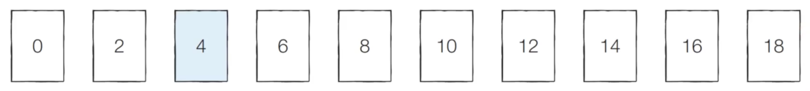
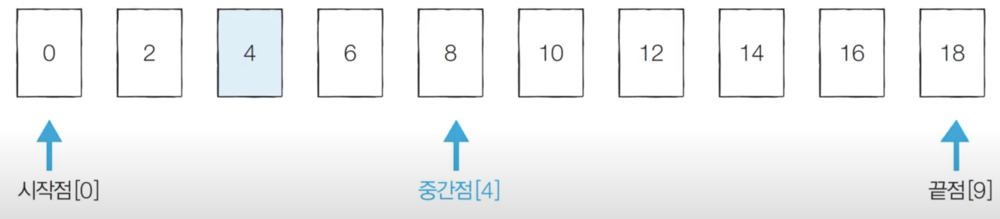
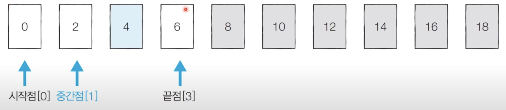
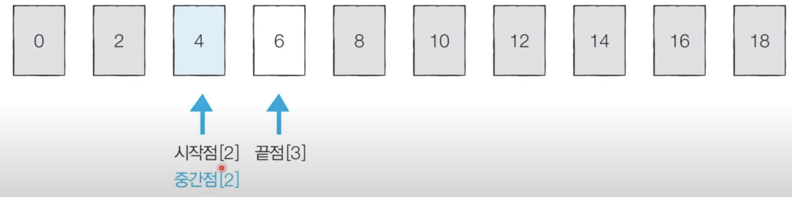

# 이진 탐색 알고리즘
이진 탐색은 정렬되어 있는 리스트에서 특정한 데이터를 빠르게 탐색하게 해주는 탐색 알고리즘
- 순차 탐색: 리스트 안에 있는 특정한 데이터를 찾기 위해 앞에서부터 데이터를 하나씩 확인하는 방법
- 이진 탐색: 정렬되어 있는 리스트에서 탐색 범위를 절반씩 좁혀가며 데이터를 탐색하는 방법
  - 시작점, 끝점, 중간점을 이용하여 탐색 범위를 설정한다.

## 예시

- 정렬된 10개 데이터 중에서 값이 4인 원소를 찾고자 한다.

- 시작점, 끝점, 중간점은 인덱스를 의미한다.
- 시작점은 0, 끝점은 9, 중간점은 4, 중간점은 소수점 이하를 제거한다.
- 만약 찾고자하는 값보다 중간점보다 크다면 중간점 오른쪽에 있는 값들은 확인할 필요가 없다. 

- 끝점을 중간점 왼쪽의 인덱스로 옮긴다.
- 시작점:0, 끝점:3, 중간점: 1
- 이때 탐색범위가 4개로 줄어든다.
- 찾고자 하는 값이 중간점보다 크기 때문에 중간점 왼쪽에 있는 값들은 확인할 필요가 없어진다.

- 시작점을 중간점 오른쪽으로 옮긴다.
- 시작점:2, 끝점3, 중간점: 2
- 이때 중간점 2의 값이 4이므로 찾고자 하는 값과 일치하게 되고 탐색이 마친다.

## 이진 탐색의 시간 복잡도
- 단계마다 탐색범위를 2로 나누는 것과 같으므로 연산횟수는 log2N에 비례한다.
- 다시말해 이진 탐색은 탐색 범위를 절반씩 줄이며 시간복잡도는 O(logN)을 보장한다.

## 구현 코드
### 재귀 함수를 이용한 이진 탐색 알고리즘
~~~java
public class BinarySearch_Recursion_Ex1 {

    public static void main(String[] args) throws IOException {
        BufferedReader br = new BufferedReader(new InputStreamReader(System.in));

        // 원소의 개수
        System.out.println("원소의 개수를 입력하세요");
        int n = Integer.parseInt(br.readLine());
        // 찾고자 하는 값
        System.out.println("찾고자 하는 값을 입력해주세요");
        int target = Integer.parseInt(br.readLine());

        // 전체 원소 입력 받기
        int[] arr = new int[n];
        System.out.println("전체 원소들을 입력해주세요. 띄어쓰기 한 칸으로 구분해주세요");
        StringTokenizer st = new StringTokenizer(br.readLine());
        for (int i = 0; i < n; i++) {
            arr[i] = Integer.parseInt(st.nextToken());
        }

        // 이진 탐색 수행
        int result = binarySearch(arr, target, 0, n - 1);
        if (result == -1) {
            System.out.println("해당 원소가 존재하지 않습니다.");
        } else {
            System.out.println(result + 1);
        }

    }

    // 재귀함수를 이용한 이진탐색
    private static int binarySearch(int[] arr, int target, int start, int end) {

        if (start > end) {
            return -1;
        }

        // 중간점
        int mid = (start + end) / 2;
        // 찾은 경우 중간점 인덱스를 반환
        if (arr[mid] == target) {
            return mid;
        } else if (arr[mid] > target) {
            // 중간점의 값보다 타켓의 값이 더 작은 경우
            return binarySearch(arr, target, start, mid - 1);
        } else {
            // 중간점의 값보다 타겟의 값이 더 큰 경우
            return binarySearch(arr, target, mid + 1, end);
        }
    }
}
~~~

### 반복문을 이용한 이진 탐색 알고리즘
~~~java
public class BinarySearch_Loop {

    public static void main(String[] args) throws IOException {

        BufferedReader br = new BufferedReader(new InputStreamReader(System.in));
        // 원소의 개수
        int n = Integer.parseInt(br.readLine());
        // 찾는 원소
        int target = Integer.parseInt(br.readLine());

        // 전체 원소 입력 받기
        int[] arr = new int[n];
        StringTokenizer st = new StringTokenizer(br.readLine());
        for (int i = 0; i < n; i++) {
            arr[i] = Integer.parseInt(st.nextToken());
        }

        // 이진 탐색 수행 결과 출력
        int result = binarySearchLoop(arr, target, 0, n - 1);
        if (result == -1) {
            System.out.println("해당 원소를 찾지 못했습니다.");
        } else {
            System.out.println(result + 1);
        }
    }

    private static int binarySearchLoop(int[] arr, int target, int start, int end) {
        while (start <= end) {

            int mid = (start + end) / 2;

            // 찾은 경우 중간점 인덱스 반환
            if (arr[mid] == target) {
                return mid;
            } else if (arr[mid] > target) {
                // 중간점의 값보다 타겟의 값이 작은 경우 왼쪽 확인
                end = mid - 1;
            } else {
                // 중간점의 값보다 타겟의 값이 더 큰 경우 오른쪽 확인
                start = mid + 1;
            }

        }

        return -1;
    }
}
~~~