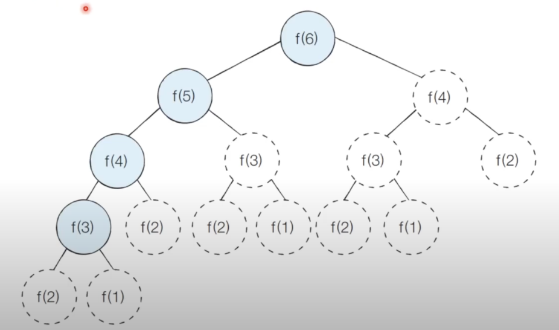
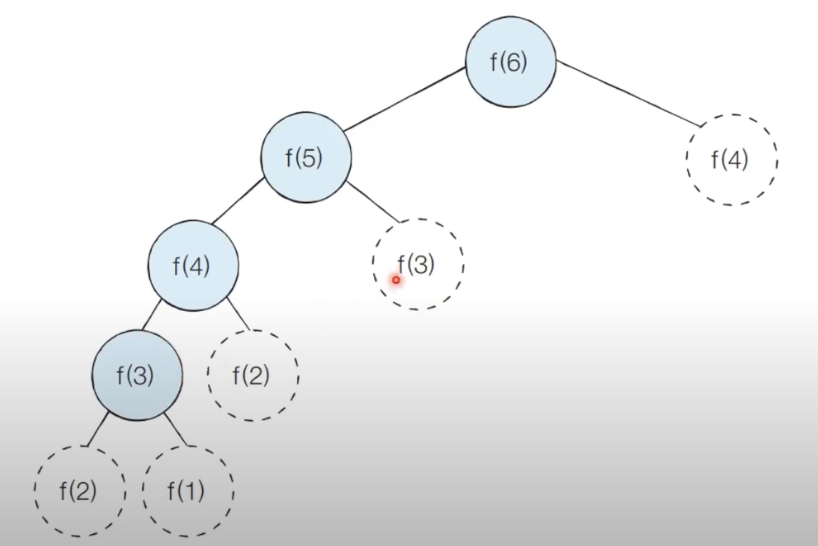
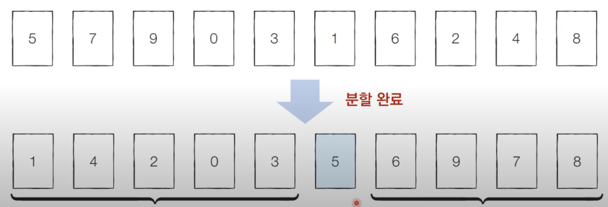

# 다이나믹 프로그래밍
- 메모리를 적절히 사용하여 수행 시간 효율성을 비약적으로 향상시키는 방법
- `이미 계산된 결과(작은 문제)는 별도의 메모리 영역에 저장`하여 다시 계산하지 않도록 한다.
- 다이나믹 프로그래밍의 구현은 일반적으로 두 가지 방식(탑다운, 바텀업)으로 구성

- `동적 계획법`이라고도 부름
- `동적`이란 어떤 무슨 의미일까?
  - 자료구조에서 동적 할당은 `프로그램이 실행되는 도중에 실행에 필요한 메모리를 할당하는 기법`
  - 반면 `다이나믹 프로그래밍`에서 다이나믹은 별 의미 없이 사용된 단어이다.

## 다이나믹 프로그래밍의 조건
1. 최적 부분 구조(Optimal Substructure)
  - 큰 문제를 작은 문제로 나눌 수 있으며 작은 문제의 답을 모아 큰 문제를 해결할 수 있다.
2. 중복되는 부분 문제(Overlapping Subproblem)
  - 동일한 작은 문제를 반복적으로 해결해야 한다.

## 피보나치 수열
- 1, 1, 2, 3, 5, 8, 13, 21, 24, 34...
- 특정 번째의 숫자를 구하고자 할 때 앞에 있는 두 수를 더한 값이 해당 피보나치 수가 된다.
- `점화식`이란 인접한 항들 사이의 관계식을 의미
- 피보나치 수열을 점화식으로 표현하면 아래와 같다.
  - an = an-1 + an-2, a1 = 1, a2 = 1
- 피보나치 수열이 계산되는 과정은 아래와 같다.

- 프로그래밍에서는 이러한 수열을 배열이나 리스트를 이용해 표현한다.

- n번째 피보나치 수를 f(n)이라고 할 때 4번 째 피보나치 수 f(4)를 구하는 과정은 위와 같다.

## 피보나치 수열의 시간 복잡도 분석
- 단순 재귀 함수로 피보나치 수열을 해결하면 지수 시간 복잡도를 가지게 된다.
- 예를 들어 6번째 피보나치 수를 호출한다고 하면 아래와 같이 재귀적으로 호출할 것이다.
- f(2)가 여러 번 호출되는 것을 확인할 수 있다. 

## 피보나치 수열의 효율적인 해법: 다이나믹 프로그래밍
- 다이나믹 프로그래밍의 사용 조건을 만족하는지 확인하자
  `1. 최적 부분 구조`: 큰 문제를 작은 문제로 나눌 수 있다.
  `2. 중복되는 부분 문제`: 동일한 작은 문제를 반복적으로 해결한다.
- 피보나치 수열은 다이나믹 프로그래밍의 사용 조건을 만족한다.

## 탑다운(하향식) 해결 방법: 메모이제이션
- 한 번 계산한 결과르 메모리 공간에 메모하는 기법이다.
- 같은 문제를 다시 호출하면 메모했던 결과를 가져온다.
- 값을 기록해 놓는다는 점에서 **캐싱**이라고도 한다.

## 탑다운 VS 바텀업
- 하향식 vs 상향식
- 다이나믹 프로그래밍의 전형적인 형태는 바텀업 방식이다.
  - 결과 저장용 리스트는 DP 테이블이라고 부른다.
- 엄밀히 말하면 메모이제이션은 이전에 계산된 결과를 일시적으로 기록해 놓는 넓은 개념을 의미한다.
  - 메모이제이션은 다이나믹 프로그래밍에 국한된 개념은 아니다.
  - 한 번 계산된 결과를 담아 놓기만 하고 다이나믹 프로그래밍을 위해 활용하지 않을 수도 있다.

## 피보나치 수열: 메모이제이션 동작 분석
- 이미 계산된 결과를 메모리에 저장하면 아래와  같이 색칠된 노드만 처리할 것을 기대할 수 있다.

- 실제 호출되는 함수에 대해 확인해보면 아래와 같이 방문을 하게 된다.

## 다이나믹 프로그래밍 VS 분할 정복
- 다이나믹 프로그래밍과 분할 정복 모두 **최적 부분 구조**를 가질 때 사용할 수 있다.
  - 큰 문제를 더 작은 문제로 나눌 수 있고 작은 문제의 답을 모아 큰 문제를 해결할 수 있는 상황을 말한다.
- 이 둘의 차이점은 **부분 문제의 중복**이다.
  - 다이나믹 프로그래밍 문제에서는 각 부분 문제들이 서로 영향을 미치며 부분 문제가 중복된다.
  - 분할 정복 문제에서는 동일한 부분 문제가 반복적으로 계산되지 않는다.

퀵 정렬을 예시로 살펴보자.
- 한 번 기준 원소가 자리를 변경해 자리를 잡게 되면 그 기준 원소의 위치는 바뀌지 않는다.
- 분할 이후 해당 피벗을 다시 처리하는 부분 문제는 호출되지 않는다.

## 다이나믹 프로그래밍 문제에 접근하는 방법
- 가장 먼저 그리디, 구현, 완전 탐색 등의 방법으로 문제를 해결할 수 있는지 검토한다.
  - 다른 알고리즘 방법으로 풀이 방법이 떠오르지 않는다면 다이나믹 프로그래밍을 고려해보자.
- 일단 재귀 함수로 비효율적인 완전 탐색 프로그램을 작성한 뒤에 작은 문제에서 구한 답이 큰 문제에서 사용될 수 있다면 코드를 개선하는 방법을 사용할 수 있다.
