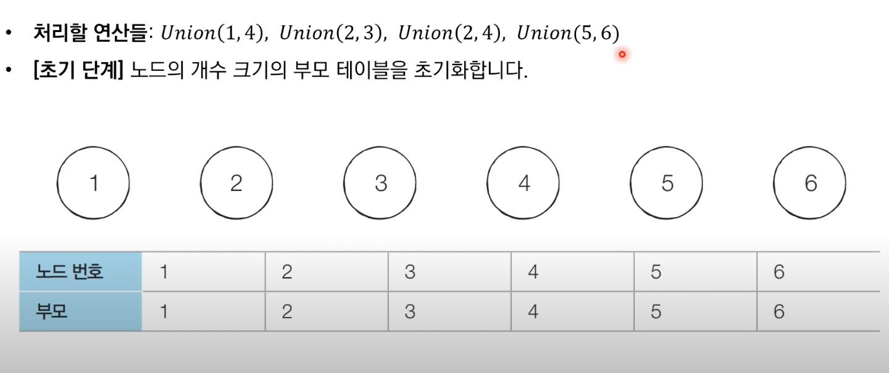

# 기타 그래프 이론
## 서로소 집합 알고리즘
- 서로소 집합은 공통 원소가 없는 두 집합을 의미
- 예를 들어, 
  - {1,2}, {3,4}는 서로 공통된 원소가 없으므로 서로소 관계이다.
  - {1,2}, {2,3}은 2라는 원소를 공통으로 갖고 있다. 즉, 서로소 관계가 아니다.

### 서로소 집합 알고리즘
- 서로소 부분 집합들로 나누어진 원소들의 데이터를 처리하기 위한 자료구조이다.
- 두 가지 연산을 지원한다.
  - **합집합(Union)**: 두 개의 원소가 포함된 집합을 하나의 집합으로 합치는 연산 
  - **찾기(Find)**: 특정 원소가 속한 집합이 어떤 집합인지 알려주는 연산
- **합치기 찾기(Union Find) 자료구조라고도 한다**

- 여러 개 합치기 연산이 주어졌을 때, 서로소 집합 자료구조의 동작과정은 다음과 같다.
  1. 합집합(Union)연산을 확인해 서로 연결된 두 노드 A, B를 확인한다.
    - A와 B의 루트 노드 A', B'를 각각 찾는다.
    - A'를 B'의 부모 노드로 설정한다.
  2. 모든 합집합(Union) 연산을 처리할 때까지 1번의 과정을 반복한다.

### 서로소 집합 자료구조: 동작 과정 살펴보기

Union함수 안에 들어가는 인자들은 각각의 노드의 번호이다. Union 함수가 실행되면 각 노드가 들어간 집합이 하나로 합쳐진다.