# 최단경로 알고리즘
- 가장 짧은 경로를 찾는 알고리즘
- 여러 문제 상황이 주어질 수 있다
  - 한 지점에서 다른 한 지점까지의 최단 경로
  - 한 지점에서 다른 모든 지점까지의 최단 경로
  - 모든 지점에서 다른 모든 지점까지의 최단 경로
- 각 지점은 그래프에서 **노드**로 표현
- 지점 간 연결된 도로는 그래프에서 **간선**으로 표현

## 다익스트라 최단 경로 알고리즘
- **특정 노드**에서 출발해 **다른 모든 노드**로 가는 최단 경로를 계산한다.
- 음의 간선이 없을 때 정상적으로 동작한다.
  - 현실 세계에서의 도로는 음의 간선으로 표현되지 않기 때문이다.
- 그리고 그리디 알고리즘으로 분류된다.
  - **매 상황에서 가장 비용이 적은 노드를 선택**해 임의의 과정은 반복한다.
  - 기본적으로 최단경로 문제는 다이나믹 프로그래밍 알고리즘으로 분류된다.

### 동작과정
1. 출발 노드 설정
2. 최단 거리 테이블 초기화 
  - 모든 노드까지 거리를 무한으로 설정
  - 자기 자신에 대한 노드는 0으로 설정
3. 방문하지 않은 노드 중에서 최단 거리가 가장 짧은 노드를 선택
4. 해당 노드를 거쳐 다른 노드로 가는 비용을 계산하여 최단 거리 테이블을 갱신
5. 3번, 4번을 반복

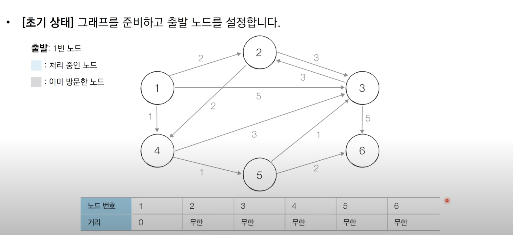

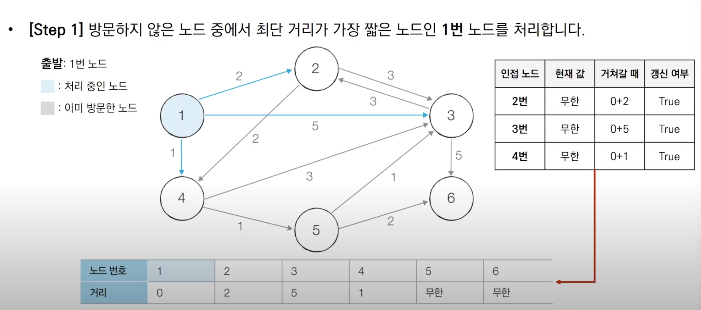

1번 노드를 통해 이동할 수 있는 노드는 2번, 3번, 4번 노드이다. 테이블 정보를 확인해보면 2번, 3번, 4번까지 이동하기 위한 거리는 모두 무한대이다.

이제 1번을 거쳐서 이동하게 되면 2번은 0+2, 3번은 0+3, 4번은 0+1이 되고 무한대보다 작으므로 최단거리값을 2번은 2, 3번은 3, 4번은 1로 변경해준다.

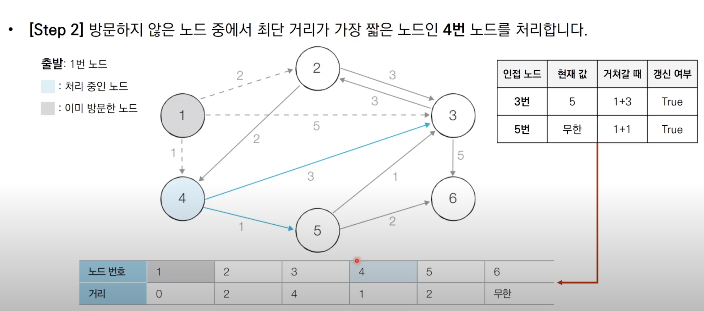

4번 노드를 통해 이동할 수 있는 노드는 3번, 5번 노드이다. 3번으로 이동하기 위한 비용은 3, 5번으로 이동하기 위한 비용은 1이다. 

이때 4번까지 이동하기 위한 비용은 1로 변경되지 않는다. 이전까지 3번까지의 최단거리가 5라고 담겨있었는데 이제 4번을 거쳐가는 비용인 1+3=4가 최단거리이므로 4를 최단거리로 갱신해준다.

5번의 최단거리는 무한대였는데 4번을 거쳐갈때의 경우를 확인해 1+1를 최단경우로 갱신해준다.

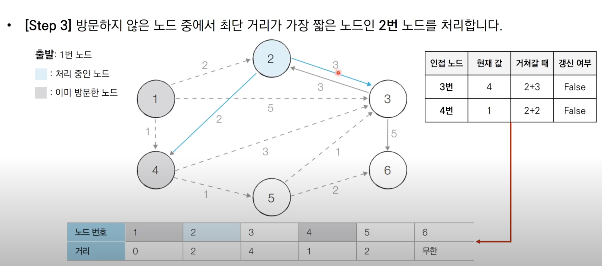

2번 노드를 통해 이동할 수 있는 노드는 3번과 4번이다. 3번의 최단거리는 4이다. 2번을 거쳐갈 때의 비용은 5이므로 최단거리는 갱신되지 않는다. 4번의 최단거리는 1이다. 2번을 거쳐갈 때의 비용은 2이므로 최단거리는 갱신되지 않는다. 

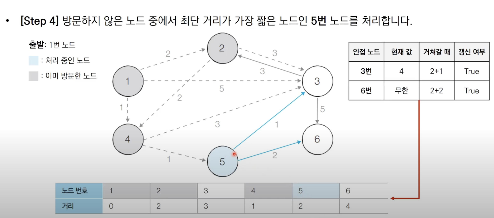

5번 노드를 통해 이동할 수 있는 노드는 3번과 6번이다. 3번의 최단거리는 4이다. 5번을 거쳐갈 때의 비용은 2+1=3이다. 4보다 작으므로 최단거리를 3으로 갱신한다.
6번의 최단거리는 현재 무한대이므로 5번을 거쳐갈 때의 비용인 2+2인 4를 최단거리로 갱신한다.

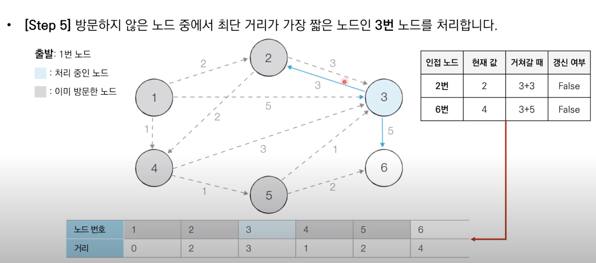

3번 노드를 통해 이동할 수 있는 노드는 2번과 6번이다. 2번의 최단거리는 2이다. 3번을 거쳐갈 때의 비용은 3+3이므로 현재 최단거리보다 크므로 최단거리를 갱신하지 않는다.

6번의 최단거리는 4이다. 3번을 거쳐갈 때의 비용은 3+5이다. 현재 최단거리보다 크므로 최단거리를 갱신하지 않는다.

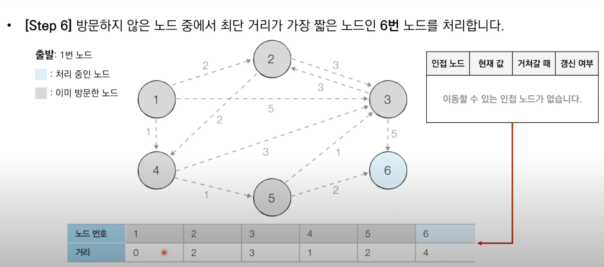

6번에서 출발하고자 하는 노드가 없으므로 종료

### 다익스트라 알고리즘 특징
- 그리디 알고리즘: **매 상황에서 방문하지 않은 가장 비용이 적은 노드를 선택**해 임의의 과정 반복
- 단계를 거치며 **한 번 처리된 노드의 최단 거리는 고정**
  - 한 단계당 하나의 노드에 대한 최단 거리를 확실히 찾는 것으로 이해하자
- 다익스트라 알고리즘 수행 후 테이블에 각 노드까지 최단 거리 정보가 저장되어야 한다.
  - 완벽한 형태의 최단 경로를 구하려면 소스코드에 추가적인 기능을 더 넣어야 함

~~~java
package dijkstra;

import java.util.*;

class Node {

    private int index;
    private int distance;

    public Node(int index, int distance) {
        this.index = index;
        this.distance = distance;
    }

    public int getIndex() {
        return this.index;
    }

    public int getDistance() {
        return this.distance;
    }
}

public class Ex1 {

    public static final int INF = (int) 1e9; // 무한대

    // 노드의 개수
    public static int n;

    // 간선의 개수
    public static int m;

    // 시작 노드의 번호
    public static int start;

    // 각 노드에 연결되어 있는 노드에 대한 정보를 담는 배열
    public static ArrayList<ArrayList<Node>> graph = new ArrayList<>();

    // 방문한 적이 있는지 체크하는 목적의 배열
    public static boolean[] visited = new boolean[100001];

    // 최단 거리 테이블
    public static int[] d = new int[100001];

    // 방문하지 않은 노드 중, 가장 최단 거리가 짧은 노드의 번호 반환
    public static int getSmallestNode(){
        int min_value = INF;
        int index = 0; // 가장 최단 거리가 짧은 인덱스
        for (int i = 1; i <=n; i++) {
            if(d[i] < min_value && !visited[i]) {
                min_value = d[i];
                index = i;
            }
        }

        return index;
    }

    public static void dijkstra(int start) {
        // 시작 노드에 대해 초기화
        d[start] = 0; // 자기 자신에 대해서는 최단거리가 0
        visited[start] = true; // 시작지점을 방문처리

        for(int j = 0; j < graph.get(start).size(); j++) {
            d[graph.get(start).get(j).getIndex()] = graph.get(start).get(j).getDistance();
        }

        // 시작 노드를 제외한 n-1개의 노드에 대해 반복
        for(int i = 0; i<n-1; i++) {
            // 현재 최단 거리가 가장 짧은 노드를 꺼내 방문 처리
            int now = getSmallestNode();
            visited[now] = true;

            for(int j = 0; j < graph.get(now).size(); j++) {
                // 현재 노드를 거쳐가는 비용
                int cost = d[now] + graph.get(now).get(j).getDistance();
                // 현재 노드를 거쳐서 다른 노드로 이동하는 거리가 더 짧은 경우
                if (cost < d[graph.get(now).get(j).getIndex()]) {
                    d[graph.get(now).get(j).getIndex()] = cost;
                }
            }
        }
    }

    public static void main(String[] args) {
        Scanner sc = new Scanner(System.in);

        n = sc.nextInt();
        m = sc.nextInt();
        start = sc.nextInt();

        // 그래프 초기화
        for (int i = 0; i <= n; i++) {
            graph.add(new ArrayList<Node>());
        }

        // 모든 간선 정보 입력
        for (int i = 0; i < m; i++) {
            int a = sc.nextInt();
            int b = sc.nextInt();
            int c = sc.nextInt();

            // a번 노드에서 b번 노드로 가는 비용이 c이다.
            graph.get(a).add(new Node(b, c));
        }

        // 최단 거리 테이블을 모두 무한으로 초기화
        Arrays.fill(d,INF);

        // 다익스트라 알고리즘 수행
        dijkstra(start);

        // 모든 노드로 가기 위한 최단 거리 출력
        for (int i = 1; i <= n; i++) {
            // 도달할 수 없는 경우, 무한(INFINITY)라고 출력
            if (d[i] == INF) {
                System.out.println("INFINITY");
            }
            // 도달할 수 있는 경우 거리 출력
            else {
                System.out.println(d[i]);
            }
        }
    }

}

~~~

- 총 O(V)번에 걸쳐 최단 거리가 가장 짧은 노드를 매번 선형 탐색해야한다.
- 따라서 전체 시간 복잡도는 O(V2)
- 일반적으로 코딩테스트의 최단 경로 문제에서 전체 노드 개수가 5000개 이하라면 이 코드로 문제를 해결할 수가 있을 것이다.
  - 하지만 노드 개수가 10000개 이상이라면 어떻게 해아할까?, 단순히 개산하더라도 1억번 이상의 연산이 수행될 것이다.

### 우선순위 큐
- 우선순위가 가장 높은 데이터를 가장 먼저 삭제하는 자료구조
- 여러개의 물건 데이터를 자료구조에 넣었다가 가치가 높은 물건 데이터부터 꺼내서 확인해야 하는 경우에 사용할 수 있다.

우선순위 큐를 구현하는 대표적인 방법으로 힙(Heap)이 있다.
- 최소 힙과 최대 힙으로 구성되어있다.
- 최소 힙은 값이 낮은 값부터 꺼내는 방식
- 최대 힙은 값이 큰 값부터 꺼내는 방식

## 다익스트라 알고리즘: 개선된 구현 방법
- 단계마다 방문하지 않은 노드 중 최단 거리가 가장 짧은 노드를 선택하기 위해 **힙(Heap)** 자료구조를 이용
- 다익스트라 알고리즘이 동작하는 기본 원리는 동일하다
  - 현재 가장 가까운 노드를 저장해 놓기 위해 힙 자료구조를 추가적으로 사용한다
  - 현재 최단 거리가 가장 짧은 노드를 선택해야하기 때문에 최소 힙을 사용한다

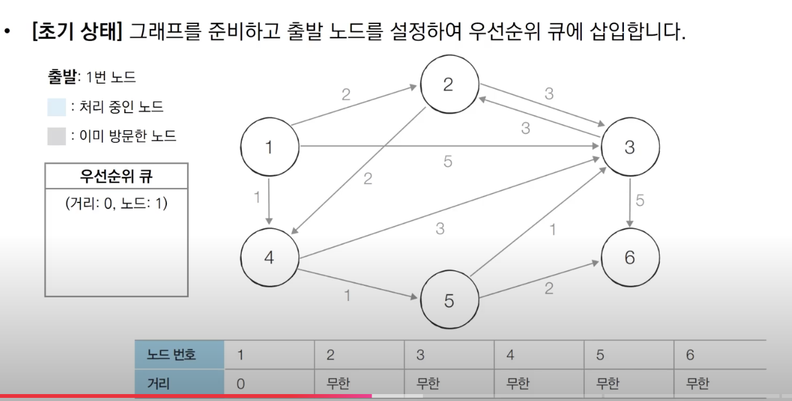
우선순위 큐에는 최단거리가 짧은 순으로 노드가 담겨져있다.

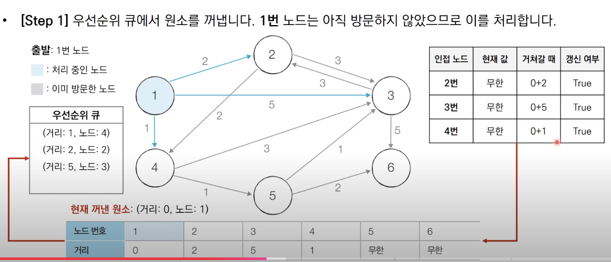
우선순위 큐에서 꺼낸 노드를 확인한다. 확인한 노드는 1이고 노드1까지 도달하기 위한 최단 거리는 0이다. 노드1을 거쳐가는 것을 기준으로 해서 인접한 노드인 2, 3, 4의 최단 거리 값을 갱신할 수 있다. 

2번 노드의 최단거리를 0+2인 2로 갱신하고 갱신여부를 true로 변경하고 3번과 4번 또한 똑같은 로직으로 갱신을 수행한다.

여기서 최단 경로를 갱신할 때만 큐에 해당 갱신된 노드에 대한 정보를 담아준다.

현재 꺼내진 원소는 노드 4까지의 최단거리가 1인 정보가 담겨진 정보가 담겨진 원소이다. 

이를 통해 4를 거쳐가는 경우에 대해 확인한다. 
3번 노드로 가는 경우 최단 거리는 1+3=4이다. 현재 최단거리인 5보다 작은 4이므로 최단거리가 4로 갱신된다.  
5번 노드로 가는 경우 최단 거리는 1+1=2이다.
현재 최단거리는 무한대이므로 최단거리가 2로 갱신된다.

3번,5번 노드 모두 최단 거리가 갱신되었으므로 우선순위 큐에 정보를 담아준다.

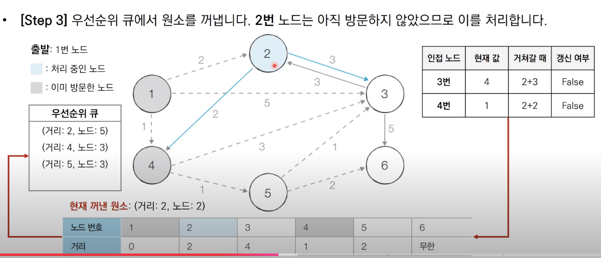
현재 꺼낸 원소는 2번 노드이고 최단거리는 2이다. 2번 노드와 연결된 노드는 4번, 3번 노드이며, 각각 비용은 2, 3이다.

3번 노드로 이동하는 경우 최단거리는 2+3=5이다. 현재 최단거리인 4보다 크므로 최단경로는 갱신되지 않는다.  
4번 노드로 이동하는 경우 최단거리는 2+2=4이다. 현재 최단거리인 1보다 크므로 최단경로는 갱신되지 않는다.

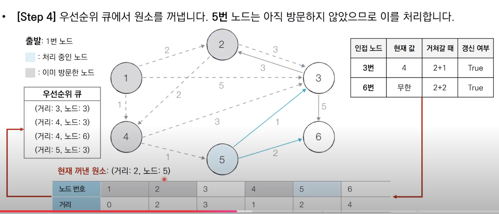
현재 꺼낸 원소는 5번 노드이고 최단거리는 2이다.
 5번 노드와 연결된 노드는 3번과 6번이다. 각각 소요되는 비용은 1, 2이다.

5번 노드를 거쳐 3번으로 이동할 때 소요되는 비용은 2+1이다. 현재 3번 노드의 최단 거리인 4보다 작으므로 최단거리가 3으로 갱신된다.

5번 노드를 거쳐 6번 노드로 이동할 때 소요되는 비용은 2+2이다. 현재 6번 노드의 최단 거리는 무한대이므로 최단거리가 4로 갱신된다.

3번, 6번 노드의 정보가 우선순위 큐에 갱신된다.

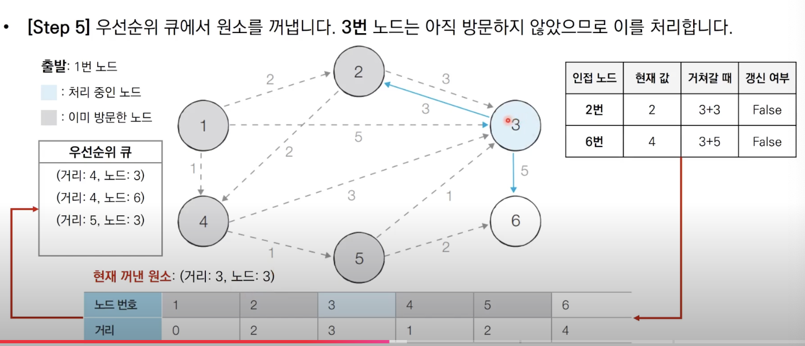
이어서 3번 노드에 대해서 처리한다. 3번 노드에서 2번 노드로 가는 비용은 3, 6번 노드로 가는 비용은 5이다. 

3번 노드를 거쳐 2번 노드로 가는 최소 비용은 3+3이다. 최단거리인 2보다 크므로 최단 거리는 갱신되지 않는다.

3번 노드를 거쳐 6번 노드로 가는 최소 비용은 3+5이다. 최단거리인 4보다 크므로 최단 거리는 갱신되지 않는다. 

다음 방문할 노드는 3번이다. 하지만 3번 노드는 이미 방문한 노드이다. 무시할 수 있도록 하자.

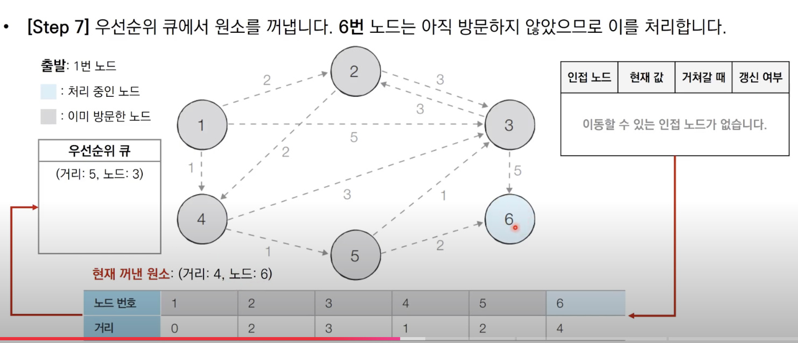
6번 노드에서 이동할 수 있는 인접 노드가 존재하지 않으므로 다음으로 진행한다.

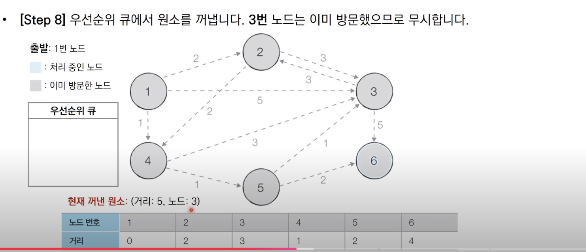
3번 노드는 방문한 노드이므로 무시한다.

~~~java
package dijkstra;

import java.util.ArrayList;
import java.util.Arrays;
import java.util.PriorityQueue;
import java.util.Scanner;

public class Ex2 {

    public static final int INF = (int) 1e9; // 무한

    // 노드 개수
    public static int n;

    // 간선 개수
    public static int m;

    // 시작 노드 번호
    public static int start;

    // 각 노드에 연결되어 있는 노드에 대한 정보를 담는 배열
    public static ArrayList<ArrayList<Node>> graph = new ArrayList<>();

    // 최단거리 테이블
    public static int[] d = new int[100001];

    public static void dijkstra(int start) {
        PriorityQueue<Node> pq = new PriorityQueue<>(); // 우선순위 큐
        // 시작 노드로 가기 위한 최단 경로는 0으로 설정하고 큐에 삽입
        pq.offer(new Node(start, 0));
        d[start] = 0;

        while (!pq.isEmpty()) {
            // 큐가 비어있지 않다면
            // 가장 최단거리가 짧은 노드에 대한 정보 꺼내기
            Node node = pq.poll();
            int distance = node.getDistance(); // 현재 노드까지의 비용
            int now = node.getIndex();// 현재 노드

            // 현재 노드가 이미 처리된 적 있다면 무시
            if (d[now] < distance) {
                continue;
            }
            // 현재 노드와 연결된 인접 노드 확인
            for (int i = 0; i < graph.get(now).size(); i++) {

                int cost = d[now] + graph.get(now).get(i).getDistance();
                // 현재 노드를 거쳐 다른 노드로 이동하는 거리가 더 짧은 경우
                if (cost < d[graph.get(now).get(i).getIndex()]) {
                    d[graph.get(now).get(i).getIndex()] = cost;
                    pq.offer(new Node(graph.get(now).get(i).getIndex(), cost));
                }
            }
        }
    }

    public static void main(String[] args) {
        Scanner sc = new Scanner(System.in);

        // 노드 개수
        n = sc.nextInt();
        // 간선 개수
        m = sc.nextInt();
        // 시작 노드 번호
        start = sc.nextInt();

        // 그래프 초기화
        for (int i = 0; i <= n; i++) {
            graph.add(new ArrayList<Node>());
        }

        // 모든 간선 정보 입력 받기
        for (int i = 0; i < m; i++) {
            int a = sc.nextInt();
            int b = sc.nextInt();
            int c = sc.nextInt();

            // a번 노드에 b번 노드로 가는 비용이 c
            graph.get(a).add(new Node(b, c));
        }

        // 최단 거리 테이블을 모두 무한으로 초기화
        Arrays.fill(d, INF);

        // 다익스트라 알고리즘 수행
        dijkstra(start);

        // 모든 노드로 가기 위한 최단 거리 출력
        for (int i = 1; i <= n; i++) {
            // 도달할 수 없는 경우, INFINITY 출력
            if (d[i] == INF) {
                System.out.println("INFINITY");
            }
            // 도달할 수 있는 경우 거리 출력
            else {
                System.out.println(d[i]);
            }
        }
    }

}
~~~

### 다익스트라 알고리즘: 개선된 구현 방법 성능 분석
- O(ElogV)
- 노드를 하나씩 꺼내 검사하는 반복문은 노드의 개수 V 이상의 횟수로는 처리되지 않는다
 - 현재 우선순위 큐에서 꺼낸 노드와 연결된 다른 노드들을 확인하는 총 횟수는 최대 간선의 개수만큼 연산이 수행될 수 있다.
- 직관적으로 전체 과정은 E개의 원소를 우선순위 큐에 넣었다가 모두 빼내는 연산과 매우 유사하다. 
  - O(ElogE)

## 플로이드 워셜 알고리즘
- **모든 노드에서 다른 노드까지의 최단 경로를 모두 계산**
- 다익스트라 알고리즘과 마찬가지로 **거쳐 가는 노드를 기준으로 알고리즘을 수행**
    - 매 단계마다 방문하지 않은 노드 중 최단 거리를 갖는 노드를 찾는 과정이 필요하지 않다.
- 플로이드 워셜은 2차원 테이블에 최단 거리 정보를 저장
- 이에 다이나믹 프로그래밍 유형에 속한다.
    - 각 단계 마다 **특정한 노드 k를 거쳐 가는 경우를 확인**
    - a에서 b로 가는 최단 거리보다 a에서 k를 거쳐 b로 가는 거리가 더 짧은지 검사

여기서 점화식은 Dab=min(Dab, Dak + Dkb)

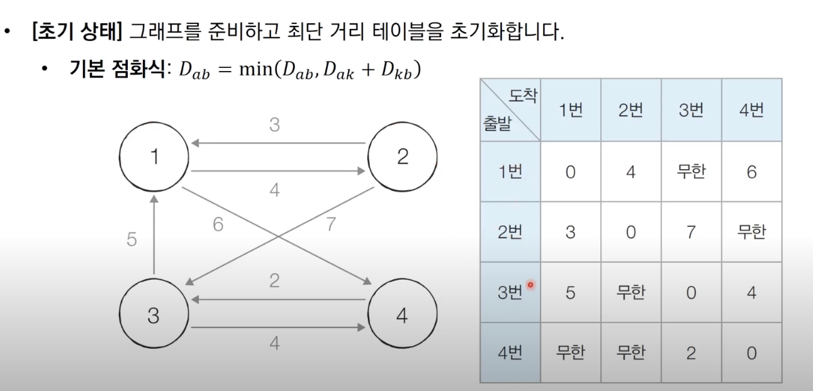
각 노드를 기준으로 하여 인접한 노드들을 확인하여 테이블을 갱신할 수 있도록 한다. 각 노드가 다른 노드로 가는 비용을 기록할 수 있도록 한다.

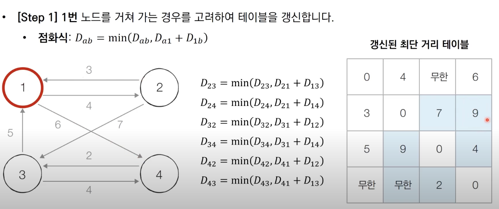
1번 노드를 거쳐가는 경우를 고려해 테이블을 갱신하자.  
이때 점화식에서 k값이 1이된다. 모든 a에서 모든 b로 가는 경우를 하나씩 확인하면서 현재 a에서 b로가는 최단 거리값보다 a에서 1로가는 거리의 값과 1에서 b로 가는 거리의 합이 더 작다면 최단 거리 테이블을 갱신한다.

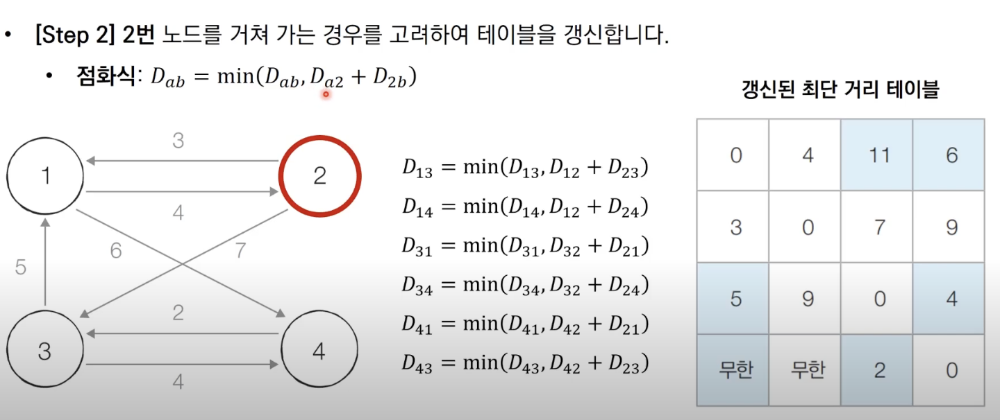
2번 노드 또한 같은 로직으로 동작한다.

4번 까지 똑같은 로직으로 최단 거리 테이블을 갱신한다.

~~~java
package dijkstra;

import java.util.Arrays;
import java.util.Scanner;

public class Floyd {

    public static final int INF = (int) 1e9; // 무한대
    // 노드 개수, 최대 500개로 가정
    public static int n;

    // 간선 개수 M
    public static int m;

    // 최단거리를 담아줄 2차원 배열
    public static int[][] graph = new int[501][501];

    public static void main(String[] args) {
        Scanner sc = new Scanner(System.in);

        n = sc.nextInt();
        m = sc.nextInt();

        // 최단 거리 테이블을 무한으로 초기화
        for (int i = 0; i < 501; i++) {
            Arrays.fill(graph[i], INF);
        }

        // 자기 자신에서 자기 자신으로 가는 비용을 0으로 초기화
        for (int a = 1; a <= n; a++) {
            for (int b = 1; b <= n; b++) {
                if (a == b) {
                    graph[a][b] = 0;
                }
            }
        }

        // 각 간선에 대한 정보를 입력 받아 그 값으로 초기화
        for (int i = 0; i < m; i++) {
            // A에서 B로 가는 비용을 C라고 설정
            int a = sc.nextInt();
            int b = sc.nextInt();
            int c = sc.nextInt();
            graph[a][b] = c;
        }

        // 점화식에 따라 플로이드 워셜 알고리즘 수행
        // Dab = min(Dab, Dak + Dkb)
        for (int k = 1; k <= n; k++) {
            for (int a = 1; a <= n; a++) {
                for (int b = 1; b <= n; b++) {
                    graph[a][b] = Math.min(graph[a][b], graph[a][k] + graph[k][b]);
                }
            }
        }

        for (int a = 1; a <= n; a++) {
            for (int b = 1; b <= n; b++) {
                // 도달할 수 없는 경우
                if (graph[a][b] == INF) {
                    System.out.print("INFINITY ");
                }
                // 도달할 수 있을 경우 거리 출력
                else {
                    System.out.print(graph[a][b] + " ");
                }
            }
            System.out.println();
        }
    }
}
~~~

### 플로이드 워셜 알고리즘 성능 분석
- 노드 개수가 N개일 때 알고리즘상 N번의 단계를 수행
    - 각 단계마다 O(N2)의 연산을 통해 현재 노드를 거쳐 가는 모든 경로를 고려한다.
- 즉, 총 시간 복잡도는 O(N3)