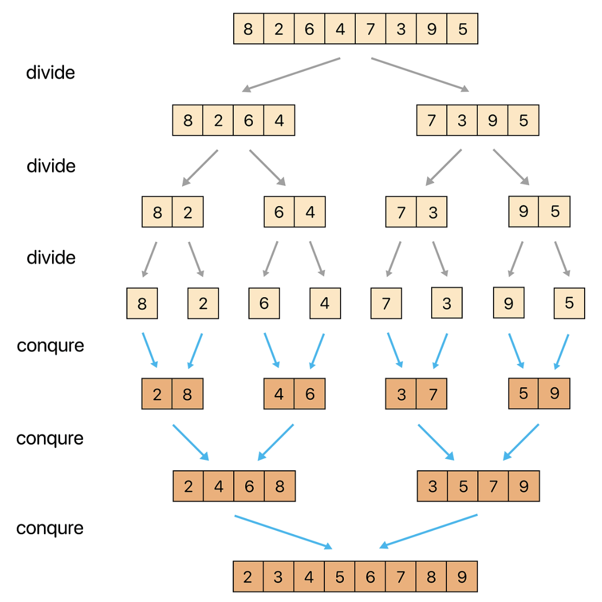

# 병합정렬(Merge Sort)
정렬해야할 리스트를 반복해서 분할하고 최대한 작게 쪼개졌을 때 부분리스트에 인접한 원소들끼리 비교해 정렬하는 방식

## 과정
1. 주어진 리스트를 절반으로 분할하여 부분리스트로 나눈다(Divide)
2. 해당 부분리스트의 길이가 1이 아니라면 1번 과정을 다시 수행
3. 인접한 부분리스트끼리 정렬하여 합친다 (Conqure)

## 참고
### [Stranger`s LAB Blog - 병합정렬](https://st-lab.tistory.com/233)