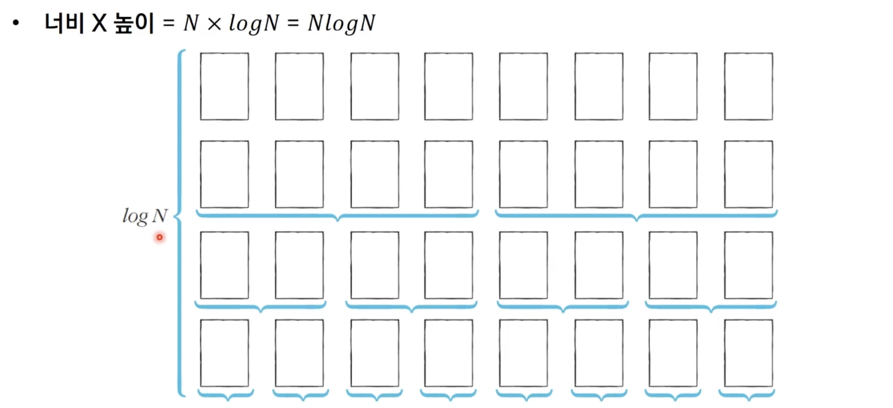

# 정렬 알고리즘
## 선택 정렬 알고리즘
처리되지 않은 데이터 중 **가장 작은 데이터를 선택해 맨 앞에 있는 데이터와 바꾸는 것을 반복** 한다.

~~~java
public class SelectSortEx {

    public static void main(String[] args) {

        int n = 10;
        int[] arr = {7, 5, 9, 0, 3, 1, 6, 2, 4, 8};

        System.out.println("정렬 전");
        for (int i = 0; i < n; i++) {
            System.out.print(arr[i] + " ");
        }
        System.out.println();

        for (int i = 0; i < n; i++) {

            int min_index = i; // 가장 장은 원소의 인덱스
            for (int j = i + 1; j < n; j++) {
                if (arr[min_index] > arr[j]) {
                    min_index = j;
                }
            }

            int temp = arr[i];
            arr[i] = arr[min_index];
            arr[min_index] = temp;
        }

        System.out.println("정렬 후");
        for (int i = 0; i < n; i++) {
            System.out.print(arr[i] + " ");
        }
    }
}
~~~
- 선택정렬은 N번 만큼 가장 작은 수를 찾아 맨 앞으로 보내야한다.
- 전체 연산 횟수
  - N + (N - 1) + (N - 2) + ... + 2
- `(N² + N - 2) / 2`로 표현할 수 있는데 빅오표기법에 따라 O(N²)라 작성 가능하다.

## 삽입 정렬
처리되지 않은 데이터를 하나씩 골라 적절한 위치에 `삽입`한다. 
선택 정렬에 비해 구현 난이도가 높지만 일반적으로 더 효율적으로 동작한다.

### 예시
`7, 5, 9, 0, 3, 1, 6, 2, 4, 8`가 있다 할 때,  

1.  첫번째 데이터 7은 정렬이 되어있다 하고, 두번째 데이터인 5가 어떤 위치로 들어갈 지 판단한다. `왼쪽 혹은 오른쪽`으로 들어가는 경우만 존재한다.
2. 작으면 왼쪽, 크면 오른쪽으로 삽입한다.
3. 이후 값들을 위와 같은 방법으로 반복

~~~java
public class InsertionSortEx {

    public static void main(String[] args) {

        int n = 10;
        int[] arr = {7, 5, 9, 0, 3, 1, 6, 2, 4, 8};

        System.out.println("정렬 전");

        for (int i = 0; i < arr.length; i++) {
            System.out.print(arr[i] + " ");
        }
        System.out.println();

        // 삽입정렬
        for (int i = 0; i < n; i++) {
            // 인덱스 i부터 1까지 감소하며 반복
            for (int j = i; j > 0; j--) {

                // 한 칸씩 왼쪽으로 이동
                if (arr[j] < arr[j - 1]) {

                    // 스와프
                    int tmp = arr[j];
                    arr[j] = arr[j - 1];
                    arr[j - 1] = tmp;
                } else {
                    // 자기보다 큰 값을 만났을 경우
                    break;
                }

            }
        }

        System.out.println("정렬 후");
        for (int i = 0; i < arr.length; i++) {
            System.out.print(arr[i] + " ");
        }
    }
}
~~~
- 삽입 정렬의 시간복잡도는 `O(N²)`, 반복문이 두 번 중첩되어 사용된다.
- 삽입 정렬은 `현재 리스트의 데이터가 거의 정렬되어 있는 상태면 매우 빠르게 동작한다.`
  - 최선의 경우 `O(N)`

## 퀵 정렬
- 기준 데이터를 설정하고 기준 데이터보다 큰 데이터와 작은 데이터의 위치를 바꾸는 방법이다.
- 일반적인 상황에서 가장 많이 사용되는 정렬 알고리즘
- 병합 정렬과 함께 대부분 프로그래밍 언어의 정렬 라이브러리의 근간이 되는 알고리즘
- 가장 기본적인 퀵 정렬은 `첫 번째 데이터를 기준 데이터(Pivot)`로 설정한다.

### 예시

위와 같이 정렬되지 않은 수열이 있다고 가정하자. 
현재 피벗 값은 5이다. 왼쪽에서부터 5보다 큰 데이터를 선택하기 때문에 7이 선택되고, 오른쪽에서부터 5보다 작은 데이터를 선택하기 때문에 4가 선택된다. 이제 7,4의 위치를 서로 변경한다.

현재 피벗값인 5를 기준으로 왼쪽에서부터 5보다 큰 데이터를 선택하기 때문에 9가 선택되고, 오른쪽에서부터 5보다 작은 데이터를 선택하기 때문에 2가 선택된다. 이제 9와 2의 위치를 서로 변경한다.

다시 피벗값 5를 기준으로 왼쪽에서부터 5보다 큰 데이터를 선택하기 때문이 6이 선택되고 오른쪽에서부터 5보다 작은 데이터를 선택하기 때문에 1이 선택된다. `단, 이처럼 엇갈리는 경우에는 "피벗"과 "작은 데이터의" 위치를 서로 변경한다.` 

5의 왼쪽에 있는 데이터들은 5보다 작고, 오른쪽에 있는 데이터들은 5보다 크다. 이렇게 피벗을 기준으로 데이터 묶음을 나누는 작업을 `분할(Divide)`라고 한다.

이제 왼쪽에 있는 데이터, 오른쪽에 있는 데이터도 마찬가지로 위와 같은 방법으로 정렬을 수행한다.

### 퀵 정렬이 빠른 이유
- 이상적인 경우 분할이 절반씩 일어난다면 전체 연산 횟수는 O(NlogN)을 기대할 수 있다.

### 퀵 정렬의 시간 복잡도
- 평균의 경우 O(NlogN)의 시간 복잡도를 가진다.
- 최악의 경우 O(N^2)의 시간 복잡도를 가진다

~~~java
public class QuickSortEx {

    public static void quickSort(int[] arr, int start, int end) {

        // 원소가 1개인 경우 종료
        if (start >= end) {
            return;
        }

        // pivot은 첫번째 요소
        int pivot = start;
        int left = start + 1;
        int right = end;

        // 교차되기 전까지 반복
        while (left <= right) {
            // 피벗보다 큰 데이터를 찾을 때까지 반복
            while (left <= end && arr[left] <= arr[pivot]) {
                left++;
            }

            // 피벗보다 작은 데이터를 찾을 때까지 반복
            while (right > start && arr[right] >= arr[pivot]) {
                right--;
            }

            // 엇갈렸다면 작은 데이터와 피벗을 교체
            if (left > right) {
                int tmp = arr[pivot];
                arr[pivot] = arr[right];
                arr[right] = tmp;
            } else {
                // 엇갈리지 않았다면 작은 데이터와 큰 데이터 교체
                int tmp = arr[left];
                arr[left] = arr[right];
                arr[right] = tmp;
            }

            // 분할 이후 왼쪽 부분과 오른쪽 부분 각각 정렬 수행
            quickSort(arr, start, right - 1);
            quickSort(arr, right + 1, end);

        }

    }

    public static void main(String[] args) {
        int n = 10;
        int[] arr = {7, 5, 9, 0, 3, 1, 6, 2, 4, 8};

        System.out.println("정렬 전");
        for (int i = 0; i < arr.length; i++) {
            System.out.print(arr[i] + " ");
        }

        System.out.println();

        quickSort(arr, 0, n - 1);

        System.out.println("정렬 후");
        for (int i = 0; i < arr.length; i++) {
            System.out.print(arr[i] + " ");
        }
    }
}
~~~

## 계수 정렬
- 특정 조건이 부합할 때만 사용할 수 있는 매우 빠른 정렬 알고리즘
    - 계수 정렬은 `데이터 크기의 범위가 제한되어 정수 형태로 표현할 수 있을 때` 사용
- 데이터 개수가 N, 데이터(양수) 중 최댓값이 K일 때 최악의 경우에도 수행시간 O(N + K)를 보장한다.

### 예시

- 데이터를 하나씩 확인하면서 데이터의 값과 동일한 인덱스의 데이터를 1씩 증가시킨다.

- 결과적으로 리스트에는 각 데이터가 몇 개씩 있는지 개수가 기록된다.
- 결과를 확인할 때는 리스트의 첫번째 데이터부터 하나씩 그 만큼 반복하여 인덱스를 출력한다.

~~~java
public class CountingSortEx {

    public static final int MAX_VALUE = 15;

    public static void main(String[] args) {
        int n = 15;

        // 모든 원소 값은 0보다 크거나 같다고 가정
        int[] arr = {7, 5, 9, 0, 14, 1, 6, 2, 9, 1, 4, 8, 0, 5, 12};

        // 모든 범위를 포함하는 배열 선언
        int[] count = new int[MAX_VALUE + 1];

        for (int i = 0; i < n; i++) {
            count[arr[i]] += 1;
        }

        for (int i = 0; i <= MAX_VALUE; i++) {
            for (int j = 0; j < count[i]; j++) {
                System.out.print(i + " ");
            }
        }
    }
}
~~~
- 시간 복잡도와 공간 복잡도 모두 O(N+K)
- 때에 따라 비효율적이다
    - ex) 데이터가 0과 999999 단 2개로만 이루어져있을 때
- 동일한 값을 가지는 데이터가 여러 개 등장할 때 효과적이다.