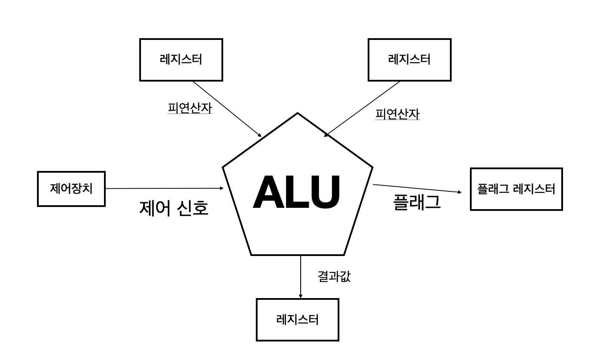

# CPU 작동 원리
## ALU와 제어장치
- CPU: 메모리에 저장된 명령어르 읽어 들이고, 해석하고, 실행하는 장치
- ALU: CPU 내부에는 계산을 담당
- 레지스터: 명령어를 읽어 들이고 해석하는 제어장치

### ALU

- `ALU`는 `레지스터`를 통해 `피연산자`를 받아들이고,
- `제어장치`로부터 수행할 연산을 알려주는 `제어 신호`를 받아들인다.
- 레지스터와 제어장치로부터 받아들인 `피연산자`와 `제어신호`로 다양한 `연산`을 수행

ALU는 연산을 수행할 결과로 숫자나 문자, 메모리 주소를 내보낼 수 있다. 이 결과값들은 `일시적으로 레지스터에 저장`된다.

CPU가 메모리에 접근하는 속도는 레지스터에 접근하는 속도보다 훨씬 느리다. ALU가 연산할 때마다 CPU는 메모리에 자주 접근하게 되고 프로그램 실행 속도를 늦출 수도 있다. 이런 이유로 ALU의 결과값을 `레지스터에 우선 저장`한다.

`플래그`: ALU가 내보내는 연산 결과에 대한 추가적인 상태 정보
- `부호`플래그: 연산한 `결과의 부호`를 나타낸다.
- `제로` 플래그: 연산 결과가 `0인지 여부`를 나타낸다.
- `캐리` 플래그: 연산 결과 `올림수`나 `빌림수`가 발생했는지 알린다.
- `오버플로우` 플래그: `오버플로우`가 발생했는지
- `인터럽트` 플래그: `인터럽트`가 가능한지 나타낸다.
- `슈퍼바이저` 플래그: `커널모드`로 실행중인지, `사용자 모드`로 실행 중인지 나타낸다.

이러한 플래그는 CPU가 프로그램을 실행하는 도중 반드시 기억해야 하는 참고 정보이다. 그리고 플래그들은 `플래그 레지스터`에 저장된다.

### 제어장치
- `제어장치`: 제어 신호를 내보내고 명령어를 해석하는 부품
- `제어신호`: 컴퓨터 부품들을 관리하고 작동시키기 위한 전기 신호

**1. 제어장치는 클럭 신호를 받아들인다.**  
클럭: 컴퓨터의 모든 부품을 움직일 수 있게 하는 시간 단위 
클럭 주기에 맞춰 한 레지스터에서 다른 레지스터로 데이터가 이동되거나, ALU에서 연산이 수행되거나, CPU가 메모리에 저장된 명령어를 읽어들인다.

**2. 제어장치는 '해석해야 할 명령어'를 받아들인다.** 
CPU가 해석해야 할 명령어는 `명령어 레지스터`라는 특별한 레지스터에 저장된다. 제어장치는 이 명령어 레지스터로부터 해석할 명령어를 받아들이고 해석 한 뒤, 제어 신호를 발생시켜 컴퓨터 부품들에게 수행해야 할 내용을 알려준다.

**3. 제어장치는 플래그 레지스터 속 플래그 값을 받아들인다.** 
제어장치는 플래그 값을 받아들이고 이를 참고해 제어 신호를 발생시킨다.

**4. 제어장치는 시스템 버스, 그중에서 제어 버스로 전달된 제어 신호를 받아들인다.** 
제어 신호는 CPU뿐 만 아니라 CPU 외부 장치도 발생시킬 수 있다. 제어장치는 제어 버스를 통해 외부로부터 전달된 제어 신호를 받아들이기도 한다.

제어 장치에서 내보내는 정보에는 크게 CPU 외부에 전달하는 제어 신호와 CPU 내부에 전달하는 제어 신호가 있다.  
CPU 외부에 제어 신호를 전달한다는 것은 제어 버스로 제어 신호를 내보낸다는 뜻이다. 이러한 제어 신호에는 `메모리에 전달하는 제어 신호`와 `입출력장치에 전달하는 제어 신호`가 있다.

제어장치가 메모리에 저장된 값을 읽거나 새로운 값을 쓰고 싶다면 메모리로 제어 신호를 내보낸다.  
제어장치가 입출력장치 값을 읽거나새로운 값을 쓰고 싶다면 입출력장치로 제어 신호를 내보낸다. 

제어장치가 CPU 내부에 전달하는 제어신호에는 `ALU에 전달하는 제어 신호`, `레지스터에 전달하는 제어 신호`가 있다. ALU에는 수행할 연산을 지시하기 위해, 레지스터에는 레지스터간 데이터를 이동시키거나 레지스터에 저장된 명령어를 해석하기 위해 제어신호를 내보낸다.