# 빅오(Big-O) 
[빅오표기법](https://www.youtube.com/watch?v=6Iq5iMCVsXA&list=PLjSkJdbr_gFYSUYfnF_OGXtnGs2d3vWg7&index=1)

위 영상을 참고하여 기록합니다.

## 빅오란?
* 알고리즘 성능을 수학적으로 표현하는 방법 
* 시간, 공간복잡도 표현할 수 있음
* 데이터 or 사용자의 증가율에 따른 알고리즘 성능을 예측하는 것이 목적

### O(1) 알고리즘
입력데이터 크기 상관없이 언제나 일정한 시간이 걸리는 알고리즘

~~~C
F(int[] n) {
  return (n[0] == 0) ? true : false;
}
~~~

- 첫번째 배열 방이 0인지 확인하는 함수.
- 인자로 받은 배열 방이 얼마나 큰지에 상관없이 언제나 일정한 속도로 결과를 반환

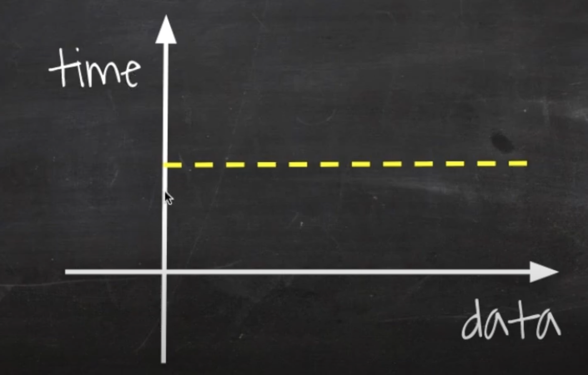
데이터가 증가함에 따라 성능에 변화가 없다.

### O(n)
입력데이터의 크기에 비례해서 처리시간이 걸리는 알고리즘
~~~C
F(int[] n) {
  for i = 0 to n.length
    print i
}
~~~
- n개의 데이터를 받으면 n번 반복문을 돌기에 n이 늘어날때마다 처리시간이 늘어남

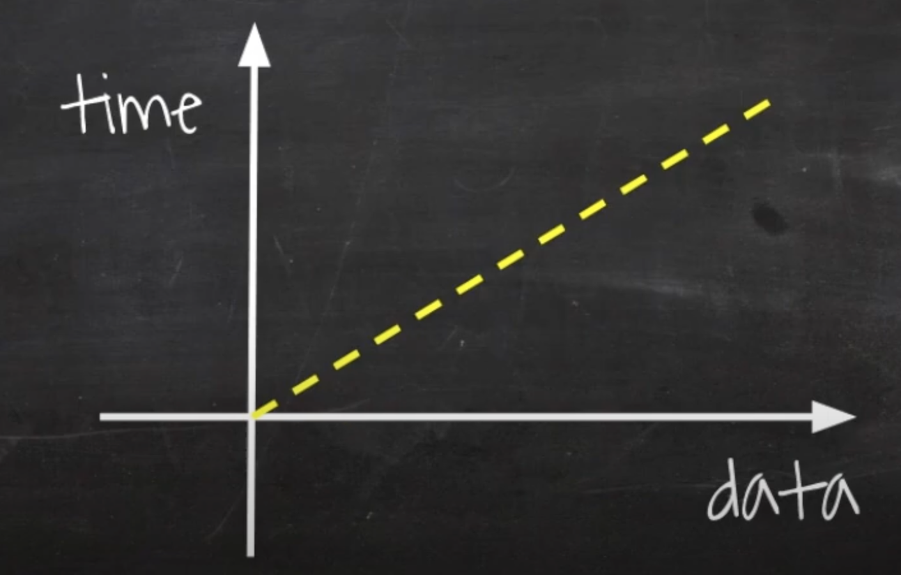
데이터가 증가함에 따라 처리시간도 같이 증가한다. 같은 비율로 증가함

### O(n^2)
~~~C
F(int[] n) {
  for i = 0 to n.length
    for j = 0 to n.length
      print i + j;
}
~~~
- 처음에 n을 가지고 반복문을 돌리면서 그 안에서 n으로 또 반복문을 돌릴 때 
- n개의 데이터를 받으면 첫번째 반복문에서 n번 돌면서 각각의 엘리먼트에서 n번씩 반복문을 또 돌리기 때문에 n^2

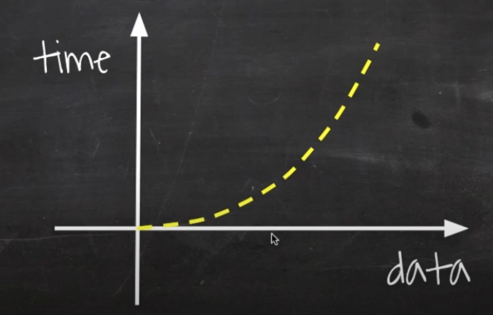
처음에 데이터가 증가할때마다 조금씩 증가하다 어느구간에서부터는 거의 수직 상승하게 됌

### O(nm)
~~~C
F(int[] n, int[] m) {
  for i = 0 to n.length
   for j = 0 to m.length
    print i + j;
}
~~~
O(n^2)에서 봤던 함수랑 비슷하지면 여기서는 n번 반복문 돌 때 그 안에서 m번 반복문을 돈다.

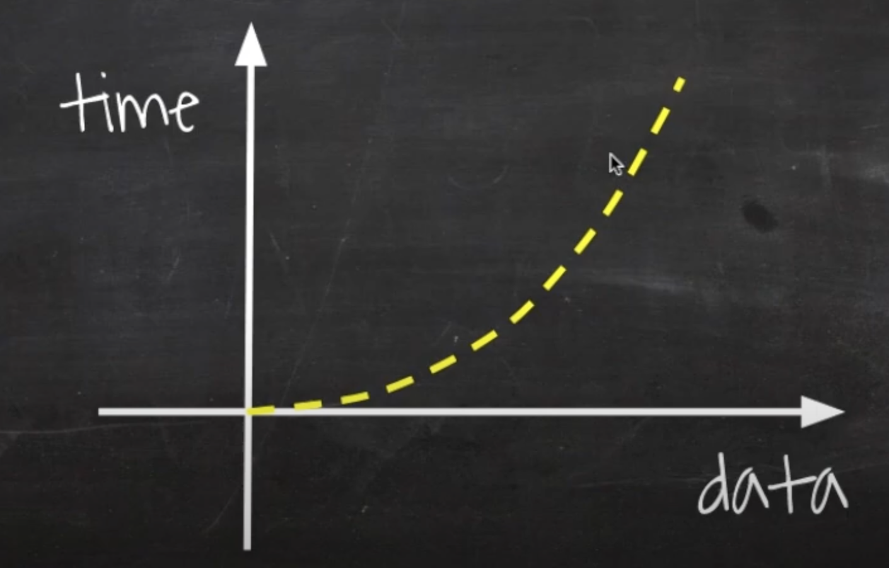

O(n^2)와 마찬가지로 데이터가 증가할수록 수직에 가깝게 그래프가 그려진다.

### O(n^3)
~~~C
F(int[] n) {
  for i = 0 to n.length
    for j = 0 to n.length
      for k = 0 to n.length
        prijnt i+j+k;
}
~~~
n을 가지고 반복문을 3중으로 돌리면 n^3이 된다.

O(n) 일 때는 직선,

O(n^2) 일 때는 면적,

O(n^3) 일 때는 큐빅이 된다.
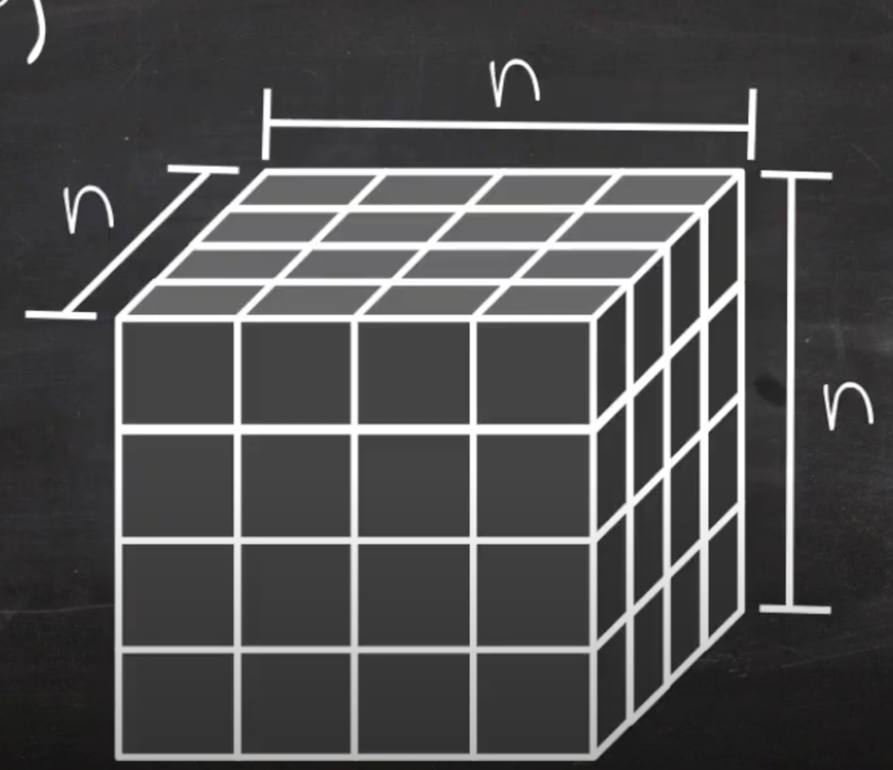

---

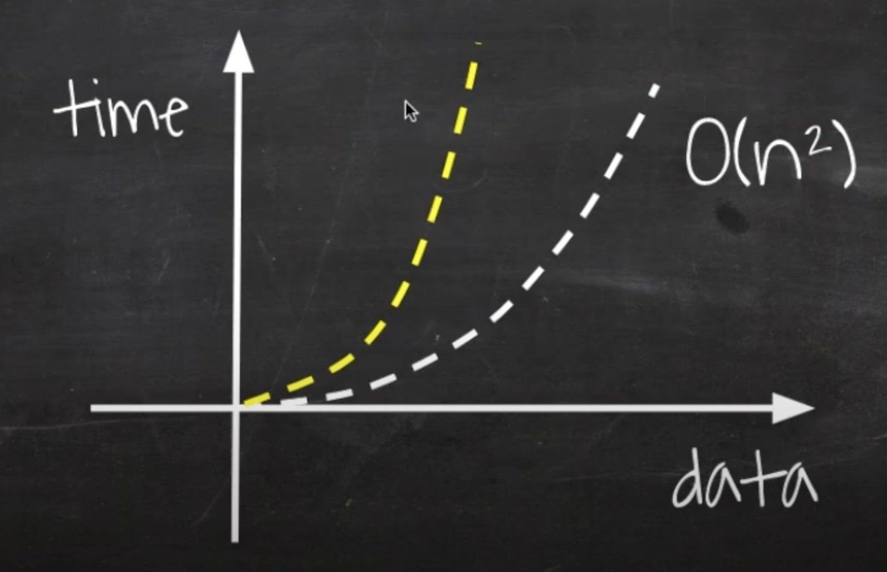
O(n^2)의 그래프와 유사하지만 가로, 세로, 높이까지 더해지므로 데이터가 증가할때마다 더 급격하게 수직 상승하게된다.

### O(2^n)
피보나치 수열: 1부터 시작해서 한 면을 기준으로 정사각형을 만드는 것
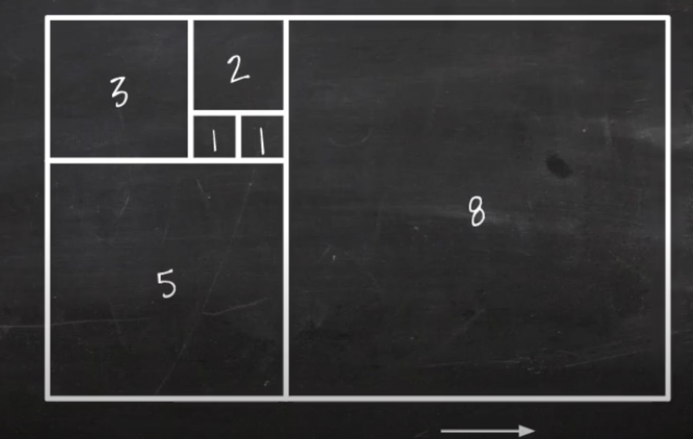

1, 1, 2, 3, 5, 8, ....

1 -> 1, 1과 1을 더해 2, 2와 1을 더해 3, 3과 2를 더해 5, 5와 3을 더해 8 ... 

재귀함수를 이용한 피보나치 수열 구하기
~~~C
F(n, r) {
  if(n <= 0) return 0;
  else if (n==1) return r[n] = 1;
  return r[n] = F(n-1, r) + F(n - 2, r);
}
~~~
호출 할 때마다 바로 전 숫자와 전전 숫자를 알아야 더할 수 있기 때문에 
하나 뺀 숫자를 갖고 재귀호출을 하고, 두개를 뺀 숫자를 가지고 재귀호출을 해서,
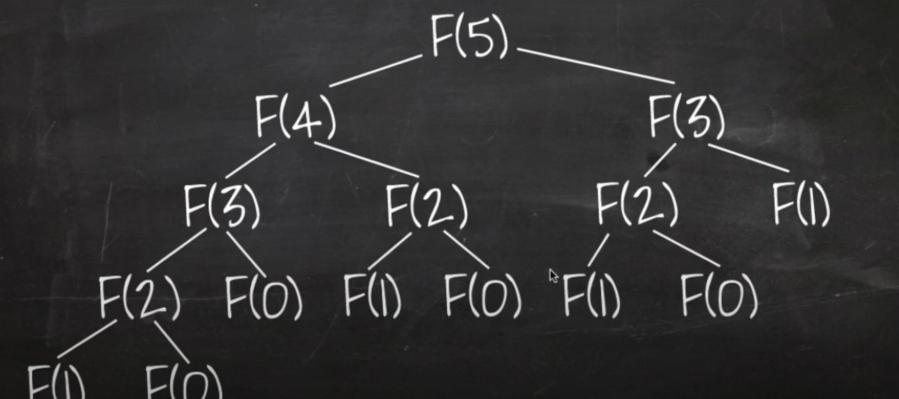

매번 함수가 호출될 때마다 두번씩 또 호출하는데 그것을 트리의 높이만큼 반복
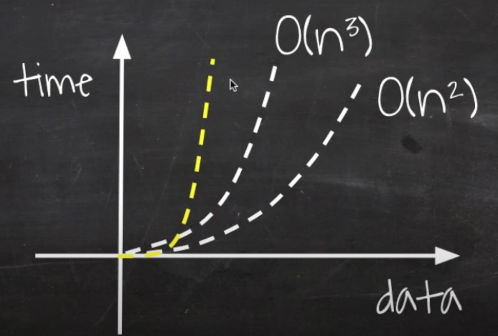

데이터의 증가할때마다 처리시간이 O(n^3), O(n^2) 보다 훨씬 늘어나게됌

### O(log n)
이진검색  
1 2 3 4 5 6 7 8 9  

이 처럼 정렬된 배열안에서 6을 찾는다 가정하자. 
이진검색을 하려면 가운데 값(5)를 찾아 키값과 비교한다. 
키값이 더 크므로 앞쪽에 있는 수는 볼 필요도 없고 뒤에 있는 숫자들만 보면 된다. 
남아있는 6 7 8 9 에서 가운데 값인 7과 6을 비교한다  
6이 더 작으므로 앞쪽에 있는 수이다. 뒤쪽에 있는 8 9 는 볼 필요도 없다.

이런식으로 처리가 한번 진행될 때 마다 검색해야하는 데이터 양이 절반씩 떨어지는 알고리즘을 O(log n) 알고리즘이라 한다.

~~~C
F(k, arr, s, e){
  if (s > e) return -1;
  m = (s + e) / 2;
  if(arr[m] == k) return m;
  else if (arr[m] > k) return F(k, arr, s, m-1);
  else return F(k, arr, m+1, e);
}
~~~
s: 시작번호
e: 끝번호
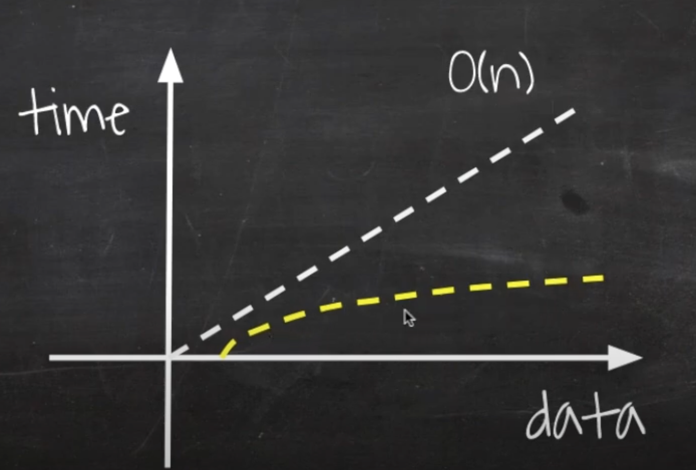

### O(sqrt(n))
n이 4 일때, n개인 정사각형에 채워서 맨 윗줄이 제곱근이 된다.
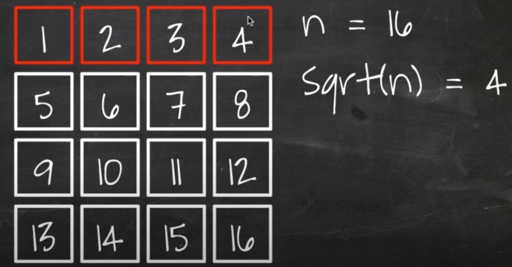
정사각형에 n을 다 채워서 맨 윗줄만 돌리는 알고리즘

---
## 빅오표기법에서 중요점
빅오에서는 상수는 과감히 버린다.
~~~C
F(int[] n) {
  for i = 0 to n.length
   print i
  for i = 0 to n.length
    print i
}
~~~
n번씩 두번씩 돌리므로 O(2n)이 되는데 빅오표기법에서는 O(n)으로 표기한다.

~~~C
F(int[] n) {
  for i = 0 to n.length
    for j = 0 to n.length
      print i + j;
  for i = 0 to n.length
    for j = 0 to n.length
      print i + j;
}
~~~
O(n^2) 도 차원이 늘어나지 않는 이상 상수는 생각하지 않는다.

코딩테스트 문제를 풀 때 가장 먼저 확인해야할 것이 시간제한(수행시간 요구사항)이다. 시간제한이 1초인 문제일 경우
- N의 범위가 500인 경우: O(N^3)인 알고리즘을 설계
- N의 범위가 2000인 경우: O(N^2)인 알고리즘 설계
- N의 범위가 100000인 경우: O(NlogN)인 알고리즘 설계
- N의 범위가 10000000인 경우: O(N)인 알고리즘 설계
