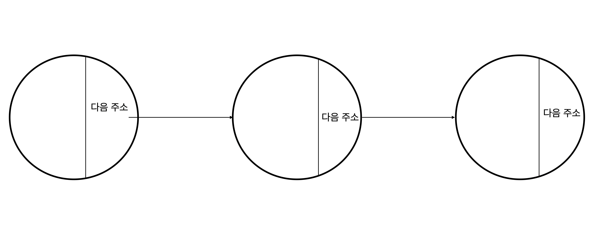

# 연결리스트(LinkedList)
연결리스트는 1열로 연결된 데이터를 저장할 때 사용된다.

이렇게 데이터를 저장할 수 있는 공간이 있다고 했을 때 그 안에 다음 데이터의 주소를 가지고 있는 구조입니다.

배열은 크기를 한 번 정하면 늘리거나 줄일 수 없습니다.  
하지만 연결리스트는 데이터를 중간에 넣고자 할 때, 

아래 그림과 같이 삽입하고자 할 노드 앞의 노드가 가지고 있던 다음 데이터의 주소를 삽입하고자 할 노드가 갖고, 앞의 노드에게는 삽입하고자 하는 노드의 주소를 알려주면 됩니다.

다시 링크를 빼고자 할 때는 빼고자 하는 노드가 갖고있던 다음 데이터의 주소를 빼고자 하는 노드의 앞의 노드에게 주면 됩니다. 여기서 링크에서 빠지게 된 노드는 메모리를 잡게되는데 자바에서는 GC를 이용해서 이 노드를 처리해줍니다.

연결리스트는 연결된 주소를 통해 일일히 찾아다니기 때문에 배열보다 속도가 느릴 수 있습니다.  
하지만 배열에서 데이터를 추가하거나 삭제하는 경우 배열을 선언하고, 복사하고, 추가해줘야하기 때문에 번거롭습니다.

이렇듯, 길이가 정해지지 않은 데이터를 다루고자 할 때는 배열보다는 연결리스트가 좋습니다.

## 단방향/양방향 연결리스트

위 그림을 보면, 이 연결리스트는 한쪽 방향으로만 이동할 수 있습니다. 이전 데이터가 어디있는지 모르고 오직 다음 데이터가 어디있는지만 알고 있습니다. 그래서 데이터를 검색할 때 맨 앞에서부터 한개씩 노드를 이동하면서 검색해야 합니다.  
이러한 연결리스트를 `단방향 연결 리스트` 라고 합니다.

반면에 `양방향 연결 리스트`는 다음 주소도 가지고 있고, 내 앞에 데이터가 어디있는지에 대한 주소도 추가로 가지고 있습니다. 

양방향 연결 리스트에서 데이터를 삽입해봅시다.

삽입하고자 하는 노드의 전 노드가 갖고있던 다음 주소를 삽입하고자 하는 노드의 다음 주소로 주고, 다음 노드에게 삽입하고자 하는 노드의 주소 이전 주소로 줍니다.  
삽입하고자 하는 노드의 앞 노드가 갖고있던 이전 주소를 삽입하고자 하는 노드의 이전 주소로 줍니다. 그리고 이전 노드에게 삽입하고자 하는 노드의 주소를 다음 주소로 줍니다.

반대로 데이터를 삭제해봅시다.
삭제하고자 하는 노드의 다음 주소를 전 노드의 다음 주소로 주고, 이전 주소를 다음 노드의 이전 주소로 주면 됩니다. 이렇게 되면 해당 데이터는 연결리스트에서 빠지게 됩니다.

## 단방향 연결리스트 구현
그럼 간단하게 단방향 연결 리스트를 구현해보도록 해봅시다.
~~~java
public class Node {

    private int data;
    Node next = null;

    public Node(int data) {
        this.data = data;
    }

    public void append(int d) {
        Node end = new Node(d);
        Node n = this;

        while (n.next != null) {
            n = n.next;
        }

        n.next = end;
    }

    public void delete(int d) {
        Node n = this;

        while (n.next != null) {
            if (n.next.data == d) {
                n.next = n.next.next;
            } else {
                n = n.next;
            }
        }
    }

    public void retrieve() {
        Node n = this;

        while (n.next != null) {
            System.out.print(n.data + " -> ");
            n = n.next;
        }

        System.out.println(n.data);
    }
}
~~~

~~~java
public class SinglyLinkedList {

    public static void main(String[] args) {
        Node head = new Node(1);
        head.append(2);
        head.append(3);
        head.append(4);

        head.retrieve();

        head.delete(2);
        head.delete(3);
        head.retrieve();

    }
}
~~~