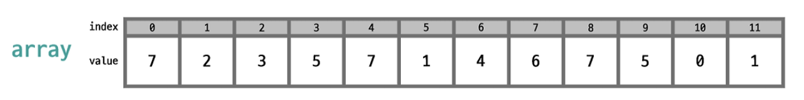
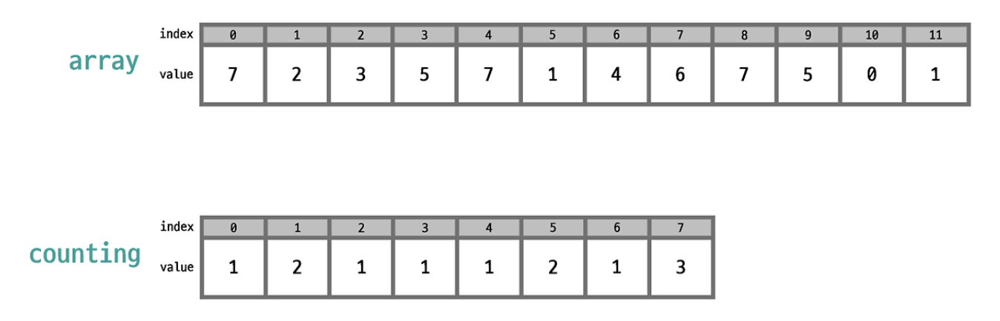
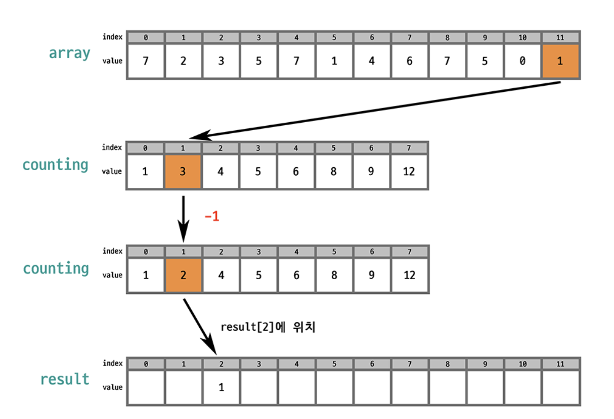
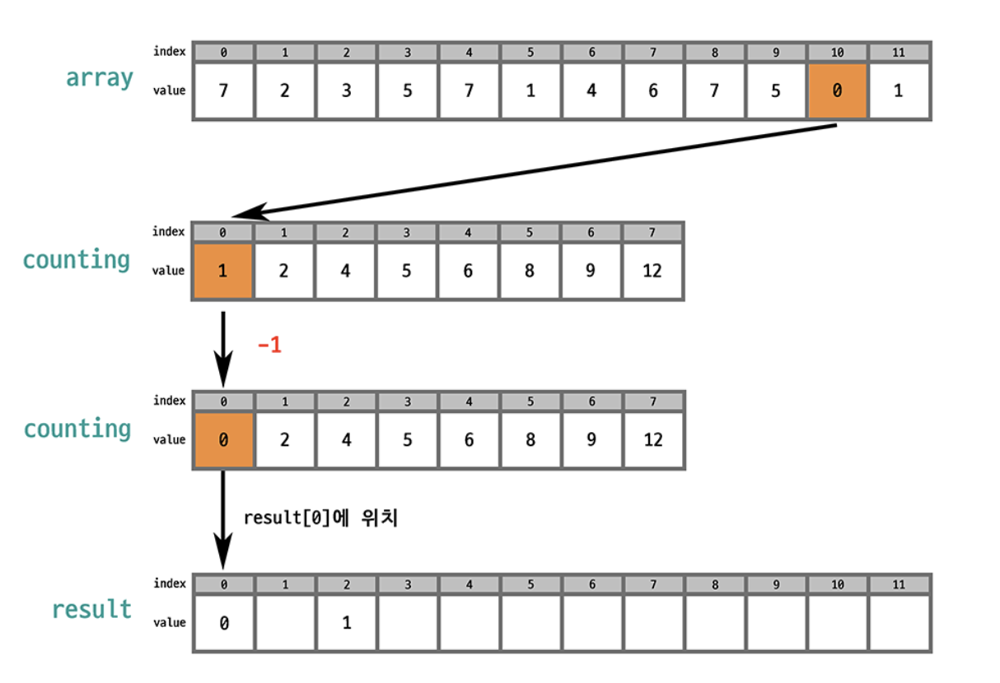
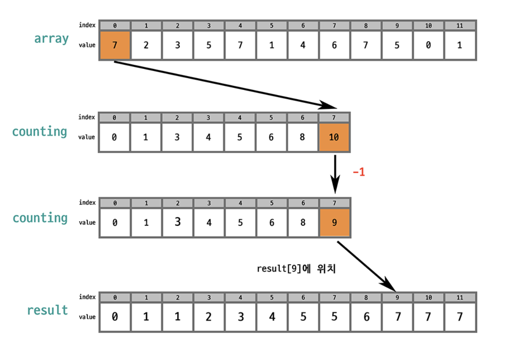

# 카운팅 정렬(계수 정렬)
### [Stranger`s LAB Blog](https://st-lab.tistory.com/104) 

- 주어진 값 범위 내에서 각 요소의 발생 빈도를 계산해 정렬하는 알고리즘
- 정수나 범위가 제한된 데이터를 정렬할 때 효과적
- 시간복잡도: O(n)

### 정렬 방법

이러한 배열이 있다고 가정하자.

1. array를 한 번 순회하면서 각 값이 나올때 마다 해당 값을 index로 하는 새로운 배열의 값을 1 증가 시킨다.

- array[0] = 7 -> counting[7]의 값을 1 증가,  
- array[1] = 2 -> counting[2]의 값을 2 증가,  
- ...  
- counting[]은 array[]에 0이 1개, 1이 2개, 3이 1개 ... 이런식으로 array[]에 담긴 값의 개수가 담겨있다.

2. counting 배열의 각 값을 누적합으로 변환
counting[0]과 counting[1]을 더한 값을 counting[1]에 넣고,  
counting[1]과 counting[2]을 더한 값을 counting[2]에 넣고,  
...

3. counting 배열을 잘 보면 배열의 각 값은 (시작점 - 1)을 알려준다.

예를 들어,
- array[0] = 7이고, counting[7] = 12 이다.
- counting[7]의 값, 즉 12에서 1을 빼준 뒤 해당값이 새로운 배열의 인덱스 11에 위치하게 해준다.

- array[1] = 2, counting[2] = 4 이다.
- counting[2]의 값, 즉 4에서 1을 빼준 뒤 해당 값이 새로운 배열 인덱스 3에 위치하게 해준다.

...
이 알고리즘에서 안정적으로 정렬해주기 위해 array의 마지막 index부터 순회하는 것이 좋다.

...

이 과정에서 두 수를 비교하는 과정이 없기 때문에 빠르게 배치가 가능하다.  
하지만 새로운 배열(counting[])을 선언해 줘야하는게 단점이다.  
수의 범위가 매우 클 경우에는 메모리가 매우 낭비하게 된다.  

~~~ java
public class CountingSort {

    public static void main(String[] args) {

        int[] arr = new int[100]; // 수열의 원소개수 100개
        int[] counting = new int[31]; // 수의 범위 : 0 ~ 31
        int[] result = new int[100]; // 정렬될 배열

        for (int i = 0; i < arr.length; i++) {
            arr[i] = (int) (Math.random() * 31); // 0~30
        }

        // Counting Sort

        // 1번 과정
        // array를 한 번 순회하면서 각 값이 나올때 마다 해당 값을 index로 하는 새로운 배열의 값을 1 증가 시킨다.
        for (int i = 0; i < arr.length; i++) {
            // array의 value 값을 index로 하는 counting배열 값 1 증가
            counting[arr[i]]++;
        }

        // 2번 과정
        // counting 배열의 각 값을 누적합으로 변환
        for (int i = 1; i < counting.length; i++) {
            counting[i] += counting[i - 1];
        }

        // 3번 과정
        // i 번쨰 원소를 인덱스로 하는 counting 배열을 1 감소시킨 뒤
        // counting 배열의 값을 인덱스로 하여 result에 value 값을 저장한다.
        for (int i = arr.length - 1; i >= 0; i--) {
            int value = arr[i];
            counting[value]--;
            result[counting[value]] = value;
        }

        System.out.println("===== arr =====");
        for (int i : arr) {
            System.out.print(i + " ");
        }
        System.out.println();

        System.out.println("===== counting[] =====");
        for (int i : counting) {
            System.out.print(i + " ");
        }
        System.out.println();

        System.out.println("===== result[] =====");
        for (int i : result) {
            System.out.print(i + " ");

        }
    }
}

~~