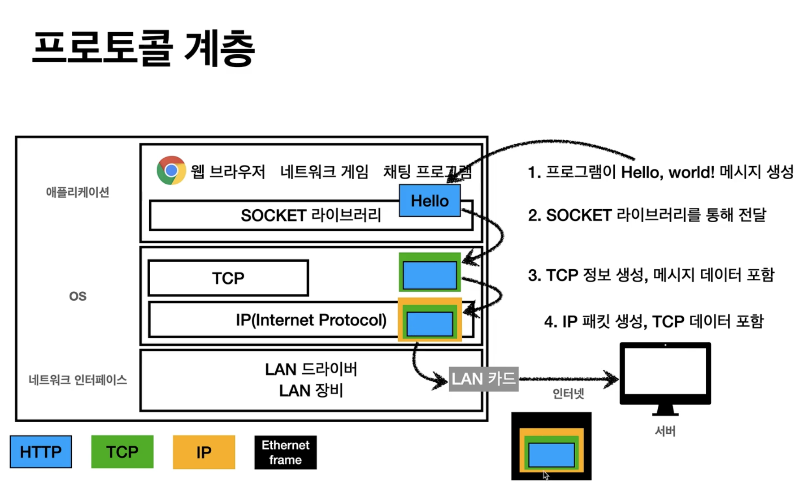
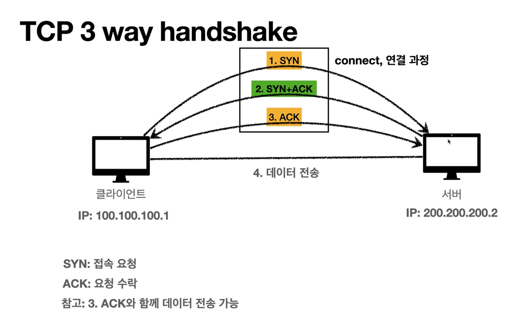

# 인터넷 네트워크
## 인터넷 통신
### IP (인터넷 프로토콜)
#### 인터넷 프로토콜의 역할
- 지정한 IP 주소에 데이터 전달
- 패킷이라는 통신 단위로 데이터 전달
#### IP 프로토콜의 한계
- 비연결성
  - 패킷을 받을 대상이 없거나 서비스 불능 상태여도 패킷 전송
- 비신뢰성
  - 중간에 패킷이 사라졌을 때?
  - 패킷이 순서대로 오지 않았을 떄?
- 프로그램 구분
  - 같은 IP를 사용하는 서버에서 통신하는 애플리케이션이 둘 이상이면?

위와 같은 문제르 TCP가 해결해준다.

### TCP/UDP
#### 인터넷 프로토콜 스택의 4계층
- 애플리케이션 계층 - HTTP, FTP
- 전송 계층 - TCP, UDP
- 인터넷 계층 - IP
- 네트워크 인터페이스 계층

#### TCP/IP 패킷 정보

#### TCP 특징
전송 제어 프로토콜(Transmisson Control Protocol)
- 연결지향 - TCP 3 way handshake (가상연결)
  - 서로 진짜 연결된 것이 아닌 논리적으로 연결
- 데이터 전달 보증
  - 클라이언트에서 데이터 전송 시 서버에서는 잘 받았는지 클라이언트로 알려줌
- 순서 보장
  - 패킷1, 패킷2, 패킷3 순서대로 패킷을 전송한다 했을 때
  - 패킷1, 패킷3, 패킷2 순서로 패킷이 서버에 도착한 경우
  - 패킷2부터 다시 보내라고 클라이언트에 요청
  - 클라이언트는 패킷2부터 다시보냄
- 신뢰할 수 있는 프로토콜

#### UDP 특징
사용자 데이터그램 프로토콜(User Datagram Protocol)
- 기능이 거의 없다
- TCP의 특징을 갖고 있지 않다.
- 단순하고 빠르다
- IP와 거의 같음 + PORT + 체크섬 점도만 추가됐다
- 애플리케이션에서 추가 작업이 필요하다

### PORT
클라이언트에서 한 번에 둘 이상 연결해야 한다면? 
ex. 게임하면서 노래도 듣고 친구와 채팅도 하는 상황

포트는 같은 IP내에서 프로세스를 구분
- 0 ~ 65535까지 할당 가능
- 0 ~ 1023까지는 잘 알려진 포트로 사용하지 않는것이 좋다
  - FTP - 20, 21
  - TELNET - 23
  - HTTP - 80
  - HTTPS - 443