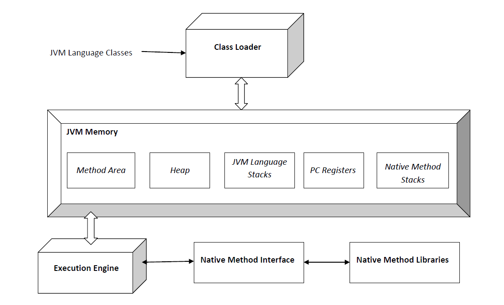

# 자바 컴파일 과정
자바의 컴파일 과정을 이해하기 전에 먼저 JVM이 무엇인지 알고 넘어가도록 하자.

## JVM
JVM은 `Java Virtual Machine`의 줄인말로 자바 가상 머신이라는 이름을 갖고 있다. 자바 프로그램을 실행할 수 있는 가상 공간이다. JVM은 여러 운영체제에서 똑같이 자바 프로그램이 실행되는 것을 도와준다.

### JVM의 구성요소
**1. 클래스 로더(Class Loader)** 
클래스 로더는 자바 프로그램을 실행하기 위해 필요한 클래스 파일들을 메모리로 불러오는 역할을 한다. 자바 코드가 컴파일 되면 `.class` 파일들이 만들어지는데 이 파일들이 프로그램이 실행될 때 필요하다. 클래스 로더가 이 파일들을 메모리에 배치하고 JVM이 프로그램을 실행할 수 있게 도와준다.

**2. 메모리 영역(Runtime Data Area)**  
자바 프로그램이 실행될 때 JVM은 여러 가지 데이터를 저장할 수 있는 메모리 공간이 필요하다. 크게 다섯 부분으로 나눌 수 있다.
- **메서드 영역(Method Area)**: 프로그램에서 사용하는 클래스 정보, 메서드 코드, 상수 등을 저장하는 곳
- **힙(Heap)**: 객체(인스턴스)들이 저장되는 공간, new 키워드로 객체를 만들 때 이곳에 객체가 생성된다.
- **스택(Stack)**: 메서드가 호출될 때마다 메서드의 변수들과 실행정보를 저장하는 공간, 메서드가 끝나면 스택에 있는 해당 정보가 사라진다.
- **PC 레지스터(Program Counter Register)**: 각 스레드가 실행할 명령어의 주소를 저장하는 공간
- **네이티브 메서드 스택(Native Method Stack)**: 자바가 아닌 다른 언어로 작성된 메서드가 실행될 때 사용하는 공간

**3. 실행 엔진(Excution Engine)**  
JVM의 핵심 부분으로 바이트코드를 실제로 실행하는 역할을 한다. 실행 엔진은 크게 두 부분으로 나눌 수 있다.
- **인터프리터(Interpreter)**: 바이트코드를 한 줄씩 읽고 실행한다. 한 줄씩 읽기 때문에 속도가 느리다.
- **JIT 컴파일러(JIT Compiler)**: 자주 사용되는 코드 부분은 한 번에 기계어로 번역해 실행 속도를 높여준다. 이 때 번역된 코드는 캐시에 저장되어 다음에 같은 코드가 실행될 때 더 빠르게 실행된다.

**4. 가비지 컬렉터(Garbage Collector)**  
프로그램에서 더 이상 사용되지 않는 객체들을 자동으로 찾아내 메모리에서 제거하는 역할을 한다. 덕분에 메모리가 낭비되지 않고 프로그램이 계속 실행될 수 있다. 또한 개발자가 메모리 관리에 신경 쓸 필요가 줄어든다.

**5. 네이티브 인터페이스(Native Interface)**  
자바 프로그램이 다른 언어로 작성된 프로그램이나 라이브러리와 상호작용을 할 수 있게 해준다. 이 인터페이스를 통해 네이티브 메서드를 호출하거나 다른 언어로 작성된 코드를 실행할 수가 있다.

**6. 네이티브 메서드 라이브러리(Native Method Library)**  
JVM이 다른 언어로 작성된 네이티브 메서드를 실행할 때 필요한 라이브러리들이 있는 곳이다. 네이티브 인터페이스와 함께 동작해 자바 외부 코드와 상호작용하게 해준다.

### 자바의 컴파일 과정
이제 자바의 컴파일 과정을 들여다보자.

1. 먼저 개발자가 자바 언어로 코드를 작성한다. (.java)
2. 이때 자바 언어는 사람들이 이해할 수 있지만, 컴퓨터는 이것을 바로 이해하지 못한다. 그래서 컴퓨터가 이해할 수 있는 언어로 바꿔줘야 하는데 이 작업을 `컴파일`이라 한다. 이 작업을 `자바 컴파일러`라는 프로그램이 해준다. 이 과정을 거쳐서 `바이트코드`라는 것으로 바꿔준다. (.class)
3. 변환된 바이트코드를 `클래스 로더`에게 전달한다.
4. `클래스 로더`는 동적 로딩을 통해서 필요한 클래스들을 로딩하고 링크하여 런타임 데이터 영역, JVM에 메모리를 올린다.
  - 클래스 로더는 아래와 같은 동작을 하게 된다
    - 로드: 클래스 파일을 가져와 JVM 메모리에 로드
    - 검증: 자바 언어 명세 및 JVM 명세에 명시된대로 구성되어있는지 검사
    - 준비: 클래스가 필요한 메모리를 할당
    - 분석: 클래스의 상수 풀 내 모든 심볼릭 레퍼런스를 다이렉트 레퍼런스로 변경
    - 초기화: 클래스 변수들을 적절한 값으로 초기화
5. 실행엔진(Execution Engine): JVM 메모리에 올라온 바이트 코드들을 명령어 단위로 하나씩 가져와 실행. 이때 실행 엔진은 위에서 설명한 `인터프리터 방식`, `JIT 컴파일러`이 사용된다.
