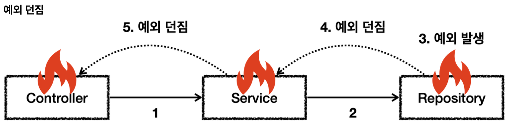

# 예외
## 예외 계층

- `Throwable`: 최상위 예외
- `Error`: 애플리케이션에서 복구 불가능한 시스템 예외, 메모리 부족 등
- `Exception`: 체크 예외
  - 애플리케이션 로직에서 사용할 수 있는 실질적인 최상위 예외
  - `Exception`과 그 하위 예외는 모두 컴파일러가 체크하는 체크예외
  - `RuntimeException`은 예외
- `RuntimeException`: 언체크 예외, 런타임 예외
  - 컴파일러가 체크하지 않는 언체크 예외
  - `RuntimeException`과 그 자식 예외는 모두 언체크 예외

## 예외 기본 규칙
예외는 폭탄 돌리기라 생각하면 되는데 잡아서 처리하거나 밖으로 던져야 한다.

- 서비스에서 예외를 처리하면 이후에는 로직이 정상 흐름으로 동작한다.

- 예외를 처리하지 못하면 호출한 곳으로 예외를 계속 던진다.

1. 예외는 잡아서 처리하거나 던져야한다.
2. 예외를 잡거나 던질 때 지정한 예외뿐만 아니라 그 예외의 자식들도 함께 처리된다
  - `Exception`을 `catch`로 잡으면 하위 예외들도 모두 잡을 수 있다.
  - `Exception`을 `throws`로 던지면 하위 예외들도 모두 던질 수 있다.

예외를 처리하지 못하고 계속 던지게 되면
- main() 쓰레드의 경우, 예외 로그를 출력하면서 시스템이 종료된다.
- 웹 애플리케이션의 경우, 하나의 예외 때문에 시스템이 종료되면 안된다. WAS가 해당 예외를 받아 처리해주는데 주로 개발자가 지정한 오류페이지를 보여준다.

## 체크 예외 기본 이해
- `Exception`과 그 하위 예외는 모두 컴파일러가 체크하는 체크 예외이다 (`RuntimeException` 제외)
- 체크예외는 잡아서 처리하거나 밖으로 던지도록 해야한다. 그렇지 않으면 컴파일 오류가 발생한다.

~~~java
@Slf4j
public class CheckedTest {

    @Test
    void checked_catch() {
        Service service = new Service();
        service.callCatch();
    }

    @Test
    void checked_throw() {
        Service service = new Service();

        assertThatThrownBy(() -> service.callThrow())
                .isInstanceOf(MyCheckedException.class);
    }

    /**
     * Exception을 상속받은 예외는 체크 예외가 된다.
     */
    static class MyCheckedException extends Exception {
        public MyCheckedException(String message) {
            super(message);
        }
    }

    /**
     * Checked 예외는
     * 예외를 잡아서 처리하거나 던지거나 둘 중 하나를 필수로 해야한다.
     */
    static class Service {
        Repository repository = new Repository();

        /**
         * 예외를 잡아 처리하는 코드
         */
        public void callCatch() {
            try {
                repository.call();
            } catch (MyCheckedException e) {
                log.info("예외 처리, message={}", e.getMessage(), e);
            }
        }

        /**
         * 체크 예외를 밖으로 던지는 코드
         * 체크 예외는 예외를 잡지 않고 밖으로 던지려면 throws 예외를 메서드에 선언해줘야한다.
         * @throws MyCheckedException
         */
        public void callThrow() throws MyCheckedException {
            repository.call();
        }
    }

    static class Repository {
        public void call() throws MyCheckedException {
            throw new MyCheckedException("ex");
        }
    }
}
~~~
- `Exception`을 상속받은 예외는 체크 예외가 된다.
- 체크 예외를 잡아 처리하려면 `catch(..)`를 사용하면 된다.
  - 해당 타입과 하위 타입 모두 잡을 수 있다.
- 체크 예외를 처리할 수 없을 때는 `method() throws 예외`를 사용해 밖으로 던질 예외를 필수로 지정해줘야한다.
  - 체크 예외를 밖으로 던지는 경우에도 해당 타입과 하위 타입 모두 던질 수 있다.

## 언체크 예외 기본 이해
- `RuntimeException`과 그 하위 예외는 언체크 예외로 분류된다.
- 말그대로 컴파일러가 예외를 체크하지 않는다는 뜻
- 체크 예외와 기본적으로 같다. 차이점으로 예외를 던지는 throws를 생략이 가능하다. 이 때 자동으로 예외를 던진다.

**체크 예외 vs 언체크 예외**
- 체크 예외: 예외를 잡아 처리하지 않으면 항상 throws에 던지는 예외를 선언해야함
- 언체크 예외: 예외를 잡아 처리하지 않아도 throws를 생략할 수 있다.

~~~java

@Slf4j
public class UncheckedTest {

    @Test
    void unchecked_catch() {
        Service service = new Service();
        service.callCatch();
    }

    @Test
    void unchecked_throw() {
        Service service = new Service();
        Assertions.assertThatThrownBy(() -> service.callThrow())
                .isInstanceOf(MyUncheckedException.class);
    }

    /**
     * RuntimeException을 상속받은 예외는 언체크 예외가 된다.
     */
    static class MyUncheckedException extends RuntimeException {

        public MyUncheckedException(String message) {
            super(message);
        }
    }

    /**
     * Unchecked 예외는
     * 예외를 잡거나, 던지지 않아도 된다.
     * 예외를 잡지 않으면 자동으로 밖으로 던진다.
     */
    static class Service {
        Repository repository = new Repository();

        /**
         * 필요한 경우 예외를 잡아서 처리하면 된다.
         */
        public void callCatch() {
            try {
                repository.call();
            } catch (MyUncheckedException e) {
                log.info("예최처리, message={}", e.getMessage(), e);
            }
        }

        /**
         * 예외를 잡지 않아도 된다. 자연스럽게 상위로 넘어감
         * throws를 선언 안해도 된다.
         */
        public void callThrow() {
            repository.call();
        }
    }
    
    static class Repository {
        public void call() {
            throw new MyUncheckedException("ex");
        }
    }

}
~~~

~~~java
public void callCatch() {
    try {
        repository.call();
    } catch (MyUncheckedException e) {
        log.info("예최처리, message={}", e.getMessage(), e);
    }
}
~~~
- 언체크 예외도 잡아서 처리 가능

~~~java
public void callThrow() {
    repository.call();
}
~~~
- throws 생략 가능(throws 예외를 선언해도 된다.)

**언체크 예외의 장점**
throws를 생략할 수 있다.
- 장점: 신경쓰고싶지 않은 언체크 예외를 무시할 수 있다.
- 단점: 개발자가 실수로 예외를 누락할 수 있다.
- 체크 예외는 비즈니스 로직 상 반드시 처리해야 할 때만 사용하자

**체크 예외의 문제점**
~~~java
public class CheckedAppTest {

    @Test
    void checked() {
        Controller controller = new Controller();
        Assertions.assertThatThrownBy(() -> controller.request())
                .isInstanceOf(Exception.class);
    }

    static class Controller {
        Service service = new Service();

        public void request() throws SQLException, ConnectException {
            service.logic();
        }
    }

    static class Service {
        Repository repository = new Repository();
        NetworkClient networkClient = new NetworkClient();

        public void logic() throws SQLException, ConnectException {
            repository.call();
            networkClient.call();

        }
    }

    static class NetworkClient {
        public void call() throws ConnectException {
            throw new ConnectException("연결실패");
        }
    }

    static class Repository {
        public void call() throws SQLException{
            throw new SQLException("ex");
        }
    }
}
~~~
- 위의 코드를 보면 크게 2가지 문제를 알 수 있다.
    - 복구 불가능한 예외
    - 의존 관계 문제

**복구 불가능한 예외**
대부분의 예외는 복구가 불가능하다. `SQLException`은 데이터베이스에 문제가 있어 발생하는 예외이다. 이런 문제는 대부분 복구가 불가능하다. 특히 서비스나 컨트롤러는 이런 문제를 해결할 수는 없다. 오류 로그를 남기고 개발자가 해당 오류를 빠르게 인지하는 것이 필요하다.

**의존 관계에 대한 문제**
위 코드의 예외는 체크 예외이다. 컨트롤러나 서비스 입장에서 본인이 처리할 수 없어도 어쩔 수 없이 throws를 통해 던지는 예외를 선언해야 한다. 이렇게 되면 서비스와 컨트롤러는 던진 예외를 의존하게 된다.

`throws SQLException, ConnectException` 대신 `throws Exception`으로 변경하여 Exception을 던져 문제를 해결할 수도 있다. 하지만 Exception은 최상위 타입이므로 모든 체크 예외를 던지는 문제가 발생한다. 결과적으로 다른 체크 예외를 체크할 수 있는 기능이 무효화되고 중요한 체크 예외를 놓치게 된다.

## 언체크 예외 활용
~~~java
public class UncheckedAppTest {

    @Test
    void unchecked() {
        Controller controller = new Controller();
        Assertions.assertThatThrownBy(() -> controller.request())
                .isInstanceOf(Exception.class);
    }

    static class Controller {
        Service service = new Service();

        public void request() {
            service.logic();
        }
    }

    static class Service {
        Repository repository = new Repository();
        NetworkClient networkClient = new NetworkClient();

        public void logic() {
            repository.call();
            networkClient.call();

        }
    }

    static class NetworkClient {
        public void call() {
            throw new RuntimeConnectException("연결실패");
        }
    }

    static class Repository {
        public void call() {
            try {
                runSQL();
            } catch (SQLException e) {
                throw new RuntimeSQLException(e);
            }
        }

        public void runSQL() throws SQLException {
            throw new SQLException("ex");
        }
    }

    static class RuntimeConnectException extends RuntimeException {
        public RuntimeConnectException(String message) {
            super(message);
        }
    }

    static class RuntimeSQLException extends RuntimeException {
        public RuntimeSQLException(Throwable cause) {
            super(cause);
        }
    }
}
~~~
- 리포지토리에서 `SQLException`이 발생하면 런타임 예외인 `RuntimeSQLException`으로 전환해 예외를 던진다.
    - 이때 기존 예외를 포함해줘야 예외 출력시 스택 트레이스에서 기존 예외도 함께 확인이 가능하다.,
- NetworkClient는 `RuntimeConnectException`라는 런타임 예외가 발생하도록 하였다.

**런타임 예외 - 대부분 복구 불가능한 예외**  
시스템에서 발생한 예외는 대부분 복구가 불가능한 예외이다. 런타임 예외 사용 시 서비스나 컨트롤러가 이런 복구 불가능한 예외를 신경쓰지 않아도 된다. 이렇게 북구 불가능한 예외는 일관성 있게 공통으로 처리해야 한다.

**의존 관계에 대한 문제**  
런타임 예외는 해당 객체가 처리할 수 없는 예외는 무시하면 된다. 따라서 체크 예외처럼 예외를 강제로 의존하지 않아도 된다.

런타임 예외는 놓칠 수 있기에 문서화가 중요하다.

## 예외 포함과 스택 트레이스
예외 전환 시 꼭 기존 예외를 포함해줘야 한다.

### 기존 예외를 포함하는 경우
~~~java
public void call() {
    try {
        runSQL();
    } catch (SQLException e) {
        throw new RuntimeSQLException(e);
    }
}
~~~
~~~
com.odg.jdbc.exception.basic.UncheckedAppTest$RuntimeSQLException: java.sql.SQLException: ex
	at com.odg.jdbc.exception.basic.UncheckedAppTest$Repository.call(UncheckedAppTest.java:63)
	at com.odg.jdbc.exception.basic.UncheckedAppTest$Service.logic(UncheckedAppTest.java:46)
	at com.odg.jdbc.exception.basic.UncheckedAppTest$Controller.request(UncheckedAppTest.java:36)
	at com.odg.jdbc.exception.basic.UncheckedAppTest.printEx(UncheckedAppTest.java:25)
...
Caused by: java.sql.SQLException: ex
	at com.odg.jdbc.exception.basic.UncheckedAppTest$Repository.runSQL(UncheckedAppTest.java:68)
	at com.odg.jdbc.exception.basic.UncheckedAppTest$Repository.call(UncheckedAppTest.java:61)
~~~
결과를 보면 예외를 포함해서 기존에 발생한 `SQLException`과 스택 트레이스를 확인할 수 있다.

### 기존 예외를 포함하지 않는 경우
~~~java
public void call() {
    try {
        runSQL();
    } catch (SQLException e) {
        throw new RuntimeSQLException(e);
    }
}
~~~
~~~
com.odg.jdbc.exception.basic.UncheckedAppTest$RuntimeSQLException: null
	at com.odg.jdbc.exception.basic.UncheckedAppTest$Repository.call(UncheckedAppTest.java:63)
	at com.odg.jdbc.exception.basic.UncheckedAppTest$Service.logic(UncheckedAppTest.java:46)
	at com.odg.jdbc.exception.basic.UncheckedAppTest$Controller.request(UncheckedAppTest.java:36)
	at com.odg.jdbc.exception.basic.UncheckedAppTest.printEx(UncheckedAppTest.java:25)
~~~
예외를 포함하지 않아 `SQLException`과 스택 트레이스를 확인할 수 없다.
