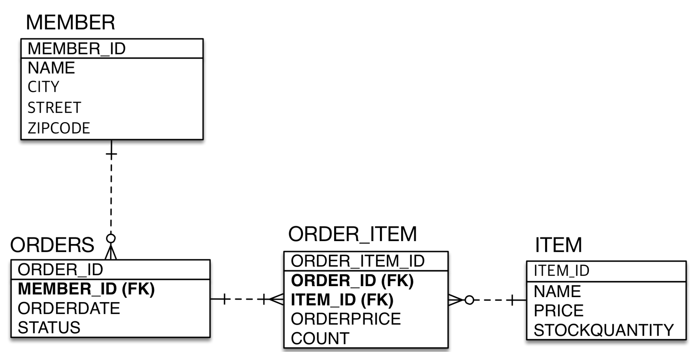
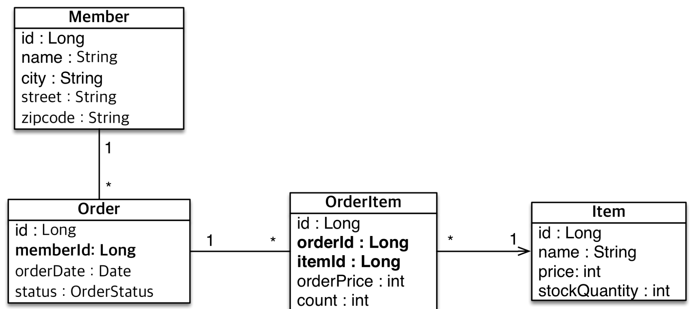

# 엔티티 매핑

## 엔티티 매핑
- 객체와 테이블 매핑: `@Entity`, `@Table`
- 필드와 컬럼 매핑: `@Column`
- 기본 키 매핑: `@Id`
- 연관관계 매핑: `@ManyToOne`, `@JoinColumn`

## 객체와 테이블 매핑
### @Entity
- `@Entity`가 붙은 클래스는 JPA가 관리
- JPA를 사용해 테이블과 매핑할 클래스는 `@Entity` 필수

**주의**
- **기본 생성자 필수**
- final 클래스, enum, interface, inner 클래스 사용x
- 저장할 필드에 final 사용x

**@Entity 속성 정리**
- name
  - JPA에서 사용할 엔티티 이름 지정
  - 기본값: 클래스 이름을 그대로 사용
  - 같은 클래스 이름이 없으면 `가급적 기본값을 사용`

### @Table
- 엔티티와 매핑할 테이블 지정
- name: 매핑할 테이블 이름, 기본값은 엔티티 이름
- catalog: 데이터베이스 catalog 매핑
- scheman: 데이터베이스 schema 매핑
- uniqueConstraints: DDL 생성 시 유니크 제약조건 생성

## 데이터베이스 스키마 자동 생성
- DDL을 애플리케이션 실행 시점에 자동 생성
- 테이블 중심 -> 객체 중심
- 데이터베이스 방언을 활용해 데이터베이스에 맞는 DDL 생성
- 이렇게 생성된 DDL은 개발 장비에서만 사용
- 운영서버에서는 사용하지 말고 필요하다면 다듬은 후 사용

`persistence.xml`에서
~~~
<property name="hibernate.hbm2ddl.auto" value="create" />
~~~
추가

~~~java
Member findMember = em.find(Member.class, 150L);
findMember.setName("AAaaAA");

em.clear();
Member findMember2 = em.find(Member.class, 150L);

System.out.println("=================");
tx.commit();
~~~
~~~
Hibernate: 
    drop table if exists Member cascade 
Hibernate: 
    create table Member (
        id bigint not null,
        name varchar(255),
        primary key (id)
    )
Hibernate: 
    select
        m1_0.id,
        m1_0.name 
    from
        Member m1_0 
    where
        m1_0.id=?
~~~
- 애플리케이션 로딩 시점에 `@Entity`가 매핑된 애들은 기존 테이블을 삭제하고 다시 만들어 낸다. 

### 데이터베이스 스키자 자동 생성 - 속성
**hibernate.hbm2ddl.auto**
- create: 기존테이블 삭제 후 다시 생성
- create-drop: create와 같으나 종료시점에 테이블을 drop
- update: 변경부분만 반영, 지우는건 안된다.(운영DB에는 하면 안됨)
- validate: 엔티티와 테이블이 정상 매핑되었는지 확인
- none: 사용하지 않음

### 데이터베이스 스키자 자동 생성 - 주의
- **운영 장비에는 절대 create, create-drop, update를 사용하지 말자**
- 개발 초기 단계는 create나 Update
- 테스트 서버는 update나 validate
- 스테이징과 운영 서버는 validate나 none

### DDL 생성 기능
- 제약조건 추가: 회원 이름은 필수, 10자 초과x
  - `@Column(nullable = false, length = 10)`

## 필드와 컬럼 매핑
요구사항 추가
- 회원은 일반 회원과 관리자로 구분
- 회원 가입일과 수정일이 있어야함
- 회원을 설명할 수 있는 필드가 있어야함, 길이는 제한이 없다

~~~java
@Entity
public class Member {

    @Id
    private Long id;

    @Column(name = "name")
    private String username;

    private Integer age;

    @Enumerated(EnumType.STRING)
    private RoleType roleType;

    @Temporal(TemporalType.TIMESTAMP)
    private Date createDates;

    @Temporal(TemporalType.TIMESTAMP)
    private Date lastModifiedDate;

    @Lob
    private String description;

    public Member() {
    }

}
~~~
~~~
Hibernate: 
    drop table if exists Member cascade 
Hibernate: 
    create table Member (
        age integer,
        createDates timestamp(6),
        id bigint not null,
        lastModifiedDate timestamp(6),
        name varchar(255),
        roleType varchar(255) check (roleType in ('USER','ADMIN')),
        description clob,
        primary key (id)
    )
~~~

### 매핑 애노테이션
- @Column: 컬럼 매핑
- @Temporal: 날짜 타입 매핑
- @Enumerated: enum 타입 매핑
- @Lob: BLOB, CLOB 매핑
- @Transient: 특정 필드 컬럼에 매핑하지 않음(매핑 무시)

#### @Column의 속성
- `name`: 필드와 매핑할 테이블의 컬럼 이름, 기본값은 객체 필드 이름
- `insertable`, `updatable`: 등록, 변경 가능 여부, 기본값은 true
- `nullable(DDL)`: null값의 허용 여부 설정, false로 설정하면 DDL 생성 시에 not null 제약조건이 붙음
- `unique(DDL)`: 컬럼에 간단히 유니크 제약조건을 걸 때 사용
  - 실무에선 잘 사용하지 않는다 제약조건명이 랜덤하게 지어져서 어떤 제약조건에 걸리는지 확인하기가 어렵다.
  - 주로 `@Table`의 `uniqueConstraints`로 제약조건을 준다.
- `length`: 문자 길이 제약조건, String 타입에만 사용
- `columnDefinition`: 데이터베이스 컬럼 정보를 직접 줄 수 있다.
-  `precision`, `scale`: BigDecimal 타입에서 사용(BigInteger도 가능). `precision`은 소수점을 포함한 전체 자릿수, `scale`은 소수의 자릿수

#### @Enumerated
자바 enum 타입을 매핑할 때 사용 
**주의! ORDINAL 사용 x** 
속성
- value
  - `EnumType.ORDINAL`: enum 순서를 데이터베이스에 저장
  - `EnumType.STRING`: enum 이름을 데이터베이스에 저장

ORDINAL을 사용할 경우 enum에 어떠한 값이 추가될 경우 순서가 바뀌게 되어 기존 데이터베이스에 저장된 값과 일치하지 않는 문제를 일으킬 수 있다.

`EnumType.STRING`을 사용하도록 하자

#### @Temporal
날짜 타입(java.util.Date, java.util.Calendar)을 매핑할 때 사용 

참고: LocalDate, LocalDateTime을 사용할 때는 생략 가능(최신 하이버네이트 지원)

- value
  - `TemporalType.DATE`: 날짜, 데이터베이스 date 타입과 매핑
  - `TemporalType.TIME`: 시간, 데이터베이스 time 타입과 매핑
  - `TemporalType.TIMESTAMP`: 날짜와 시간, 데이터베이스 timestamp 타입과 매핑

#### @Lob
데이터베이스 BLOB, CLOB 타입과 매핑
- `@Lob`에는 지정할 수 있는 속성이 없다.
- 매핑하는 필드 타입이 문자면 CLOB, 나머지는 BLOB
  - CLOB: String, char[], java.sql.CLOB
  - BLOL: byte[], java.sql.BLOB

#### @Transient
- 필드 매핑을 하지 않는다
- 데이터베이스에 저장, 조회 x
- 메모리상에서만 임시로 어떤 값을 보관하고자 할 때 사용

## 기본 키 매핑
### 기본 키 매핑 애노테이션
- `@Id`
- `@GeneratedValue`

### 기본 키 매핑 방법
- 직접 할당 : `@Id`만 사용
- 자동 생성(`@GeneratedValue`)
  - IDENTITY: 데이터베이스에 위임, MYSQL
  - SEQUENCE: 데이터베이스 시퀀스 오브젝트 사용, ORACLE
    - `@SequenceGenerator` 필요
  - TABLE: 키 생성용 테이블 사용, 모든 DB에서 사용
    - `@TableGenerator` 필요
  - AUTO: 방언에 따라 자동 지정

테이블마다 시퀀스를 따로 만들고자 한다면 아래와 같이 작성하면 된다
~~~java
@Entity
@SequenceGenerator(
        name = "MEMBER_SEQ_GENERATOR",
        sequenceName = "MEMBER_SEQ", // 매핑할 데이터베이스 시퀀스 이름
        initialValue = 1, allocationSize = 1)
public class Member {
    @Id
    @GeneratedValue(strategy = GenerationType.SEQUENCE,
            generator = "MEMBER_SEQ_GENERATOR")
    private Long id;
}
~~~

### TABLE 전략
- 키 생성 전용 테이블을 하나 만들어 시퀀스를 흉내내는 전략
- 모든 데이터베이스에 적용 가능하지만 성능적인 부분에서 안좋다.

~~~java
@Entity
@TableGenerator(
        name = "MEMBER_SEQ_GENERATOR",
        table = "MY_SEQUENCES",
        pkColumnValue = "MEMBER_SEQ", allocationSize = 1)
public class Member {
    @Id
    @GeneratedValue(strategy = GenerationType.TABLE,
            generator = "MEMBER_SEQ_GENERATOR")
    private Long id;
}
~~~

### 권장하는 식별자 전략
- 기본키 제약조건: null이 아니어야하고, 유일해야하며 변하면 안된다.
- 미래까지 이 조건을 만족하는 자연키는 찾기가 어렵다. 대체키를 사용하자
  - 자연키: 비즈니스적으로 의미있는 키, 주민번호, 전화번호 등
  - 대체키: 비즈니스적으로 상관없는 키, 랜던값 등
- **권장**: **Long형 + 대체키 * 키 생성전략 사용**
- Auto-increment나 시퀀스 둘 중 하나를 쓰자

### IDENTITY 전략
- 기본 키 생성을 데이터베이스에 위임
- 주로 MySQL, PostgreSQL, SQL Server, DB2에서 사용
  - MySQL의 AUTO_INCREMENT
- JPA는 트랜잭션 커밋 시점에 INSERT SQL 실행
- AUTO_INCREMENT는 데이터베이스에 INSERT SQL을 실행한 후에 ID 값을 알 수 있다.
- IDENTITY 전략은 `em.persist()`시점에 즉시 INSERT SQL을 실행하고 DB에서 식별자를 조회한다.

~~~java
Member member = new Member();
member.setUsername("h");

System.out.println("================");
em.persist(member);
System.out.println("member.getId() = " + member.getId());
System.out.println("================");

tx.commit();
~~~
~~~
================
Hibernate: 
    /* insert for
        hellojpa.Member */insert 
    into
        Member (name, id) 
    values
        (?, default)
member.getId() = 1
================
~~~

### SEQUENCE 전략
~~~java
@Entity
@SequenceGenerator(
        name = "MEMBER_SEQ_GENERATOR",
        sequenceName = "MEMBER_SEQ", // 매핑할 데이터베이스 시퀀스 이름
        initialValue = 1, allocationSize = 1)
public class Member {
    @Id
    @GeneratedValue(strategy = GenerationType.SEQUENCE,
            generator = "MEMBER_SEQ_GENERATOR")
    private Long id;
}
~~~
~~~
Hibernate: 
    drop table if exists Member cascade 
Hibernate: 
    drop sequence if exists MEMBER_SEQ
Hibernate: 
    create sequence MEMBER_SEQ start with 1 increment by 1
Hibernate: 
    create table Member (
        id bigint not null,
        name varchar(255),
        primary key (id)
    )

================
Hibernate: 
    select
        next value for MEMBER_SEQ
member.getId() = 1
================
Hibernate: 
    /* insert for
        hellojpa.Member */insert 
    into
        Member (name, id) 
    values
        (?, ?)
~~~
- `em.persist()`하기 위해서는 항상 pk가 있어야 한다.
- PK의 `GenerateType`을 확인하고 `SEQUENCE`전략이면 시퀀스에서 현재 값을 조회한다.
- 그 뒤 멤버의 id에 이 값을 넣어준다.
- 그 다음 영속성 컨텍스트에 저장한다.
- 트랜잭션 커밋 시점에 insert 쿼리를 날린다.

#### @SequenceGenerator의 속성
- name: 식별자 생성기 이름
- sequenceName: 데이터베이스에 등록되어 있는 시퀀스 이름
- initialValue: DDL 생성 시에만 사용, DDL 생성 시 처음 시작하는 수를 지정
- allocationSize: 시퀀스 한 번 호출에 증가하는 수
  - 성능을 최적화하는데 사용된다.
  - 데이터베이스 시퀀스 값이 하나씩 증가하도록 설정되어있으면 이 값을 반드시 1로 설정해야한다.
  - 기본값은 50이다.

## 실전 예제 1 - 요구사항 분석과 기본 매핑
### 요구사항 분석
- 회원은 상품을 주문할 수 있다.
- 주문 시 여러 종류 상품을 선택할 수 있다. 

### 기능 목록
- 회원 기능
  - 회원 등록
  - 회원 조회
- 상품 기능
  - 상품 등록
  - 상품 수정
  - 상품 조회
- 주문 기능
  - 상품 주문
  - 주문내역 조회
  - 주문취소

### 도메인 모델 분석
- 회원과 주문의 관계: 회원은 여러 번 주문할 수 있다.(일대다)
- 주문과 상품 관계: 주문 시 여러 상품을 선택할 수 있다. 반대로 같은 상품도 여러 번 주문될 수 있다. 주문상품이라는 모델을 만들어 다대다 관계를 일다대, 다대일 관계로 풀어내자.

### 테이블 설계

### 엔티티 설계와 매핑

### 현재 설계의 문제점
- 현재 설계는 객체 설계를 테이블 설계에 맞춘 방식이다
- 테이블의 외래키를 객체에 그대로 가져온다.
- 이렇게 되면 객체 그래프 탐색이 불가능해진다
- 또한 참조가 없으므로 UML도 잘못되었다.

