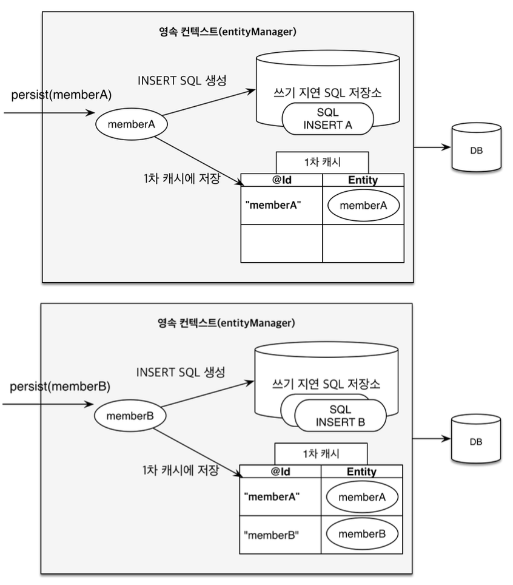
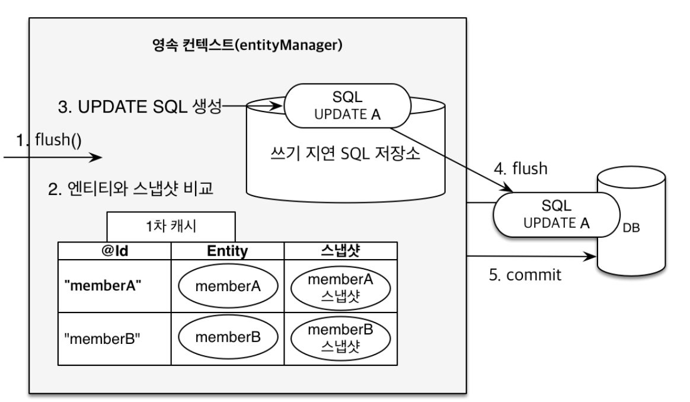

# 영속성 컨텍스트

## 엔티티 매니저 팩토리와 엔티티 매니저
- 웹 애플리케이션에서 엔티티 매니저 팩토리가 요청이 들어올 때마다 엔티티 매니저를 생성한다. 
- 엔티티 매니저는 내부적으로 데이터베이스 커넥션을 사용해서 DB를 사용하게 된다.

## 영속성 컨텍스트
- JPA를 이해하는데 가장 중요한 용어이다.
- 해석해보자면 `엔티티를 영구 저장하는 환경`이라는 뜻이다.
- `EntityManger.persist(entity)` 앞서 실습했던 내용에서는 객체를 DB에 저장한다라고 이해했지만 실제로는 DB에 저장하는 것이 아니라 `영속성 컨텍스트를 통해 엔티티를 영속화한다`는 뜻이다.
- 즉, DB에 저장한다는 것이 아닌 영속성 컨텍스트 라는 곳에 저장한다는 뜻이다.
- 영속성 컨텍스트는 논리적인 개념이다.
- 엔티티 매니저를 통해 영속성 컨텍스트에 접근한다.

## 엔티티의 생명주기
- 비영속(new/transient): 영속성 컨텍스트와 전혀 관계가 없는 새로운 상태
- 영속(managed): 영속성 컨텍스트에 관리되는 상태
- 준영속(detached): 영속성 컨텍스트에 저장되었다가 분리된 상태
- 삭제(removed): 삭제된 상태

### 비영속
~~~java
Member member = new Member();
member.setId("member1");
member.setUsername("Oh");
~~~
- 현재 객체만 생성하고 엔티티 매니저에 넣어주지 않고 있다.
- 전혀 JPA랑 관계없는 상태이다.
- 이를 비영속 상태라 한다.

### 영속
~~~java
Member member = new Member();
member.setId("member1");
member.setUsername("Oh");

EntityManager em = emf.createEntityManager();
em.getTransaction().begin();

// 객체를 저장 (영속)
em.persist(member);
~~~
- 멤버 객체를 생성한다음 엔티티 매니저를 얻어와 엔티티 매니저에 `em.persist(member)`를 호출하게 되면 영속성 컨텍스트에 멤버 객체가 들어가게 되면서 영속 상태가 된다.
- `em.persist()`를 호출할 때 DB에 저장되는 것처럼 보이지만 이때 DB에 저장되지 않는다.

~~~java
try {
    Member member = new Member();
    member.setId(100L);
    member.setName("hihi");

    System.out.println("=== BEFORE ===");
    em.persist(member);
    System.out.println("=== AFTER ===");

    tx.commit();
} catch (Exception e) {
    tx.rollback();
} finally {
    em.close();
}

emf.close();
~~~
출력결과
~~~
=== BEFORE ===
=== AFTER ===
Hibernate: 
    /* insert for
        hellojpa.Member */insert 
    into
        Member (name, id) 
    values
        (?, ?)
~~~
- BEFORE와 AFTER 사이에 아무것도 출력되지 않았다.
- 영속 상태가 된다해서 바로 DB에 쿼리가 날라가는 것이 아니다.
- 트랜잭션을 커밋하는 시점에 영속성 컨텍스트에 있는 애가 DB에 쿼리가 날라가게 된다.

### 준영속
~~~java
Member member = new Member();
member.setId(100L);
member.setName("hihi");

System.out.println("=== BEFORE ===");
em.persist(member);
em.detach(member);
System.out.println("=== AFTER ===");
~~~
- `em.detach(member)`: 엔티티 매니저에서 회원 엔티티를 영속성 컨텍스트에서 분리해준다.
### 삭제
`em.remove(member)`: 객체를 삭제한 상태

## 영속성 컨텍스트의 이점
### 1차 캐시
~~~java
Member member = new Member();
member.setId("member1");
member.setUsername("Oh");

EntityManager em = emf.createEntityManager();
em.getTransaction().begin();

// 객체를 저장 (영속)
em.persist(member);
~~~
- 영속성 컨텍스트 내부에는 1차 캐시라는 것이 존재한다.
- 맴버 객체를 생성하고 `em.persist(member)`를 호출하게 되면 영속성 컨텍스트에 멤버 엔티티가 영속되게 된다.
- 1차 캐시라는 맵이 존재하는데 키로는 `PK`가 되고 값으로는 `엔티티 객체 자체`가 된다.
- 조회 시 JPA가 우선 영속성 컨텍스트에서 1차 캐시에서 값을 찾는다.
- 1차 캐시에 엔티티가 존재한다면 캐시에 있는 값을 조회한다.
- 만약 1차 캐시에 없는 `member2`를 조회한다고 했을 때
- 1차 캐시에서 우선 조회하고 없다면 JPA가 DB에서 `member2`를 조회한다.
- 그리고 1차 캐시에 `member2`를 저장한다.
- 그런 후 `member2`를 반환한다.

트랜잭션이 끝날 때 영속성 컨텍스트를 지운다. 

~~~java
Member member = new Member();
member.setId(100L);
member.setName("hihi");

System.out.println("=== BEFORE ===");
em.persist(member);
System.out.println("=== AFTER ===");

Member findMember = em.find(Member.class, 100L);
System.out.println("findMember.getId() = " + findMember.getId());
System.out.println("findMember.getName() = " + findMember.getName());
~~~
출력 결과
~~~
=== BEFORE ===
=== AFTER ===
findMember.getId() = 100
findMember.getName() = hihi
Hibernate: 
    /* insert for
        hellojpa.Member */insert 
    into
        Member (name, id) 
    values
        (?, ?)
~~~
- 조회 시 select 쿼리문이 날라가지 않았다.
- `em.persist(member)`때 1차 캐시에 엔티티가 저장된 것이다.
- 1차캐시에 저장되있는 값을 출력한 것이다.

~~~java
Member findMember1 = em.find(Member.class, 100L);
Member findMember2 = em.find(Member.class, 100L);
~~~
~~~
Hibernate: 
    select
        m1_0.id,
        m1_0.name 
    from
        Member m1_0 
    where
        m1_0.id=?
~~~
- 똑같은 Id로 조회 시 select문이 1번만 출력된다.
- 처음 조회 했을 때 1차 캐시에 엔티티를 추가하고
- 두번째 조회시 1차 캐시에 같은 키의 값이 존재하므로 1차 캐시에서 해당 엔티티를 조회해온다.

### 영속 엔티티의 동일성 보장
~~~java
Member findMember1 = em.find(Member.class, 100L);
Member findMember2 = em.find(Member.class, 100L);

System.out.println("result = " + (findMember1 == findMember2));
~~~
~~~
출력결과
result = true
~~~
- 같은 트랜잭션 안에서 같은 id로 조회한 결과가 동일하다.
- 1차 캐시덕분에 얻을 수 있는 결과이다.

### 엔티티 등록 시 트랜잭션을 지원하는 쓰기 지연
~~~java
EntityManager em = emf.createEntityManager();
EntityTransaction transaction = em.getTransaction();

transaction.begin()

em.persist(memberA);
em.persist(memberB);
// 여기까지 INSERT SQL을 데이터베이스에 보내지 않는다.

// 커밋하는 순간 데이터베이스에 INSERT SQL을 보낸다.
transaction.commit();
~~~

- 영속성 컨텍스트 안에는 `쓰기 지연 SQL 저장소`라는 것이 있다.
- `em.persist(memberA)`를 통해 멤버A를 넣으면 먼저 1차 캐시에 들어간다.
- 동시에 JPA가 해당 엔티티를 분석해 insert쿼리를 생성하고 쓰기 지연 SQL 저장소에 쌓아둔다.
- `em.persist(memberB)`를 통해 멤버B를 넣으면 먼저 1차 캐시에 들어간다.
- 동시에 JPA가 해당 엔티티를 분석해 insert쿼리를 생성하고 쓰기 지연 SQL 저장소에 쌓아둔다.
- 트랜잭션이 커밋되는 시점에 쓰기 지연 SQL 저장소에 쌓여있는 SQL이 `플러쉬`가 되면서 DB에 쿼리문을 날린다.
- 그리고 실제 데이터베이스가 커밋된다.

~~~java
Member member1 = new Member(150L, "A");
Member member2 = new Member(160L, "B");

em.persist(member1);
em.persist(member2);
System.out.println("=============================");

tx.commit();
~~~
출력결과
~~~
=============================
Hibernate: 
    /* insert for
        hellojpa.Member */insert 
    into
        Member (name, id) 
    values
        (?, ?)
Hibernate: 
    /* insert for
        hellojpa.Member */insert 
    into
        Member (name, id) 
    values
        (?, ?)
~~~
- `=============================`가 출력된 이후에 insert쿼리가 날라간다.

### 엔티티 수정 시 변경 감지
~~~java
Member findMember = em.find(Member.class, 150L);
findMember.setName("zzzz1111z");

System.out.println("=================");

tx.commit();
~~~
~~~출력결과
Hibernate: 
    select
        m1_0.id,
        m1_0.name 
    from
        Member m1_0 
    where
        m1_0.id=?
=================
Hibernate: 
    /* update
        for hellojpa.Member */update Member 
    set
        name=? 
    where
        id=?
~~~
- JPA는 자바의 컬렉션을 다루듯이 값만 바꿔주었다.
- JPA는 `더티 채킹`이라고 하는데 변경 감지 기능을 사용해서 엔티티를 변경을 할 수 있다.
- `em.update(findMember)` 같은 코드가 필요할 것 같은데 setter 사용한 것 만으로 엔티티가 변경되었다.

- 엔티티를 변경 후 트랜잭션을 커밋하는 시점에 JPA는 `flush()`를 호출한다.
- 이때 엔티티와 스냅샷을 비교한다.
- 이 스냅샷은 엔티티를 읽어온 최초 시점의 상태라 보면 된다.
- 비교했을때 엔티티가 변경되었다면 업데이트 쿼리를 `쓰기 지연 SQL 저장소`에 보관한다.
- 그런 뒤 쓰기 지연 SQL 저장소에 있는 업데이트 쿼리를 데이터베이스에 반영하고 커밋한다. 
- 삭제 또한 위와 같은 매커니즘으로 동작한다.

## 플러시
영속성 컨텍스트의 변경내용을 데이터베이스에 반영하는 것을 말한다.  
쓰기 지연 SQL 저장소에 있는 쿼리문을 데이터베이스에 날리는 것이다.  
쉽게 말해 영속성 컨텍스트의 현재 변경 사항과 데이터베이스의 상태를 맞춰주는 작업이다.

### 플러시가 발생됐을 때 어떤 일이 벌어질까?
트랜잭션이 발생되면 자동으로 플러시가 발생된다고 생각하면 된다.

1. 더티 채킹, 변경감지가 일어난다.
2. 수정된 엔티티를 쓰기 지연 SQL 저장소에 등록한다.
3. 쓰기 지연 SQL 저장소의 쿼리를 데이터베이스에 전송한다.

어떻게 영속성 컨텍스트를 플러시할까?
- em.flush()
- 트랜잭션 커밋 - 자동으로 호출
- JPQL 쿼리 실행 - 자동으로 호출