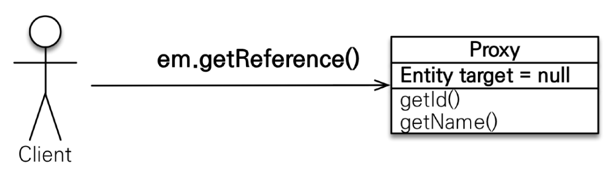
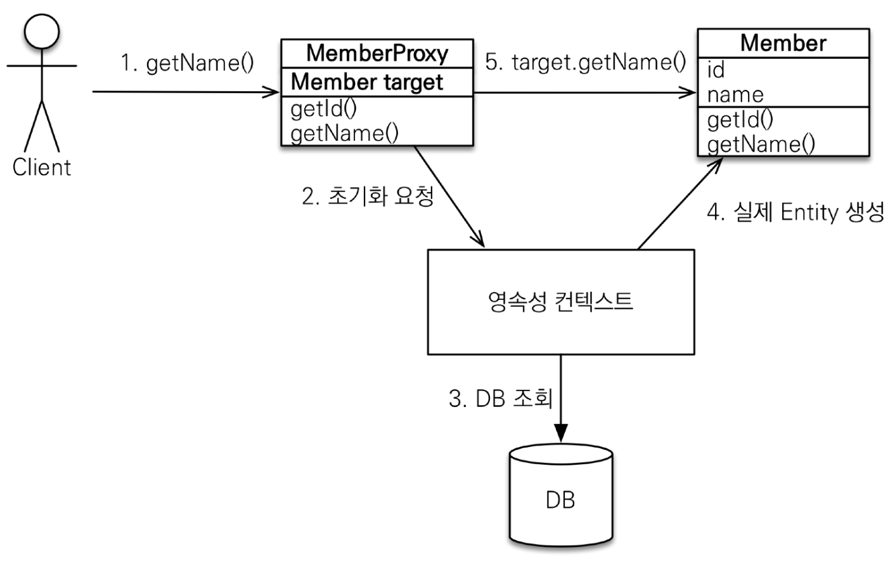
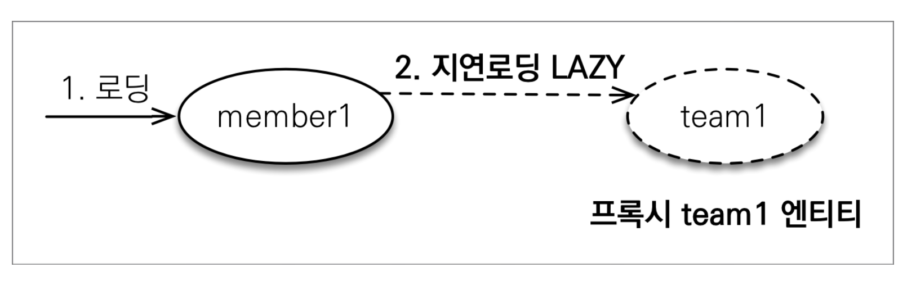
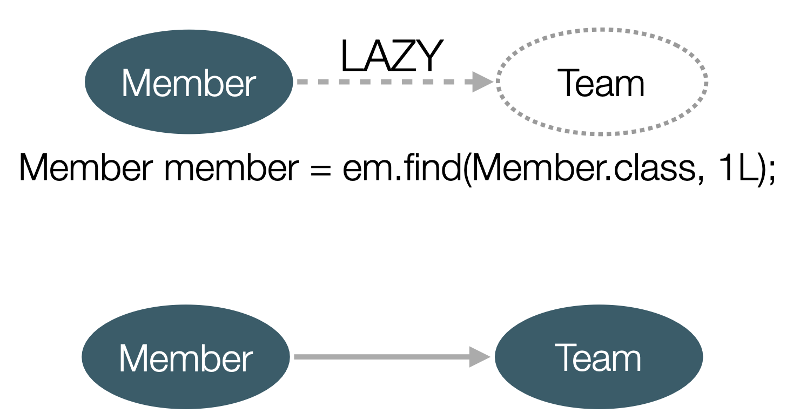

# 프록시

## 프록시 기초
- em.find() vs `em.getReference`
- em.find(): 데이터베이스를 통해 실제 엔티티 객체 조회
- `em.getReference()`: 데이터베이스 조회를 미루는 가짜 엔티티 객체 조회

### 프록시 특징
- 실제 클래스를 상속 받아 만들어진다.
- 실제 클래스와 겉 모양이 같다.
- 사용하는 입장에서는 진짜 객체인지 프록시 객체인지 구분하지 않고 사용하면 된다.
- 프록시 객체는 실제 객체의 참조(target)을 보관
- 프록시 객체를 호출하면 프록시 객체는 실제 객체의 메소드를 호출한다.

### 프록시 객체의 초기화
~~~java
Member member = em.getReference(Member.class, "id1");
member.getName();
~~~

### 프록시의 특징
- 프록시 객체는 처음 사용할 때 한 번만 초기화
- 프록시 객체를 초기화 할 때, 프록시 객체가 `실제 엔티티로 바뀌는 것은 아니다.`
- 초기화되면 프록시 객체를 통해 `실제 엔티티에 접근이 가능한 것이다.`
- 프록시 객체는 원본 엔티티를 상속받는다. 따라서 타입 체크시 주의해야한다
  - (`==` 비교가 아닌 `instance of` 사용)
- 영속성 컨텍스트에 찾는 엔티티가 이미 존재한다면 em.getReference()를 호출해도 실제 엔티티를 반환
  - JPA에서는 영속성 컨텍스트 안에서 같은 인스턴스를 비교하면 항상 true를 보장해야한다.
- 엔티티가 준영속 상태일 때, 프록시를 초기화하면 문제가 발생한다.
  - 하이버네이트는 `org.hibernate.LazyInitailizationException` 예외를 터트림

### 프록시 확인
- 프록시 인스턴스의 초기화 여부 확인
~~~java
Member refMember = em.getReference(Member.class, member1.getId());
emf.getPersistenceUnitUtil.isLoaded(refMember);
~~~
- 프록시 클래스 확인 방법
  - `entity.getClass().getName()` 출력
- 프록시 강제 초기화
  - `org.hibernate.Hibernate.initalize(entity)`
  - JPA 표준에는 강제 초기화 없음

## 즉시 로딩과 지연 로딩
단순히 member 정보만 사용하는 비즈니스 로직에서 Member를 조회할 때 Team도 함께 조회해야한다면 성능면에서 좋지 못할 것이다.  
이를 해결하기 위해 지연 로딩을 사용할 수 있다.

### 지연 로딩 LAZY을 사용해 프록시로 조회
~~~java
@Entity
public class Member{

    @Id
    @GeneratedValue
    @Column(name = "MEMBER_ID")
    private Long id;

    @Column(name = "name")
    private String username;

    @ManyToOne(fetch = FetchType.LAZY)
    @JoinColumn(name = "TEAM_ID")
    private Team team;
    ...
}
~~~

### 지연 로딩 LAZY을 사용해 프록시로 조회

~~~java
Team team = member.getTeam();
team.getName(); // 실제 team을 사용하는 시점에 초기화
~~~

### Member와 Team을 자주 함께 사용한다면?
-> 즉시 로딩을 사용해서 함께 조회

### 즉시 로딩 EAGER
~~~java
@Entity
public class Member extends BaseEntity{

    @Id
    @GeneratedValue
    @Column(name = "MEMBER_ID")
    private Long id;

    @Column(name = "name")
    private String username;

    @ManyToOne(fetch = FetchType.EAGER)
    @JoinColumn(name = "TEAM_ID")
    private Team team;
}
~~~
- Member 조회 시 항상 Team도 조회
- JPA 구현체는 가능하면 조인을 사용해 SQL 한번에 함께 조회

### 프록시와 즉시로딩 주의
- **가급적 지연 로딩만 사용**
- 즉시 로딩은 `JPQL에서 N+1문제를 일으킨다.`
- `@ManyToOne, @OneToOne`은 기본이 즉시 로딩 -> `LAZY`로 설정하자.
- @OneToMany, @ManyToMany는 기본이 지연 로딩

### 정리
- `모든 연관관계에 지연 로딩을 사용하자`
- `실무에서 즉시 로딩을 사용하지 말자`
- `fetch 조인이나, 엔티티 그래프 기능을 사용하자`