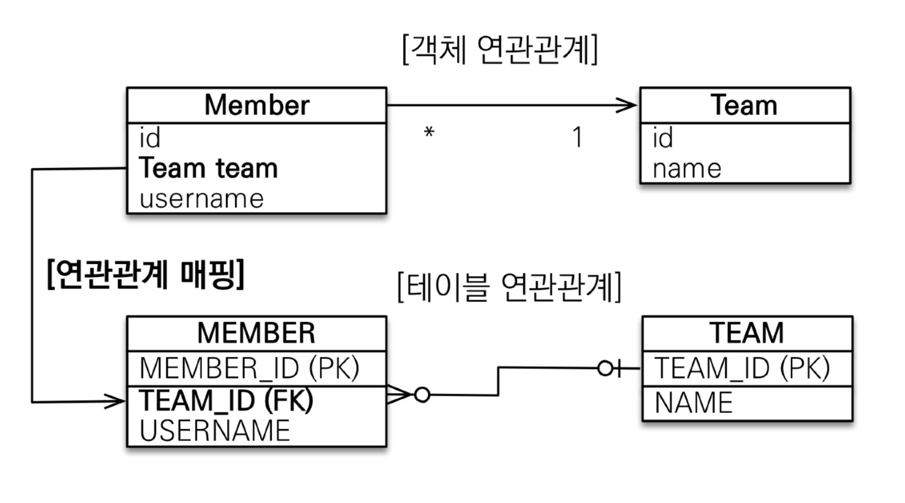
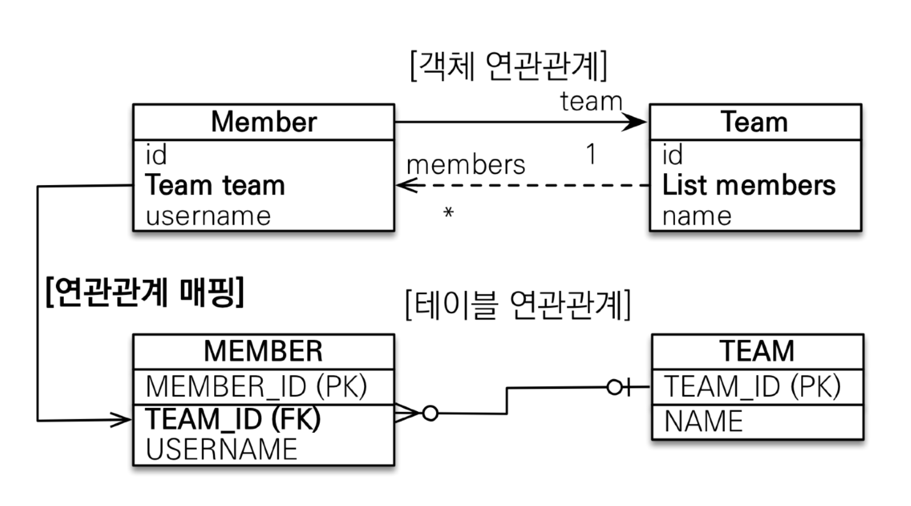
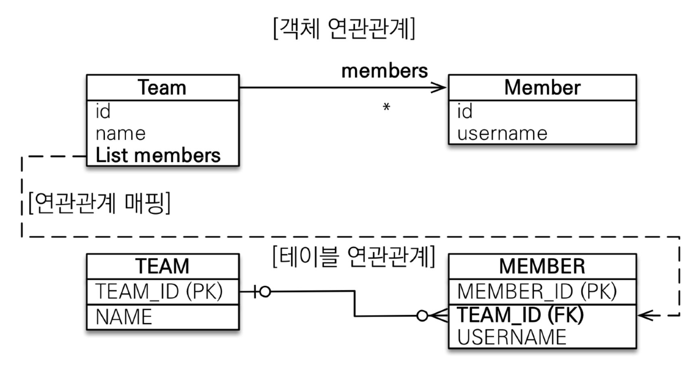
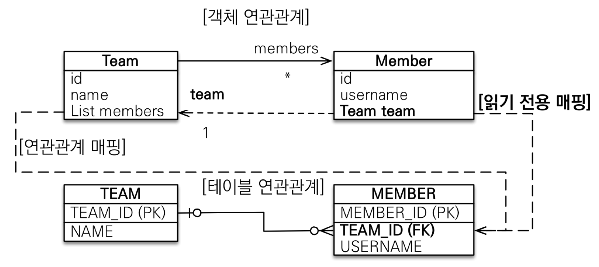
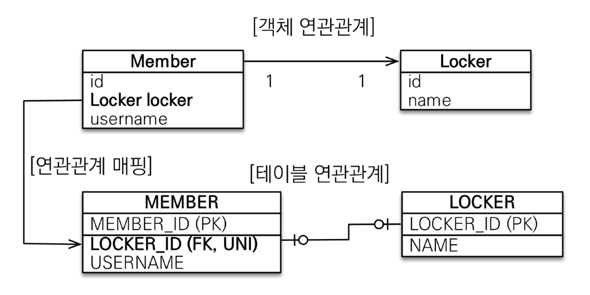
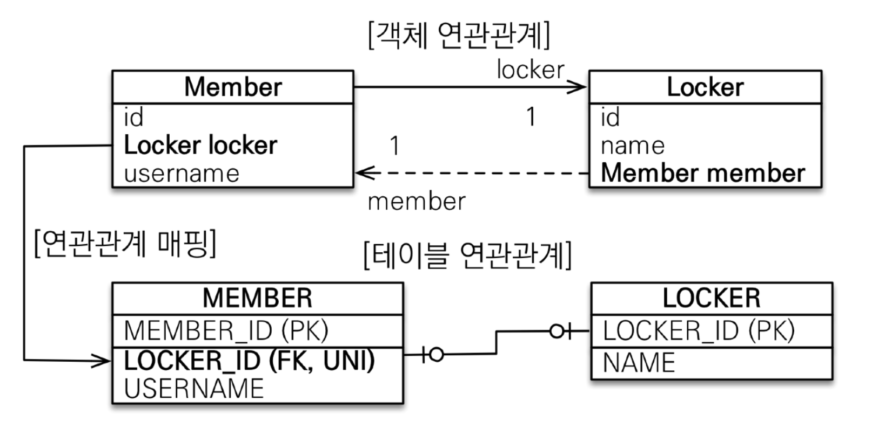
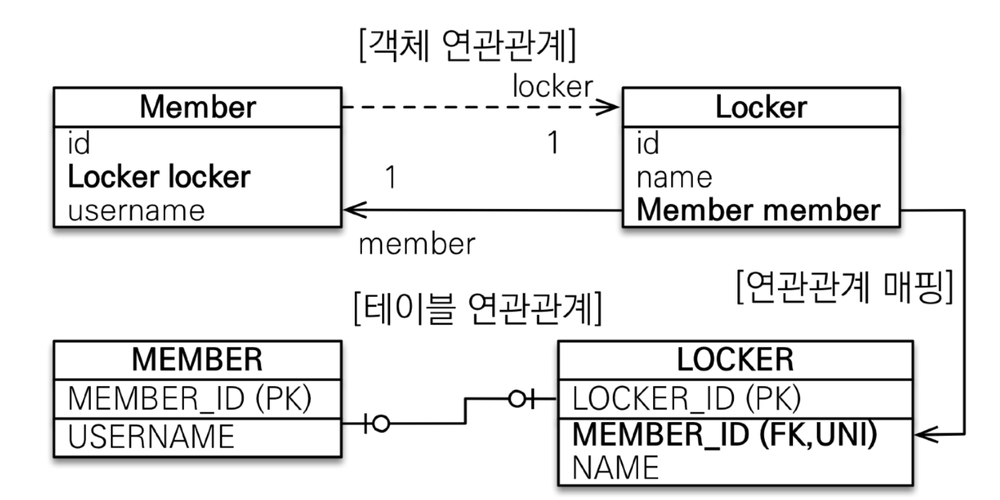
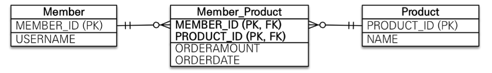
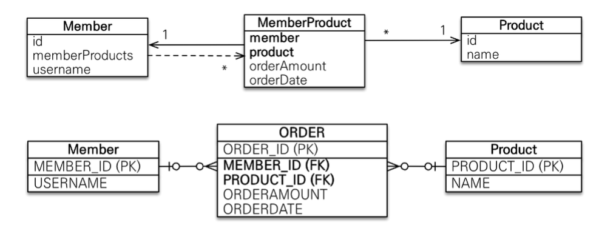

# 다양한 연관관계 매핑
## 연관관계 매핑시 고려사항
- 다중성
- 단방향, 양방향
- 연관관계의 주인

### 다중성
- 다대일: `@ManyToOne`
- 일대다: `@OneToMany`
- 일대일: `@OneToOne`
- 다대다: `@ManyToMany`
  - 실무에서 쓰지말자

### 단방향, 양방향
- 테이블
  - 외래 키 하나만으로 양쪽으로 조인이 가능
  - 사실 방향의 개념이 없다
- 객체
  - 참조용 필드가 있는 쪽으로만 참조 가능
  - 한쪽만 참조하면 단방향
  - 양쪽이 서로 참조하면 양방향

### 연관관계의 주인
- 테이블은 외래 키 하나로 두 테이블이 연관관계를 맺는다.
- 객체에서 양방향 관계는 A->B, B->A 와 같이 참조가 2군데에 존재해야 한다.
- 둘 중 테이블의 왜래 키를 관리할 곳을 정해야한다.
- **외래 키를 관리하는 참조**를 연관관계의 주인으로 정하자
- 주인의 반대편은 외래 키에 영향을 주지 않고, 단순 조회하는 기능만 가능하다.

## 다대일(N:1)
### 다대일 단방향

~~~java
@Entity
public class Member {

    @Id
    @GeneratedValue
    @Column(name = "MEMBER_ID")
    private Long id;

    @Column(name = "name")
    private String username;

    @ManyToOne
    @JoinColumn(name = "TEAM_ID")
    private Team team;
}
~~~

### 다대일 양방향

~~~java
@Entity
public class Member {

    @Id
    @GeneratedValue
    @Column(name = "MEMBER_ID")
    private Long id;

    @Column(name = "name")
    private String username;

    @ManyToOne
    @JoinColumn(name = "TEAM_ID")
    private Team team;
}

@Entity
public class Team {

    @Id
    @GeneratedValue
    @Column(name = "TEAM_ID")
    private Long id;
    private String name;

    @OneToMany(mappedBy = "team")
    private List<Member> members = new ArrayList<>();
}
~~~
- 외래 키가 있는 쪽이 연관관계의 주인
- 양쪽을 서로 참조하도록 개발할 때 필요

## 일대다(1:N)
### 일대다 단방향

~~~java
@Entity
public class Team {

    @Id
    @GeneratedValue
    @Column(name = "TEAM_ID")
    private Long id;
    private String name;

    @OneToMany
    private List<Member> members = new ArrayList<>();
}

@Entity
public class Member {

    @Id
    @GeneratedValue
    @Column(name = "MEMBER_ID")
    private Long id;

    @Column(name = "name")
    private String username;
}
~~~ 
~~~java
Member member = new Member();
member.setUsername("member1");

em.persist(member);

Team team = new Team();
team.setName("teamA");
team.getMembers().add(member);

em.persist(team);

tx.commit();
~~~
~~~
Hibernate: 
    /* insert for
        hellojpa.Member */insert 
    into
        Member (name, MEMBER_ID) 
    values
        (?, ?)
Hibernate: 
    /* insert for
        hellojpa.Team */insert 
    into
        Team (name, TEAM_ID) 
    values
        (?, ?)
Hibernate: 
    update
        Member 
    set
        TEAM_ID=? 
    where
        MEMBER_ID=?
~~~
- 업데이트 쿼리를 통해 멤버 테이블에 외래키가 추가되는 것을 볼 수 있다.
- 팀 엔티티를 저장하는데 팀 테이블에서는 이 외래키를 어떻게 할 방법이 없다.
- 그래서 멤버 테이블에서 업데이트를 하게 된다.

**일대다 단방향 정리**
- 일대다 단방향은 일대다에서 `일(1)`쪽에 연관관계의 주인이 있다.
- 테이블 일대다 관계는 항상 `다(N) 쪽에 외래 키가 있다.`
- 객체와 테이블의 차이 때문에 반대편 테이블의 외래 키를 관리하는 구조가 만들어진다.
- `@JoinColumn`을 꼭 사용해야한다. 그렇지 않으면 조인 테이블 방식을 사용한다(중간에 테이블이 하나 추가된다.)
- 단점
  - 엔티티가 관리하는 외래 키가 다른 테이블에 존재한다.
  - 연관관계 관리를 위해 추가적으로 UPDATE SQL을 실행한다.

일대다 단방향 매핑보다는 `다대일 양방향 매핑`을 사용하자.

### 일대다 양방향

~~~java
@Entity
public class Team {

    @Id
    @GeneratedValue
    @Column(name = "TEAM_ID")
    private Long id;
    private String name;

    @OneToMany
    @JoinColumn(name = "TEAM_ID")
    private List<Member> members = new ArrayList<>();
}

@Entity
public class Member {

    @Id
    @GeneratedValue
    @Column(name = "MEMBER_ID")
    private Long id;

    @Column(name = "name")
    private String username;

    @OneToMany
    @JoinColumn(name = "TEAM_ID", insertable = false, updatable = false)
    private Team team;
}
~~~
- 공식적으로 존재하는 매핑은 아니다
- `@JoinColumn(name = "TEAM_ID", insertable = false, updatable = false)`
- `읽기 전용 필드`를 사용해 양방향처럼 사용하는 방법이다.
- 그냥 `다대일 양방향`을 쓰자

## 일대일(1:1)
- 일대일 관계는 반대도 일대일
- 주 테이블이나 대상 테이블 중에 외래 키 선택 가능
  - 주 테이블에 외래 키
  - 대상 테이블에 외래 키
- 외래 키에 데이터베이스 유니크 제약조건 추가

### 일대일: 주 테이블에 외래 키 단방향

- `@ManyToOne` 단방향 매핑과 유사하다.

~~~java
// Member Entity
@OneToOne
@JoinColumn(name = "LOCKER_ID")
private Locker locker;

// Locker Entity
@Entity
public class Locker {

    @Id
    @GeneratedValue
    private Long id;

    private String name;
}
~~~
### 일대일: 주 테이블에 외래 키 양방향

- 다대일 양방향 매핑처럼 `외래 키가 있는 곳이 연관관계의 주인`
~~~java
// Locker Entity
@OneToOne(mappedBy = "locker")
private Member member;
~~~

### 일대일: 대상 테이블에 외래 키 단방향은 JPA에서 지원하지 않는다.

### 일대일: 대상 테이블에 외래 키 양방향

- 일대일 주 테이블에 외래 키 양방향 매핑과 같다

**정리**
- 주 테이블에 외래 키
  - 주 객체가 대상 객체의 참조를 가지는 것처럼 주 테이블에 외래 키를 두고 대상 테이블을 찾는다.
  - 개발자들이 선호하는 방법
  - JPA 매핑이 편리하다
  - 주 테이블만 조회해도 대상 테이블에 데이터가 있는지 확인 가능
  - 값이 없으면 외래 키에 null 허용
- 대상 테이블에 외래키
  - 대상 테이블에 외래키가 존재
  - 전통적인 DBA가 선호
  - 장점: 주 테이블과 대상 테이블을 일대일에서 일대다 관계로 변경할 때 테이블 구조가 유지된다.
  - 단점: 프록시 기능 한계로 지연 로딩으로 설정해도 항상 즉시 로딩된다.

## 다대다(N:M)
- 관계형 데이터베이스는 정규화된 테이블 2개로 다대다 관계를 표현할 수가 없다.
- 연결 테이블을 추가해 일대다, 다대일 관계로 풀어야한다.
- 객체는 컬렉션을 사용해 객체 2개로 다대다 관계가 가능하다.
- `@ManyToMany`
- `@JoinTable`로 연결 테이블 지정
- 단방향, 양방향 가능

### 다대다 매핑의 한계
- 편리해 보이지만 실무에서는 사용하지 않는다
- 연결 테이블이 단순히 연결만 하고 끝나지 않는다.
- 주문시간이나 수량과 같은 데이터가 들어올 수 있다.

### 다대다 매핑의 문제 해결
- 연결 테이블용 엔티티 추가(연결 테이블을 엔티티로)
- `@ManyToMany` -> `@OneToMany`, `@ManyToOne`

~~~java
// Member Entity
@OneToMany(mappedBy = "member")
private List<MemberProduct> memberProducts = new ArrayList<>();

// Product Entity
@OneToMany(mappedBy = "product")
private List<MemberProduct> memberProducts = new ArrayList<>();

// MemberProduct Entity
@Entity
public class MemberProduct {

    @Id
    @GeneratedValue
    private Long id;

    @ManyToOne
    @JoinColumn(name = "MEMBER_ID")
    private Member member;

    @ManyToOne
    @JoinColumn(name = "PRODUCT_ID")
    private Product product;

    private int count;
    private int price;

    private LocalDateTime orderDateTime;

}
~~~