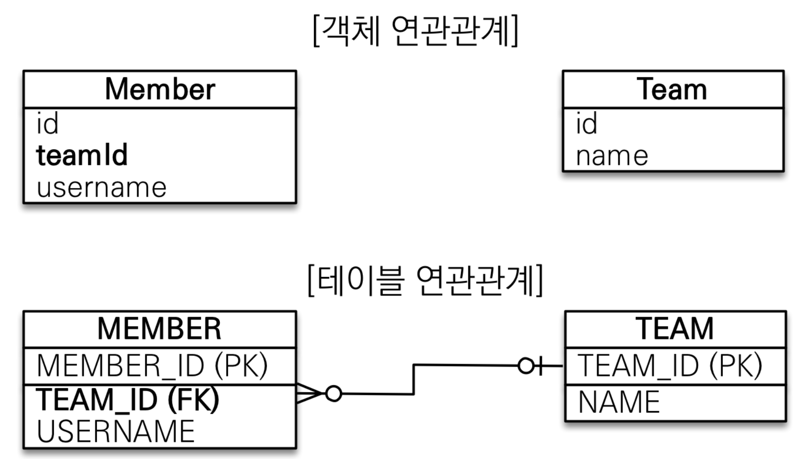
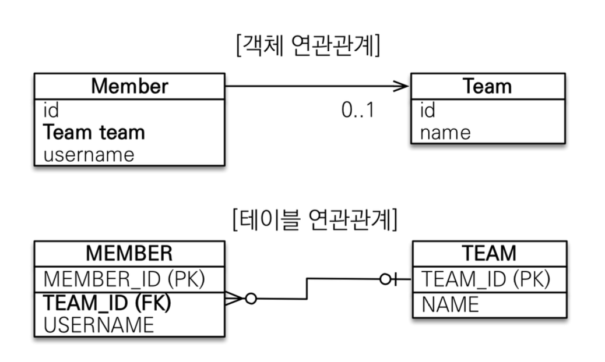
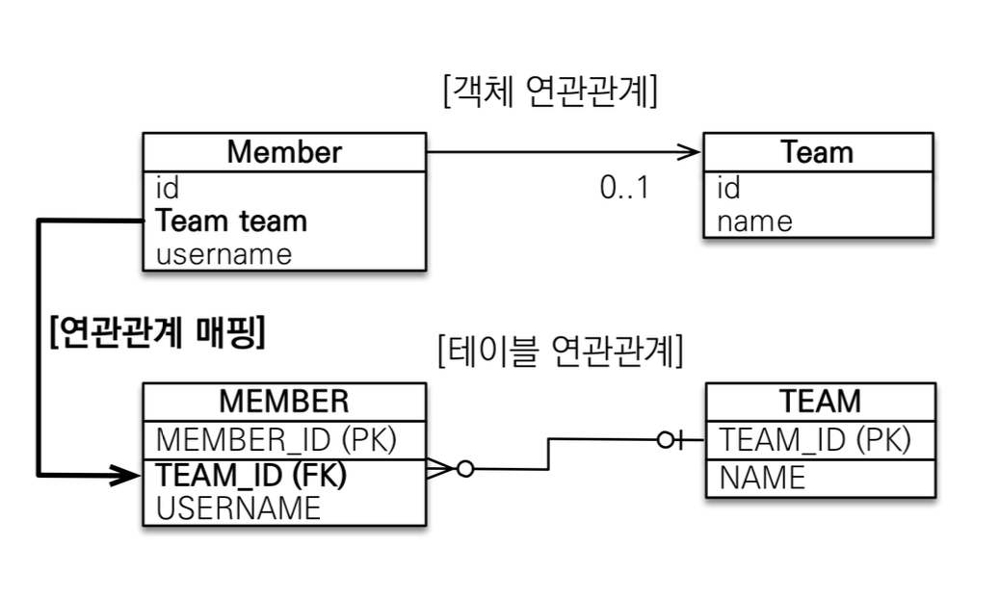
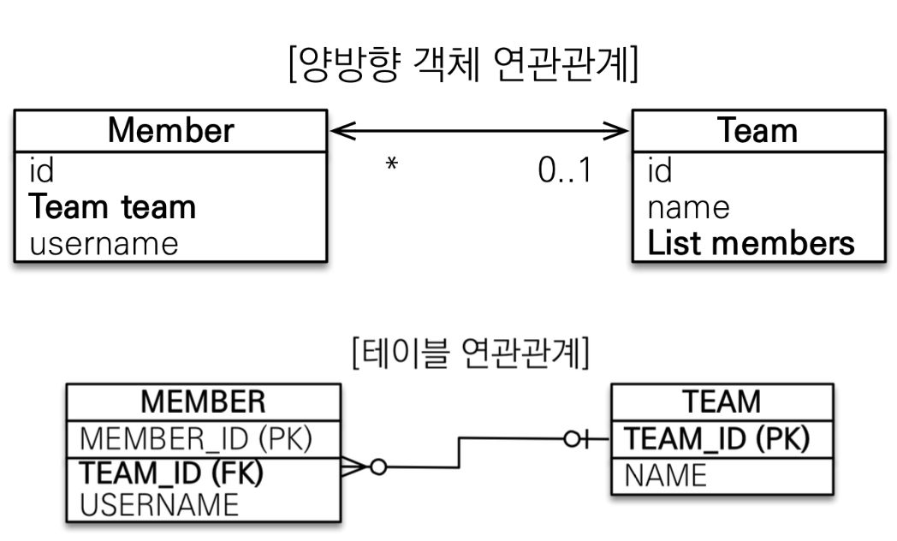
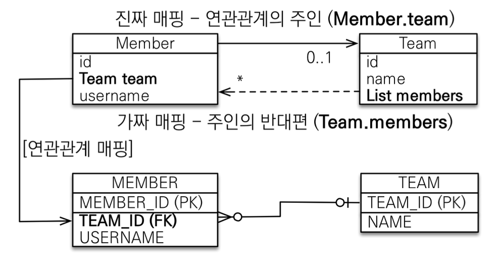

# 연관관계 매핑 기초
## 연관관계가 필요한 이유
"객체지향 설계의 목표는 자율적인 객체들의 협력 공동체를 만드는 것이다."  

### 예제 시나리오
- 회원과 팀이 있다.
- 회원은 하나의 팀에만 소속될 수 있다.
- 회원과 팀은 다대일 관계이다.

### 객체를 테이블에 맞추어 모델링(연관관계가 없는 객체)

~~~java
public class Member {
    @Id
    @GeneratedValue
    @Column(name = "MEMBER_ID")
    private Long id;

    @Column(name = "name")
    private String username;

    @Column(name = "TEAM_ID")
    private Long teamId;
  ...
}

@Entity
public class Team {

    @Id
    @GeneratedValue
    @Column(name = "TEAM_ID")
    private Long id;
    private String name;
  ...
}
~~~
- 객체를 테이블에 맞추어 모델링 하였다.
- 참조 대신에 외래키를 그대로 사용

~~~java
//팀 저장
Team team = new Team();
team.setName("TeamA");
em.persist(team);

//회원 저장
Member member = new Member();
member.setUsername("member1");
member.setTeamId(team.getId());
em.persist(member);

Member findMember = em.find(Member.class, member.getId());
Long findTeamId = findMember.getTeamId();

Team findTeam = em.find(Team.class, findTeamId);

tx.commit();
~~~
- 외래키 식별자를 직접 다루고 있다.
- 조회 시 식별자로 조회한다. 이러한 방법은 객체지향적인 방법이 아니다.

### 겍체를 테이블에 맞추어 데이터 중심으로 모델링하면 협력 관계를 만들 수 없다
- 테이블은 외래 키 조인을 사용해 연관된 테이블을 찾는다.
- 객체는 참조를 사용해 연관된 객체를 찾는다

## 단방향 연관관계
### 객체 지향 모델링

~~~java
@Entity
public class Member {
    @Id
    @GeneratedValue
    @Column(name = "MEMBER_ID")
    private Long id;

    @Column(name = "name")
    private String username;
    
    @ManyToOne
    @JoinColumn(name = "TEAM_ID")
    private Team team;
}
~~~
### ORM 매핑

연관관계 저장
~~~java
//팀 저장
Team team = new Team();
team.setName("TeamA");
em.persist(team);

//회원 저장
Member member = new Member();
member.setUsername("member1");
member.setTeam(team);

em.persist(member);
~~~

연관관계 조회
~~~java
Member findMember = em.find(Member.class, member.getId());
Team findTeam = findMember.getTeam();
~~~

연관관계 수정
~~~java
// 새로운 팀B
Team teamB = new Team(); 
teamB.setName("TeamB"); 
em.persist(teamB);
// 회원1에 새로운 팀B 설정 
member.setTeam(teamB);
~~~

## 양방향 매핑

- 테이블에서 연관관계는 외래키 하나로 단방향, 양방향 모두 다 가능하다.
- 문제는 객체이다.
- 멤버에서 팀을 조회할 수 있었지만, 팀에서는 멤버를 조회할 수 없다.
- 팀에서 members라는 리스트를 넣어줘야 양방향으로 조회가 가능하다.
~~~java
@Entity
public class Member {
    @Id
    @GeneratedValue
    @Column(name = "MEMBER_ID")
    private Long id;

    @Column(name = "name")
    private String username;

    @ManyToOne
    @JoinColumn(name = "TEAM_ID")
    private Team team;
}
~~~
- Member 엔티티는 단방향과 동일하다.

~~~java
@Entity
public class Team {

    @Id
    @GeneratedValue
    @Column(name = "TEAM_ID")
    private Long id;
    private String name;

    @OneToMany(mappedBy = "team")
    private List<Member> members = new ArrayList<>();
}
~~~
- Team 엔티티에 Members 리스트 컬렉션 추가

### 객체와 테이블이 관계를 맺는 차이
- 객체 연관관계 = 2개
  - 회원 -> 팀 연관관계 (단방향)
  - 팀 -> 회원 연관관계 (단방향)
- 테이블 연관관계 = 1개
  - 회원 <-> 팀의 연관관계 1개 (양방향)

### 객체의 양방향 관계
- 객체의 양방향 관계는 사실 서로 다른 단방향 관계 2개이다.
- 객체를 양방향으로 참조하려면 단방향 연관관계를 2개 만들어야 한다.

### 테이블의 양방향 연관관계
- 테이블은 외래 키 하나로 두 테이블의 연관관계를 관리
- 양쪽으로 조인할 수 있다.

멤버에 있는 팀으로 외래키를 관리할 지 팀에 있는 members 리스트로 외래키를 관리할 지, 둘 중 하나를 주인으로 정해야한다.

### 연관관계의 주인
양방향 매핑 규칙
- 객체의 두 관계 중 하나를 연관관계의 주인으로 지정
- 연관관계의 주인만이 외래 키를 관리(등록, 수정)
- 주인이 아닌 쪽은 읽기만 가능
- 주인은 `mappedBy` 속성 사용 x
- 주인이 아니면 `mappedBy` 속성으로 주인 지정

### 누구를 주인으로??
- 외래 키가 있는 곳을 주인으로 정하자
- 위 예제에서는 `Member.team`이 연관관계의 주인

