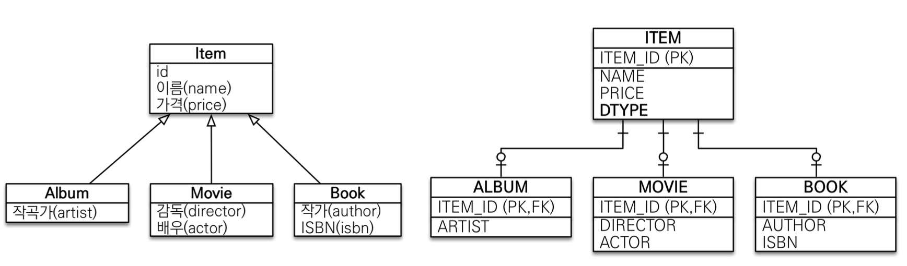
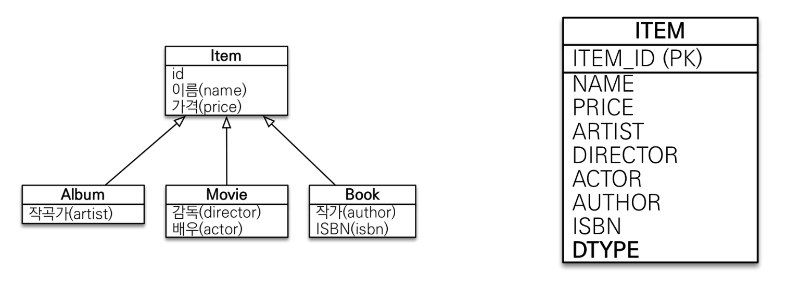
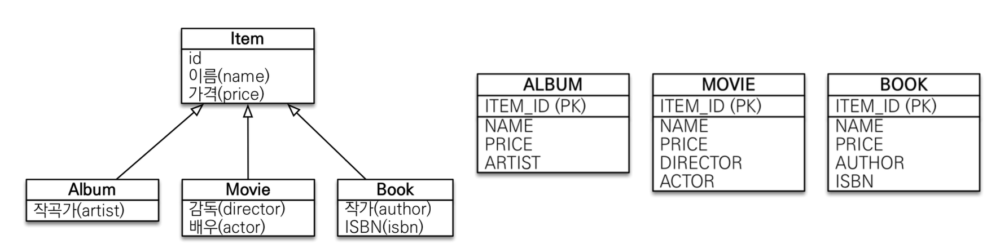
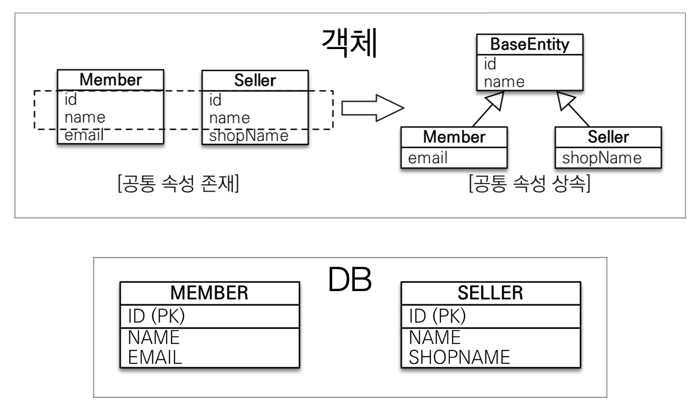

# 고급 매핑
## 상속관계 매핑
- 관계형 데이터베이스에는 상속 관계가 없다
- 슈퍼타입 서브타입 관계라는 모델링 기법이 겍체의 상속과 유사하다.
- 상속관계 매핑: 객체의 상속 구조와 DB의 슈퍼타입 서브타입 관계를 매핑하는 것을 말한다.
- 슈퍼타입 서브타입 논리 모델을 실제 물리 모델로 구현하는 방법
  - 각각 테이블로 변환 -> 조인 전략
  - 통합 테이블로 변환 -> 단일 테이블 전략
  - 서브타입 테이블로 변환 -> 구현 클레스마다 테이블 전략

### 주요 애노테이션
- `@Inheritance(strategy=InheritanceType.XXX)`
  - `JOINED`: 조인전략
  - `SINGLE_TABLE`: 단일 테이블 전략
  - `TABLE_PER_CLASS`: 구현 클래스마다 테이블 전략
- `@DiscriminatorColumn(name="DTYPE")`
- `@DiscriminatorValue("XXX")`

### 조인 전략

~~~java
@Entity
@Inheritance(strategy = InheritanceType.JOINED)
@DiscriminatorColumn
public class Item {

    @Id
    @GeneratedValue
    private Long id;

    private String name;
    private int price;
}

@Entity
@DiscriminatorValue("A")
public class Album extends Item{

    private String artist;
}

@Entity
@DiscriminatorValue("M")
public class Movie extends Item{

    private String director;
    private String actor;

}

@Entity
@DiscriminatorValue("B")
public class Book extends Item{

    private String author;
    private String isbn;
}
~~~
~~~
Hibernate: 
    create table Album (
        id bigint not null,
        artist varchar(255),
        primary key (id)
    )
Hibernate: 
    create table Book (
        id bigint not null,
        author varchar(255),
        isbn varchar(255),
        primary key (id)
    )
Hibernate: 
    create table Item (
        price integer not null,
        id bigint not null,
        DTYPE varchar(31) not null,
        name varchar(255),
        primary key (id)
    )
Hibernate: 
    create table Movie (
        id bigint not null,
        actor varchar(255),
        director varchar(255),
        primary key (id)
    )

Hibernate: 
    /* insert for
        hellojpa.Movie */insert 
    into
        Item (name, price, DTYPE, id) 
    values
        (?, ?, 'M', ?)
Hibernate: 
    /* insert for
        hellojpa.Movie */insert 
    into
        Movie (actor, director, id) 
    values
        (?, ?, ?)
~~~
- 장점
  - 테이블 정규화
  - 외래 키 참조 무결성 제약조건 활용가능
  - 저장공간 효율화
- 단점
  - 조회 시 조인을 많이 사용 -> 성능 저하
  - 조회 쿼리가 복잡함
  - 데이터 저장 시 INSERT SQL 2번 호출

### 단일 테이블 전략

~~~java
@Entity
@Inheritance(strategy = InheritanceType.JOINED)
@DiscriminatorColumn
public abstract class Item {

    @Id
    @GeneratedValue
    private Long id;

    private String name;
    private int price;
}
// Album, Book, Album은 동일
... 
~~~
~~~
Hibernate: 
    create table Item (
        price integer not null,
        id bigint not null,
        DTYPE varchar(31) not null,
        actor varchar(255),
        artist varchar(255),
        author varchar(255),
        director varchar(255),
        isbn varchar(255),
        name varchar(255),
        primary key (id)
    )

Hibernate: 
    /* insert for
        hellojpa.Movie */insert 
    into
        Item (name, price, actor, director, DTYPE, id) 
    values
        (?, ?, ?, ?, 'M', ?)
~~~
- 장점
  - 조인이 필요 없으므로 조회 성능이 빠르다
  - 조회 쿼리가 단순
- 단점
  - 자식 엔티티가 매핑한 컬럼은 모두 null을 
  - 단일 테이블에 모든 것을 저장하기 때문에 테이블이 커질 수가 있다. 상황에 따라 조회 성능이 저하될 수 있다.

### 구현 클래스마다 테이블 전략

~~~java
@Entity
@Inheritance(strategy = InheritanceType.TABLE_PER_CLASS)
@DiscriminatorColumn
public abstract class Item {

    @Id
    @GeneratedValue
    private Long id;

    private String name;
    private int price;
}
~~~
~~~
Hibernate: 
    create table Album (
        price integer not null,
        id bigint not null,
        artist varchar(255),
        name varchar(255),
        primary key (id)
    )
Hibernate: 
    create table Book (
        price integer not null,
        id bigint not null,
        author varchar(255),
        isbn varchar(255),
        name varchar(255),
        primary key (id)
    )
Hibernate: 
    create table Movie (
        price integer not null,
        id bigint not null,
        actor varchar(255),
        director varchar(255),
        name varchar(255),
        primary key (id)
    )
~~~
- `이 전략은 추천하지 않는다. 사용하지 말자`
- 장점
  - 서브타입을 명확하게 구분해서 처리할 때 효과적
  - not null 제약조건 사용 가능
- 단점
  - 여러 자식 테이블을 함께 조회할 때 성능이 느리다
  - 자식 테이블을 통합해서 쿼리하기 어렵다

## @MappedSuperclass
- 공통 매핑 정보가 필요할 때 사용

- 상속관계 매핑 x
- 엔티티 x, 테이블과 매핑 x
- 부모 클래스를 상속 받는 `자식 클래스에 매핑 정보만 제공`
- 조회, 검색 불가
- 직접 생성해 사용할 일이 없으므로 `추상 클래스로 만들자`

- 테이블과 관계 없고, 단순히 엔티티가 공통으로 사용하는 매핑 정보를 모으는 역할
- 주로 등록일, 수정일, 등록자, 수정자 같은 전체 엔티티에서 공통으로 적용하는 정보를 모을 때 사용
- `@Entity` 클래스는 엔티티나 `@MappedSuperclass`로 지정한 클래스만 상속이 가능하다.