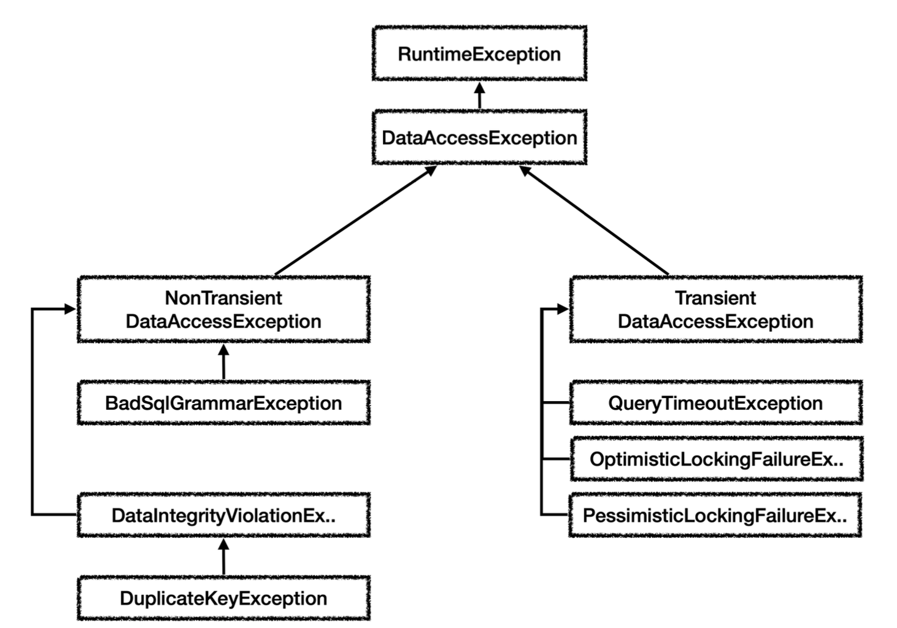

# 스프링과 문제 해결 - 예외 처리, 반복
서비스에서 처리할 수 없는 `SQLException`을 처리하기 위해서는 리포지토리에서 `SQLException` 예외를 런타임 예외로 전환해서 서비스 계층으로 던지는 방법이 있다. 이렇게 하면 서비스 계층이 이 예외를 무시할 수 있기 때문에 특정 기술에 의존하는 부분을 제거할 수 있다.

## 인터페이스 도입
먼저 인터페이스를 만들건데 기존 체크 예외 코드가 있는 인터페이스를 도입했을 때 문제점을 보자
~~~java
public interface MemberRepositoryEx {
    Member save(Member member) throws SQLException;

    Member findById(String memberId) throws SQLException;

    void update(String memberId, int money) throws SQLException;

    void delete(String memberId) throws SQLException;
}
~~~

~~~java
@Slf4j
public class MemberRepositoryV3 implements MemberRepositoryEx{

    private final DataSource dataSource;

    public MemberRepositoryV3(DataSource dataSource) {
        this.dataSource = dataSource;
    }

    public Member save(Member member) throws SQLException {
        String sql = "insert into member(member_id, money) values (?,?)";

        Connection conn = null;
        PreparedStatement pstmt = null;

        try {
            conn = getConnection();
            pstmt = conn.prepareStatement(sql);
            pstmt.setString(1, member.getMemberId());
            pstmt.setInt(2, member.getMoney());
            pstmt.executeUpdate();

            return member;
        } catch (SQLException e) {

            log.error("db error, ", e);
            throw e;
        } finally {
            close(conn, pstmt, null);

        }
    }

    public Member findById(String memberId) throws SQLException {
        String sql = "select * from member where member_id = ?";

        Connection conn = null;
        PreparedStatement pstmt = null;
        ResultSet rs = null;

        try {
            conn = getConnection();
            pstmt = conn.prepareStatement(sql);
            pstmt.setString(1, memberId);

            rs = pstmt.executeQuery();

            if (rs.next()) {
                Member member = new Member();
                member.setMemberId(rs.getString("member_id"));
                member.setMoney(rs.getInt("money"));
                return member;
            } else {
                throw new NoSuchElementException("member not found. memberId = " + memberId);
            }
        }catch (SQLException e) {
            log.error("db error", e);
            throw e;
        } finally {
            close(conn, pstmt, rs);
        }
    }

    public void update(String memberId, int money) throws SQLException {
        String sql = "update member set money = ? where member_id=?";

        Connection conn = null;
        PreparedStatement pstmt = null;

        try {

            conn = getConnection();
            pstmt = conn.prepareStatement(sql);

            pstmt.setInt(1, money);
            pstmt.setString(2, memberId);
            int resultSize = pstmt.executeUpdate();
            log.info("resultSize = {}", resultSize);
        } catch (SQLException e) {

            log.error("db error, ", e);
            throw e;
        } finally {
            close(conn, pstmt, null);

        }
    }

    public void delete(String memberId) throws SQLException {
        String sql = "delete from member where member_id = ?";

        Connection conn = null;
        PreparedStatement pstmt = null;

        try {

            conn = DBConnectionUtil.getConnection();
            pstmt = conn.prepareStatement(sql);

            pstmt.setString(1, memberId);
            pstmt.executeUpdate();
        } catch (SQLException e) {

            log.error("db error, ", e);
            throw e;
        } finally {
            close(conn, pstmt, null);

        }

    }

    private void close(Connection conn, Statement stmt, ResultSet rs) {

        JdbcUtils.closeResultSet(rs);
        JdbcUtils.closeStatement(stmt);
        // 주의! 트랜잭션 동기화를 사용하려면 DataSourceUtils를 사용해야 한다.
        DataSourceUtils.releaseConnection(conn, dataSource);

    }

    private Connection getConnection() throws SQLException{
        // 주의! 트랜잭션 동기화를 사용하려면 DataSourceUtils를 사용해야 한다.
        Connection conn = DataSourceUtils.getConnection(dataSource);
        log.info("get connection = {}, class = {}", conn, conn.getClass());
        
        return conn;
    }
}
~~~
- 인터페이스의 구현체가 체크 예외를 던지려면 인터페이스 메서드에 먼저 체크 예외를 던지는 부분이 선언되어 있어야 한다.

구현 기술을 쉽게 변경하기 위해 인터페이스를 도입하더라도 특정 구현 기술에 종속적인 체크 예외를 사용하게 되면 인터페이스에서도 해당 예외를 포함해야한다. 그렇게 되면 해당 인터페이스는 순수한 인터페이스가 아니게 된다. 인터페이스를 만드는 목적은 구현체를 쉽게 변경하기 위함인데 특정 기술에 의존되어 버리면 목적을 다하지 못하는 것이다.

런타임 예외는 이런 부분에서 자유롭다. 인터페이스는 런타임 예외를 따로 선언하지 않아도 된다. 즉, 인터페이스가 특정 기술에 종속적일 필요가 없게 된다.

## 런타임 에외 적용
~~~java
public interface MemberRepository {
    Member save(Member member);

    Member findById(String memberId);

    void update(String memberId, int money);

    void delete(String memberId);
}
~~~
~~~java
public class MyDbException extends RuntimeException {
    public MyDbException() {
    }

    public MyDbException(String message) {
        super(message);
    }

    public MyDbException(String message, Throwable cause) {
        super(message, cause);
    }

    public MyDbException(Throwable cause) {
        super(cause);
    }
}
~~~
- `RuntimeException`을 상속받아 `MyDbException`이라는 런타임 예외 생성
~~~java
@Slf4j
public class MemberRepositoryV4_1 implements MemberRepository{

    private final DataSource dataSource;

    public MemberRepositoryV4_1(DataSource dataSource) {
        this.dataSource = dataSource;
    }

    @Override
    public Member save(Member member){
        String sql = "insert into member(member_id, money) values (?,?)";

        Connection conn = null;
        PreparedStatement pstmt = null;

        try {
            conn = getConnection();
            pstmt = conn.prepareStatement(sql);
            pstmt.setString(1, member.getMemberId());
            pstmt.setInt(2, member.getMoney());
            pstmt.executeUpdate();

            return member;
        } catch (SQLException e) {
            throw new MyDbException(e);
        } finally {
            close(conn, pstmt, null);

        }
    }

    @Override
    public Member findById(String memberId){
        String sql = "select * from member where member_id = ?";

        Connection conn = null;
        PreparedStatement pstmt = null;
        ResultSet rs = null;

        try {
            conn = getConnection();
            pstmt = conn.prepareStatement(sql);
            pstmt.setString(1, memberId);

            rs = pstmt.executeQuery();

            if (rs.next()) {
                Member member = new Member();
                member.setMemberId(rs.getString("member_id"));
                member.setMoney(rs.getInt("money"));
                return member;
            } else {
                throw new NoSuchElementException("member not found. memberId = " + memberId);
            }
        }catch (SQLException e) {
            throw new MyDbException(e);
        } finally {
            close(conn, pstmt, rs);
        }
    }

    @Override
    public void update(String memberId, int money) {
        String sql = "update member set money = ? where member_id=?";

        Connection conn = null;
        PreparedStatement pstmt = null;

        try {

            conn = getConnection();
            pstmt = conn.prepareStatement(sql);

            pstmt.setInt(1, money);
            pstmt.setString(2, memberId);
            int resultSize = pstmt.executeUpdate();
            log.info("resultSize = {}", resultSize);
        } catch (SQLException e) {
            throw new MyDbException(e);
        } finally {
            close(conn, pstmt, null);

        }
    }

    @Override
    public void delete(String memberId) {
        String sql = "delete from member where member_id = ?";

        Connection conn = null;
        PreparedStatement pstmt = null;

        try {

            conn = DBConnectionUtil.getConnection();
            pstmt = conn.prepareStatement(sql);

            pstmt.setString(1, memberId);
            pstmt.executeUpdate();
        } catch (SQLException e) {
            throw new MyDbException(e);
        } finally {
            close(conn, pstmt, null);
        }
    }

    private void close(Connection conn, Statement stmt, ResultSet rs) {

        JdbcUtils.closeResultSet(rs);
        JdbcUtils.closeStatement(stmt);
        // 주의! 트랜잭션 동기화를 사용하려면 DataSourceUtils를 사용해야 한다.
        DataSourceUtils.releaseConnection(conn, dataSource);

    }

    private Connection getConnection() throws SQLException{
        // 주의! 트랜잭션 동기화를 사용하려면 DataSourceUtils를 사용해야 한다.
        Connection conn = DataSourceUtils.getConnection(dataSource);
        log.info("get connection = {}, class = {}", conn, conn.getClass());
        
        return conn;
    }
}
~~~
- `SQLException` 체크 예외를 `MyDbException` 런타임 예외로 전환

~~~java
@Slf4j
public class MemberServiceV4 {

    private final MemberRepository memberRepository;

    public MemberServiceV4(MemberRepository memberRepository) {
        this.memberRepository = memberRepository;
    }

    @Transactional
    public void accountTransfer(String fromId, String toId, int money){
        bizLogic(fromId, toId, money);

    }

    private void bizLogic(String fromId, String toId, int money){
        Member fromMember = memberRepository.findById(fromId);
        Member toMember = memberRepository.findById(toId);

        memberRepository.update(fromId, fromMember.getMoney() - money);
        validation(toMember);
        memberRepository.update(toId, toMember.getMoney() + money);
    }

    private void validation(Member toMember) {
        if (toMember.getMemberId().equals("ex")) {
            throw new IllegalStateException("이체 중 예외 발생");
        }
    }

}
~~~
- `MemberRepository` 인터페이스에 의존하게 코드 변경
- `bizLogic()` 메서드에 `throws SQLException` 부분이 제거

체크 예외를 런타임 예외로 변경함으로써 인터페이스와 서비스 계층의 순수성을 유지할 수 있게 되었다. 또한 향후 JDBC에서 다른 구현 기술로 변경하더라도 서비스 계층의 코드를 변경하지 않고 유지할 수 있다.

## 데이터 접근 예외 직접 만들기
회원가입 시 DB에 이미 같은 ID가 있을 경우 ID뒤에 숫자를 붙여 ID를 생성한다고 가정하자

데이터를 DB에 저장할 때 같은 ID가 데이터베이스에 저장되어 있다면 데이터베이스는 오류 코드를 반환하고 이 오류코드를 받은 JDBC 드라이버는 SQLException을 던진다. SQLException에넌 데이터베이스가 제공하는 errorCode가 들어있다.

SQLException 내부에 들어있는 errorCode를 활용하면 데이터베이스에서 어떤 문제가 발생했는지 확인할 수 있다.

서비스계층에서 예외를 복구하기 위해 키 중복 오류를 확인할 수 있어야 한다. 그래야 새로운 ID를 만들어 다시 저장을 할 수 있기 때문이다. 리포지토리는 SQLException을 서비스 계층에 던지고 서비스 계층은 이 예외의 오류 코드를 확인한 후 키 중복 오류인 경우 새로운 ID를 만들어 다시 저장하면 된다.

SQLException에 들어있는 오류 코드를 활용하기 위해 서비스 계층으로 이 예외를 던지게 되면 서비스 계층이 JDBC 기술에 의존하게 된다.

이를 해결하기 위해서 리포지토리에서 예외를 변환해 던지면 된다.
~~~java
public class MyDuplicationKeyException extends MyDbException {
    public MyDuplicationKeyException() {
    }

    public MyDuplicationKeyException(String message) {
        super(message);
    }

    public MyDuplicationKeyException(String message, Throwable cause) {
        super(message, cause);
    }

    public MyDuplicationKeyException(Throwable cause) {
        super(cause);
    }
}
~~~
- 기존에 사용한 `MyDbException`을 상속받아 예외를 생성한다. 이렇게 하면 데이터베이스 관련 예외라는 계층을 만들 수 있다.

~~~java

@Slf4j
public class ExTranslatorV1Test {

    Repository repository;
    Service service;

    @BeforeEach
    void init() {
        DriverManagerDataSource dataSource = new DriverManagerDataSource(URL, USERNAME, PASSWORD);
        repository = new Repository(dataSource);
        service = new Service(repository);
    }

    @Test
    void duplicateKeySave() {
        service.create("myId");
        service.create("myId");

    }

    @Slf4j
    @RequiredArgsConstructor
    static class Service {
        private final Repository repository;

        public void create(String memberId) {

            try {
                repository.save(new Member(memberId, 0));
                log.info("saveId={}", memberId);
            } catch (MyDuplicationKeyException e) {
                log.info("키 중, 복수 시도");
                String retryId = generateNewId(memberId);
                log.info("retryId={}", retryId);
                repository.save(new Member(retryId, 0));
            } catch (MyDbException e) {
                log.info("데이터 접근 계층 예외", e);
                throw e;
            }
        }

        private String generateNewId(String memberId) {
            return memberId + new Random().nextInt(10000);
        }
    }

    @RequiredArgsConstructor
    static class Repository {

        private final DataSource dataSource;

        public Member save(Member member) {
            String sql = "insert into member(member_id, money) values(?,?)";

            Connection conn = null;
            PreparedStatement pstmt = null;

            try {
                conn = dataSource.getConnection();
                pstmt = conn.prepareStatement(sql);

                pstmt.setString(1, member.getMemberId());
                pstmt.setInt(2, member.getMoney());
                pstmt.executeUpdate();

                return member;
            } catch (SQLException e) {
                // h2 db
                if (e.getErrorCode() == 23505) {
                    throw new MyDuplicationKeyException(e);
                }

                throw new MyDbException();
            } finally {
                JdbcUtils.closeStatement(pstmt);
                JdbcUtils.closeConnection(conn);
            }
        }
    }
}
~~~

~~~java
catch (SQLException e) {
    // h2 db
    if (e.getErrorCode() == 23505) {
        throw new MyDuplicationKeyException(e);
    }

    throw new MyDbException();
}
~~~
- 오류코드가 23505(키 중복 오류)일 때 `MyDuplicationKeyException`을 생성해 서비스로 던짐
- 나머지 경우엔 `MyDbException` 던짐

~~~java
public void create(String memberId) {

    try {
        repository.save(new Member(memberId, 0));
        log.info("saveId={}", memberId);
    } catch (MyDuplicationKeyException e) {
        log.info("키 중, 복수 시도");
        String retryId = generateNewId(memberId);
        log.info("retryId={}", retryId);
        repository.save(new Member(retryId, 0));
    } catch (MyDbException e) {
        log.info("데이터 접근 계층 예외", e);
        throw e;
    }
}
~~~
- `MyDuplicationKeyException` 예외 발생 시 새로운 ID를 생성하고 저장한다(generateNewId(memberId)), 이 부분이 예외를 복구하는 부분
- 복구할 수 없는 예외면 로그만 남기고 예외를 던진다.

## 스프링 예외 추상화

- 스프링은 데이터 접근 계층에 대한 수십가지 예외를 정리해 일관된 예외 계층을 제공한다.
- 각각의 예외는 특정 기술에 종속적이지 않게 설계되어있다. 서비스 계층에서도 스프링이 제공하는 예외를 사용하면 된다.
- JDBC나 JPA를 사용할 때 발생하는 예외를 스프링이 제공하는 예외로 변환해주는 역할도 제공해준다.

- 예외의 최고 상위 계층은 `org.springframework.dao.DataAccessException`이다. `RuntimeException`을 상속받았기 때문에 스프링에서 제공하는 데이터 접근 계층의 모든 예외는 런타임 예외이다.
- `Transient`: 일시적이라는 뜻으로 하위 예외는 동일한 SQL을 다시 시도했을 때 성공할 가능성이 있다. 쿼리 타임아웃, 락 관련 오류 등
- `NonTransient`: 일시적이지 않다라는 뜻, 같은 SQL을 반복해서 실행하면 실패, 문법 오류, 제약조건 위배 등

### 스프링이 제공하는 예외 변환기
~~~java
@Slf4j
public class SpringExceptionTranslatorTest {

    DataSource dataSource;

    @BeforeEach
    void init() {
        dataSource = new DriverManagerDataSource(URL, USERNAME, PASSWORD);
    }

    @Test
    void sqlExceptionErrorCode() {
        String sql = "select bad grammer";

        try {
            Connection conn = dataSource.getConnection();
            PreparedStatement stmt = conn.prepareStatement(sql);
            stmt.executeQuery();
        } catch (SQLException e) {
            assertThat(e.getErrorCode()).isEqualTo(42122);

            int errorCode = e.getErrorCode();
            log.info("errorCode={}", errorCode);
            log.info("error", e);
        }
    }

    @Test
    void exceptionTranslator() {

        String sql = "select bad grammer";

        try {
            Connection conn = dataSource.getConnection();
            PreparedStatement stmt = conn.prepareStatement(sql);
            stmt.executeQuery();
        } catch (SQLException e) {
            assertThat(e.getErrorCode()).isEqualTo(42122);

            SQLErrorCodeSQLExceptionTranslator exTranslator = new SQLErrorCodeSQLExceptionTranslator(dataSource);
            DataAccessException resultEx = exTranslator.translate("select", sql, e);
            log.info("resultEx", resultEx);

            assertThat(resultEx.getClass()).isEqualTo(BadSqlGrammarException.class);
        }
    }

}
~~~

~~~java
SQLErrorCodeSQLExceptionTranslator exTranslator = new SQLErrorCodeSQLExceptionTranslator(dataSource);
DataAccessException resultEx = exTranslator.translate("select", sql, e);
~~~
- translate()의 첫번째 파라미터는 읽을 수 있는 설명, 두번째 파라미터는 실행한 sql, 세번째 파라미터는 발생된 예외를 전달하면 된다.
- 이렇게 하면 적절한 스프링 데이터 접근 계층의 예외로 변환해서 반환해준다.
- 
~~~
org.springframework.jdbc.BadSqlGrammarException: select; bad SQL grammar [select bad grammer]
~~~

스프링은 어떻게 각각의 DB가 제공하는 SQL ErrorCode까지 고려해서 예외를 변환하는 것일까?

sql-error-codes.xml이라는 파일에 답이 있다.
~~~xml
<bean id="H2" class="org.springframework.jdbc.support.SQLErrorCodes">
  <property name="badSqlGrammarCodes">
    <value>42000,42001,42101,42102,42111,42112,42121,42122,42132</value>
  </property>
  <property name="duplicateKeyCodes">
    <value>23001,23505</value>
  </property>
  <property name="dataIntegrityViolationCodes">
    <value>22001,22003,22012,22018,22025,23000,23002,23003,23502,23503,23506,23507,23513</value>
  </property>
  <property name="dataAccessResourceFailureCodes">
    <value>90046,90100,90117,90121,90126</value>
  </property>
  <property name="cannotAcquireLockCodes">
    <value>50200</value>
  </property>
</bean>
~~~
- 스프링 SQL 예외 변환기는 SQL ErrorCode를 이 파일에 대입해 어떤 스프링 데이터 접근 예외로 전환해야할지 찾는다.

## 스프링 예외 추상화 적용
~~~java
@Slf4j
public class MemberRepositoryV4_2 implements MemberRepository{

    private final DataSource dataSource;
    private final SQLExceptionTranslator exceptionTranslator;

    public MemberRepositoryV4_2(DataSource dataSource) {
        this.dataSource = dataSource;
        this.exceptionTranslator = new SQLErrorCodeSQLExceptionTranslator(dataSource);
    }

    @Override
    public Member save(Member member){
        String sql = "insert into member(member_id, money) values (?,?)";

        Connection conn = null;
        PreparedStatement pstmt = null;

        try {
            conn = getConnection();
            pstmt = conn.prepareStatement(sql);
            pstmt.setString(1, member.getMemberId());
            pstmt.setInt(2, member.getMoney());
            pstmt.executeUpdate();

            return member;
        } catch (SQLException e) {
            throw exceptionTranslator.translate("save", sql, e);
        } finally {
            close(conn, pstmt, null);

        }
    }

    @Override
    public Member findById(String memberId){
        String sql = "select * from member where member_id = ?";

        Connection conn = null;
        PreparedStatement pstmt = null;
        ResultSet rs = null;

        try {
            conn = getConnection();
            pstmt = conn.prepareStatement(sql);
            pstmt.setString(1, memberId);

            rs = pstmt.executeQuery();

            if (rs.next()) {
                Member member = new Member();
                member.setMemberId(rs.getString("member_id"));
                member.setMoney(rs.getInt("money"));
                return member;
            } else {
                throw new NoSuchElementException("member not found. memberId = " + memberId);
            }
        }catch (SQLException e) {
            throw exceptionTranslator.translate("findById", sql, e);

        } finally {
            close(conn, pstmt, rs);
        }
    }

    @Override
    public void update(String memberId, int money) {
        String sql = "update member set money = ? where member_id=?";

        Connection conn = null;
        PreparedStatement pstmt = null;

        try {

            conn = getConnection();
            pstmt = conn.prepareStatement(sql);

            pstmt.setInt(1, money);
            pstmt.setString(2, memberId);
            int resultSize = pstmt.executeUpdate();
            log.info("resultSize = {}", resultSize);
        } catch (SQLException e) {
            throw exceptionTranslator.translate("update", sql, e);
        } finally {
            close(conn, pstmt, null);

        }
    }

    @Override
    public void delete(String memberId) {
        String sql = "delete from member where member_id = ?";

        Connection conn = null;
        PreparedStatement pstmt = null;

        try {

            conn = DBConnectionUtil.getConnection();
            pstmt = conn.prepareStatement(sql);

            pstmt.setString(1, memberId);
            pstmt.executeUpdate();
        } catch (SQLException e) {
            throw exceptionTranslator.translate("delete", sql, e);
        } finally {
            close(conn, pstmt, null);
        }
    }

    private void close(Connection conn, Statement stmt, ResultSet rs) {

        JdbcUtils.closeResultSet(rs);
        JdbcUtils.closeStatement(stmt);
        // 주의! 트랜잭션 동기화를 사용하려면 DataSourceUtils를 사용해야 한다.
        DataSourceUtils.releaseConnection(conn, dataSource);

    }

    private Connection getConnection() throws SQLException{
        // 주의! 트랜잭션 동기화를 사용하려면 DataSourceUtils를 사용해야 한다.
        Connection conn = DataSourceUtils.getConnection(dataSource);
        log.info("get connection = {}, class = {}", conn, conn.getClass());
        
        return conn;
    }
}
~~~

## JDBC 반복 문제 해결 - JdbcTemplate
리포지토리의 메서드들을 보면 많은 부분이 반복되고 있다. 이런 반복을 효과적으로 처리하는 방법이 템플릿 콜백 패턴이다.

스프링은 JDBC 반복 문제를 해결하기 위해서 JdbcTemplate이라는 템플릿을 제공한다.

~~~java
@Slf4j
public class MemberRepositoryV5 implements MemberRepository{

    private final JdbcTemplate template;

    public MemberRepositoryV5(DataSource dataSource) {
        template = new JdbcTemplate(dataSource);
    }

    @Override
    public Member save(Member member){
        String sql = "insert into member(member_id, money) values (?,?)";
        template.update(sql, member.getMemberId(), member.getMoney());
        return member;

    }

    @Override
    public Member findById(String memberId){
        String sql = "select * from member where member_id = ?";
        return template.queryForObject(sql, memberRowMapper(), memberId);
    }

    @Override
    public void update(String memberId, int money) {
        String sql = "update member set money = ? where member_id=?";
        template.update(sql, money, memberId);
    }

    @Override
    public void delete(String memberId) {
        String sql = "delete from member where member_id = ?";
        template.update(sql, memberId);
    }

    private RowMapper<Member> memberRowMapper() {
        return (rs, rowNum) -> {
            Member member = new Member();
            member.setMemberId(rs.getString("member_id"));
            member.setMoney(rs.getInt("money"));
            return member;
        };
    }
}
~~~
`JdbcTemplate`은 JDBC로 개발할 때 발생하는 반복을 해결해준다. 그 뿐만 아니라 커넥션 동기화, 스프링 예외 변환기도 자동으로 실행해준다.