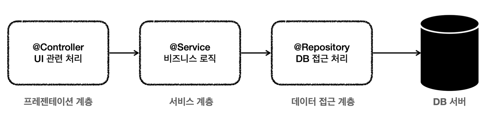
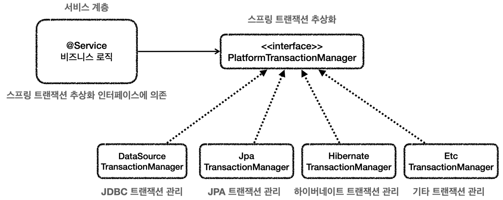
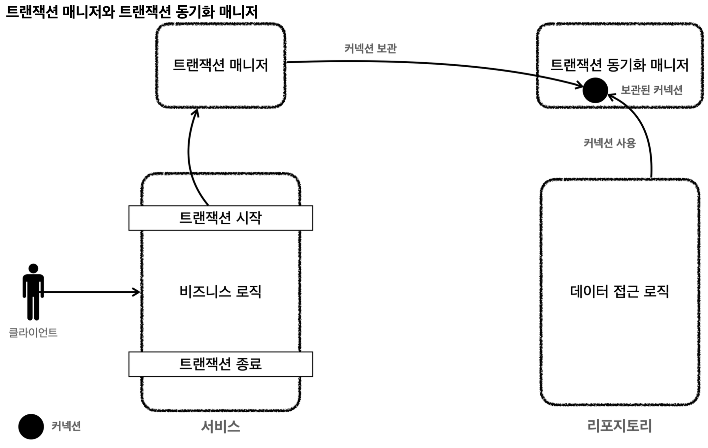
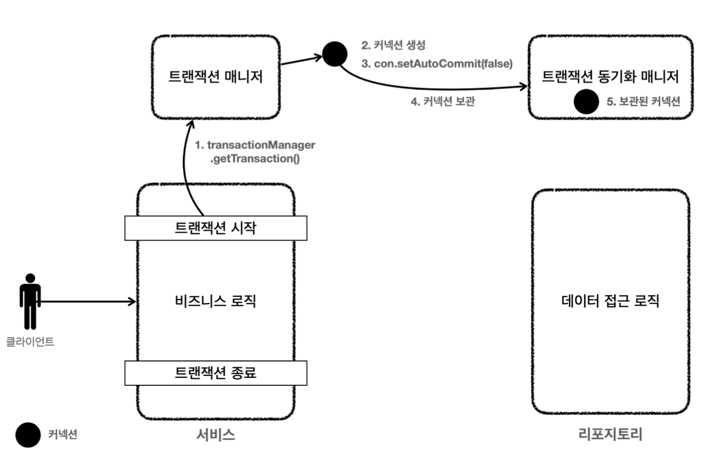
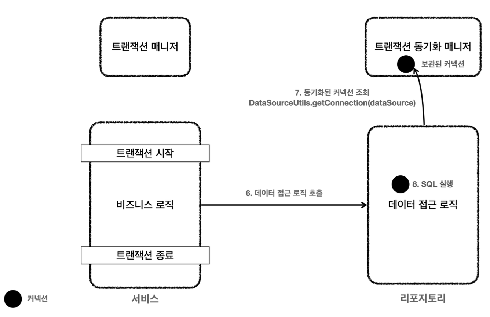
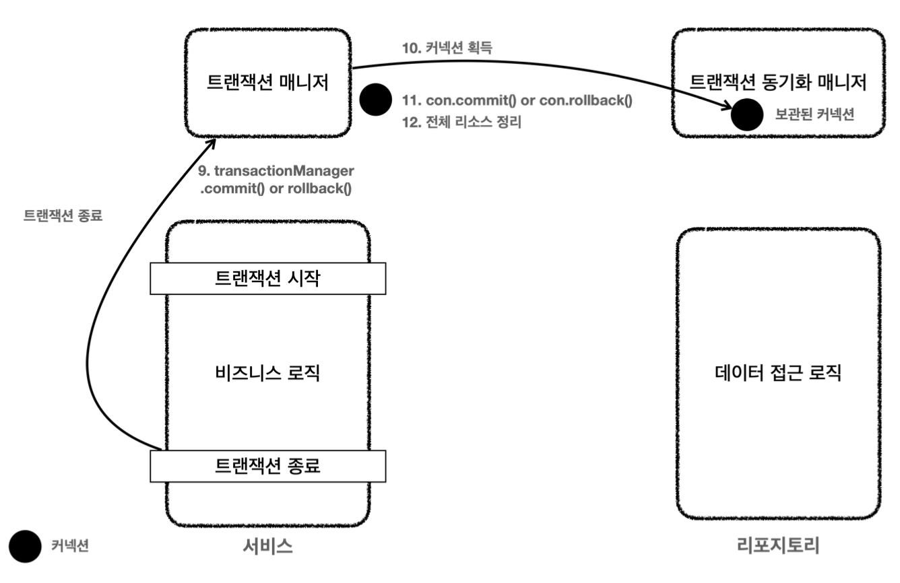

# 스프링과 문제 해결 - 트랜잭션
## 문제점들
### 애플리케이션 구조
가장 단순하면서 많이 사용하는 방법은 아래와 같이 3계층으로 나누는 것이다.

- 프레젠테이션 계층
  - UI와 관련된 처리를 담당
  - 웹 요청과 응답
  - 사용자 요청을 검증
  - 서블릿, HTTP같은 웹기술, 스프링 MVC 등의 기술을 주로 사용
- 서비스 계층
  - 비즈니스 로직을 담당
  - 특정기술에 의존하지 않고 순수 자바 코드로 작성
- 데이터 접근 계층
  - 실제 데이터베이스에 접근하는 코드
  - JDBC, JPA 등...

### 서비스 계층
- 여기서 가장 중요한 곳은 핵심 비즈니스 로직이 들어있는 서비스 계층이다. UI 혹은 웹과 관련된 부분이 변경되고, 데이저 저장 기술을 다른 기술을 변경한다 하더라도 비즈니스 로직은 최대한 변경이 없도록 유지되어야 한다.
- 이런점을 고려하기 위해서는 서비스 계층을 특정 기술에 종속적이지 않게 개발을 해야한다.
  - 위와 같이 계층을 나눈 것도 서비스 계층을 순수하게 유지하기 위한 목적이 크다. 기술에 종속적인 부분은 프레젠테이션 계층, 데이터 접근 계층에서 가지고 간다
- 서비스 계층이 특정 기술에 종속되지 않기 때문에 비즈니스 로직을 유지보수하기도 쉽고 테스트 하기도 용이하다

### 문제점
~~~java
public class MemberServiceV1 {

    private final MemberRepositoryV1 memberRepository;

    public void accountTransfer(String fromId, String toId, int money) throws SQLException {
        Member fromMember = memberRepository.findById(fromId);
        Member toMember = memberRepository.findById(toId);

        memberRepository.update(fromId, fromMember.getMoney() - money);

        validation(toMember);

        memberRepository.update(toId, toMember.getMoney() + money);
    }

    private void validation(Member toMember) {
        if (toMember.getMemberId().equals("ex")) {
            throw new IllegalStateException("이체 중 예외 발생");
        }
    }

}
~~~
- 위 코드를 보게되면 `MemberServiceV1`은 특정 기술에 종속되지 않고 순수한 비즈니스 로직만 존재한다.
- 하지만 `SQLException`이라는 JDBC 기술에 의존하고 있다.
- 이 예외는 `memberRepository`에서 던진 예외이기 때문에 `memberRepository`에서 해결을 해줘야한다.
- 그리고 `MemberRepositoryV1`이라는 구체 클래스에 직접 의존하고 있다. `MemberRepository` 인터페이스를 도입하게 되면 `MemberService`의 코드 변경 없이 다른 구현 기술로 쉽게 변경할 수 있을 것이다.

~~~java
@Slf4j
@RequiredArgsConstructor
public class MemberServiceV2 {

    private final DataSource dataSource;
    private final MemberRepositoryV2 memberRepository;

    public void accountTransfer(String fromId, String toId, int money) throws SQLException {
        Connection conn = dataSource.getConnection();

        try {
            conn.setAutoCommit(false); // 트랜잭션 시작

            // 비즈니스 로직
            bizLogic(conn, fromId, toId, money);
            conn.commit(); // 성공 시 커밋

        } catch (Exception e) {
            conn.rollback(); // 실패 시 롤백
            throw new IllegalStateException(e);

        } finally {
            release(conn);
        }

    }

    private void bizLogic(Connection conn, String fromId, String toId, int money) throws SQLException {
        Member fromMember = memberRepository.findById(conn, fromId);
        Member toMember = memberRepository.findById(conn, toId);

        memberRepository.update(conn, fromId, fromMember.getMoney() - money);
        validation(toMember);
        memberRepository.update(conn, toId, toMember.getMoney() + money);
    }

    private static void release(Connection conn) {
        if (conn != null) {
            try {
                conn.setAutoCommit(true); // 커넥션 풀 고려해서 true로 변경
                conn.close();
            } catch (Exception e) {
                log.info("error", e);
            }
        }
    }

    private void validation(Member toMember) {
        if (toMember.getMemberId().equals("ex")) {
            throw new IllegalStateException("이체 중 예외 발생");
        }
    }

}
~~~
- 트랜잭션 같은 경우 비즈니스 로직이 있는 서비스 계층에서 시작하는 것이 좋다.
- 그런데 트랜잭션을 사용하기 위해서는 `javax.sql.DataSource`, `java.sql.Connection`, `java.sql.SQLException` 같은 JDBC 기술에 의존해야한다.
- 이 코드는 트랜잭션을 사용하기 위해 JDBC 기술에 의존하고 있다. 즉, 비즈니스 로직 보다 JDBC를 사용하는 코드가 더 많다.
- 향후에 JDBC에서 다른 기술로 바꾸어 사용하게 되면 서비스 코드도 변경해야한다.
- 핵심 비즈니스 로직과 JDBC 기술이 섞여있어 유지보수 하기가 어렵다.

### 정리
**트랜잭션 문제**
- JDBC 구현 기술이 서비스 계층에서 사용되고 있다.
  - 트랜잭션을 적용하기 위해 JDBC 구현 기술이 서비스 계층에 누수되었다.
  - 서비스 계층은 구현 기술을 변경하더라도 최대한 유지할 수 있어야 한다.
    - 그렇기 때문에 데이터 접근 계층에 JDBC 코드를 넣어두는 것이다.
    - 데이터 접근 계층의 구현 기술이 변경될 수도 있기에 데이터 계층은 인터페이스를 제공하는 것이 좋다.
  - 서비스 게층은 특정 기술에 종속되지 않아야 한다.
- 트랜잭션 동기화 문제
  - 같은 트랜잭션을 유지하기 위해 커넥션을 파라미터로 넘겨야 한다.
  - 똑같은 기능인데도 트랜잭션용 기능과 트랜잭션을 유지하지 않아도 되는 기능으로 분리해야 한다
- 트랜잭션 적용 반복 문제
  - 트랜잭션 적용 코드의 반복이 많다.

**예외 누수**
- 데이터 접근 계층의 JDBC 구현 기술 예외가 서비스 계층으로 전파된다.
- `SQLException`은 체크 예외이므로 데이터 접근 계층을 호출한 서비스 계층에서 해당 예외를 잡아 처리하거나 throws을 이용해서 던지거나 해야한다
- `SQLException`은 JDBC 기술이다. 나중에 다른 데이터 접근 기술을 사용하면 그에 맞는 예외로 변경해야하고 서비스 계층의 코드도 수정해야 한다.

## 트랜잭션 추상화
트랜잭션을 사용하는 코드는 데이터 접근 기술마다 다르기 때문에 각 기술에 맞게 코드를 수정해야한다.

이러한 문제를 해결하기 위해서는 트랜잭션 기능을 추상화하면 된다.
~~~java
public interface TxManager{
  begin();
  commit();
  rollback();
}
~~~
이러한 인터페이스를 기반으로 각각의 기술에 맞는 구현체를 만들면 된다.
- 서비스 계층에서 트랜잭션 기술에 직접 의존하는 것이 아닌 추상화된 인터페이스에 의존한다. 이제 원하는 구현체를 DI를 통해 주입하기만 하면 된다
- 서비스는 인터페이스에 의존하고 DI를 사용한 덕분에 OCP 원칙을 지킬 수 있게 됐다.

### 스프링 트랜잭션 추상화

스프링에서는 트랜잭션 추상화 기슬울 제공한다. 데이터 접근 기술에 따른 트랜잭션 구현체도 만들어두어서 가져다 사용하기만 하면 된다.
~~~java
public interface PlatformTransactionManager extends TransactionManager {

     TransactionStatus getTransaction(@Nullable TransactionDefinition definition)
             throws TransactionException;
     void commit(TransactionStatus status) throws TransactionException;
     void rollback(TransactionStatus status) throws TransactionException;
}
~~~

## 트랜잭션 동기화
스프링이 제공하는 트랜잭션 매니저는 크게 두가지 역할을 한다
1. 트랜잭션 추상화
2. 리소스 동기화

**리소스 동기화**
트랜잭션을 유지하기 위해서는 트랜잭션 시작부터 끝까지 데이터베이스 커넥션을 유지해야한다. 이전에는 같은 커넥션을 동기화하기 위해서 파라미터로 커넥션을 전달하는 방법을 사용했다. 하지만 코드가 지저분해지고 커넥션을 넘기는 메서드와 넘기지 않은 메서드를 중복해서 만들어야하는 단점이 있었다.

- 스프링은 `트랜잭션 동기화 매니저`를 제공하는데, 이것은 쓰레드 로컬이라는 것을 사용해 커넥션을 동기화해준다. 트랜잭션 매니저는 내부에서 이 트랜잭션 동기화 매니저를 사용한다.
- 트랜잭션 동기화 매니저는 쓰레드 로컬을 사용하기 때문에 멀티쓰레드 환경에서도 안전하게 커넥션을 동기화 할 수 있다. 커넥션이 필요하면 트랜잭션 동기화 매니저를 통해 커넥션을 획득하면 된다.

과정을 간단히 설명하자면,  
1. 트랜잭션을 시작하기 위해선 커넥션이 필요하다. 트랜잭션 매니저는 데이터소스를 통해 커넥션을 만들고 트랜잭션을 시작한다.
2. 트랜잭션 매니저는 트랜잭션이 시작된 커넥션을 동기화 매니저에 보관한다.
3. 리포지토리는 트랜잭션 동기화 매니저에 보관된 커넥션을 꺼내 사용한다.
4. 트랜잭션이 종료되면 트랜잭션 매니저는 트랜잭션 동기화 매니저에 보관된 커넥션을 통해 트랜잭션을 종료하고 커넥션도 닫는다.

## 트랜잭션 문제 해결 - 트랜잭션 매니저 1
~~~java
@Slf4j
public class MemberRepositoryV3 {

    private final DataSource dataSource;

    public MemberRepositoryV3(DataSource dataSource) {
        this.dataSource = dataSource;
    }

    public Member save(Member member) throws SQLException {
        String sql = "insert into member(member_id, money) values (?,?)";

        Connection conn = null;
        PreparedStatement pstmt = null;

        try {
            conn = getConnection();
            pstmt = conn.prepareStatement(sql);
            pstmt.setString(1, member.getMemberId());
            pstmt.setInt(2, member.getMoney());
            pstmt.executeUpdate();

            return member;
        } catch (SQLException e) {

            log.error("db error, ", e);
            throw e;
        } finally {
            close(conn, pstmt, null);

        }
    }

    public Member findById(String memberId) throws SQLException {
        String sql = "select * from member where member_id = ?";

        Connection conn = null;
        PreparedStatement pstmt = null;
        ResultSet rs = null;

        try {
            conn = getConnection();
            pstmt = conn.prepareStatement(sql);
            pstmt.setString(1, memberId);

            rs = pstmt.executeQuery();

            if (rs.next()) {
                Member member = new Member();
                member.setMemberId(rs.getString("member_id"));
                member.setMoney(rs.getInt("money"));
                return member;
            } else {
                throw new NoSuchElementException("member not found. memberId = " + memberId);
            }
        }catch (SQLException e) {
            log.error("db error", e);
            throw e;
        } finally {
            close(conn, pstmt, rs);
        }
    }

    public void update(String memberId, int money) throws SQLException {
        String sql = "update member set money = ? where member_id=?";

        Connection conn = null;
        PreparedStatement pstmt = null;

        try {

            conn = getConnection();
            pstmt = conn.prepareStatement(sql);

            pstmt.setInt(1, money);
            pstmt.setString(2, memberId);
            int resultSize = pstmt.executeUpdate();
            log.info("resultSize = {}", resultSize);
        } catch (SQLException e) {

            log.error("db error, ", e);
            throw e;
        } finally {
            close(conn, pstmt, null);

        }
    }

    public void delete(String memberId) throws SQLException {
        String sql = "delete from member where member_id = ?";

        Connection conn = null;
        PreparedStatement pstmt = null;

        try {

            conn = getConnection();
            pstmt = conn.prepareStatement(sql);

            pstmt.setString(1, memberId);
            pstmt.executeUpdate();
        } catch (SQLException e) {

            log.error("db error, ", e);
            throw e;
        } finally {
            close(conn, pstmt, null);

        }

    }

    private void close(Connection conn, Statement stmt, ResultSet rs) {

        JdbcUtils.closeResultSet(rs);
        JdbcUtils.closeStatement(stmt);
        // 주의! 트랜잭션 동기화를 사용하려면 DataSourceUtils를 사용해야 한다.
        DataSourceUtils.releaseConnection(conn, dataSource);

    }

    private Connection getConnection() throws SQLException{
        // 주의! 트랜잭션 동기화를 사용하려면 DataSourceUtils를 사용해야 한다.
        Connection conn = DataSourceUtils.getConnection(dataSource);
        log.info("get connection = {}, class = {}", conn, conn.getClass());
        
        return conn;
    }
}
~~~
- 커넥션을 파라미터로 받는 메서드를 제거하였다
- `getConnection()`에서 `DataSourceUtils.getConnection()`을 사용하고 있다.
  - **트랜잭션 동기화 매니저가 관리하는 커넥션이 있으면 해당 커넥션을 반환한다.**
  - 없을 경우에는 새로운 커넥션을 생성해서 반환한다.
- `DataSourceUtils.releaseConnection()`
  - 커넥션을 `conn.close()`하게 될 경우 직접 커넥션을 닫게되고 커넥션이 유지되지 않는 문제가 발생한다. 이 커넥션은 트랜잭션이 종료될 때까지 살아있어야 한다.
  - `DataSourceUtils.releaseConnection()`를 사용하면 바로 커넥션을 닫는 것이 아니라
    - **트랜잭션을 사용하기 위해 동기화된 커넥션은 닫지않고 그대로 유지해준다**
    - 트랜잭션 동기화 매니저가 관리하는 커넥션이 없는 경우 해당 커넥션을 닫는다.

~~~java
@Slf4j
@RequiredArgsConstructor
public class MemberServiceV3_1 {

    private final PlatformTransactionManager transactionManager;
    private final MemberRepositoryV3 memberRepository;

    public void accountTransfer(String fromId, String toId, int money) throws SQLException {
        // 트랜잭션 시작
        TransactionStatus status = transactionManager.getTransaction(new DefaultTransactionDefinition());

        try {
            // 비즈니스 로직
            bizLogic(fromId, toId, money);
            transactionManager.commit(status); // 성공 시 커밋

        } catch (Exception e) {
            transactionManager.rollback(status); // 실패 시 롤백
            throw new IllegalStateException(e);
        }

    }

    private void bizLogic(String fromId, String toId, int money) throws SQLException {
        Member fromMember = memberRepository.findById(fromId);
        Member toMember = memberRepository.findById(toId);

        memberRepository.update(fromId, fromMember.getMoney() - money);
        validation(toMember);
        memberRepository.update(toId, toMember.getMoney() + money);
    }

    private void validation(Member toMember) {
        if (toMember.getMemberId().equals("ex")) {
            throw new IllegalStateException("이체 중 예외 발생");
        }
    }

}
~~~
- 트랜잭션매니저를 주입받게되는데 여기서는 JDBC 기술을 사용하고 있기 때문에 `DataSourceTransactionManager` 구현체를 주입 받는다.
- `TransactionStatus status = transactionManager.getTransaction(new DefaultTransactionDefinition());`
  - 트랜잭션을 시작하고 `TransactionStatus status`를 반환한다. 현재 트랜잭션의 상태 정보가 포함되어 있고 트랜잭션을 커밋, 롤백할 대 사용된다.

## 트랜잭션 문제 해결 - 트랜잭션 매니저 2

클라이언트 요청으로 서비스 로직 실행
1. 서비스 계층에서 `transactionManager.getTransaction()`을 호출해 트랜잭션을 시작
2. 트랜잭션을 시작하기 위해선 커넥션이 필요하다. 트랜잭션 매니저 내부에서 데이터소스를 사용해 커넥션을 생성
3. 커넥션을 수동커밋으로 변경한 후 실제 데이터베이스 트랜잭션을 시작
4. 커넥션을 트랜잭션 동기화 매니저에 보관
5. 트랜잭션 동기화 매니저는 쓰레드 로컬에 커넥션을 보관

6. 비즈니스 로직을 실행하면서 리포지토리의 메서드를 호출, 이때 커넥션을 파라미터로 전달하지 않는다.
7. 리포지토리의 메서드들은 트랜잭션이 시작된 커넥션이 필요한데, 리포지토리는 `DataSourceUtils.getConnection()`을 사용해 트랜잭션 동기화 매니저에 보관된 커넥션을 꺼내 사용한다.
8. 꺼낸 커넥션을 사용해 SQL을 DB에 전달해 실행

9. 비즈니스 로직이 끝난 뒤 트랜잭션을 종료한다. 커밋 or 롤백 시 종료
10. 트랜잭션을 종료하기 위해서는 동기화된 커넥션이 필요한데 트랜잭션 동기화 매니저를 통해서 동기화된 커넥션을 획득
11. 획득한 커넥션을 커밋 or 롤백
12. 리소스를 정리
  - 트랜잭션 동기화 매니저 정리
  - `con.setAutoCommit(true)`로 되돌림
  - `con.close()`를 호출해 커넥션 종료, 커넥션 풀 사용 시 `con.close()`를 사용하면 커넥션 풀에 반환

트랜잭션 추상화 덕에 서비스 코드는 JDBC 기술에 의존하지 않게 되었고 트랜잭션 동기화 매니저 덕분에 커넥션을 파라미터로 전달하지 않아도 되었다.

## 트랜잭션 문제 해결 - 트랜잭션 템플릿
~~~Java
public void accountTransfer(String fromId, String toId, int money) throws SQLException {
        // 트랜잭션 시작
        TransactionStatus status = transactionManager.getTransaction(new DefaultTransactionDefinition());

        try {
            // 비즈니스 로직
            bizLogic(fromId, toId, money);
            transactionManager.commit(status); // 성공 시 커밋

        } catch (Exception e) {
            transactionManager.rollback(status); // 실패 시 롤백
            throw new IllegalStateException(e);
        }

    }
~~~
- 트랜잭션을 사용하는 코드를 보면 반복되는 패턴을 볼 수 있다.
- 트랜잭션을 시작하고, 비즈니스 로직을 실행하고, 성공하면 커밋, 실패하면 롤백한다.
- 이런 형태가 각 서비스에서 반복된다. 비즈니스 로직 부분만 달라진다
- 이럴 때 템플릿 콜백 패턴을 활용하게 되면 반복 문제를 해결할 수가 있다.

### 트랜잭션 템플릿
~~~java
@Slf4j
public class MemberServiceV3_2 {

    private final TransactionTemplate txTemplate;
    private final MemberRepositoryV3 memberRepository;

    public MemberServiceV3_2(PlatformTransactionManager transactionManager, MemberRepositoryV3 memberRepository) {
        this.txTemplate = new TransactionTemplate(transactionManager);
        this.memberRepository = memberRepository;
    }

    public void accountTransfer(String fromId, String toId, int money) throws SQLException {

        txTemplate.executeWithoutResult((status) -> {
            try {
                bizLogic(fromId, toId, money);
            } catch (SQLException e) {
                throw new IllegalStateException(e);
            }
        });

    }

    private void bizLogic(String fromId, String toId, int money) throws SQLException {
        Member fromMember = memberRepository.findById(fromId);
        Member toMember = memberRepository.findById(toId);

        memberRepository.update(fromId, fromMember.getMoney() - money);
        validation(toMember);
        memberRepository.update(toId, toMember.getMoney() + money);
    }

    private void validation(Member toMember) {
        if (toMember.getMemberId().equals("ex")) {
            throw new IllegalStateException("이체 중 예외 발생");
        }
    }

}
~~~
- `TransactionTemplate`를 사용하려면 `transactionManager`가 필요하다. 생성자에서 `transactionManager`를 주입 받으면서 `TransactionTemplate`를 생성한다.

~~~java
txTemplate.executeWithoutResult((status) -> {
            try {
                bizLogic(fromId, toId, money);
            } catch (SQLException e) {
                throw new IllegalStateException(e);
            }
        });
~~~
- 트랜잭션 탬플릿 덕에 트랜잭션을 시작하고, 커밋, 롤백하는 코드가 불필요해졌다.
- 비즈니스 로직이 정상 수행되면 커밋, 언체크 예외 발생 시 롤백한다. 그 외의 경우에는 커밋

트랜잭션 템플릿을 사용하여 트랜잭션 사용 시 생기는 반복적인 코드를 줄일 수 있었다. 하지만 서비스 로직인데 비즈니스 로직 뿐만 아니라 트랜잭션을 처리하는 기술 로직이 함께 포함되어있다. 서비스 입장에서는 비즈니스 로직이 핵심 기능이고 트랜잭션이 부가 기능이다. 이렇게 비즈니스 로직과 트랜잭션을 처리하는 로직이 한 곳에 있으면 한 클래스에서 두가지 관심사를 한번에 처리하게 된다. 즉, 유지보수가 어려워진다.