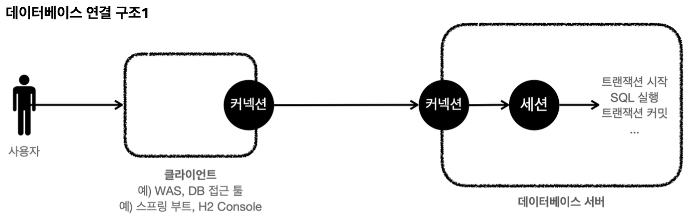
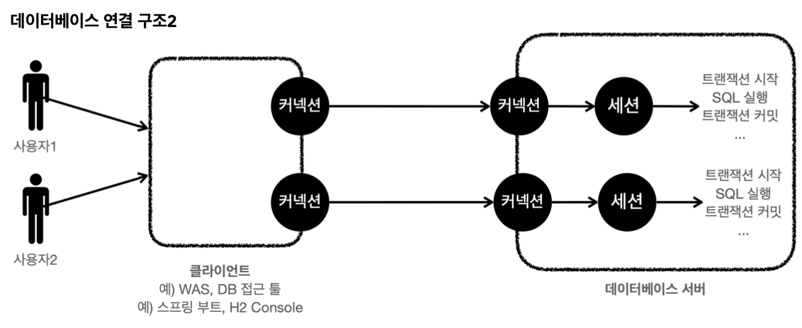
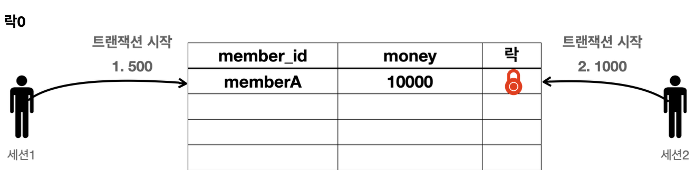
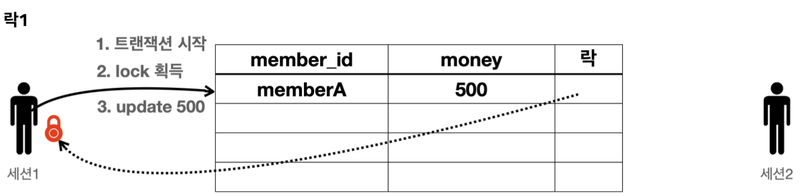
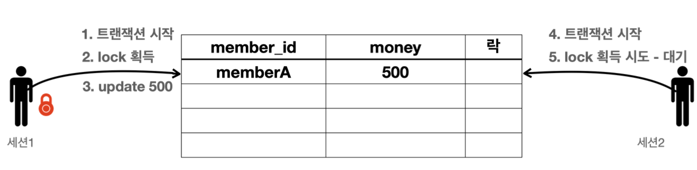
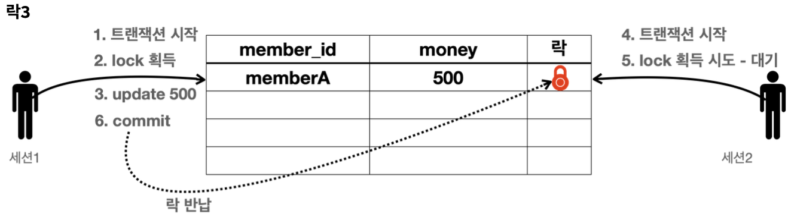
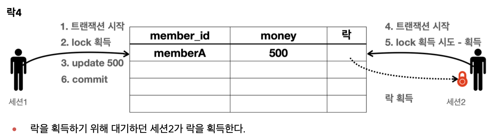
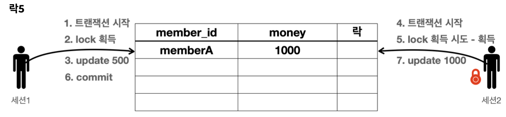
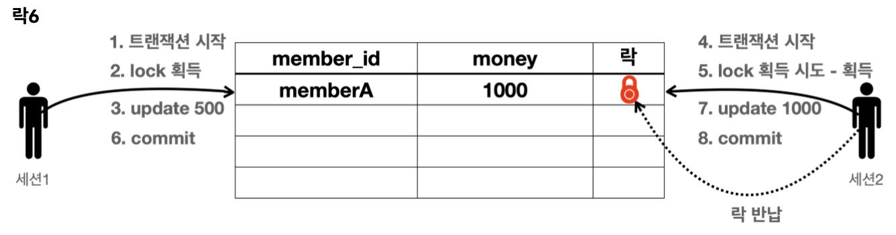

# 트랜잭션
## 트랜잭션이란
트랜잭션은 번역하자면 거래라는 뜻이다. 데이터베이스에서 트랜잭션은 하나의 거래를 안전하게 처리하도록 보장하는 것을 말한다. 
예를 들어, a가 b에게 10000원을 이체한다고 했을 때, a의 계좌에서 10000원이 감소되고 b의 계좌에 10000원이 증가되어야 한다. 만약 이때 a의 계좌에서 10000원 감소하는 것은 성공하고 b의 계좌에 10000원 증가하는 것이 실패하게 된다면 심각한 문제가 발생할 것이다.

데이터베이스에서 제공하는 트랜잭션 기능을 사용하게 되면 둘의 작업 중 하나라도 실패하게 되면 이전 상태로 돌아갈 수 있다.

모든 작업이 성공해서 데이터베이스에 정상적으로 반영하는 것을 `commit`, 하나라도 실패해서 거래 이전으로 되돌리는 것을 `rollback` 이라 한다.

## 트랜잭션 ACID
- `원자성(Atomicity)`: 트랜잭션 내에서 실행한 작업들은 하나의 작업인 것처럼 모두 성공하거나 모두 실패해야 한다.
- `일관성(Consistency)`: 모든 트랜잭션은 일관성 있는 데이터베이스 상태를 유지해야 한다.
- `격리성(Isolation)`: 동시에 실행되는 트랜잭션들이 서로에게 영향을 미치지 않도록 격리한다. 동시에 같은 데이터를 수정하지 못하도록 해야한다는 것이다.
- `지속성(Durability)`: 트랜잭션을 성공적으로 마치면 그 결과가 항상 기록되어야한다. 중간에 시스템에 문제가 생겨도 데이터베이스 로그 등을 이용해서 트랜잭션 내용을 복구할 수 있도록 해야한다.

## 데이터베이스 연결 구조와 DB 세션

- 사용자는 WAS나 DB접근 툴 같은 클라이언트를 사용해 데이터베이스 서버에 접근할 수 있다. 이때 클라이언트는 서버에 연결을 요청하고 커넥션을 맺게 된다. 이때 데이터베이스 서버는 서버 내부에 세션을 생성하고 해당 커넥션을 통한 모든 요청은 이 세션을 통해 실행하게 된다.
- 개발자가 클라이언트를 통해 SQL을 전달하면 현재 커넥션에 연결된 세션이 SQL을 실행한다는 것이다.
- 세션은 트랜잭션을 시작하고 커밋 or 롤백을 통해 트랜잭션을 종료하고 이후 새로운 트랜잭션을 다시 시작할 수 있다.
- 사용자가 커넥션을 닫거나 세션을 강제로 종료하게 되면 세션은 종료된다.

- 커넥션 풀이 10개의 커넥션을 생성하면 세션도 10개가 만들어진다.

## 트랜잭션 개념 이해
**트랜잭션 사용법**
- 데이터 변경 쿼리를 실행하고 데이터베이스에 그 결과를 반영하려면 `commit`을 호출하고, 결과를 반영하고 싶지 않다면 `rollback`을 호출
- `커밋을 호출하기 전까지는 임시로 데이터를 저장한다.` 따라서 해당 트랜잭션을 시작한 세션에게만 변경 데이터가 보이고 다른 세션에서는 변경 데이터가 보이지 않는다.

**예시**
- 세션1에서 트랜잭션을 시작하고 테이블에 데이터를 추가
- 추가한 데이터는 임시 상태로 저장된다.
- 세션1에서는 추가한 데이터를 조회할 수 있지만
- 다른 세션에서는 데이터를 조회할 수 없다.
  - 이때 다른 세션에서 커밋하지 않은 데이터를 조회할 수 있을 경우 다른 세션에서 그 데이터들을 가지고 어떠한 로직을 수행할 수 있다. 이때 세션1에서 롤백을 수행하게 되면 추가했던 데이터들이 사라지게 되고 문제가 발생하게 된다.

## 트랜잭션 - 자동커밋, 수동커밋
### 자동커밋
자동 커밋은 각각 쿼리 실행 직후에 자동으로 커밋을 호출하는 것을 말한다. 커밋이나 롤백을 직접 호출하지 않아 편리하지만 쿼리를 실행할 때마다 자동으로 커밋이 되버리기 때문에 트랜잭션 기능을 제대로 사용할 수 없다.

## DB 락 
세션1이 트랜잭션을 시작하고 데이터를 수정하고 있는 동안 커밋을 수행하지 않았는데 다른 세션에서 동시에 같은 데이터를 수정하게 될 경우 많은 문제가 발생하게 된다. 이때 원자성이 깨지게 된다. 더 나아가 세션1에서 롤백을 할 경우 다른 세션에서는 잘못된 데이터를 수정하는 문제가 발생하게 된다.

이런 문제를 방지하기 위해 트랜잭션을 시작하고 데이터를 수정하는 동안에는 커밋이나 롤백 전까지 다른 세션에서 해당 데이터를 수정할 수 없게 막아야 한다.

이런 문제를 해결하기 위해 `락(Lock)`이라는 개념을 제공한다.

**예시**

세션1이 회원1의 금액을 1000원으로 변경하고 싶고, 세션2가 회원1의 금액을 5000원으로 변경하고자 한다.

- 세션1이 트랜잭션을 시작
- 세션1이 회원1의 금액을 1000원으로 변경을 시도한다. 이때 해당 row의 락을 먼저 획득해야한다. 락이 남아있으므로 세션1은 락을 획득하게 된다.(세션1이 세션2보다 먼저 요청)
- 세션1은 락을 획득했으므로 해당 row에 update 수행

- 세션2가 트랜잭션 시작
- 세션2도 회원1의 금액을 변경하려고한다. 이때 해당 row의 락을 획득해야 한다. 락이 없으므로 락이 돌아올 때 까지 대기
- 무한정 대기하는 것이 아니라 락 대기 시간을 넘어가게 되면 락 타임아웃 오류가 발생한다. 대기 시간 설정 가능

- 세션1이 커밋을 수행, 트랜잭션이 종료되어 락 반납

- 대기하고 있던 세션2가 락을 획득

- 세션2가 update 수행

- 세션2는 커밋을 수행, 트랜잭션이 종료되어 락 반납

- `SET LOCK_TIMEOUT <milliseconds>`: 락 타임아웃 시간 설정, 시간 내 락을 얻지 못하면 락 타임아웃 오류 발생

## DB 락 - 조회
일반적인 조회에서는 락을 사용하지 않는다. 

- 데이터를 조회할 때도 락을 획득하고자 할 때는 `select for update` 구문을 사용하면 된다.
- 이렇게 하면 세션1이 조회 시점에서 락을 가져가기 때문에 다른 세션에서 해당 데이터를 변경할 수 없게 된다.
- 이 때도 트랜잭션을 커밋하면 락을 반납한다.
- 주로 해당 데이터를 다른 곳에서 변경하지 못하도록 강제로 막아야 할 때 사용한다.

## 트랜잭션 - 적용 2
- 트랜잭션은 비즈니스 로직이 있는 서비스 계층에서 시작해야 한다. 비즈니스 로직이 잘못되면 해당 비즈니스 로직으로 인해 문제가 되는 부분을 함께 롤백해줘야 하기 때문이다.
- 트랜잭션을 시작하기 위해서는 커넥션이 필요하다. 즉, 서비스 계층에서 커넥션을 만들고 트랜잭션 커밋 이후 커넥션을 종료해야 한다.
- 애플리케이션에서 DB 트랜잭션을 사용하기 위해서는 트랜잭션을 사용하는 동안 같은 커넥션을 유지해야한다. 그래야 같은 커넥션을 사용할 수가 있다.

- 서비스 계층에서 커넥션을 파라미터를 통해서 Repository로 전달해 커넥션을 사용하도록 하자

**Repository**
~~~java
public Member findById(Connection conn, String memberId) throws SQLException {
    String sql = "select * from member where member_id = ?";

    PreparedStatement pstmt = null;
    ResultSet rs = null;

    try {
        pstmt = conn.prepareStatement(sql);
        pstmt.setString(1, memberId);

        rs = pstmt.executeQuery();

        if (rs.next()) {
            Member member = new Member();
            member.setMemberId(rs.getString("member_id"));
            member.setMoney(rs.getInt("money"));
            return member;
        } else {
            throw new NoSuchElementException("member not found. memberId = " + memberId);
        }
    }catch (SQLException e) {
        log.error("db error", e);
        throw e;
    } finally {
        // Connection을 닫지 않는다.
        JdbcUtils.closeResultSet(rs);
        JdbcUtils.closeStatement(pstmt);
    }
}

public void update(Connection conn, String memberId, int money) throws SQLException {
    String sql = "update member set money = ? where member_id=?";

    PreparedStatement pstmt = null;

    try {

        pstmt = conn.prepareStatement(sql);

        pstmt.setInt(1, money);
        pstmt.setString(2, memberId);
        int resultSize = pstmt.executeUpdate();
        log.info("resultSize = {}", resultSize);
    } catch (SQLException e) {

        log.error("db error, ", e);
        throw e;
    } finally {
        JdbcUtils.closeStatement(pstmt);

    }
}
~~~
- service에서 넘겨준 커넥션을 사용해야 한다.
- 종료 또한 리포지토리에서 해주는 것이 아닌 서비스에서 해줘야한다.
**Service**
~~~java
public class MemberServiceV2 {

    private final DataSource dataSource;
    private final MemberRepositoryV2 memberRepository;

    public void accountTransfer(String fromId, String toId, int money) throws SQLException {
        Connection conn = dataSource.getConnection();

        try {
            conn.setAutoCommit(false); // 트랜잭션 시작

            // 비즈니스 로직
            bizLogic(conn, fromId, toId, money);
            conn.commit(); // 성공 시 커밋

        } catch (Exception e) {
            conn.rollback(); // 실패 시 롤백
            throw new IllegalStateException(e);

        } finally {
            release(conn);
        }

    }

    private void bizLogic(Connection conn, String fromId, String toId, int money) throws SQLException {
        Member fromMember = memberRepository.findById(conn, fromId);
        Member toMember = memberRepository.findById(conn, toId);

        memberRepository.update(conn, fromId, fromMember.getMoney() - money);
        validation(toMember);
        memberRepository.update(conn, toId, toMember.getMoney() + money);
    }

    private static void release(Connection conn) {
        if (conn != null) {
            try {
                conn.setAutoCommit(true); // 커넥션 풀 고려해서 true로 변경
                conn.close();
            } catch (Exception e) {
                log.info("error", e);
            }
        }
    }

    private void validation(Member toMember) {
        if (toMember.getMemberId().equals("ex")) {
            throw new IllegalStateException("이체 중 예외 발생");
        }
    }

}
~~~
- `conn.setAutoCommit(false)`: 트랜잭션 시작 시 자동 커밋 모드를 꺼야한다. 이렇게 하게 되면 커넥션을 통해서 세션에 `set autocommit false`가 전달되고 수동 커밋 모드로 바뀌게 된다.
- `release(conn)`: 커넥션 풀에서 받아온 커넥션을 사용하기 때문에 커넥션을 반납하게 된다. 이때 수동 커밋 설정을 되있는 커넥션을 자동 커밋으로 변경하고나서 풀에 반납해주는게 좋다.