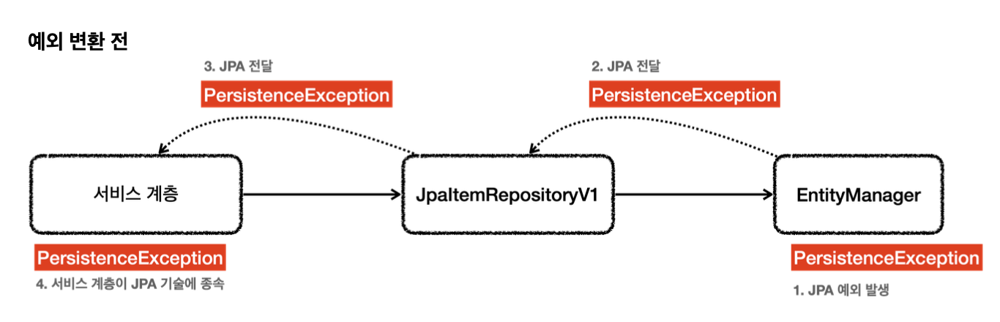
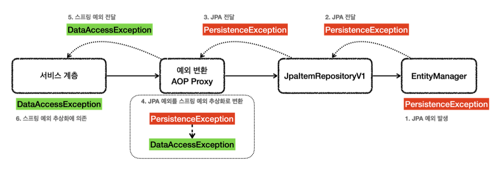

# 데이터 접근 기술 - JPA

## JPA 설정
`spring-boot-starter-data-jpa` 라이브러리를 사용하면 JPA와 스프링 데이터 JPA를 스프링 부트와 통합하고 설정도 간단히 할 수 있다.

의존관계 추가
~~~
implementation 'org.springframework.boot:spring-boot-starter-data-jpa'
~~~

jdbcTemplate 의존관계를 삭제해주자
~~~
implementation 'org.springframework.boot:spring-boot-starter-jdbc'
~~~

`spring-boot-starter-data-jpa`는 `spring-boot-starter-jdbc`도 함께 포함한다.

로그를 확인하기 위해 `application.properties`에 추가
~~~
logging.level.org.hibernate.SQL=DEBUG
logging.level.org.hibernate.type.descriptor.sql.BasicBinder=TRACE
~~~
- `org.hibernate.SQL=DEBUG`: 하이버네이트가 생성하고 실행하는 SQL을 확인할 수 있다.
- `org.hibernate.type.descriptor.sql.BasicBinder=TRACE`: SQL에 바인딩 되는 파라미터를 확인할 수 있다.

스프링부트 3.0 이상 사용 시 하이버네이트 6 버전을 사용하고 있는데 로그 설정 방식이 달라졌다. 아래와 같이 로그를 설정하도록 하자
~~~
logging.level.org.hibernate.SQL=DEBUG
logging.level.org.hibernate.orm.jdbc.bind=TRACE
~~~

## JPA 적용1 - 개발
JPA에서 가장 중요한 부분은 객체와 테이블을 매핑하는 것이다. JPA가 제공하는 애노테이션을 사용해서 Item 객체와 테이블을 매핑해보자
~~~java
@Data
@Entity
//@Table(name = "item") // 객체명과 같으면 생략 가능
public class Item {

    @Id
    @GeneratedValue(strategy = GenerationType.IDENTITY)
    private Long id;

    @Column(name = "item_name", length = 10)
    private String itemName;
    private Integer price;
    private Integer quantity;

    public Item() {
    }

    public Item(String itemName, Integer price, Integer quantity) {
        this.itemName = itemName;
        this.price = price;
        this.quantity = quantity;
    }
}
~~~

- `@Entity`: JPA가 사용하는 객체, 이 애노테이션이 있어야 JPA가 인식할 수 있다. 이렇게 `@Entity`가 붙은 객체를 JPA에서는 `엔티티`라고 한다.
- `@Id`: 테이블의 PK와 해당 필드를 매핑한다.
- `@GeneratedValue(strategy=GenerationType.IDENTITY)`: PK 생성 값을 데이터베이스에서 생성하는 IDENTITY 방식을 사용한다. MySQL의 auto increment
- `@Column`: 객체의 필드를 테이블의 컬럼과 매핑
  - `name = "item_name"`: 객체는 `itemName`이지만 테이블의 컬럼은 `item_name`이므로 이런식으로 매핑하였다.
  - `length = 10`: JPA 매핑 정보로 DDL(create table)도 생성이 가능하다. 이때 컬럼의 길이 값으로 활용
  - `@Column` 생략할 경우 필드의 이름을 테이블 컬럼으로 사용한다. 지금처럼 스프링부트와 통합해 사용하면 필드 이름을 테이블 컬럼명으로 변경할 때 객체 필드의 카멜 케이스를 테이블 컬럼의 언더스코어로 자동 변환해준다.

JPA는 public 또는 protected 기본 생성자가 필수이다. 꼭 넣어주도록 하자.

~~~java
@Slf4j
@Repository
@Transactional
public class JpaItemRepository implements ItemRepository {

    private final EntityManager em;

    public JpaItemRepository(EntityManager em) {
        this.em = em;
    }

    @Override
    public Item save(Item item) {
        em.persist(item);
        return item;
    }

    @Override
    public void update(Long itemId, ItemUpdateDto updateParam) {
        Item findItem = em.find(Item.class, itemId);
        findItem.setItemName(updateParam.getItemName());
        findItem.setPrice(updateParam.getPrice());
        findItem.setQuantity(updateParam.getQuantity());
    }

    @Override
    public Optional<Item> findById(Long id) {
        Item item = em.find(Item.class, id);
        return Optional.ofNullable(item);
    }

    @Override
    public List<Item> findAll(ItemSearchCond cond) {
        String jpql = "select i from Item i";

        Integer maxPrice = cond.getMaxPrice();
        String itemName = cond.getItemName();

        if (StringUtils.hasText(itemName) || maxPrice != null) {
            jpql += " where";
        }
        boolean andFlag = false;
        if (StringUtils.hasText(itemName)) {
            jpql += " i.itemName like concat('%',:itemName,'%')";
            andFlag = true;
        }
        if (maxPrice != null) {
            if (andFlag) {
                jpql += " and";
            }
            jpql += " i.price <= :maxPrice";
        }
        log.info("jpql={}", jpql);

        TypedQuery<Item> query = em.createQuery(jpql, Item.class);
        if (StringUtils.hasText(itemName)) {
            query.setParameter("itemName", itemName);
        }
        if (maxPrice != null) {
            query.setParameter("maxPrice", maxPrice);
        }
        return query.getResultList();
    }
}
~~~

- `private final EntityManager em`: 생성자를 보면 스프링을 통해 엔티티 매니저(EntityManager)라는 것을 주입받고 있다. JPA 모든 동작은 엔티티 매니저를 통해 이루어진다. 엔티티 매니저는 내부에 데이터소스를 가지고 있고 데이터베이스에 접근할 수 있다.
- `@Transactional`: JPA의 모든 데이터 변경(등록, 수정, 삭제)은 트랜잭션 안에서 이루어져야한다. 조회는 트랜잭션이 없어도 가능하고, 변경의 경우에는 일반적으로 서비스 계층에서 트랜잭션을 시작하기 때문에 문제가 없다. JPA에서는 데이터 변경 시 트랜잭션이 필수이다. 그렇기 때문에 리포지토리에 트랜잭션을 걸어주었다. 
**일반적으로는 비즈니스 로직을 시작하는 서비스 계층에 트랜잭션을 걸어주는 것이 맞다.**

JPA를 설정하기 위해서는 EntityManagerFactory, JpaTransactionManager, 데이터소스 등 다양한 설정을 해야한다. 스프링 부트는 이 과정을 모두 자동화 해준다.

~~~java
@Configuration
public class JpaConfig {

    private final EntityManager em;

    public JpaConfig(EntityManager em) {
        this.em = em;
    }

    @Bean
    public ItemService itemService() {
        return new ItemServiceV1(itemRepository());
    }

    @Bean
    public ItemRepository itemRepository() {
        return new JpaItemRepository(em);
    }
}
~~~

~~~java
@Slf4j
//@Import(MemoryConfig.class)
//@Import(JdbcTemplateV1Config.class)
//@Import(JdbcTemplateV2Config.class)
//@Import(JdbcTemplateV3Config.class)
//@Import(MyBatisConfig .class)
@Import(JpaConfig .class)
@SpringBootApplication(scanBasePackages = "hello.itemservice.web")
public class ItemServiceApplication {}
~~~

## JPA 적용2 - 리포지토리 분석
### save()
~~~java
@Override
public Item save(Item item) {
    em.persist(item);
    return item;
}
~~~
- `em.persist(item)`: JPA에서 객체를 테이블에 저장할 때는 엔티티 매니저가 제공하는 persist() 메서드를 사용하면 된다.

**JPA가 만들어서 실행한 SQL**
~~~sql
insert into item (id, item_name, price, quantity) values (null, ?, ?, ?) 
또는
insert into item (id, item_name, price, quantity) values (default, ?, ?, ?)
또는
insert into item (item_name, price, quantity) values (?, ?, ?)
~~~
- SQL을 보면 id 값이 빠져있는 것을 확인할 수가 있다. PK키 생성 전략을 `IDENTITY`로 사용했기 때문에 JPA가 이와 같은 쿼리를 만들어서 실행한 것이다.

~~~java
public class Item {
    
    @Id
    @GeneratedValue(strategy = GenerationType.IDENTITY)
    private Long id;
}
~~~

### update()
~~~java
@Override
public void update(Long itemId, ItemUpdateDto updateParam) {
    Item findItem = em.find(Item.class, itemId);
    findItem.setItemName(updateParam.getItemName());
    findItem.setPrice(updateParam.getPrice());
    findItem.setQuantity(updateParam.getQuantity());
}
~~~

**JPA가 만들어서 실행한 SQL**
~~~sql
update item set item_name=?, price=?, quantity=? where id=?
~~~
- `em.update()`와 같은 메서드 호출 없이 UPDATE SQL이 실행되었다.
- JPA는 트랜잭션이 커밋되는 시점에 변경된 엔티티 객체가 있는지 확인하고, 특정 엔티티 객체가 변경된 경우에 UPDATE SQL을 실행한다.

### findById()
~~~java
@Override
public Optional<Item> findById(Long id) {
    Item item = em.find(Item.class, id);
    return Optional.ofNullable(item);
}
~~~
- JPA에서 엔티티 객체를 PK를 기준으로 조회할 때는 `find()`를 사용하고 조회 타입과 PK 값을 주면 된다. 그러면 JPA가 아래와 같은 SQL을 만들어 실행하고 결과를 객체로 변환해준다.
~~~sql
select
    item0_.id as id1_0_0_,
    item0_.item_name as item_nam2_0_0_,
    item0_.price as price3_0_0_,
    item0_.quantity as quantity4_0_0_   
from item item0_
where item0_.id=?
~~~

### findAll
~~~java
@Override
public List<Item> findAll(ItemSearchCond cond) {
    String jpql = "select i from Item i";

    TypedQuery<Item> query = em.createQuery(jpql, Item.class);
    return query.getResultList();
}
~~~

#### JPQL
JPA는 JPQL(Java Persistence Query Language)이라는 객체지향 쿼리 언어를 제공한다. 
주로 여러 데이터를 복잡한 조건으로 조회할 때 사용한다. 
SQL이 테이블을 대상으로 한다고 하면 JPQL은 엔티티 객체 대상으로 SQL을 실행한다고 생각하면 된다. 
엔티티 객체를 대상으로 하기 때문에 from 다음 Item `엔티티 객체 이름`이 들어간다. 엔티티 객체와 속성은 대소문자를 구분해야 한다.

**실행된 JPQL**
~~~sql
select i from Item i
where i.itemName like concat('%',:itemName,'%')
    and i.price <= :maxPrice
~~~

**JPQL을 통해 실행된 SQL**
~~~sql
select
    item0_.id as id1_0_,
    item0_.item_name as item_nam2_0_,
    item0_.price as price3_0_,
    item0_.quantity as quantity4_0_
from item item0_
where (item0_.item_name like ('%'||?||'%'))
    and item0_.price<=?
~~~

**파라미터** 
JPQL에서 파라미터는 다음과 같이 입력한다.
- where price <= :maxPrice
- 파라미터 바인딩은 다음과 같이 한다
- query.setParameter("maxPrice", maxPrice)

**동적쿼리문제**
JPA를 사용해도 동적 쿼리 문제가 남아있다. 동적 쿼리는 `Querydsl`이라는 기술을 사용하면 깔끔하게 사용할 수 있다.

## JPA 적용3 - 예외 변환
JPA의 경우 예외가 발생하면 JPA 예외가 발생하게 된다.
~~~java
@Repository
@Transactional
public class JpaItemRepository implements ItemRepository {

    private final EntityManager em;

    public JpaItemRepository(EntityManager em) {
        this.em = em;
    }

    @Override
    public Item save(Item item) {
        em.persist(item);
        return item;
    }
}
~~~
- `EntityManager`는 순수 JPA 기술이고 스프링과는 아무 연관이 없다. 따라서 엔티티 매니저는 예외가 발생하면 JPA 관련 예외를 발생시킨다.
- JPA는 `PersistenceException`과 그 하위 예외를 발생시킨다.
    - 추가로 JPA는 `IllegalStateException`, `IllegalArgumentException`을 발생시킬 수 있다.
- 어떻게 JPA 예외를 스프링 예외 추상화로 어떻게 변환할 수 있었던걸까?
- 바로 `@Repository`에 정답이 있다.

**@Repository의 기능**
- @Repository 애노테이션이 붙은 클래스는 컴포넌트 스캔의 대상이 된다.
- 또한 예외 변환 AOP의 적용 대상이 된다.
    - 스프링과 JPA를 함께 사용하는 경우 스프링은 JPA 예외 변환기를 등록한다.(PersistenceExceptionTranslator)
    - 예외 변환 AOP 프록시는 JPA 관련 예외가 발생하게 되면 JPA 예외 변환기를 통해 스프링 데이터 접근 예외로 변환한다.

`@Repository` 애노테이션만 있으면 스프링이 예외 변환을 처리하는 AOP를 만들어준다.