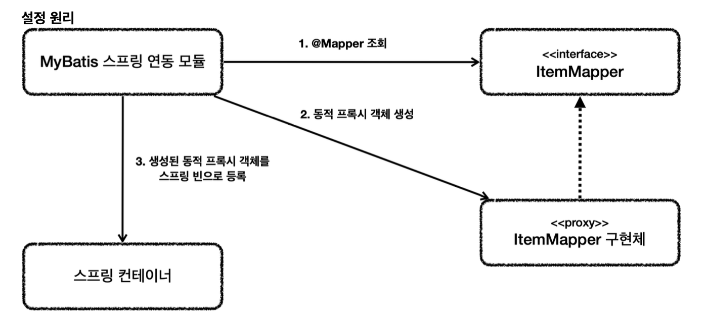

# 데이터 접근 기술 - MyBatis

## MyBatis 소개
MyBatis는 JdbcTemplate보다 더 많은 기능을 제공하는 SQL Mapper 이다.

가장 매력적인 부분은 SQL을 XML에 편리하게 작성 가능하고 동적 쿼리를 매우 편리하게 작성할 수 있다.

## MyBatis 설정
의존성 추가
~~~
implementation 'org.mybatis.spring.boot:mybatis-spring-boot-starter:3.0.3'
~~~

`application.properties`에 추가  
`main`과 `test`각 위치에 있는 파일 모두 수정

~~~
mybatis.type-aliases-package=hello.itemservice.domain
mybatis.configuration.map-underscore-to-camel-case=true
logging.level.hello.itemservice.repository.mybatis=trace
~~~
- `mybatis.type-aliases-package`
  - 마이바티스에서 타입 정보 사용 시 패키지 이름을 적어주어야 한다. 여기에 명시하게되면 패키지 이름을 생략할 수 있다.
  - 지정한 패키지와 그 하위 패키지가 자동으로 인식된다.
  - `,`나 `;`로 구분
- `map-underscore-to-camel-case`
  - 언더바를 카멜로 자동 변경해주는 기능을 활성화

## MyBatis 적용1 - 기본
XML에 SQL을 작성한다는 점을 제외하고는 JDBC 반복을 줄여준다는 점에서 JdbcTemplate와 거의 유사하다

~~~java
@Mapper
public interface ItemMapper {

    void save(Item item);

    void update(@Param("id") Long id, @Param("updateParam") ItemUpdateDto updateParam);

    Optional<Item> findById(Long id);

    List<Item> findAll(ItemSearchCond itemSearchCond);

}
~~~
- 마이바티스 매핑 XML을 호출해주는 매퍼 인터페이스이다.
- 이 인터페이스에는 `@Mapper`를 붙여주어야한다. 그래야 MyBatis가 인식을 할 수 있다.
- 이 인터페이스의 메서드를 호출하면 xml의 해당 SQL을 실행하고 결과를 돌려준다.

같은 위치에 실행할 SQL이 있는 XML 매핑 파일을 만들어주자. 
자바 코드가 아니기 때문에 `src/main/resources` 하위에 만들되 패키지 위치는 맞추어 주어야 한다.

~~~xml
<?xml version="1.0" encoding="UTF-8"?>
<!DOCTYPE mapper PUBLIC "-//mybatis.org//DTD Mapper 3.0//EN"
        "http://mybatis.org/dtd/mybatis-3-mapper.dtd">
<mapper namespace="hello.itemservice.repository.mybatis.ItemMapper">

    <insert id="save" useGeneratedKeys="true" keyProperty="id">
        insert into item(item_name, price, quantity)
        values(#{itemName}, #{price}, #{quantity})
    </insert>

    <update id="update">
        update item
        set item_name=#{updateParam.itemName},
            price=#{updateParam.price},
            quantity=#{updateParam.quantity}
        where id = #{id}
    </update>

    <select id="findById" resultType="Item">
        select id, item_name, price, quantity
        from item
        where id = #{id}
    </select>

    <select id="findAll" resultType="Item">
        select id, item_name, price, quantity
        from item
        <where>
            <if test="itemName != null and itemName != ' '">
                and item_name like concat('%', #{itemName},'%')
            </if>
            <if test="maxPrice != null">
                and price $lt;= #{maxPrice}
            </if>
        </where>
    </select>

</mapper>
~~~
- `namespace`: 매퍼 인터페이스를 지정하면 된다.
  - 경로와 파일 이름 주의!

**XML 파일 경로 수정하기**  
XML파일을 원하는 위치에 두고 싶다면 `application.properties`에 다음과 같이 설정하자.
`mybatis.mapper-locations=classpath:mapper/**/*.xml`

이렇게 하면 `resources/mapper`를 포함한 그 하위 폴더에 있는 XML을 XML 매핑 파일로 인식한다.

### insert - save
~~~java
void save(Item item);
~~~
~~~xml
<insert id="save" useGeneratedKeys="true" keyProperty="id">
    insert into item(item_name, price, quantity)
    values(#{itemName}, #{price}, #{quantity})
</insert>
~~~
- `<insert>`사용
- id에는 매퍼 인터페이스에 설정한 `메서드 이름`을 지정하면 된다. 
- 파라미터는 `#{}` 문법을 사용한다. 매퍼에서 넘긴 객체의 프로퍼티 이름을 적어주면 된다.
- `#{}` 사용 시 `PreparedStatement`를 사용한다. JDBC의 ?를 치환한다 생각하자.
- `useGeneratedKeys`: 데이터베이스가 키를 생성해주는 IDENTITY 전략일 때 사용, `keyProperty`는 생성되는 키의 속성 이름을 지정한다. Insert가 끝나면 item 객체의 id 속성에 생성된 값이 입력된다.

### update - update
~~~java
void update(@Param("id") Long id, @Param("updateParam") ItemUpdateDto updateParam);
~~~
~~~xml
<update id="update">
    update item
    set item_name=#{updateParam.itemName},
        price=#{updateParam.price},
        quantity=#{updateParam.quantity}
    where id = #{id}
</update>
~~~
- `<update>` 사용
- 여기서는 파라미터가 `Long id`, `ItemUpdateDto updateParam` 두 개가 있다. 파라미터가 1개만 있으면 `@Param`을 지정하지 않아도 되지만 파라미터가 2개 이상이면 `@Param`으로 이름을 지정해서 파라미터를 구분해야 한다.

### select - findById
~~~java
Optional<Item> findById(Long id);
~~~
~~~xml
<select id="findById" resultType="Item">
    select id, item_name, price, quantity
    from item
    where id = #{id}
</select>
~~~
- `<select>` 사용
- `resultType`: 반환 타입을 명시하면 된다.
  - `application.properties`에 `mybatis.type-aliases-package=hello.itemservice.domain` 속성을 지정해줬기 때문에 모든 패키지를 적어주지 않아도 됐다.
  - JdbcTemplate의 `BeanPropertyRowMapper`처럼 `SELECT` SQL의 결과를 편리하게 객체로 바로 변환해준다.
  - `mybatis.configuration.map-underscore-to-camel-case=true` 속성을 지정해준 덕분에 카멜 표기법으로 자동으로 처리해준다.
- 반환 객체가 하나면 `Item`, `Optional<Item>` 처럼 사용하면 되고 하나 이상이면 컬렉션을 사용하면 된다. `List`

### select - findAll
~~~java
List<Item> findAll(ItemSearchCond itemSearchCond);
~~~
~~~xml
<select id="findAll" resultType="Item">
    select id, item_name, price, quantity
    from item
    <where>
        <if test="itemName != null and itemName != ' '">
            and item_name like concat('%', #{itemName},'%')
        </if>
        <if test="maxPrice != null">
            and price $lt;= #{maxPrice}
        </if>
    </where>
</select>
~~~
- 마이바티스는 `<where>`, `<if>` 같은 동적 쿼리 문법을 통해 편리한 동적 쿼리를 지원한다.
- `<if>`는 해당 조건이 만족했을 때 구문을 추가한다.
- `<where>`는 적절하게 where문장을 만들어준다.
  - 위에서 `if`가 모두 실패하게되면 SQL WHERE을 만들지 않는다.
  - 하나라도 성공한 경우 처음 나타나는 and를 where로 변환해준다.

## MyBatis 적용2 - 설정과 실행
~~~java
@Repository
@RequiredArgsConstructor
public class MyBatisItemRepository implements ItemRepository {

    private final ItemMapper itemMapper;

    @Override
    public Item save(Item item) {
        itemMapper.save(item);
        return item;
    }

    @Override
    public void update(Long itemId, ItemUpdateDto updateParam) {
        itemMapper.update(itemId, updateParam);
    }

    @Override
    public Optional<Item> findById(Long id) {
        return itemMapper.findById(id);
    }

    @Override
    public List<Item> findAll(ItemSearchCond cond) {
        return itemMapper.findAll(cond);
    }
}
~~~
`MyBatisItemRepository`는 단순히 ItemMapper에 기능을 위임한다.

~~~java
@Configuration
@RequiredArgsConstructor
public class MyBatisConfig {

    private final ItemMapper itemMapper;

    @Bean
    public ItemService itemService() {
        return new ItemServiceV1(itemRepository());
    }

    @Bean
    public ItemRepository itemRepository() {
        return new MyBatisItemRepository(itemMapper);
    }
}
~~~

~~~java
@Slf4j
//@Import(MemoryConfig.class)
//@Import(JdbcTemplateV1Config.class)
//@Import(JdbcTemplateV2Config.class)
//@Import(JdbcTemplateV3Config.class)
@Import(MyBatisConfig .class)
@SpringBootApplication(scanBasePackages = "hello.itemservice.web")
public class ItemServiceApplication {

	public static void main(String[] args) {
		SpringApplication.run(ItemServiceApplication.class, args);
	}

	@Bean
	@Profile("local")
	public TestDataInit testDataInit(ItemRepository itemRepository) {
		return new TestDataInit(itemRepository);
	}

//	@Bean
//	@Profile("test")
//	public DataSource dataSource() {
//		log.info("메모리 데이터베이스 초기화");
//		DriverManagerDataSource dataSource = new DriverManagerDataSource();
//		dataSource.setDriverClassName("org.h2.Driver");
//		dataSource.setUrl("jdbc:h2:mem:db;DB_CLOSE_DELAY=-1");
//		dataSource.setUsername("sa");
//		dataSource.setPassword("");
//
//		return dataSource;
//	}

}
~~~

## MyBatis 적용3 - 분석
ItemMapper 매퍼 인터페이스의 구현체가 없는데 어떻게 동작을 한 것인가??

바로 MyBatis 스프링 연동 모듈에서 자동으로 처리해주기 때문이다.

1. 애플리케이션 로딩 시점에 MyBatis 스프링 연동 모듈은 `@Mapper`가 붙어있는 인터페이스를 찾는다.
2. 인터페이스를 발견하면 동적 프록시 기술을 사용해 `ItemMapper` 인터페이스의 구현체를 생성한다.
3. 생성된 구현체를 스프링 빈으로 등록한다.

로그를 확인해보면
~~~
itemMapper class=class com.sun.proxy.$Proxy69
~~~
JDK 동적 프록시가 적용된 것을 확인할 수 있다.

### 매퍼 구현체
- MyBatis 스프링 연동이 만들어주는 `ItemMapper` 구현체 덕에 인터페이스만으로 편리하게 XML의 데이터를 찾아 호출할 수 있다.
- 원래는 더 번잡한 코드가 필요했지만 이런 부분을 인터페이스 하나로 깔끔하고 편리하게 사용할 수 있게 되었다.
- 매퍼 구현체는 예외 변환까지 처리해준다. MyBatis에서 발생한 예외를 스프링 예외 추상화인 `DataAccessException`에 맞게 변환해준다. 

## MyBatis 기능 정리1 - 동적 쿼리
### 동적 SQL
동적 쿼리를 위해 제공되는 기능
- `if`
- `choose(when, otherwise)`
- `trim (where, set)`
- `foreach`

#### if
~~~xml
<select id="findActiveBlogWithTitleLike" resultType="Blog">
   SELECT * FROM BLOG
   WHERE state = ‘ACTIVE’
   <if test="title != null">
     AND title like #{title}
   </if>
</select>
~~~
- 해당 조건에 따라 값을 추가할지 말지 판단

#### choose, when, otherwise
~~~xml
<select id="findActiveBlogLike" resultType="Blog">
   SELECT * FROM BLOG WHERE state = ‘ACTIVE’
   <choose>
     <when test="title != null">
       AND title like #{title}
     </when>
     <when test="author != null and author.name != null">
       AND author_name like #{author.name}
     </when>
     <otherwise>
       AND featured = 1
     </otherwise>
   </choose>
</select>
~~~
- 자바 switch 구문과 유사한 구문

#### trim, where, set
~~~xml
<select id="findActiveBlogLike" resultType="Blog">
   SELECT * FROM BLOG
   WHERE
   <if test="state != null">
     state = #{state}
   </if>
   <if test="title != null">
     AND title like #{title}
   </if>
   <if test="author != null and author.name != null">
     AND author_name like #{author.name}
   </if>
</select>
~~~
위 예제의 문제점을 문장을 모두 만족하지 않을 때와 title만 만족할 때 발생하게 된다.
~~~xml
SELECT * FROM BLOG
WHERE
~~~
~~~xml
SELECT * FROM BLOG
WHERE
AND title like #{title}
~~~

WHERE문을 언제 넣어줘야 할지에 따라 동적으로 달라지는 문제가 생기게 된다.
이때 `<where>`를 사용하면 문제를 해결할 수 있다.
~~~xml
<select id="findActiveBlogLike" resultType="Blog">
   SELECT * FROM BLOG
   <where>
     <if test="state != null">
          state = #{state}
     </if>
     <if test="title != null">
         AND title like #{title}
     </if>
     <if test="author != null and author.name != null">
         AND author_name like #{author.name}
     </if>
   </where>
</select>
~~~
`<where>`는 문장이 없으면 where를 추가하지 않는다. 문장이 있으면 where를 추가한다. AND가 먼저 시작된다면 AND를 지운다.

trim이라는 기능을 사용해도 된다.
~~~xml
<trim prefix="WHERE" prefixOverrides="AND |OR ">
    ... 
</trim>
~~~

#### foreach
~~~xml
<select id="selectPostIn" resultType="domain.blog.Post">
   SELECT *
   FROM POST P
   <where>
     <foreach item="item" index="index" collection="list"
         open="ID in (" separator="," close=")" nullable="true">
           #{item}
     </foreach>
</where>
</select>
~~~
- 컬렉션을 반복처리할 때 사용한다.
- 파라미터로 List를 전달하면 된다.

## MyBatis 기능 정리2 - 기타 기능

### 애노테이션으로 SQL 작성
~~~java
@Select("select id, item_name, price, quantity from item where id = #{id}")
Optional<Item> findById(Long id);
~~~
- `@Insert`, `@Update`, `@Delete`, `@Select` 기능이 제공된다.
- 이 경우 XML에 있는 `<select id="findById">...</select>`를 지워줘야 한다.
- 간단한 경우에만 사용하자

### 문자열 대체
`#{}`는 ? 를 넣고 파라미터를 바인딩하는 `PreparedStatement`를 사용한다. 문자 그대로 처리하고자 할 때는 `${}`를 사용하면 된다.

**`${}`사용 시 SQL 인젝션 공격을 당할 수 있으므로 가급적이면 사용하지말자.**

### 재사용 가능한 SQL 조각
~~~xml
<sql id="userColumns"> ${alias}.id,${alias}.username,${alias}.password </sql>

<select id="selectUsers" resultType="map">
    select
        <include refid="userColumns"><property name="alias" value="t1"/></include>,
        <include refid="userColumns"><property name="alias" value="t2"/></include>
    from some_table t1
        cross join some_table t2
</select>
~~~
- `<include>`를 통해 `<sql>` 조각을 찾아 사용이 가능하다.

~~~xml
<sql id="sometable">
    ${prefix}Table
</sql>

<sql id="someinclude">
    from
        <include refid="${include_target}"/>
</sql>

<select id="select" resultType="map">
    select
        field1, field2, field3
    <include refid="someinclude">
        <property name="prefix" value="Some"/>
        <property name="include_target" value="sometable"/>
    </include>
</select>
~~~
- 프로퍼티 값을 전달할 수 있고, 해당 값은 내부에서 사용할 수 있다.

### Result Maps
결과를 매핑할 때 테이블은 `user_id`이지만 객체는 `id`이다.
이 경우 컬럼명과 객체 프로퍼티 명이 다르다. 이때 별칭을 사용하면 된다.
~~~xml
<select id="selectUsers" resultType="User">
    select
        user_id as "id",
        user_name as "userName",
        hashed_passward as "hashedPassword"
    from some_table
    where id = #{id}
</select>
~~~

별칭을 사용하지 않고 `resultMap`을 선언해서 사용할 수도 있다
~~~xml
<resultMap id="userResultMap" type="User">
    <id property="id" column="user_id" />
    <result property="username" column="user_name"/>
    <result property="password" column="hashed_password"/>
</resultMap>

<select id="selectUsers" resultMap="userResultMap">
    select user_id, user_name, hashed_password
    from some_table
    where id = #{id}
</select>
~~~

## 정리
- MyBatis 공식 메뉴얼: https://mybatis.org/mybatis-3/ko/index.html 
- MyBatis 스프링 공식 메뉴얼: https://mybatis.org/spring/ko/index.html
- 애노테이션으로 SQL 작성: https://mybatis.org/mybatis-3/ko/java-api.html
- 결과 매핑에 대한 내용: https://mybatis.org/mybatis-3/ko/sqlmap-xml.html#Result_Maps

