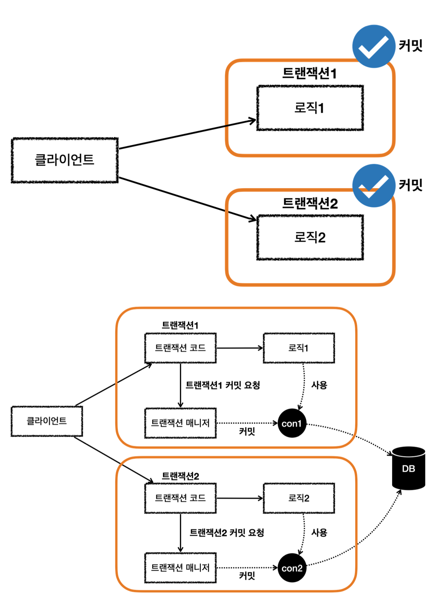
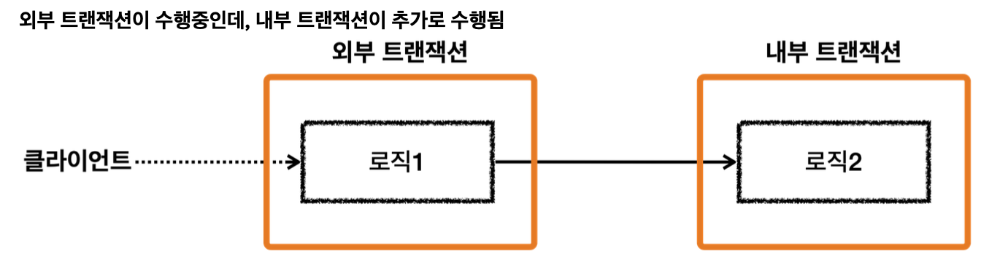
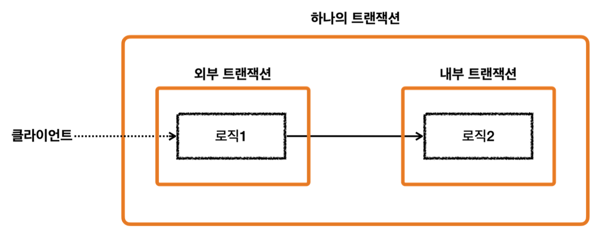
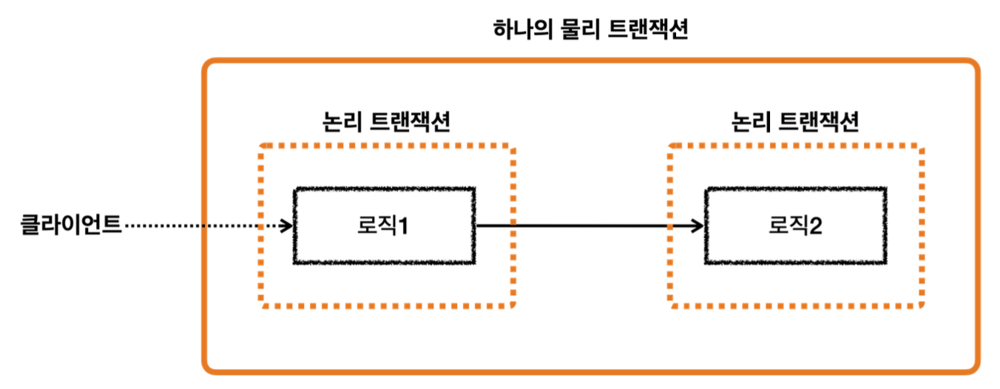
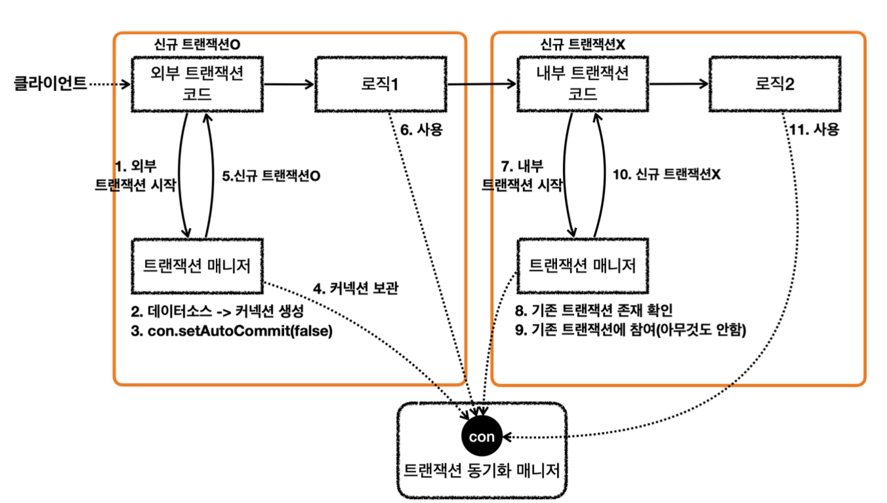
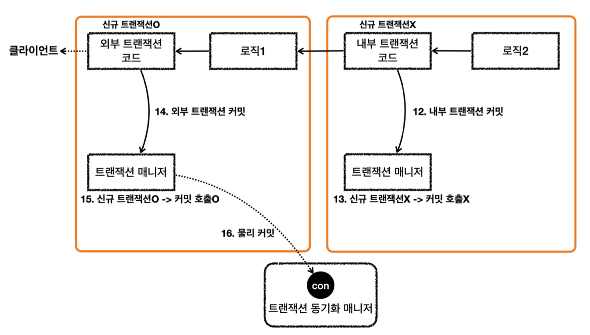

# 스프링 트랜잭션 전파1 - 기본
## 스프링 트랜잭션 전파1 - 커밋, 롤백

~~~java
@Slf4j
@SpringBootTest
public class BasicTxTest {

    @Autowired
    PlatformTransactionManager txManager;

    @TestConfiguration
    static class Config {
        @Bean
        public PlatformTransactionManager transactionManager(DataSource dataSource) {
            return new DataSourceTransactionManager(dataSource);
        }
    }

    @Test
    void commit() {
        log.info("트랜잭션 시작");
        TransactionStatus status = txManager.getTransaction(new DefaultTransactionAttribute());

        log.info("트랜잭션 커밋 시작");
        txManager.commit(status);
        log.info("트랜잭션 커밋 완료");

    }

    @Test
    void rollback() {
        log.info("트랜잭션 시작");
        TransactionStatus status = txManager.getTransaction(new DefaultTransactionAttribute());

        log.info("트랜잭션 롤백 시작");
        txManager.rollback(status);
        log.info("트랜잭션 롤백 완료");

    }
}
~~~

### commit()
~~~java
@Test
void commit() {
    log.info("트랜잭션 시작");
    TransactionStatus status = txManager.getTransaction(new DefaultTransactionAttribute());

    log.info("트랜잭션 커밋 시작");
    txManager.commit(status);
    log.info("트랜잭션 커밋 완료");

}
~~~
**실행 로그**
~~~
BasicTxTest   : 트랜잭션 시작
DataSourceTransactionManager     : Creating new transaction with name [null]: PROPAGATION_REQUIRED,ISOLATION_DEFAULT
DataSourceTransactionManager     : Acquired Connection [HikariProxyConnection@1705558790 wrapping conn0: url=jdbc:h2:mem:5b634725-38eb-4199-81bb-562d7ae615ac user=SA] for JDBC transaction
DataSourceTransactionManager     : Switching JDBC Connection [HikariProxyConnection@1705558790 wrapping conn0: url=jdbc:h2:mem:5b634725-38eb-4199-81bb-562d7ae615ac user=SA] to manual commit
BasicTxTest   : 트랜잭션 커밋 시작
DataSourceTransactionManager     : Initiating transaction commit
DataSourceTransactionManager     : Committing JDBC transaction on Connection [HikariProxyConnection@1705558790 wrapping conn0: url=jdbc:h2:mem:5b634725-38eb-4199-81bb-562d7ae615ac user=SA]
DataSourceTransactionManager     : Releasing JDBC Connection [HikariProxyConnection@1705558790 wrapping conn0: url=jdbc:h2:mem:5b634725-38eb-4199-81bb-562d7ae615ac user=SA] after transaction
BasicTxTest   : 트랜잭션 커밋 완료
~~~

### rollback()
~~~java
@Test
void rollback() {
    log.info("트랜잭션 시작");
    TransactionStatus status = txManager.getTransaction(new DefaultTransactionAttribute());

    log.info("트랜잭션 롤백 시작");
    txManager.rollback(status);
    log.info("트랜잭션 롤백 완료");

}
~~~
~~~
BasicTxTest   : 트랜잭션 시작
DataSourceTransactionManager     : Creating new transaction with name [null]: PROPAGATION_REQUIRED,ISOLATION_DEFAULT
DataSourceTransactionManager     : Acquired Connection [HikariProxyConnection@2021678579 wrapping conn0: url=jdbc:h2:mem:9aa35610-2a2b-4652-8bd7-b38e27bea53f user=SA] for JDBC transaction
DataSourceTransactionManager     : Switching JDBC Connection [HikariProxyConnection@2021678579 wrapping conn0: url=jdbc:h2:mem:9aa35610-2a2b-4652-8bd7-b38e27bea53f user=SA] to manual commit
BasicTxTest   : 트랜잭션 롤백 시작
DataSourceTransactionManager     : Initiating transaction rollback
DataSourceTransactionManager     : Rolling back JDBC transaction on Connection [HikariProxyConnection@2021678579 wrapping conn0: url=jdbc:h2:mem:9aa35610-2a2b-4652-8bd7-b38e27bea53f user=SA]
DataSourceTransactionManager     : Releasing JDBC Connection [HikariProxyConnection@2021678579 wrapping conn0: url=jdbc:h2:mem:9aa35610-2a2b-4652-8bd7-b38e27bea53f user=SA] after transaction
BasicTxTest   : 트랜잭션 롤백 완료
~~~

## 스프링 트랜잭션 전파2 - 트랜잭션 두 번 사용
이번에는 트래잭션이 각각 사용되는 경우를 보자
~~~java
@Test
void double_commit() {
    log.info("트랜잭션1  시작");
    TransactionStatus tx1 = txManager.getTransaction(new DefaultTransactionAttribute());
    log.info("트랜잭션 커밋1 시작");
    txManager.commit(tx1);

    log.info("트랜잭션2 시작");
    TransactionStatus tx2 = txManager.getTransaction(new DefaultTransactionAttribute());
    log.info("트랜잭션2 커밋 시작");
    txManager.commit(tx2);

}
~~~
~~~
트랜잭션1  시작
Creating new transaction with name [null]: PROPAGATION_REQUIRED,ISOLATION_DEFAULT
Acquired Connection [HikariProxyConnection@1909332462 wrapping conn0: url=jdbc:h2:mem:d8d3c589-1872-43de-9b95-f884350974b4 user=SA] for JDBC transaction
Switching JDBC Connection [HikariProxyConnection@1909332462 wrapping conn0: url=jdbc:h2:mem:d8d3c589-1872-43de-9b95-f884350974b4 user=SA] to manual commit
트랜잭션 커밋1 시작
Initiating transaction commit
Committing JDBC transaction on Connection [HikariProxyConnection@1909332462 wrapping conn0: url=jdbc:h2:mem:d8d3c589-1872-43de-9b95-f884350974b4 user=SA]
Releasing JDBC Connection [HikariProxyConnection@1909332462 wrapping conn0: url=jdbc:h2:mem:d8d3c589-1872-43de-9b95-f884350974b4 user=SA] after transaction

트랜잭션2 시작
Creating new transaction with name [null]: PROPAGATION_REQUIRED,ISOLATION_DEFAULT
Acquired Connection [HikariProxyConnection@919473090 wrapping conn0: url=jdbc:h2:mem:d8d3c589-1872-43de-9b95-f884350974b4 user=SA] for JDBC transaction
Switching JDBC Connection [HikariProxyConnection@919473090 wrapping conn0: url=jdbc:h2:mem:d8d3c589-1872-43de-9b95-f884350974b4 user=SA] to manual commit
트랜잭션2 커밋 시작
Initiating transaction commit
Committing JDBC transaction on Connection [HikariProxyConnection@919473090 wrapping conn0: url=jdbc:h2:mem:d8d3c589-1872-43de-9b95-f884350974b4 user=SA]
Releasing JDBC Connection [HikariProxyConnection@919473090 wrapping conn0: url=jdbc:h2:mem:d8d3c589-1872-43de-9b95-f884350974b4 user=SA] after transaction
~~~
**트랜잭션1**
- `Acquired Connection [HikariProxyConnection@1909332462 wrapping conn0: url=jdbc:h2:mem:d8d3c589-1872-43de-9b95-f884350974b4 user=SA] for JDBC transaction`
  - 트랜잭션1을 시작하고 커넥션 풀에서 conn0 커넥션 획득
- `Releasing JDBC Connection [HikariProxyConnection@1909332462 wrapping conn0: url=jdbc:h2:mem:d8d3c589-1872-43de-9b95-f884350974b4 user=SA] after transaction`
  - 트랜잭션1을 커밋하고 커넥션 풀에 conn0 커넥션 반납

**트랜잭션2**
- `Acquired Connection [HikariProxyConnection@919473090 wrapping conn0: url=jdbc:h2:mem:d8d3c589-1872-43de-9b95-f884350974b4 user=SA] for JDBC transaction`
  - 트랜잭션2를 시작하고 커넥션 풀에서 conn0 커넥션 획득
- `Releasing JDBC Connection [HikariProxyConnection@919473090 wrapping conn0: url=jdbc:h2:mem:d8d3c589-1872-43de-9b95-f884350974b4 user=SA] after transaction`
  - 트랜잭션2을 커밋하고 커넥션 풀에 conn0 커넥션 반납

위에서 확인할 수 있듯이 트랜잭션1과 트랜잭션2는 같은 conn0을 사용하고 있다. 커넥션 풀 때문에 그런 것이다. 트랜잭션1은 conn0을 모두 사용하고 커넥션 풀에 반납을 완료했다. 이후 트랜잭션2가 conn0을 획득하였다. 따라서 둘은 다른 커넥션으로 인지하는 것이 맞다.

히카리 커넥션 풀에서 커넥션을 획득하면 실제 커넥션을 반환하는 것이 아닌 내부 관리를 위해 히카리 프록시 커넥션이라는 객체를 생성해 반환한다. 내부에 실제 커넥션이 포함되어있다. 
- 트랜잭션1: `Acquired Connection [HikariProxyConnection@1909332462 wrapping conn0]`
- 트랜잭션2: `Acquired Connection [HikariProxyConnection@919473090 wrapping conn0]`

결과적으로 conn0을 통해 커넥션이 재사용 된 것을 볼 수 있고, 각각 커넥션 풀에서 커넥션을 조회한 것을 확인할 수 있다.

- 트랜잭션이 각각 수행되기 때문에 사용되는 DB 커넥션 또한 각각 다르다.
- 이 때 트랜잭션을 각자 관리하기 때문에 전체 트랜잭션을 묶을 수 없다.
  - 트랜잭션1이 커밋하고 트랜잭션2이 롤백하는 경우
    - 트랜잭션1에서 저장한 데이터는 커밋되고, 트랜잭션2에서 저장한 데이터는 롤백된다.

~~~java
@Test
void double_commit_rollback() {
    log.info("트랜잭션1  시작");
    TransactionStatus tx1 = txManager.getTransaction(new DefaultTransactionAttribute());
    log.info("트랜잭션 커밋1 시작");
    txManager.commit(tx1);

    log.info("트랜잭션2 시작");
    TransactionStatus tx2 = txManager.getTransaction(new DefaultTransactionAttribute());
    log.info("트랜잭션2 롤백 시작");
    txManager.rollback(tx2);

}
~~~
~~~
트랜잭션1  시작
Creating new transaction with name [null]: PROPAGATION_REQUIRED,ISOLATION_DEFAULT
Acquired Connection [HikariProxyConnection@1220163548 wrapping conn0: url=jdbc:h2:mem:56011bc1-7e56-4852-9d4d-1f4132138c3a user=SA] for JDBC transaction
Switching JDBC Connection [HikariProxyConnection@1220163548 wrapping conn0: url=jdbc:h2:mem:56011bc1-7e56-4852-9d4d-1f4132138c3a user=SA] to manual commit
트랜잭션 커밋1 시작
Initiating transaction commit
Committing JDBC transaction on Connection [HikariProxyConnection@1220163548 wrapping conn0: url=jdbc:h2:mem:56011bc1-7e56-4852-9d4d-1f4132138c3a user=SA]
Releasing JDBC Connection [HikariProxyConnection@1220163548 wrapping conn0: url=jdbc:h2:mem:56011bc1-7e56-4852-9d4d-1f4132138c3a user=SA] after transaction

트랜잭션2 시작
Creating new transaction with name [null]: PROPAGATION_REQUIRED,ISOLATION_DEFAULT
Acquired Connection [HikariProxyConnection@830449117 wrapping conn0: url=jdbc:h2:mem:56011bc1-7e56-4852-9d4d-1f4132138c3a user=SA] for JDBC transaction
Switching JDBC Connection [HikariProxyConnection@830449117 wrapping conn0: url=jdbc:h2:mem:56011bc1-7e56-4852-9d4d-1f4132138c3a user=SA] to manual commit
트랜잭션2 롤백 시작
Initiating transaction rollback
Rolling back JDBC transaction on Connection [HikariProxyConnection@830449117 wrapping conn0: url=jdbc:h2:mem:56011bc1-7e56-4852-9d4d-1f4132138c3a user=SA]
Releasing JDBC Connection [HikariProxyConnection@830449117 wrapping conn0: url=jdbc:h2:mem:56011bc1-7e56-4852-9d4d-1f4132138c3a user=SA] after transaction
~~~
- 트랜잭션을 각각 관리했기 때문에 트랜잭션1은 커밋되지만, 트랜잭션2는 롤백된다.

## 스프링 트랜잭션 전파3 - 전파 기본
만약 트랜잭션이 진행 중인데 여기에 추가로 트랜잭션을 수행하면 어떻게 될까? 
이런 경우 어떻게 동작할지 결정하는 것을 트랜잭션 전파라고 한다.

예제를 통해 트랜잭션 전파를 알아보자

- 외부 트랜잭션이 수행 중이고, 끝나지 않았는데 내부 트랜잭션이 수행된다.

- 스프링에서 이 경우 외부 트랜잭션과 내부 트랜잭션을 묶어 하나의 트랜잭션을 만들어준다. 내부 트랜잭션이 외부 트랜잭션에 참여하는 것이다. 이것이 기본 동작이고 옵션을 통해 다른 방식으로 변경할 수 있다.

- 스프링에서는 논리 트랜잭션, 물리 트랜잭션이라는 개념을 나눈다.
- 논리 트랜잭션들은 하나의 물리 트랜잭션으로 묶인다.
- `물리 트랜잭션`은 실제 데이터베이스에 적용되는 트랜잭션을 뜻한다. 실제 트랜잭션을 시작하고 실제 트랜잭션을 커밋, 롤백하는 단위이다.
- `논리 트랜잭션`은 트랜잭션 매니저를 통해 트랜잭션을 사용하는 단위이다.
- 논리 트랜잭션 개념은 트랜잭션이 진행 중에 내부에 추가로 트랜잭션을 사용하는 경우에 나타난다. 트랜잭션이 하나인 경우는 둘을 구분하지 않는다.

트랜잭션이 사용 중일때 또 다른 트랜잭션이 내부에 사용되면 여러가지 복잡한 상황이 발생한다. 이때 논리 트랜잭션 개념을 도입하면 단순한 원칙을 만들 수 있다.

**원칙** 
- **모든 논리 트랜잭션이 커밋되어야 물리 트랜잭션이 커밋된다.**
- **하나의 논리 트랜잭션이라도 롤백되면 물리 트랜잭션은 롤백된다.**

## 스프링 데이터 전파4 - 예제
~~~java
@Test
void inner_commit() {
    log.info("외부 트랜잭션 시작");
    TransactionStatus outer = txManager.getTransaction(new DefaultTransactionAttribute());
    log.info("outer.isNewTransaction()={}", outer.isNewTransaction());

    log.info("내부 트랜잭션 시작");
    TransactionStatus inner = txManager.getTransaction(new DefaultTransactionAttribute());
    log.info("inner.isNewTransaction()={}", inner.isNewTransaction());
    log.info("내부 트랜잭션 커밋");
    txManager.commit(inner);

    log.info("외부 트랜잭션 커밋");
    txManager.commit(outer);
}
~~~
- 외부 트랜잭션 수행 중에 내부 트랜잭션을 추가로 수행했다.
- 외부 트랜잭션은 처음 수행된 트랜잭션이다. 이 경우 신규 트랜잭션이 된다.(isNewTransaction=true)
- 내부 트랜잭션을 시작하는 시점에는 이미 외부 트랜잭션이 진행중인 상태이다. 이 경우 내부 트랜잭션은 외부 트랜잭션에 참여한다.
- 트랜잭션 참여
  - 내부 트랜잭션이 외부 트랜잭션에 참여한다는 뜻
  - 이는 내부 트랜잭션이 외부 트랜잭션을 이어 받아 따른다는 의미이다.
  - 외부 트랜잭션의 범위가 내부 트랜잭션까지 넓어진다는 뜻이다.
  - 외부에서 시작된 물리적인 트랜잭션의 범위가 내부 트랜잭션까지 넓어진다는 뜻이다.
  - 즉, 외부 트랜잭션과 내부 트랜잭션이 하나의 물리 트랜잭션으로 묶이는 것이다.
- 내부 트랜잭션은 이미 진행중인 외부 트랜잭션에 참여한다. 이 때 신규 내부 트랜잭션은 신규 트랜잭션이 아니다.(isNewTransaction=false)

위 예제의 코드에서 커밋을 두 번 호출했다. 학습했던 내용을 떠올려보면 하나의 커넥션에 커밋은 한번만 호출할 수 있다.

스프링은 어떻게 외부 트랜잭션과 내부 트랜잭션을 묶어 하나의 물리 트랜잭션으로 동작하게 하는지 알아보자
**실행 로그**
~~~
외부 트랜잭션 시작
Creating new transaction with name [null]: PROPAGATION_REQUIRED,ISOLATION_DEFAULT
Acquired Connection [HikariProxyConnection@161573617 wrapping conn0: url=jdbc:h2:mem:15dda021-fa0d-4492-bed0-b8c238441733 user=SA] for JDBC transaction
Switching JDBC Connection [HikariProxyConnection@161573617 wrapping conn0: url=jdbc:h2:mem:15dda021-fa0d-4492-bed0-b8c238441733 user=SA] to manual commit
outer.isNewTransaction()=true

내부 트랜잭션 시작
Participating in existing transaction
inner.isNewTransaction()=false
내부 트랜잭션 커밋

외부 트랜잭션 커밋
Initiating transaction commit
Committing JDBC transaction on Connection [HikariProxyConnection@161573617 wrapping conn0: url=jdbc:h2:mem:15dda021-fa0d-4492-bed0-b8c238441733 user=SA]
Releasing JDBC Connection [HikariProxyConnection@161573617 wrapping conn0: url=jdbc:h2:mem:15dda021-fa0d-4492-bed0-b8c238441733 user=SA] after transaction
~~~
- 내부 트랜잭션 시작 시 `Participating in existing transaction` 메시지를 확인할 수 있다. 내부 트랜잭션이 기존에 존재하는 외부 트랜잭션에 참여한다는 뜻이다.
- 외부 트랜잭션을 시작하거나 커밋할 때는 DB 커넥션을 통한 물리 트랜잭션을 시작하고, DB 커넥션을 통해 커밋 하는 것을 볼 수 있다. (Switching JDBC Connection [HikariProxyConnection@161573617 wrapping conn0] to `manual commit`)
- 하지만 내부 트랜잭션을 시작하거나 커밋할 때는 DB 커넥션을 통해 커밋하는 로그를 확인할 수 없다. 
- `간단히 말해서 외부 트랜잭션만 물리 트랜잭션을 시작하고 커밋한다.`
- 만약 내부 트랜잭션이 실제 물리 트랜잭션을 커밋하면 트랜잭션이 끝나기 때문에 트랜잭션을 외부 트랜잭션까지 이어갈 수 없다.
- 따라서 내부 트랜잭션은 DB커넥션을 통한 물리 트랜잭션을 커밋하면 안된다.
- 스프링은 여러 트랜잭션이 함께 사용되는 경우, `처음 트랜잭션을 시작한 외부 트랜잭션이 실제 물리 트랜잭션을 관리`하도록 한다.

이제 트랜잭션 전파가 실제로 어떻게 동작하는지 알아보자

**요청 흐름 - 외부 트랜잭션** 
- 1. 외부 트랜잭션 시작
- 2. 트랜잭션 매니저는 데이터소스를 통해 커넥션을 생성
- 3. 생성한 커넥션을 수동 커밋 모드로 설정 - **물리 트랜잭션 시작**
- 4. 트랜잭션 매니저는 트랜잭션 동기화 매니저에 커넥션을 보관
- 5. 트랜잭션 매니저는 트랜잭션 생성 결과를 `TransactionStatus`에 담아 반환하는데 여기에 신규 트랜잭션 여부가 담겨 있다. 트랜잭션을 처음 시작했으므로 신규 트랜잭션이다.(isNewTransaction=true)
- 6. 로직1이 사용되고 커넥션이 필요한 경우 트랜잭션 동기화 매니저를 통해 트랜잭션이 적용된 커넥션을 획득해서 사용한다.

**요청 흐름 - 내부 트랜잭션** 
- 7. 내부 트랜잭션 시작
- 8. 트랜잭션 매니저는 트랜잭션 동기화 매니저를 통해 기존 트랜잭션이 존재하는지 확인
- 9. 기존 트랜잭션이 존재하므로 기존 트랜잭션에 참여한다. 이 말은 아무것도 하지 않는다는 뜻이다.
- 10. 기존 트랜잭션에 참여했기 때문에 신규 트랜잭션이 아니다.(isNewTransaction=false)
- 11. 로직2가 사용되고 커넥션이 필요한 경우 트랜잭션 동기화 매니저를 통해 외부 트랜잭션이 보관한 커넥션을 획득해 사용한다.

**응답 흐름 - 내부 트랜잭션**
- 12. 로직2가 끝나고 트랜잭션 매니저를 통해 내부 트랜잭션을 커밋한다.
- 13. 이 경우에는 신규 트랜잭션이 아니므로 커밋을 호출하지 않는다. 이 부분이 중요한데 실제 커넥션에 커밋이나 롤백을 호출해버리면 물리 트랜잭션이 끝나버린다. 트랜잭션이 끝난게 아니기 때문에 실제 커밋을 호출하면 안된다. 물리 트랜잭션은 외부 트랜잭션을 종료할 때 까지 이어져야 한다.

**응답 흐름 - 외부 트랜잭션**
- 14. 로직1이 끝나고 트랜잭션 매니저를 통해 외부 트랜잭션을 커밋
- 15. 외부 트랜잭션은 신규 트랜잭션이므로 DB 커넥션에 실제 커밋을 호출
- 16. 트랜잭션 매니저에 커밋하는 것이 논리적인 커밋이라면 실제 커넥션에 커밋하는 것을 물리 커밋이라 할 수 있다. 실제 데이터베이스에 커밋이 반영되고 물리 트랜잭션도 끝난다.

**핵심**
- 신규 트랜잭션인 경우에만 실제 커넥션을 사용해 물리 커밋과 롤백 수행
