# 스프링 트랜잭션 전파2 - 활용

## 트랜잭션 전파 활용1 - 예제 시작
실제 예제를 통해 이전에 배웠던 트랜잭션 전파에 관한 내용을 이해해보도록 하자.

**요구사항**
- 회원을 등록하고 조회
- 회원에 대한 변경 이력을 추적할 수 있도록 회원 데이터가 변경될 때 변경 이력을 DB LOG 테이블에 남겨야한다.
  - 회원 등록시에만 DB LOG 테이블에 남기도록 하자.

~~~java
@Entity
@Getter @Setter
public class Member {

    @Id @GeneratedValue
    private Long id;
    private String username;

    public Member() {

    }

    public Member(String username) {
        this.username = username;
    }

}
~~~
- JPA를 통해 관리하는 회원 엔티티

~~~java
@Slf4j
@Repository
@RequiredArgsConstructor
public class MemberRepository {

    private final EntityManager em;

    @Transactional
    public void save(Member member) {
        log.info("member 저장");
        em.persist(member);
    }

    public Optional<Member> find(String username) {
        return em.createQuery("select m from Member m where m.username = :username", Member.class)
                .setParameter("username", username)
                .getResultList().stream().findAny();
    }

}
~~~
- JPA를 사용하는 회원 리포지토리, 저장, 조회 기능을 제공

~~~java
@Entity
@Getter @Setter
public class Log {

    @Id
    @GeneratedValue
    private Long id;
    private String message;

    public Log() {

    }

    public Log(String message) {
        this.message = message;
    }
}
~~~
- JPA를 통해 관리하는 로그 엔티티

~~~java
@Slf4j
@Repository
@RequiredArgsConstructor
public class LogRepository {

    private final EntityManager em;

    @Transactional
    public void save(Log logMessage) {
        log.info("log 저장");
        em.persist(logMessage);

        if (logMessage.getMessage().contains("로그예외")) {
            log.info("log 저장 시 예외 발생");
            throw new RuntimeException("예외 발생");
        }

    }

    public Optional<Log> find(String message) {
        return em.createQuery("select l from Log l where l.message = :message", Log.class)
                .setParameter("message", message)
                .getResultList().stream().findAny();
    }

}
~~~
- JPA를 사용하는 로그 리포지토리, 저장, 조회 기능 제공
- 중간 예외 상황을 재현하기 위해 `로그예외`라고 입력하는 경우 예외 발생

~~~java
@Slf4j
@Service
@RequiredArgsConstructor
public class MemberService {

    private final MemberRepository memberRepository;
    private final LogRepository logRepository;

    public void joinV1(String username) {
        Member member = new Member(username);
        Log logMessage = new Log(username);

        log.info("== memberRepository 호출 시작 ==");
        memberRepository.save(member);
        log.info("== memberRepository 호출 종료 ==");

        log.info("== logRepository 호출 시작 ==");
        logRepository.save(logMessage);
        log.info("== logRepository 호출 종료 ==");

    }

    public void joinV2(String username) {
        Member member = new Member(username);
        Log logMessage = new Log(username);

        log.info("== memberRepository 호출 시작 ==");
        memberRepository.save(member);
        log.info("== memberRepository 호출 종료 ==");

        log.info("== logRepository 호출 시작 ==");
        try {
            logRepository.save(logMessage);
        } catch (RuntimeException e) {
            log.info("log 저장에 실패했습니다, logMessage={}", logMessage.getMessage());
            log.info("정상 흐름 반환");
        }
        log.info("== logRepository 호출 종료 ==");

    }
}
~~~
- 회원을 등록하면서 동시에 회원 등록에 대한 DB 로그도 남긴다.
- joinV1()
  - 회원과 DB로그를 함께 남기는 비즈니스 로직
  - 현재 별도의 트랜잭션은 설정하지 않음
- joinV2()
  - joinV1()과 같은 기능을 함
  - DB로그 저장시 예외가 발생하면서 예외를 복구
  - 현재 별도 트랜잭션은 설정하지 않음

테스트를 진행해보자
~~~java
@Slf4j
@SpringBootTest
class MemberServiceTest {

    @Autowired
    MemberService memberService;
    @Autowired
    MemberRepository memberRepository;
    @Autowired
    LogRepository logRepository;

    /**
     * memberService @Transactional: OFF
     * memberRepository @Transactional:ON
     * logRepository @Transactional:ON
     */
    @Test
    void outerTxOff_success() {
        //given
        String username = "outerTxOff_success";

        //when
        memberService.joinV1(username);

        //when: 모든 데이터가 저장 된다.
        assertTrue(memberRepository.find(username).isPresent());
        assertTrue(logRepository.find(username).isPresent());

    }

}
~~~
- 하이버네이트가 테이블을 자동으로 생성해준다.
- 메모리 DB이기 때문에 모든 테스트가 완료된 이후 DB는 사라진다.
- 여기서는 각각 테스트가 완료된 시점에 데이터를 삭제하지 않는다. 따라서 username은 테스트별로 각각 다르게 설정해야 한다.그렇지 않으면 다른 테스트에 영향을 준다.

**JPA와 데이터 변경**
- JPA를 통한 모든 데이터 변경에는 트랜잭션이 필요하다. (조회는 트랜잭션 없이 가능하다.)
  - 현재 코드에서 서비스 계층에 트랜잭션이 없기 때문에 리포지토리에 트랜잭션이 있다.

## 트랜잭션 전파 활용2 - 커밋, 롤백
### 서비스 계층에 트랜잭션이 없을 때 - 커밋

상황
- 서비스 계층에 트랜잭션이 없다.
- 회원, 로그 리포지토리가 각각 트랜잭션을 갖고 있다.
- 회원, 로그 리포지토리 둘 다 커밋에 성공한다

~~~java
/**
 * memberService @Transactional: OFF
 * memberRepository @Transactional:ON
 * logRepository @Transactional:ON
 */
@Test
void outerTxOff_success() {
    //given
    String username = "outerTxOff_success";

    //when
    memberService.joinV1(username);

    //when: 모든 데이터가 저장 된다.
    assertTrue(memberRepository.find(username).isPresent());
    assertTrue(logRepository.find(username).isPresent());

}
~~~

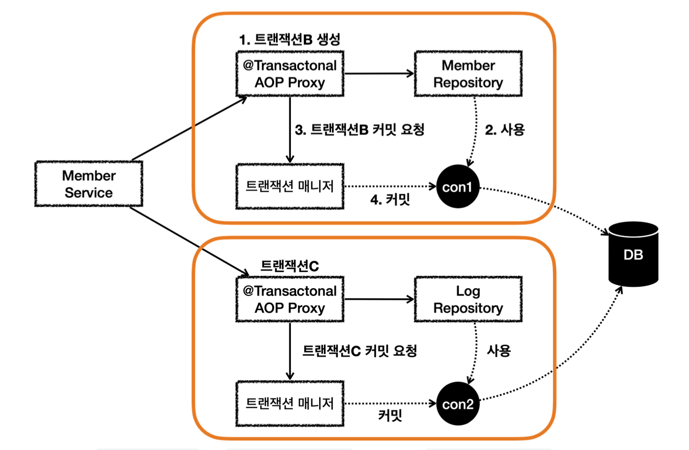
1. `MemberService`에서 `MemberRepository` 호출, `MemberRepository`에는 `@Transactional` 애노테이션이 있어 트랜잭션 AOP가 작동한다. 여기서 트랜잭션 매니저를 통해 트랜잭션을 시작한다. 이 트랜잭션을 트랜잭션B라 하겠다.
  - 트랜잭션 매니저에 트랜잭션을 요청하면 데이터소스를 통해 con1 커넥션을 획득
  - 해당 커넥션을 수동 커밋 모드로 변경하고 트랜잭션 시작
  - 트랜잭션 동기화 매니저를 통해 트랜잭션을 시작한 커넥션을 보관
  - 트랜잭션 매니저의 호출 결과로 `status`를 반환한다. 여기서는 신규 트랜잭션 여부가 참이 된다.
2. `MemberRepository`는 JPA를 통해 회원을 저장한다. 이때 JPA는 트랜잭션이 시작된 con1을 사용해 회원을 저장
3. `MemberRepository`가 정상 응답을 반환했기 때문에 트랜잭션 AOP는 트랜잭션 매니저에 커밋을 요청
4. 트랜잭션 매니저는 con1 커넥션을 통해 물리 트랜잭션을 커밋
  - 신규 트랜잭션 여부, rollbackOnly 여부 모두 체크함

이러한 과정을 통해 `MemberRepository`와 관련된 모든 데이터는 정상 커밋되고 트랜잭션B는 완전히 종료된다. 이후 `LogRepository`를 통해 트랜잭션C를 시작하고 정상 커밋한다.

결과적으로 둘 다 커밋되었으므로 Member, Log 모두 안전하게 저장된다.

- 트랜잭션 전파의 기본 값은 `REQUIRED`이다. 
  - `@Transactional(propagation = Propagation.REQUIRED)`
  - `@Transactional`
  - 위 둘은 같은 기능을 수행한다.
- `REQUIRED`는 기존 트랜잭션이 없으면 새로운 트랜잭션을 만들고 기존 트랜잭션이 있으면 참여한다.

### 서비스 계층에 트랜잭션이 없을 때 - 롤백

상황
- 서비스 계층에 트랜잭션이 없다.
- 회원, 로그 리포지토리가 각각 트랜잭션을 가지고 있다.
- 회원 리포지토리는 정상 동작하지만 로그 리포지토리에서 예외가 발생

~~~java
/**
 * memberService @Transactional: OFF
 * memberRepository @Transactional:ON
 * logRepository @Transactional:ON EXCEPTION
 */
@Test
void outerTxOff_fail() {
    //given
    String username = "로그예외_outerTxOff_fail";

    //when
    assertThatThrownBy(() -> memberService.joinV1(username))
            .isInstanceOf(RuntimeException.class);

    //when log 데이터는 롤백된다.
    assertTrue(memberRepository.find(username).isPresent());
    assertTrue(logRepository.find(username).isEmpty());

}
~~~
- 사용자 이름에 `로그예외`라는 단어가 포함되어 있으면 `LogRepository`에서 런타임 예외가 발생한다.
- 트랜잭션 AOP는 해당 런타임 예외를 확인하고 롤백 처리한다.

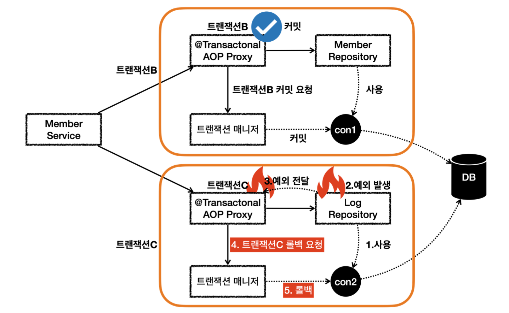
- `MemberService`에서 `MemberRepository`를 호출하는 부분은 위의 내용과 같다,
- `MemberService`에서 `LogRepository`를 호출하는데 `로그예외`라는 이름을 전달한다. 
- 이 과정에서 새로운 트랜잭션C가 만들어진다.

**LogRepository 응답 로직**
1. `LogRepository`는 트랜잭션C와 관련된 con2를 사용
2. `로그예외`라는 이름을 전달해 `LogRepository`에 런타임 예외 발생
3. `LogRepository`는 예외를 밖으로 던짐, 이 때 트랜잭션 AOP가 예외를 받음
4. 런타임 예외가 발생해 트랜잭션 AOP는 트랜잭션 매니저에 롤백을 호출
5. 트랜잭션 매니저는 신규 트랜잭션이므로 물리 롤백을 호출

위 상황에서 회원은 저장되지만 로그는 롤백된다. 따라서 데이터 정합성에 문제가 발생할 수 있다. 둘을 하나의 트랜잭션으로 묶어 처리하도록 하자.

## 트랜잭션 전파 활용3 - 단일 트랜잭션
회원 리포지토리와 로그 리포지토리를 하나의 트랜잭션으로 묶는 가장 간단한 방법은 이 둘을 호출하는 회원 서비스에만 트랜잭션을 적용하는 것이다.

~~~java
/**
 * memberService @Transactional: OFF
 * memberRepository @Transactional:ON
 * logRepository @Transactional:OFF
 */
@Test
void singleTx() {
    //given
    String username = "outerTxOff_success";

    //when
    memberService.joinV1(username);

    //when: 모든 데이터가 저장 된다.
    assertTrue(memberRepository.find(username).isPresent());
    assertTrue(logRepository.find(username).isPresent());

}
~~~
- `MemberService`에 `@Transactional`을 추가하고 각 리포지토리에 있는 `@Transactional`을 주석처리하자

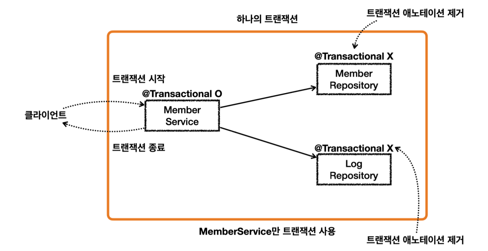
- 이렇게 되면 `MemberService`를 시작할 때부터 종료할 때 까지의 모든 로직을 하나의 트랜잭션으로 묶을 수 있다.
  - `MemberService`가 `MemberRepository`, `LogRepository`를 호출하므로 로직들은 같은 트랜잭션을 사용한다.
- `MemberSerivce`만 트랜잭션을 처리하기 때문에 논리 트랜잭션, 물리 트랜잭션, 외부 트랜잭션, 내부 트랜잭션, 신규 트랜잭션, 트랜잭션 전파와 같은 복잡한 것을 고민할 필요가 없다. 단순하고 깔끔하게 트랜잭션을 묶을 수 있다.

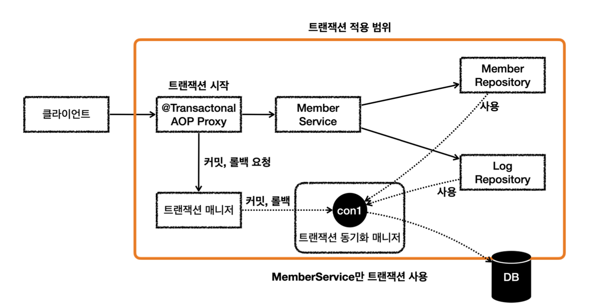
- `MemberService`에만 `@Transactonal`이 붙어있기 때문에 여기에만 트랜잭션 AOP가 적용된다.
  - `MemberRepository`, `LogRepository`는 트랜잭션 AOP가 적용되지 않는다.
- `MemberService`의 시작부터 끝까지 관련 로직은 해당 트랜잭션이 생성한 커넥션을 사용한다.
  - `MemberService`가 호출하는 `MemberRepository`, `LogRepository`도 같은 커넥션을 사용하면서 트랜잭션 범위에 포함된다.

### 각각 트랜잭션이 필요한 상황

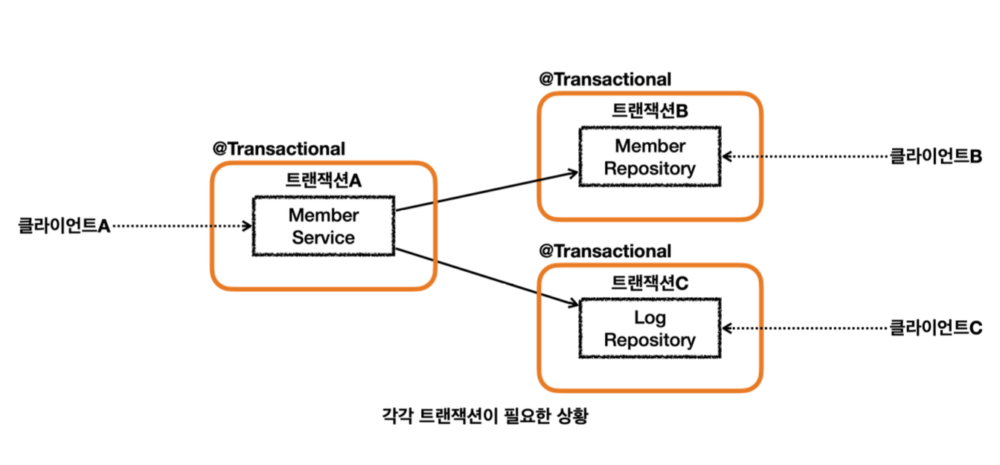
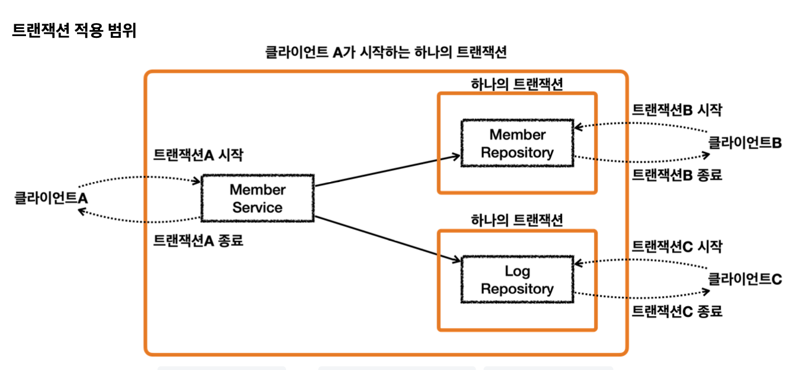
- 클라이언트A는 `MemberService`부터 `MemberRepository`, `LogRepository`를 모두 하나의 트랜잭션으로 묶고자 한다.
- 클라이언트B는 `MemberRepository`만 호출하고 여기에만 트랜잭션을 사용하고싶다.
- 클라이언트C는 `LogRepository`만 호출하고 여기에만 트랜잭션을 사용하고싶다.

- 클라이언트A만 생각했을 때 `MemberService`에 트랜잭션 코드를 남기고, `MemberRepository`, `LogRepository`의 트랜잭션 코드를 제거하면 깔끔하게 하나의 트랜잭션을 적용할 수 있다.
- 하지만 클라이언트B, 클라이언트C가 호출하는 `MemberRepository`, `LogRepository`에는 트랜잭션을 적용할 수 없다.

트랜잭션 전파 없이 이런 문제를 해결하려면 트랜잭션이 있는 메서드와 트랜잭션이 없는 메서드를 각각 만들어야 할 것이다.

## 트랜잭션 전파 활용4 - 전파 커밋
스프링은 `@Transactional`이 적용되어 있으면 기본 `REQUIRED`라는 전파 옵션을 사용한다.  
이 옵션은 기존 트랜잭션이 없으면 트랜잭션을 생성하고, 있으면 기존 트랜잭션 참여한다. 해당 트랜잭션을 그대로 따른다는 의미이고, 동시에 같은 동기화 커넥션을 사용한다는 의미이다.

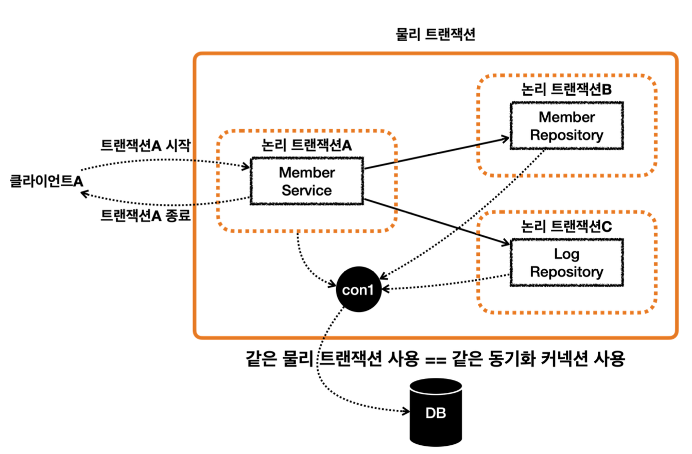

위와같이 둘 이상의 트랜잭션이 하나의 물리 트랜잭션에 묶이게 되면 둘을 구분하기 위해서 논리 트랜잭션과 물리 트랜잭션으로 구분한다.

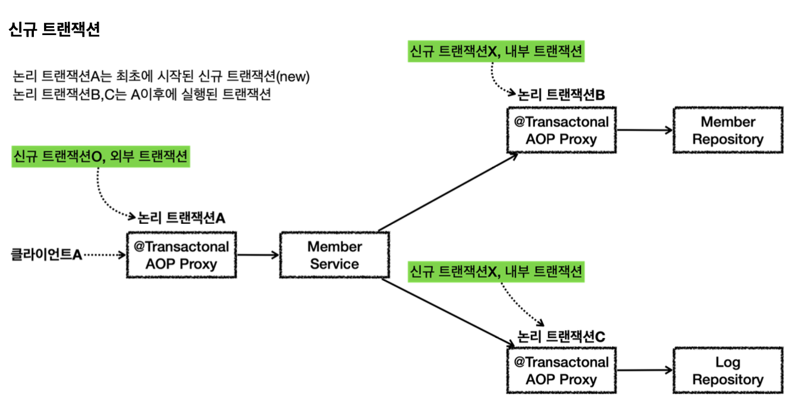
- 이 경우 외부에 있는 신규 트랜잭션만 실제 물리 트랜잭션을 시작하고 커밋한다.
- 내부에 있는 트랜잭션은 물리 트랜잭션을 시작하거나 커밋하지 않는다.

~~~java
/**
 * memberService @Transactional: ON
 * memberRepository @Transactional: ON
 * logRepository @Transactional: ON
 */
@Test
void outerTxOn_success() {
    //given
    String username = "outerTxOn_success";

    //when
    memberService.joinV1(username);

    //when: 모든 데이터가 저장 된다.
    assertTrue(memberRepository.find(username).isPresent());
    assertTrue(logRepository.find(username).isPresent());

}
~~~

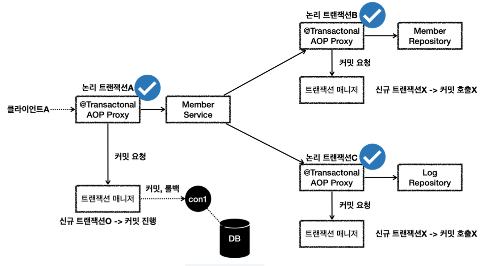
- 클라이언트A가 `MemberService`를 호출하면서 트랜잭션 AOP가 호출
  - 여기서 신규 트랜잭션이 생성되고 물리 트랜잭션도 시작한다.
- `MemberRepository`를 호출하면서 트랜잭션 AOP가 호출
  - 이미 트랜잭션이 있기 때문에 기존 트랜잭션에 참여한다.
- `MemberRepository`의 로직이 끝나고 정상 응답 시 트랜잭션 AOP가 호출
  - 트랜잭션 AOP는 정상 응답이므로 트랜잭션 매니저에 커밋을 요청한다. 이 때 신규 트랜잭션이 아니기 때문에 실제 커밋을 호출하지 않는다.
- `LogRepository`를 호출하면서 트랜잭션 AOP가 호출된다.
  - 이미 트랜잭션이 있기 때문에 기존 트랜잭션에 참여한다.
- `LogRepository`의 로직이 끝나고 정상 응답 시 트랜잭션 AOP가 호출된다.
  - 트랜잭션 AOP가 정상 응답이므로 트랜잭션 매니저에 커밋을 요청한다. 이 때 신규 트랜잭션이 아니기 때문에 실제 커밋을 호출하지 않는다.
- `MemberService`의 로직이 끝나고 정상 응답 시 트랜잭션 AOP가 호출된다.
  - 트랜잭션 AOP는 정상 응답이기 때문에 트랜잭션 매니저에 커밋을 요청한다. 이 때 신규 트랜잭션이므로 물리 커밋을 호출한다.

## 트랜잭션 전파 활용5 - 전파 롤백
로그 리포지토리에서 예외가 발생해 전체 트랜잭션이 롤백되는 경우를 살펴보자

~~~java
/**
 * memberService @Transactional: On
 * memberRepository @Transactional:ON
 * logRepository @Transactional:ON EXCEPTION
 */
@Test
void outerTxOn_fail() {
    //given
    String username = "로그예외_outerTxOff_fail";

    //when
    assertThatThrownBy(() -> memberService.joinV1(username))
            .isInstanceOf(RuntimeException.class);

    //when
    assertTrue(memberRepository.find(username).isEmpty());
    assertTrue(logRepository.find(username).isEmpty());

}
~~~

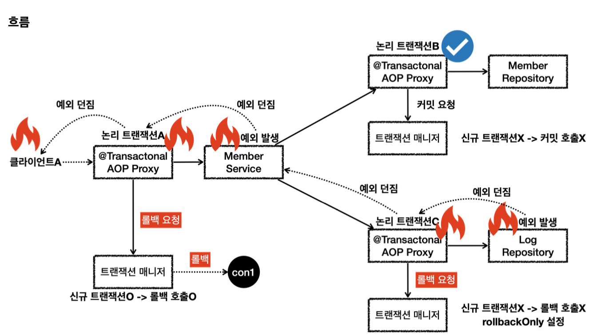
- 클라이언트A가 `MemberService`를 호출하면서 트랜잭션 AOP가 호출된다.
  - 여기서 신규 트랜잭션이 생성되고 물리 트랜잭션도 시작한다.
- `MemberRepository`를 호출하면서 트랜잭션 AOP가 호출된다.
  - 이미 트랜잭션이 있으므로 기존 트랜잭션에 참여
- `MemberRepository`의 로직 호출이 끝나고 정상 응답 시 트랜잭션 AOP가 호출
  - 트랜잭션 AOP는 정상 응답이기 때문에 트랜잭션 매니저에 커밋을 요청한다. 하지만 신규 트랜잭션이 아니기 때문에 실제 커밋을 호출하지 않는다.
- `LogRepository`를 호출하면서 트랜잭션 AOP가 호출
  - 이미 트랜잭션이 있으므로 기존 트랜잭션에 참여
- `LogRepository`로직에서 런타임 예외 발생, 예외를 던지면 트랜잭션 AOP가 해당 예외를 받게된다.
  - 트랜잭션 AOP는 런타임 예외가 발생했으므로 트랜잭션 매니저에 롤백을 요청. 이때 신규 트랜잭션이 아니기 때문에 물리 롤백을 호출하지 않는다. 대신 `rollbackOnly`를 설정한다.
  - `LogRepository`가 예외를 던졌기 때문에 트랜잭션 AOP도 예외를 밖으로 던진다
- `MemberService`에서도 런타임 예외를 받게 되는데 로직에서는 해당 런타임 예외를 처리하지 않고 밖으로 던진다
  - 트랜잭션 AOP는 런타임 예외가 발생했기 때문에 트랜잭션 매니저에 롤백을 요청한다. 이 때 신규 트랜잭션이기 때문에 물리 롤백을 호출한다.
  - 어차피 롤백이 되었기 때문에 `rollbackOnly` 설정은 참고하지 않는다.
  - `MemberService`가 예외를 던졌기 때문에 트랜잭션 AOP도 해당 예외를 밖으로 던진다
- 클라이언트A는 `LogRepository`부터 넘어온 런타임 예외를 받게 된다.

회원과 회원 이력 로그를 처리하는 부분을 하나의 트랜잭션으로 묶은 덕분에 문제가 발생했을 때 회원과 회원 이력 로그가 모두 함께 롤백된다. 따라서 데이터 정합성에 문제가 발생하지 않는다.

## 트랜잭션 전파 활용6 - 복구 REQUIRED
위에서 회원과 로그를 하나의 트랜잭션으로 묶어 데이터 정합성 문제를 해결하였다. 그런데 회원 이력 로그를 DB에 남기는 작업에 문제가 발생해 회원 가입 자체가 안되는 경우가 발생하게 되었다. 이를 막기위해 요구사항이 변경되었다.

회원가입을 시도한 로그를 남기는데 실패하더라도 회원 가입은 유지되어야 한다.

~~~java
/**
 * memberService @Transactional: On
 * memberRepository @Transactional:ON
 * logRepository @Transactional:ON EXCEPTION
 */
@Test
void recoverException_fail() {
    //given
    String username = "로그예외_recoverException_fail";

    //when
    assertThatThrownBy(() -> memberService.joinV2(username))
            .isInstanceOf(UnexpectedRollbackException.class);

    //when
    assertTrue(memberRepository.find(username).isEmpty());
    assertTrue(logRepository.find(username).isEmpty());

}
~~~
- `joinV2()`에는 예외를 잡아 정상흐름으로 변환하는 로직이 있다.

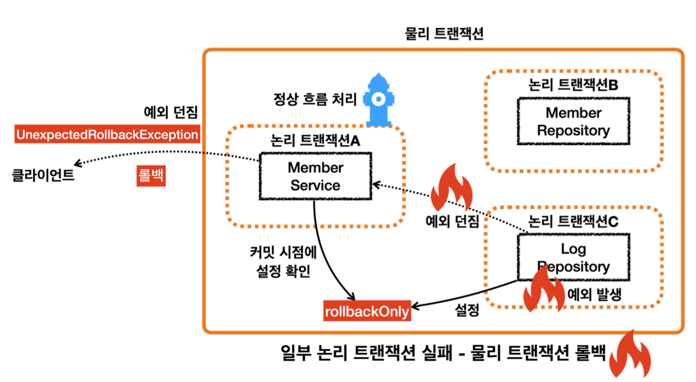
- 내부 트랜잭션에서 `rollbackOnly`를 설정하기 때문에 정상 흐름 처리를 해서 외부 트랜잭션에서 커밋을 호출해도 물리 트랜잭션은 롤백된다.

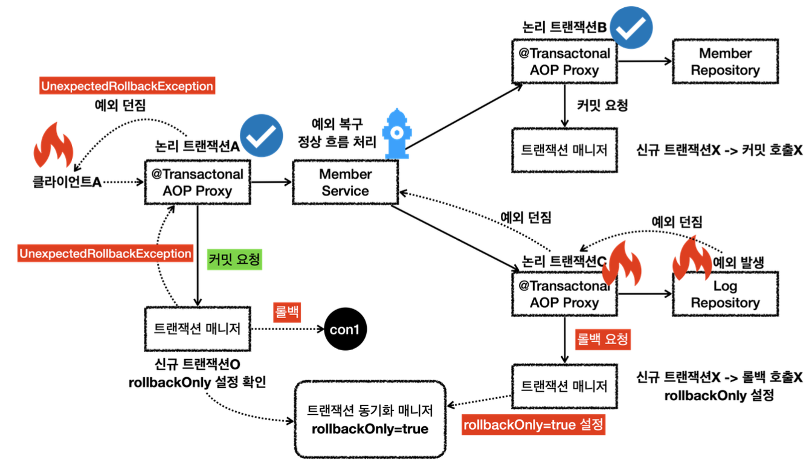
- `LogRepository`에서 예외가 발생한다. 예외를 던지게 되면 `LogRepository`의 트랜잭션 AOP가 해당 예외를 받는다.
- 신규 트랜잭션이 아니므로 물리 트랜잭션을 롤백하지 않고 트랜잭션 동기화 매니저에 `rollbackOnly`를 설정한다.
- 이후 트랜잭션 AOP는 전달받은 예외를 밖으로 던진다.
- `MemberService`가 예외를 복구한다. 그리고 정상적으로 리턴한다.
- 정상 흐름이 되었으므로 `MemberService`의 트랜잭션 AOP는 커밋을 호출
- 커밋 호출 시 신규 트랜잭션이기 때문에 실제 물리 트랜잭션을 커밋한다. 이 때 `rollbackOnly`를 체크한다.
- `rollbackOnly`가 체크되어 있기 때문에 물리 트랜잭션을 롤백한다.
- 트랜잭션 매니저는 `UnexpectedRollbackException` 예외를 던진다.
- 트랜잭션 AOP도 전달받은 `UnexpectedRollbackException`을 클라이언트로 던진다.

**정리**
- 논리 트랜잭션 중 하나라도 롤백되면 전체 트랜잭션은 롤백된다.
- 내부 트랜잭션이 롤백 되었는데 외부 트랜잭션이 커밋되면 `UnexpectedRollbackException` 예외가 발생
- `rollbackOnly`가 있는 상황에서 커밋 발생 시 `UnexpectedRollbackException` 예외 발생

## 트랜잭션 전파 활용7 - 복구 REQUIRES_NEW
**회원 가입을 시도한 로그를 남기는데 실패하더라도 회원 가입은 유지되어야 한다.**
~~~java
/**
 * memberService @Transactional: On
 * memberRepository @Transactional:ON
 * logRepository @Transactional:ON(REQUIRES_NEW) EXCEPTION
 */
@Test
void recoverException_success() {
    //given
    String username = "로그예외_recoverException_success";

    //when
    memberService.joinV2(username);

    //when
    assertTrue(memberRepository.find(username).isPresent());
    assertTrue(logRepository.find(username).isEmpty());

}
~~~

~~~java
@Transactional(propagation = Propagation.REQUIRES_NEW)
public void save(Log logMessage) 
~~~
항상 신규 트랜잭션을 생성하는 옵션 `REQUIRES_NEW`을 적용시켰다.

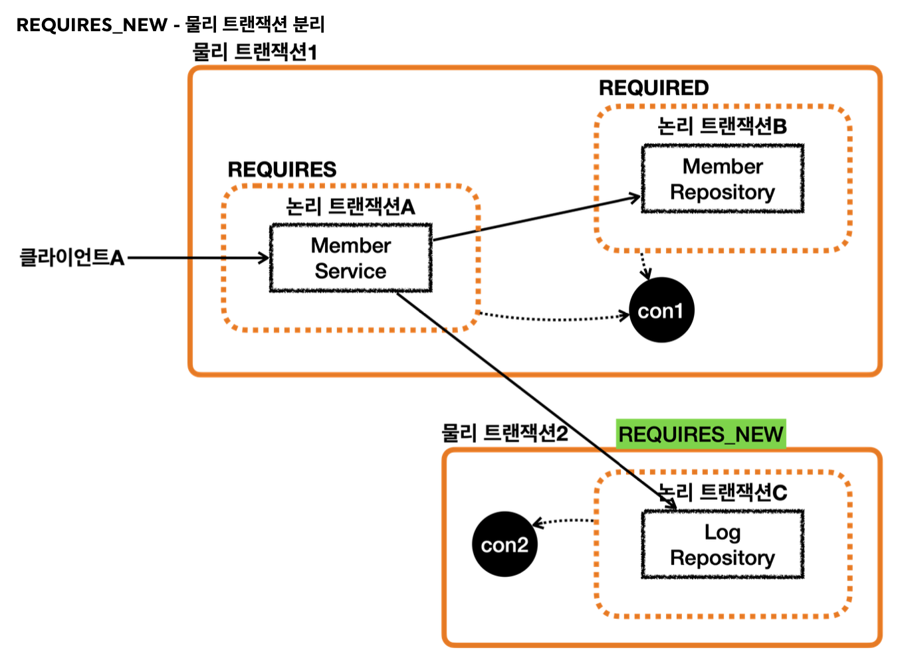
- `MemberRepository`는 `REQUIRED` 옵션을 사용하기 때문에 기존 트랜잭션에 참여한다.
- `LogRepository`는 `REQUIRES_NEW` 옵션을 사용하기 때문에 항상 새로운 트랜잭션을 만든다. 따라서 이 트랜잭션 안에는 커넥션도 별도로 사용하게 된다.

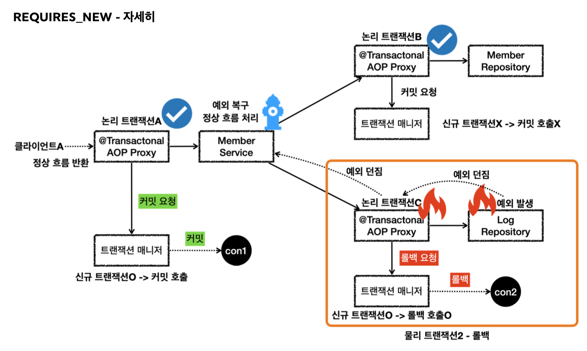
- `LogRepository`에서 예외가 발생, 예외를 던지면 `LogRepository`의 트랜잭션 AOP가 해당 예외를 받는다.
- `REQUIRES_NEW`를 사용한 신규 트랜잭션이기 때문에 물리 트랜잭션을 롤백한다.
- 물리 트랜잭션을 롤백했기 때문에 `rollbackOnly`를 표시하지 않는다.
- `REQUIRES_NEW`를 사용한 물리 트랜잭션은 롤백되고 완전히 끝나버린다.
- 이후 트랜잭션 AOP는 전달받은 예외를 밖으로 던진다.
- `MemberService`가 예외를 받아 복구를 진행한다. 그리고 정상적으로 리턴한다.
- 정상 흐름이 되었으므로 `MemberService`의 트랜잭션 AOP는 커밋을 호출한다.
- 커밋을 호출할 때 신규 트랜잭션이므로 실제 물리 트랜잭션을 커밋해야한다. 이때 `rollbackOnly`를 체크한다.
- `rollbackOnly`가 없으므로 물리 트랜잭션을 커밋한다
- 이후 정상 흐름이 반환된다.

결과적으로 회원 데이터는 저장되고, 로그 데이터만 롤백되는 것을 확인할 수 있다.

주의할 점이 있는데 
`REQUIRES_NEW`를 사용하게 되면 하나의 HTTP 요청에 2개의 데이터베이스 커넥션을 사용하게 된다. 성능이 중요한 곳에서는 이 부분에 주의해야한다.
