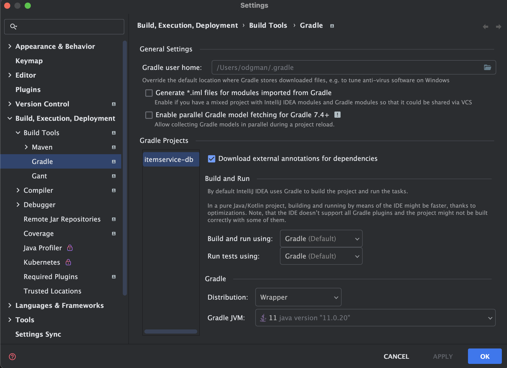
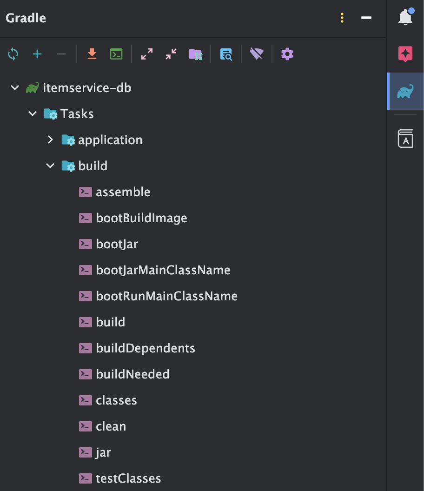
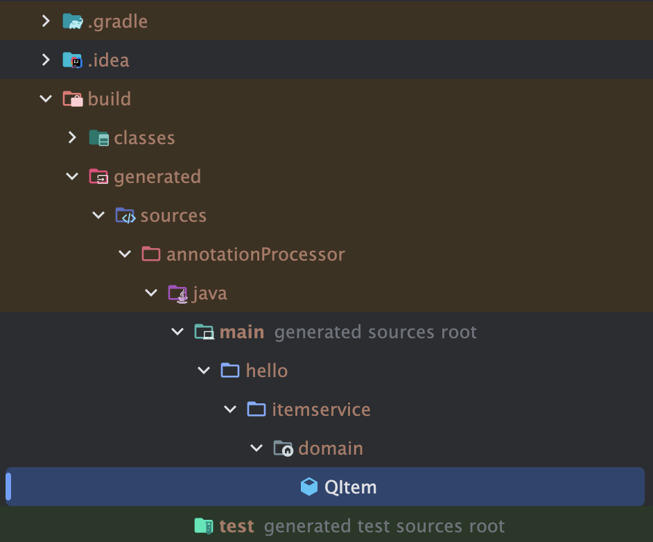

# Querydsl
## Querydsl 설정
스프링 부트 2.x와 스프링 부트 3.x 설정이 다르다. 버전에 맞춰 설정을 하도록하자

### 스프링 부트 2.x 설정
**bulid.gradle**
~~~
dependencies {

	//Querydsl 추가
	implementation 'com.querydsl:querydsl-jpa'
	annotationProcessor "com.querydsl:querydsl-apt:${dependencyManagement.importedProperties['querydsl.version']}:jpa"
	annotationProcessor "jakarta.annotation:jakarta.annotation-api"
	annotationProcessor "jakarta.persistence:jakarta.persistence-api"

}

//Querydsl 추가, 자동 생성된 Q클래스 gradle clean으로 제거
clean {
	delete file('src/main/generated')
}
~~~

### 스프링 부트 3.x 설정
~~~
dependencies {
//Querydsl 추가
  implementation 'com.querydsl:querydsl-jpa:5.0.0:jakarta' annotationProcessor "com.querydsl:querydsl-apt:${dependencyManagement.importedProperties['querydsl.version']}:jakarta"
  annotationProcessor "jakarta.annotation:jakarta.annotation-api"
  annotationProcessor "jakarta.persistence:jakarta.persistence-api"
}
~~~

여기서 Gradle, IntelliJ IDEA 두 가지 설정이 있다. 하나를 택해 설정할 수 있다.

### 옵션 선택 1 - Gradle - Q타입 생성 확인 방법

- Gradle -> Tasks -> build -> clean
- Gradle -> Tasks -> other -> complieJava

- build -> generated -> sources -> annotationProcessor -> java/main 하위에 `hello.itemservice.domain.QItem`이 있어야 한다.

#### Q타입 삭제
- gradle clean 수행 시 build 폴더 자체가 삭제된다.

### 옵션 선택 2 - IntelliJ IDEA - Q타입 생성 확인 방법
`Build -> Build Project` 또는 `Build -> Rebuild` 또는 `main()` , 또는 테스트를 실행하면 된다.

src/main/generated 하위에
- `hello.itemservice.domain.QItem`이 있어야 한다.

Q타입은 컴파일 시점에 자동 생성되므로 버전관리에 포함하지 않는 것이 좋다.

#### Q타입 삭제
이 경우에는 Q파일을 직접 삭제해야한다. 
~~~
clean {
  delete file('src/main/generated')
}
~~~
gradle에 위 처럼 clean 스크립트를 추가했다면 gradle clean 실행 시 삭제가 된다.

## Querydsl 적용
~~~java
@Repository
@Transactional
public class JpaItemRepositoryV3 implements ItemRepository {

    private final EntityManager em;
    private final JPAQueryFactory query;

    public JpaItemRepositoryV3(EntityManager em) {
        this.em = em;
        this.query = new JPAQueryFactory(em);
    }

    @Override
    public Item save(Item item) {
        em.persist(item);
        return item;
    }

    @Override
    public void update(Long itemId, ItemUpdateDto updateParam) {
        Item findItem = em.find(Item.class, itemId);
        findItem.setItemName(updateParam.getItemName());
        findItem.setPrice(updateParam.getPrice());
        findItem.setQuantity(updateParam.getQuantity());
    }

    @Override
    public Optional<Item> findById(Long id) {
        Item item = em.find(Item.class, id);
        return Optional.ofNullable(item);
    }

    public List<Item> findAllOld(ItemSearchCond cond) {

        String itemName = cond.getItemName();
        Integer maxPrice = cond.getMaxPrice();

        QItem item = QItem.item;
        BooleanBuilder builder = new BooleanBuilder();

        if (StringUtils.hasText(itemName)) {
            builder.and(item.itemName.like("%" + itemName + "%"));
        }

        if (maxPrice != null) {
            builder.and(item.price.loe(maxPrice));
        }

        List<Item> result = query
                .select(item)
                .from(item)
                .where(builder)
                .fetch();
        return result;
    }

    @Override
    public List<Item> findAll(ItemSearchCond cond) {

        String itemName = cond.getItemName();
        Integer maxPrice = cond.getMaxPrice();

        QItem item = QItem.item;
        BooleanBuilder builder = new BooleanBuilder();

        return query
                .select(item)
                .from(item)
                .where(likeItemName(itemName), maxPrice(maxPrice))
                .fetch();
    }

    private BooleanExpression maxPrice(Integer maxPrice) {
        if (maxPrice != null) {
            return item.price.loe(maxPrice);
        }

        return null;
    }

    private BooleanExpression likeItemName(String itemName) {
        if (StringUtils.hasText(itemName)) {
            return item.itemName.like("%" + itemName + "%");
        }

        return null;
    }
}
~~~
- Querydsl을 사용하려면 `JPAQueryFactory가 필요하다.` JPAQueryFactory는 JPQL을 만들기 때문에 `EntityManager`가 필요하다.

### save(), update(), findById()
기본 기능들은 JPA 기능을 사용하였다.

### findAllOld()
~~~java
public List<Item> findAllOld(ItemSearchCond cond) {

    String itemName = cond.getItemName();
    Integer maxPrice = cond.getMaxPrice();

    QItem item = QItem.item;
    BooleanBuilder builder = new BooleanBuilder();

    if (StringUtils.hasText(itemName)) {
        builder.and(item.itemName.like("%" + itemName + "%"));
    }

    if (maxPrice != null) {
        builder.and(item.price.loe(maxPrice));
    }

    List<Item> result = query
            .select(item)
            .from(item)
            .where(builder)
            .fetch();
    return result;
}
~~~
Querydsl을 사용해 전에 있던 동적 쿼리 문제를 해결하였다. 
`BooleanBuilder`를 사용해 where 조건을 넣어주면 된다

### findAll()
~~~java
@Override
public List<Item> findAll(ItemSearchCond cond) {

    String itemName = cond.getItemName();
    Integer maxPrice = cond.getMaxPrice();

    QItem item = QItem.item;
    BooleanBuilder builder = new BooleanBuilder();

    return query
            .select(item)
            .from(item)
            .where(likeItemName(itemName), maxPrice(maxPrice))
            .fetch();
}

private BooleanExpression maxPrice(Integer maxPrice) {
    if (maxPrice != null) {
        return item.price.loe(maxPrice);
    }

    return null;
}

private BooleanExpression likeItemName(String itemName) {
    if (StringUtils.hasText(itemName)) {
        return item.itemName.like("%" + itemName + "%");
    }

    return null;
}
~~~
- `findAllOld()`에서 작성한 코드를 리팩토링 하였다
~~~java
return query
        .select(item)
        .from(item)
        .where(likeItemName(itemName), maxPrice(maxPrice))
        .fetch();
~~~
- Querydsl에서 where(A,B)에 다양한 조건들을 직접 넣을 수 있다.
- 위처럼 작성할 경우 AND 조건으로 처리된다.
- where()에 null을 입력하면 해당 조건은 무시한다.
- likeItemName(), maxPrice()를 다른 쿼리를 작성할 때 재사용할 수 있다.

이제 설정하고 실행해보자

~~~java
@Configuration
@RequiredArgsConstructor
public class QuerydslConfig {

    private final EntityManager em;

    @Bean
    public ItemService itemService() {
        return new ItemServiceV1(itemRepository());
    }

    @Bean
    public ItemRepository itemRepository() {
        return new JpaItemRepositoryV3(em);
    }
}
~~~

~~~java
@Import(QuerydslConfig .class)
@SpringBootApplication(scanBasePackages = "hello.itemservice.web")
public class ItemServiceApplication {}
~~~