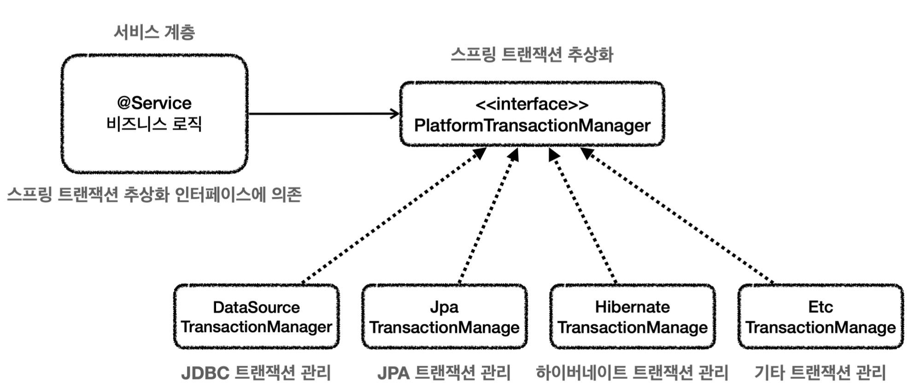
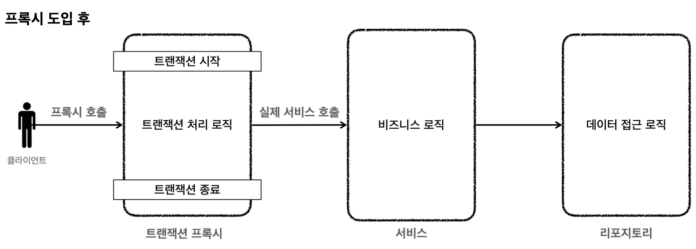
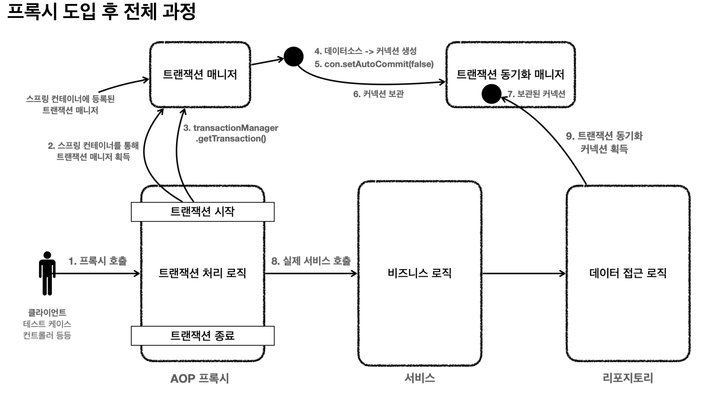
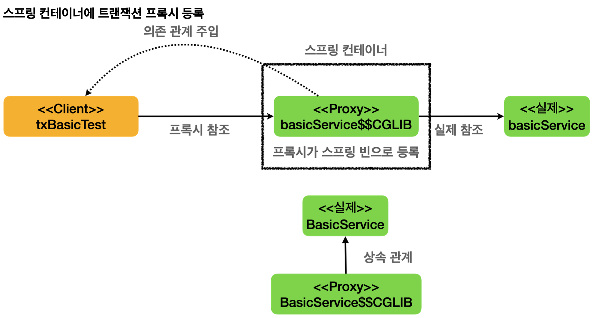
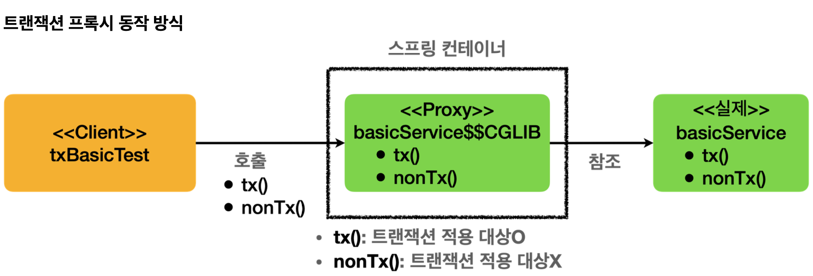
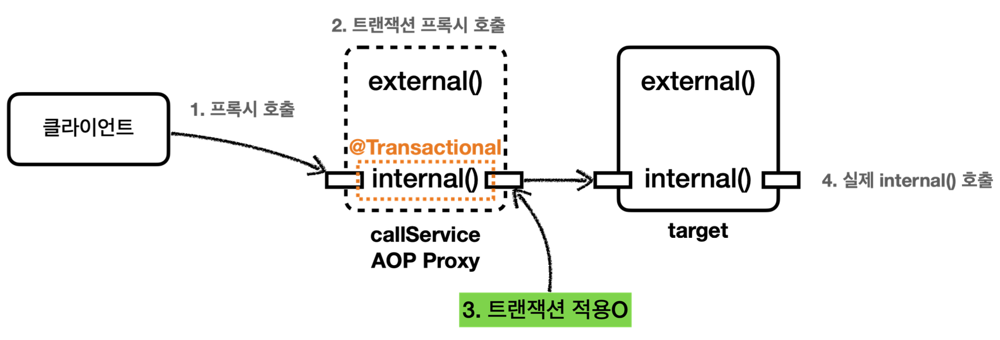
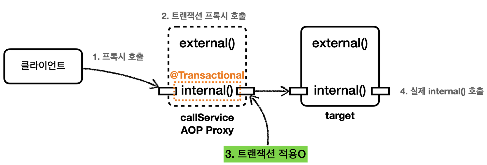
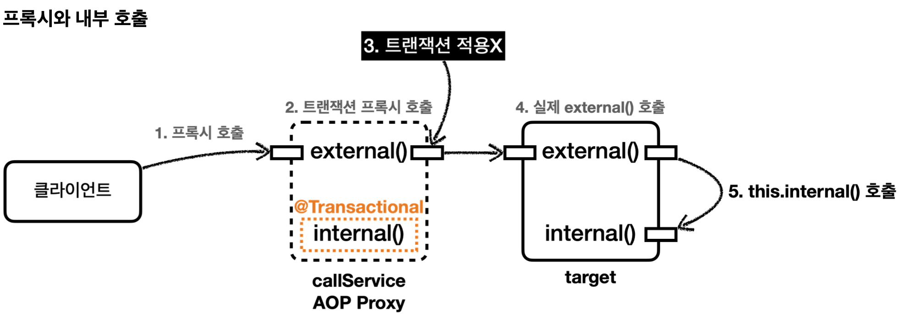
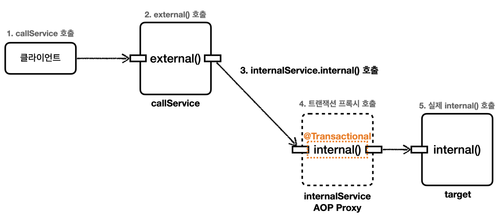

# 스프링 트랜잭션 이해

## 스프링 트랜잭션 간단 복습
### 스프링 트랜잭션 추상화
각각 데이터 접근 기술들은 트랜잭션을 처리하는 방식에 차이가 있다. JDBC와 JPA는 트랜잭션을 사용하는 코드 자체가 다르다.

**JDBC 트랜잭션 코드 예시**
~~~java
public void accountTransfer(String fromId, String toId, int money) throws SQLException {
     
    Connection con = dataSource.getConnection();
    try {
      con.setAutoCommit(false); //트랜잭션 시작 
      
      //비즈니스 로직
      bizLogic(con, fromId, toId, money); 
      con.commit(); //성공시 커밋
    } catch (Exception e) {
      con.rollback(); //실패시 롤백
      throw new IllegalStateException(e);
    } finally {
      release(con);
    } 
}
~~~

**JPA 트랜잭션 코드 예시**
~~~java
public static void main(String[] args) {
//엔티티 매니저 팩토리 생성
    EntityManagerFactory emf = Persistence.createEntityManagerFactory("jpabook");
    EntityManager em = emf.createEntityManager(); //엔티티 매니저 생성 
    EntityTransaction tx = em.getTransaction(); //트랜잭션 기능 획득

    try {

      tx.begin(); //트랜잭션 시작 
      logic(em); //비즈니스 로직 
      tx.commit();//트랜잭션 커밋

    } catch (Exception e) { 
      tx.rollback(); //트랜잭션 롤백

    } finally {
      em.close(); //엔티티 매니저 종료
    }

    emf.close(); //엔티티 매니저 팩토리 종료 
}
~~~
JDBC에서 JPA로 변경할 경우 트랜잭션 코드도 변경해야 한다.

스프링은 이런 문제를 해결하기 위해 `트랜잭션 추상화`를 제공한다. 트랜잭션을 사용하는 입장에서는 스프링 트랜잭션 추상화를 통해 둘을 동일한 방식으로 사용할 수 있다.

`PlatformTransactionManager`라는 인터페이스를 통해 트랜잭션을 추상화한다.
~~~java
public interface PlatformTransactionManager extends TransactionManager {
    TransactionStatus getTransaction(@Nullable TransactionDefinition definition) throws TransactionException;

    void commit(TransactionStatus status) throws TransactionException;

    void rollback(TransactionStatus status) throws TransactionException;
}
~~~
- 트랜잭션 획득, 커밋, 롤백으로 추상화 할 수 있다.

- 스프링은 트랜잭션을 추상화해서 제공할 뿐만 아니라, 실무에서 자주 사용하는 데이터 접근 기술에 대한 트랜잭션 매니저 구현체도 함께 제공한다. 필요한 구현체를 스프링 빈으로 등록하고 주입 받아 사용하기만 하면 된다.
- 스프링 부트는 어떤 데이터 접근 기술을 사용하는지를 자동으로 인식해 적절한 트랜잭션 매니저를 선택해 스프링 빈으로 등록해주기 때문에 트랜잭션 매니저를 선택하고 등록하는 과정을 생략할 수 있다.

### 스프링 트랜잭션 사용 방식
`PlaformTransactionManager`를 사용하는 방법에는 크게 두 가지 방법이 있다.
1. `선언적 트랜잭션 관리`(Declarative Transaction Management)
  - `@Transactional` 애노테이션 하나만 선언해 편리하게 트랜잭션을 적용하는 것을 말한다.
  - 과거 XML에 설정하기도 했다.
  - 어떠한 로직에 트랜잭션을 적용하겠다 라고 선언하기만 하면 트랜잭션이 적용되는 방식이다.
2. 프로그래밍 방식의 트랜잭션 관리(programmatic transaction management)
  - 트랜잭션 매니저 or 트랜잭션 템플릿 등을 사용해 트랜잭션 관련 코드를 직접 작성하는 것을 말한다.
  - 애플리케이션 코드가 트랜잭션이라는 기술 코드와 강하게 결합된다.

### 선언적 트랜잭션과 AOP
`@Transactional`을 사용하게되면 기본적으로 프록시 방식의 AOP가 적용된다.

- 프록시 도입 전: 서비스에 비즈니스 로직과 트랜잭션 처리 로직이 함께 섞여있다.
- 프록시 도입 후: 트랜잭션 프록시가 트랜잭션 처리 로직을 모두 가져간다. 트랜잭션 시작 후 실제 서비스를 대힌 호출한다.

- 트랜잭션은 커녁센에 `con.setAutocommit(false)`를 지정하며 시작한다.
- 같은 트랜잭션을 유지하기 위해서는 같은 데이터베이스 커넥션을 사용해야한다.
- 이를 위해 스프링 내부에서는 `트랜잭션 동기화 매니저`가 사용된다.
- 대부분의 데이터 접근 기술들은 트랜잭션을 유지하기 위해 내부에서 트랜잭션 동기화 매니저를 통해 커넥션을 동기화 한다.

### 스프링이 제공하는 트랜잭션 AOP
- 스프링은 트랜잭션 AOP를 처리하기 위한 모든 기능을 제공한다. 스프링 부트를 사용하면 트랜잭션 AOP를 처리하기 위해 필요한 스프링 빈들도 자동으로 등록해준다.
- 개발자는 트랜잭션 처리가 필요한 곳에 `@Transactional` 애노테이션만 붙여주면 된다. 스프링의 트랜잭션 AOP는 이 애노테이션을 인식해 트랜잭션을 처리하는 프록시를 적용해준다.

## 트랜잭션 적용 확인
`@Transactional`을 사용한 선언적 트랜잭션 방식을 사용하면 애노테이션 하나로 트랜잭션을 적용할 수 있었다. 그런데 이 기능은 트랜잭션 관련 코드가 눈에 보이지 않고 AOP를 기반으로 동작하기 때문에 실제로 트랜잭션이 적용되어있는지 확인하기가 어렵다.

스프링 트랜잭션이 실제로 적용되었는지 확인하는 방법을 알아보자

~~~java
@Slf4j
@SpringBootTest
public class TxBasicTest {

    @Autowired
    BasicService basicService;

    @Test
    void proxyCheck() {
        log.info("aop class={}", basicService.getClass());
        assertThat(AopUtils.isAopProxy(basicService)).isTrue();
    }

    @Test
    void txTest() {
        basicService.tx();
        basicService.nonTx();

    }

    @TestConfiguration
    static class TxApplyBasicConfig {

        @Bean
        BasicService basicService() {
            return new BasicService();
        }

    }

    @Slf4j
    static class BasicService {

        @Transactional
        public void tx() {
            log.info("call tx");
            boolean txActive = TransactionSynchronizationManager.isActualTransactionActive();
            log.info("tx active={}", txActive);
        }

        public void nonTx() {
            log.info("call nonTx");
            boolean txActive = TransactionSynchronizationManager.isActualTransactionActive();
            log.info("tx active={}", txActive);
        }
    }
}
~~~

### proxyCheck()
- `AopUtils.isAopProxy()`: 선언적 트랜잭션 방식에서 스프링 트랜잭션은 `AOP`를 기반으로 동작한다. 
- `@Transactional`을 메서드 혹은 클래스에 붙이게 되면 해당 객체는 `트랜잭션 AOP 적용 대상`이 되고 실제 객체 대신 트랜잭션을 처리해주는 `프록시 객체`가 스프링 빈에 등록된다. 주입받을 때 또한 실제 객체가 아닌 `프록시 객체`가 주입된다.
- 로그를 확인해보면 `aop class=class com.odg.springtx.apply.TxBasicTest$BasicService$$SpringCGLIB$$0` 처럼 프록스 클래스 이름이 출력되는 것을 확인할 수 있다.

### 스프링 컨테이너에 트랜잭션 프록시 등록

- `@Transactional` 애노테이션이 메서드 혹은 클래스에 하나라도 있으면 트랜잭션 AOP는 프록시를 만들어서 스프링 컨테이너에 등록한다. 그리고 실제 객체가 아닌 프록시 객체를 스프링 빈으로 등록한다. 그리고 내부에 실제 객체를 참조하게 된다.
- `txBasicTest`는 `@Autowired BasicService basicService`로 의존관계 주입을 요청한다. 스프링 컨테이너는 실제 객체 대신 프록시 객체가 스프링 빈으로 등록되어 있기 때문에 프록시 객체를 주입한다.
- 프록시는 `BasicService`를 상속해서 만들어지기 때문에 다형성을 활용할 수 있다. 따라서 BasicService 대신 `BasicService$$CGLIB`를 주입할 수 있다.

### 트랜잭션 프록시 동작 방식

#### basicService.tx()
- 클라이언트가 `basicService.tx()` 호출 시 프록시의 tx()가 호출된다. 여기서 프록시는 tx()가 트랜잭션을 사용할 수 있는지 확인한다. tx()에 `@Transactional`이 붙어있으므로 트랜잭션 적용 대상이다.
- 따라서 트랜잭션을 시작한 다음에 실제 basicService.tx()를 호출한다.
- 실제 basicService.tx() 호출이 끝나서 프록시로 제어가 돌아오면 프록시는 트랜잭션 로직을 커밋하거나 롤백해 트랜잭션을 종료한다.

#### basicService.nonTx()
- 클라이언트가 `basicService.nonTx()` 호출 시 프록시의 nonTx()가 호출된다. 여기서 nonTx()가 트랜잭션을 사용할 수 있는지 확인한다. nonTx()에는 `@Transactional` 애노테이션이 없으므로 적용 대상이 아니다.
- 따라서 트랜잭션을 시작하지 않고 basicService.nonTx()를 호출하고 종료한다.

#### TransactionSynchronizationManager isActualTransactionActive()
- 현재 쓰레드에 트랜잭션이 적용되어 있는지 확인할 수 있는 기능이다. true면 트랜잭션이 적용되어있는 것이다. 

~~~
TransactionInterceptor           : Getting transaction for [com.odg.springtx.apply.TxBasicTest$BasicService.tx]
TxBasicTest$BasicService     : call tx
TxBasicTest$BasicService     : tx active=true
TransactionInterceptor           : Completing transaction for [com.odg.springtx.apply.TxBasicTest$BasicService.tx]

TxBasicTest$BasicService     : call nonTx
TxBasicTest$BasicService     : tx active=false
~~~
- 로그를 확인해보면 tx() 호출 시 `tx active=true`가 출력된 것으로 보아 트랜잭션이 적용된 것을 확인할 수 있다.
- `TransactionInterceptor` 로그를 통해 트랜잭션 프록시가 트랜잭션을 시작하고 완료한 내용을 확인할 수 있다.
- nonTx() 호출 시 `tx active=false`를 통해 트랜잭션이 없는 것을 확인할 수 있다.

## 트랜잭션 적용 위치
스프링에서 우선순위는 `더 구체적이고 자세한 것이 우선순위를 가진다`라는 윈칙을 기억하자
~~~java
@SpringBootTest
public class TxLevelTest {

    @Autowired
    LevelService levelService;

    @Test
    void orderTest() {
        levelService.write();
        levelService.read();
    }

    @TestConfiguration
    static class TxLevelTestConfig {

        @Bean
        LevelService levelService() {
            return new LevelService();
        }
    }

    @Slf4j
    @Transactional(readOnly = true)
    static class LevelService {

        @Transactional(readOnly = false)
        public void write() {
            log.info("call write");
            printTxInfo();
        }

        public void read() {
            log.info("call read");
            printTxInfo();
        }

        private void printTxInfo() {
            boolean txActive = TransactionSynchronizationManager.isActualTransactionActive();
            log.info("tx active={}", txActive);

            boolean readOnly = TransactionSynchronizationManager.isCurrentTransactionReadOnly();
            log.info("tx readOnly={}", readOnly);
        }
    }
}
~~~

스프링의 `@Transactional`은 두 가지 규칙이 있다.
1. 우선순위 규칙
2. 클래스에 적용하면 메서드에 자동으로 적용된다.

### 우선순위
위 예제를 예를 들자.
- `LevelService`타입에 `@Transactional(readOnly=true)`가 붙어 있다.
- `write()` 메서드에 `@Transactional(readOnly=false)`가 붙어 있다.
  - 클래스보다 메서드가 더 구체적이므로 메서드에 있는 `@Transactional(readOnly=false)` 옵션을 사용한 트랜잭션이 적용된다.

### 클래스에 적용하면 메서드에 자동으로 적용된다
- `read()` 메서드에는 `@Transactional`이 없다. 이 경우 더 상위인 클래스를 확인한다
  - 클래스에 `@Transactional(readOnly=true)`가 적용되어있다. 따라서 트랜잭션에 적용되고 readOnly = true 옵션을 사용한다.

`TransactionSynchronizationManager.isCurrentTransactionReadOnly()`: 현재 트랜잭션에 적용된 readOnly 옵션 값을 반환한다.
~~~
TransactionInterceptor           : Getting transaction for [com.odg.springtx.apply.TxLevelTest$LevelService.write]
TxLevelTest$LevelService     : call write
TxLevelTest$LevelService     : tx active=true
TxLevelTest$LevelService     : tx readOnly=false
TransactionInterceptor           : Completing transaction for [com.odg.springtx.apply.TxLevelTest$LevelService.write]

TransactionInterceptor           : Getting transaction for [com.odg.springtx.apply.TxLevelTest$LevelService.read]
TxLevelTest$LevelService     : call read
TxLevelTest$LevelService     : tx active=true
TxLevelTest$LevelService     : tx readOnly=true
TransactionInterceptor           : Completing transaction for [com.odg.springtx.apply.TxLevelTest$LevelService.read]
~~~
- write()에는 `tx readOnly=false`: 읽기 쓰기 트랜잭션이 적용되어있다. readOnly가 아니다.
- read()에는 `tx readOnly=true`: 읽기 전용 트랜잭션 옵션인 readOnly가 적용되어있다.

### 인터페이스에 @Transactional 적용
인터페이스에도 `@Transactional`을 적용할 수 있다. 여기서도 구체적인 것이 높은 우선순위를 갖는다.
1. 클래스의 메서드 (우선순위 가장 높음)
2. 클래스의 타입
3. 인터페이스의 메서드 
4. 인터페이스의 타입 (우선순위 가장 낮음)
스프링 공식 메뉴얼에서는 권장하지 않는 방법이다. 가급적 구체 클래스에 적용하도록 하자.

## 트랜잭션 AOP 주의사항 - 프록시 내부 호출1
`@Transactional`을 사용하면 스프링의 트랜잭션 AOP가 적용된다. 트랜잭션 AOP는 기본적으로 프록시 방식의 AOP를 사용한다. `@Transactional` 적용 시 프록시 객체가 요청을 먼저 받아 트랜잭션을 처리하고 실제 객체를 호출해준다.  따라서 트랜잭션을 적용하려면 항상 프록시를 통해 대상 객체를 호출해야한다. 
이렇게 해야 프록시에서 먼저 트랜잭션을 적용하고 이후에 대상 객체를 호출하게 된다. 
만약 프록시를 거치지 않고 대상 객체를 직접 호출하게 되면 AOP가 적용되지 않고 트랜잭션도 적용되지 않는다.

실제 객체 내부에서 메서드 호출이 발생하게 되면 프록시를 거치지 않고 실제 객체를 호출하는 문제가 발생하게 된다. 이렇게 되면 `@Transactional`이 있어도 트랜잭션이 적용되지 않는다.

예제를 통해 확인해보자
~~~java
@Slf4j
@SpringBootTest
public class InternalCallV1Test {

    @Autowired
    CallService callService;

    @Test
    void printProxy() {
        log.info("callService  class={}", callService.getClass());
    }

    @Test
    void internalCall() {
        callService.internal();
    }

    @Test
    void externalCall() {
        callService.external();
    }

    @TestConfiguration
    static class InternalCallV1TestConfig {

        @Bean
        CallService callService() {
            return new CallService();
        }
    }

    @Slf4j
    static class CallService {

        public void external() {

            log.info("call external");
            printTxInfo();
            internal();
        }

        @Transactional
        public void internal() {
            log.info("call internal");
            printTxInfo();
        }

        private void printTxInfo() {
            boolean txActive = TransactionSynchronizationManager.isActualTransactionActive();
            log.info("tx active={}", txActive);

            boolean readOnly = TransactionSynchronizationManager.isCurrentTransactionReadOnly();
            log.info("tx readOnly={}", readOnly);
        }
    }
}
~~~
- external()은 트랜잭션이 없다.
- internal()은 `@Transactional`을 통해 트랜잭션을 적용한다.

`@Transactional`이 하나라도 있으면 트랜잭션 프록시 객체가 만들어진다. 그리고 callService 빈을 주입 받으면 트랜잭션 프록시 객체가 대신 주입된다.

`printProxy()`의 결과를 보면
~~~
callService  class=class com.odg.springtx.apply.InternalCallV1Test$CallService$$SpringCGLIB$$0
~~~
프록시 객체를 주입 받은 것을 확인할 수 있다.

### internal()
트랜잭션이 있는 코드인 internal()을 호출한다
~~~java
@Transactional
public void internal() {
    log.info("call internal");
    printTxInfo();
}
~~~

- callService.internal() 호출 -> callService는 트랜잭션 프록시이다.
- callService의 트랜잭션 프록시가 호출
- internal() 메서드에 `@Transactional`이 붙어 있으므로 트랜잭션 프록시는 트랜잭션을 적용
- 트랜잭션 적용 후 실제 callService 객체 인스턴스의 `internal()` 호출
- 실제 callService가 처리 완료하면 응답이 트랜잭션 프록시로 돌아오고 트랜잭션 프록시는 트랜잭션을 완료한다.

~~~
TransactionInterceptor           : Getting transaction for [com.odg.springtx.apply.InternalCallV1Test$CallService.internal]
InternalCallV1Test$CallService   : call internal
InternalCallV1Test$CallService   : tx active=true
TransactionInterceptor           : Completing transaction for [com.odg.springtx.apply.InternalCallV1Test$CallService.internal]
~~~
트랜잭션이 적용된 것을 확인할 수가 있다.

### external()
~~~java
public void external() {

    log.info("call external");
    printTxInfo();
    internal();
}

@Transactional
public void internal() {
    log.info("call internal");
    printTxInfo();
}
~~~

external()은 `@Transactional` 애노테이션이 없다. 따라서 트랜잭션 없이 시작한다. 그런데 내부에서 `@Transactional`이 있는 internal()을 호출하는 것을 확인할 수 있다.  
이 때 external()은 트랜잭션이 없지만, internal() 에서는 트랜잭션이 적용되는 것 처럼 보일 수 있다.

~~~
CallService   : call external
CallService   : tx active=false
CallService   : call internal
CallService   : tx active=false
~~~
로그를 보면 트랜잭션 관련한 출력결과가 보이지 않는다. 실제 callService에서 남긴 로그만 확인된다. `tx active=false`를 통해 트랜잭션이 수행되지 않은 것을 확인할 수가 있다.

왜 internal()에서 트랜잭션이 적용되지 않은것일까?

위 흐름을 분석하자면, 
- callService.external()을 호출한다. callService는 트랜잭션 프록시이다.
- callService의 트랜잭션 프록시가 호출된다.
- external()은 @Transactional이 없다. 따라서 트랜잭션 프록시는 트랜잭션을 적용하지 않는다.
- 트랜잭션을 적용하지 않고, 실제 callService 객체 인스턴스의 external()을 호출한다.
- external()은 내부에서 internal()을 호출하는데 여기서 문제가 생긴다.

**원인** 
자바에서는 메서드 앞에 별도 참조가 없으면 `this`가 생략되는데 자기 자신의 인스턴스를 가리킨다.  
결과적으로 `this.internal()`이 되는데 this는 자기 자신을 가리키므로 실제 대상 객체의 인스턴스를 뜻한다. 따라서 이러한 내부 호출은 프록시를 거치지 않게 되고 트랜잭션을 적용할 수 없다. 결과적으로 대상 객체의 internal()을 직접 호출하게 된 것이다.

프록시를 사용하면 메서드 내부 호출에 프록시를 적용할 수 없다.
이를 해결하기위한 방법 중 가장 간단한 방법은 internal()를 별도 클래스로 분리하는 것이다.

## 트랜잭션 AOP 주의사항 - 프록시 내부 호출 2
메서드 내부 호출로 인해 트랜잭션 프록시가 적용되지 않는 문제를 해결해보도록 하자.  
internal() 메서드를 별도 클래스로 분리하자.
~~~java
@Slf4j
@SpringBootTest
public class InternalCallV2Test {

    @Autowired
    CallService callService;

    @Test
    void printProxy() {
        log.info("callService  class={}", callService.getClass());
    }

    @Test
    void externalCallV2() {
        callService.external();
    }

    @TestConfiguration
    static class InternalCallV1TestConfig {

        @Bean
        CallService callService() {
            return new CallService(internalService());
        }

        @Bean
        InternalService internalService() {
            return new InternalService();
        }
    }

    @Slf4j
    @RequiredArgsConstructor
    static class CallService {

        private final InternalService internalService;

        public void external() {

            log.info("call external");
            printTxInfo();
            internalService.internal();
        }

        private void printTxInfo() {
            boolean txActive = TransactionSynchronizationManager.isActualTransactionActive();
            log.info("tx active={}", txActive);
        }
    }

    static class InternalService {
        @Transactional
        public void internal() {
            log.info("call internal");
            printTxInfo();
        }

        private void printTxInfo() {
            boolean txActive = TransactionSynchronizationManager.isActualTransactionActive();
            log.info("tx active={}", txActive);
        }
    }
}
~~~
- `InternalService` 클래스를 만들고 internal() 메서드를 여기로 옮겼다.
- 이렇게 메서드 내부 호출을 외부 호출로 변경했다.
- `CallService`에는 트랜잭션 관련 코드가 없으므로 트랜잭션 프록시가 적용되지 않는다.
- `InternalService`에는 트랜잭션 코드가 있어 트랜잭션 프록시가 적용된다.

호출 흐름을 분석해보자
- callService.external()을 호출
- callService는 실제 callService 객체 인스턴스이다.
- internalService는 트랜잭션 프록시 객체이다. internal() 메서드에 `@Transactional`이 붙어 있으므로 트랜잭션을 적용한다.
- 트랜잭션 적용 후 실제 internalService 객체 인스턴스의 internal()을 호출한다.

~~~
CallService   : call external
CallService   : tx active=false

TransactionInterceptor           : Getting transaction for [com.odg.springtx.apply.InternalCallV2Test$InternalService.internal]
InternalCallV2Test  : call internal
InternalCallV2Test  : tx active=true
TransactionInterceptor           : Completing transaction for [com.odg.springtx.apply.InternalCallV2Test$InternalService.internal]
~~~

### public 메서드만 트랜잭션 적용
스프링의 트랜잭션 AOP 기능은 public 메서드에서만 트랜잭션을 적용하도록 기본 설정이 되어있다.

클래스 레벨에 트랜잭션을 적용하게 되면 모든 메서드에 트랜잭션이 걸릴 수 있다. 그러면 트랜잭션을 의도하지 않는 곳까지 트랜잭션이 과도하게 적용이 된다. 트랜잭션은 주로 비즈니스 로직 시작점에 걸기 때문에 대부분 외부에 열어준 곳을 시작점으로 사용한다. 이러한 이유로 public 메서드에만 트랜잭션을 적용하도록 설정되어 있다.

public이 아닌 곳에 `@Transactional`이 붙어 있으면 예외가 발생하지 않고 트랜잭션 적용만 무시된다.