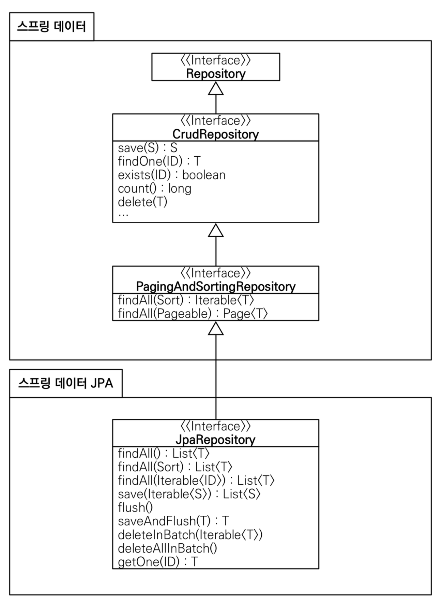
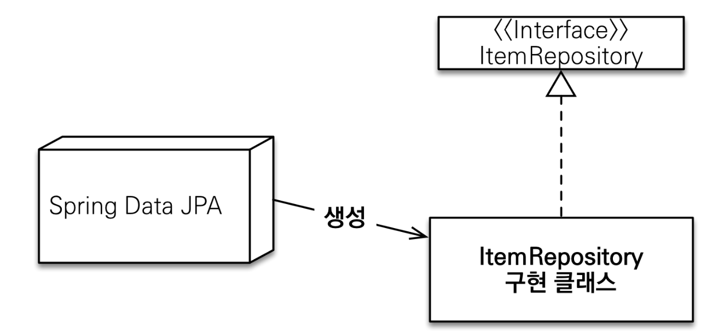
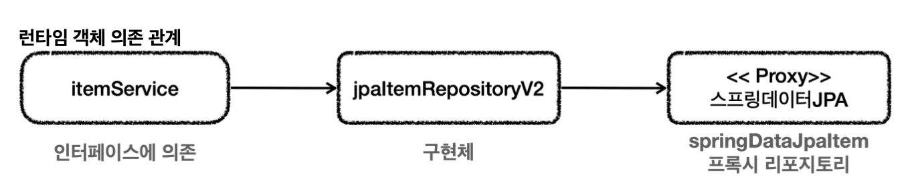

# 스프링 데이터 JPA
## 스프링 데이터 JPA 주요 기능
스프링 데이터 JPA는 JPA를 편리하게 사용할 수 있도록 도와주는 라이브러리이다. 수많은 편리한 기능을 제공하지만 대표적인 기능은 아래와 같다.

- 공통 인터페이스 기능
- 쿼리 메서드 기능

### 공통 인터페이스 기능

- `JpaRepository` 인터페이스를 통해 기본적인 CRUD 기능 제공
- 공통화 가능한 기능이 거의 모두 포함되어있다.
- `CrudRepository` 인터페이스에서 findOne() -> findById()로 변경되었음

**JpaRepository 사용방법**
~~~java
public interface ItemRepository extends JpaRepository<Item, Long> {}
~~~
- JpaRepository 인터페이스를 인터페이스 상속 받고, 제네릭에 관리할 <엔티티, 엔티티ID>를 넣어주면 된다.

- JpaRepository 인터페이스만 상속받으면 스프링 데이터 JPA가 프록시 기술을 사용해서 구현 클래스를 만들어준다. 만든 구현 클래스의 인스턴스를 만들어 스프링 빈으로 등록한다.
- 개발자는 구현 클래스 없이 인터페이스만으로 기본 CRUD 기능을 사용할 수 있다.

### 쿼리 메서드 기능
인터페이스에 메서드만 적어두면 메서드 이름을 분석해 쿼리를 자동으로 만들어주고 실행까지 해주는 기능을 제공한다.

**순수 JPA 리포지토리**
~~~java
public List<Member> findByUsernameAndAgeGreaterThan(String username, int age) {
     return em.createQuery("select m from Member m where m.username = :username and m.age > :age")
              .setParameter("username", username)
              .setParameter("age", age)
              .getResultList();
}
~~~
순수 JPA 사용 시 직접 JPQL을 작성하고 파라미터도 직접 바인딩 해야한다.

**스프링 데이터 JPA**
~~~java
public interface MemberRepository extends JpaRepository<Member, Long> {
  List<Member> findByUsernameAndAgeGreaterThan(String username, int age);
}
~~~
- 스프링 데이터 JPA는 메서드 이름을 분석해서 필요한 JPQL을 만들고 실행해준다. 이때 JPQL은 JPA가 SQL로 번역해서 실행한다.
- 아래와 같은 규칙으로 메서드를 정의해야 한다.

**스프링 데이터 JPA가 제공하는 쿼리 메소드 기능**
- 조회: `find...By`, `read...By`, `query...By`, `get..By``
  - `findHelloBy`와 같이 ...에 식별하기 위한 내용이 들어가도 된다.
- COUNT: `count...By` -> 반환타입 long
- EXISTS: `exists...By` -> 반환타입 boolean
- 삭제: `delete...By`, `remove...By` -> 반환타입 long
- DISTINCT: `findDistinct`, `findMemberDistinctBy`
- LIMIT: `findFirst3`, `findFirst`, `findTop`, `findTop3`

쿼리 메소드 필터 조건은 아래의 공식 문서를 참고하도록 하자 
https://docs.spring.io/spring-data/jpa/reference/#jpa.query-methods.query-creation

**JPQL 직접 사용하기**
~~~java
public interface SpringDataJpaItemRepository extends JpaRepository<Item, Long> { 
    //쿼리 메서드 기능
    List<Item> findByItemNameLike(String itemName);
    //쿼리 직접 실행
    @Query("select i from Item i where i.itemName like :itemName and i.price <= :price")
    List<Item> findItems(@Param("itemName") String itemName, @Param("price") Integer price);
}
~~~
- 쿼리 메서드 기능 대신 직접 JPQL을 사용하고자 할 때는 `@Query`와 함께 JPQL을 작성하면 된다. 이때 메서드 이름으로 실행하는 규칙은 무시된다.
- 스프링 데이터 JPA는 JPQL뿐만 아니라 JPA의 네이티브 쿼리 기능도 지원한다. JPQL 대신 SQL을 직접 작성할 수 있다.

## 스프링 데이터 JPA 적용 1
스프링 데이터 JPA는 `spring-boot-starter-data-jpa` 라이브러리를 `build.gradle`에 넣어주면 된다. 
여기에는 JPA, 하이버네이트, 스프링 데이터 JPA(spring-data-jpa), 그리고 스프링 JDBC 관련 기능도 포함되어있다.
~~~java
public interface SpringDataJpaItemRepository extends JpaRepository<Item, Long> {

    List<Item> findByItemNameLike(String itemName);

    List<Item> findByPriceLessThanEqual(Integer price);

    // 쿼리 메서드 (아래 메서드와 같은 기능 수행)
    List<Item> findByItemNameAndPriceLessThanEqual(String itemName, Integer price);

    // 쿼리 직접 실행
    @Query("select i from Item i where i.itemName like :itemName and i.price <= :price")
    List<Item> findItems(@Param("itemName") String itemName, @Param("price") Integer price);
}
~~~
- 스프링 데이터 JPA가 제공하는 JpaRepository 인터페이스를 인터페이스 상속 받으면 기본적인 CRUD 기능을 사용할 수 있다.
- 이름을 검색하거나 가격으로 검색하는 기능은 공통으로 제공할 수 있는 기능이 아니기 때문에 `쿼리 메서드` 기능을 사용하거나 `@Query`를 사용해서 직접 쿼리를 실행하면 된다.

위 예제에서는 데이터를 조건에 따라 분류해서 검색한다.
- 모든 데이터 조회
- 이름 조회
- 가격 조회
- 이름 + 가격 조회

**findAll()** 
코드에는 보이지 않지만 JpaRepository 인터페이스가 제공하는 기능이다. 
`select i from Item i` JPQL이 실행된다.

**findByItemNameLike()** 
이름 조건만 검색했을 때 사용하는 쿼리 메서드 
`select i from Item i where i.name like ?`

**findByPriceLessThanEqual()** 
가격 조건만 검색했을 때 사용하는 쿼리 메서드 
`select i from Item i where i.price <= ?`

**findByItemNameLikeAndPriceLessThanEqual()** 
이름과 가격 조건을 검색했을 때 사용하는 쿼리 메서드 
`select i from Item i where i.itemName like ? and i.price <= ?`

**findItems()** 
메서드 이름으로 쿼리를 실행하는 기능은 다음과 같은 문제점을 갖고 있다.
- 조건이 많으면 메서드 이름이 길어진다.
- 조인과 같은 복잡한 조건을 사용할 수 없다.

메서드 이름으로 쿼리를 실행하는 기능은 간단한 경우에는 유용하지만 복잡해지면 직접 JPQL를 작성하는 것이 좋다.
- 쿼리를 직접 실행하려면 `@Query` 애노테이션 사용
- 메서드 이름으로 쿼리를 실행할 때는 파라미터를 순서대로 입력하면 됐지만,
- 쿼리를 직접 실행할 때는 `@param("itemName")` 애노테이션을 사용해 파라미터를 명시적으로 바인딩 해야한다.

## 스프링 데이터 JPA 적용 2
~~~java
@Repository
@Transactional
@RequiredArgsConstructor
public class JpaItemRepositoryV2 implements ItemRepository {

    private final SpringDataJpaItemRepository repository;

    @Override
    public Item save(Item item) {
        return repository.save(item);
    }

    @Override
    public void update(Long itemId, ItemUpdateDto updateParam) {
        Item findItem = repository.findById(itemId).orElseThrow();
        findItem.setItemName(updateParam.getItemName());
        findItem.setPrice(updateParam.getPrice());
        findItem.setQuantity(updateParam.getQuantity());
    }

    @Override
    public Optional<Item> findById(Long id) {
        return repository.findById(id);
    }

    @Override
    public List<Item> findAll(ItemSearchCond cond) {
        String itemName = cond.getItemName();
        Integer maxPrice = cond.getMaxPrice();

        if (StringUtils.hasText(itemName) && maxPrice != null) {
//            return repository.findByItemNameAndPriceLessThanEqual("%" + itemName + "%", maxPrice);
            return repository.findItems("%" + itemName + "%", maxPrice);
        } else if (StringUtils.hasText(itemName)) {
            return repository.findByItemNameLike("%" + itemName + "%");
        } else if (maxPrice != null) {
            return repository.findByPriceLessThanEqual(maxPrice);
        } else {
            return repository.findAll();
        }

    }
}
~~~
- ItemService는 ItemRepository에 의존하고 있기 때문에 ItemService에서 SpringDataJpaRepository를 그대로 사용할 수 없다.
- ItemService가 SpringDataJpaItemRepository를 직접 사용하도록 코드를 수정해도 되지만, 지금 목표는 ItemService 코드 변경 없이 ItemService가 ItemRepository 의존관계를 유지하면서 DI를 통해 구현 기술을 변경하는 것이다.

새로운 리포지토리를 만들어서 이 문제를 해결하도록 하자. 이 리포지토리는 ItemRepository와 SpringDataJpaItemRepository 사이를 맞추기 위한 어댑터 역할을 한다.

- JpaItemRepositoryV2는 ItemRepository를 구현하고 SpringDataJpaItemRepository를 사용한다.

- 런타임의 객체 의존관계는 위와 같이 동작한다.

JpaItemRepositoryV2가 어댑터 역할을 해준 덕에 ItemService가 사용하는 ItemRepository 인터페이스를 그대로 유지할 수 있게 되었고 ItemService의 코드를 변경하지 않게 되었다.

### save()
~~~java
@Override
public Item save(Item item) {
    return repository.save(item);
}
~~~
- `repository.save(item)`
- 스프링 데이터 JPA가 제공하는 save()를 호출한다.

### update()
~~~java
@Override
public void update(Long itemId, ItemUpdateDto updateParam) {
    Item findItem = repository.findById(itemId).orElseThrow();
    findItem.setItemName(updateParam.getItemName());
    findItem.setPrice(updateParam.getPrice());
    findItem.setQuantity(updateParam.getQuantity());
}
~~~
- 스프링 데이터 JPA가 제공하는 findById() 메서드를 사용해 엔티티를 찾고 데이터를 수정한다.
- 이후 트랜잭션이 커밋될 때 변경 내용이 데이터베이스에 반영된다(JPA가 제공하는 기능)

### findById()
~~~java
@Override
public Optional<Item> findById(Long id) {
    return repository.findById(id);
}
~~~
- `repository.findById(itemId)`
- 스프링 데이터 JPA에서 제공하는 findById() 메서드를 사용해 엔티티를 찾는다.

### findAll()
~~~java
@Override
public List<Item> findAll(ItemSearchCond cond) {
    String itemName = cond.getItemName();
    Integer maxPrice = cond.getMaxPrice();

    if (StringUtils.hasText(itemName) && maxPrice != null) {
//            return repository.findByItemNameAndPriceLessThanEqual("%" + itemName + "%", maxPrice);
        return repository.findItems("%" + itemName + "%", maxPrice);
    } else if (StringUtils.hasText(itemName)) {
        return repository.findByItemNameLike("%" + itemName + "%");
    } else if (maxPrice != null) {
        return repository.findByPriceLessThanEqual(maxPrice);
    } else {
        return repository.findAll();
    }

}
~~~
데이터 조건에 따라 4가지로 분류해서 검색한다
- 모든 데이터 조회
- 이름 조회
- 가격 조회
- 이름 + 가격 조회

모든 조건 부합 시 `findByItemNameLikeAndPriceLessThanEqual()`을 사용해도 되고 `repository.findItems()`를 사용해도 되지만, 조건이 2개만 되어도 메서드 이름이 너무 길어지는 단점이 있다. 
결국, 스프링 데이터 JPA가 제공하는 메서드 이름으로 쿼리를 자동으로 만들어주는 기능과 `@Query`로 직접 쿼리를 작성하는 기능 중 선택이 필요하다.

또 위 코드는 동적 쿼리가 아닌 상황에 따라 스프링 데이터 JPA 메서드를 호출해서 비효율적인 코드이다. 스프링 데이터 JPA는 동적 쿼리 기능이 취약하다. 이러한 부분을 Querydsl을 사용해 개선할 수 있다.

이제 설정 후 실행까지 해보자
~~~java
@Configuration
@RequiredArgsConstructor
public class SpringDataJpaConfig {

    private final SpringDataJpaItemRepository springDataJpaItemRepository;

    @Bean
    public ItemService itemService() {
        return new ItemServiceV1(itemRepository());
    }

    @Bean
    public ItemRepository itemRepository() {
        return new JpaItemRepositoryV2(springDataJpaItemRepository);
    }
}
~~~
~~~java
@Slf4j
@Import(SpringDataJpaConfig .class)
@SpringBootApplication(scanBasePackages = "hello.itemservice.web")
public class ItemServiceApplication {}
~~~

스프링 데이터 JPA도 스프링 예외 추상화를 지원한다. 스프링 데이터 JPA가 만들어주는 프록시에서 이미 예외 변환을 처리하기 때문에 @Repository와 관계없이 예외가 변환된다.