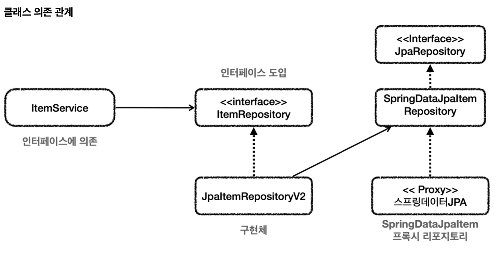
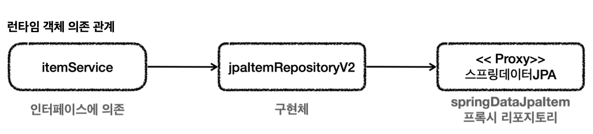
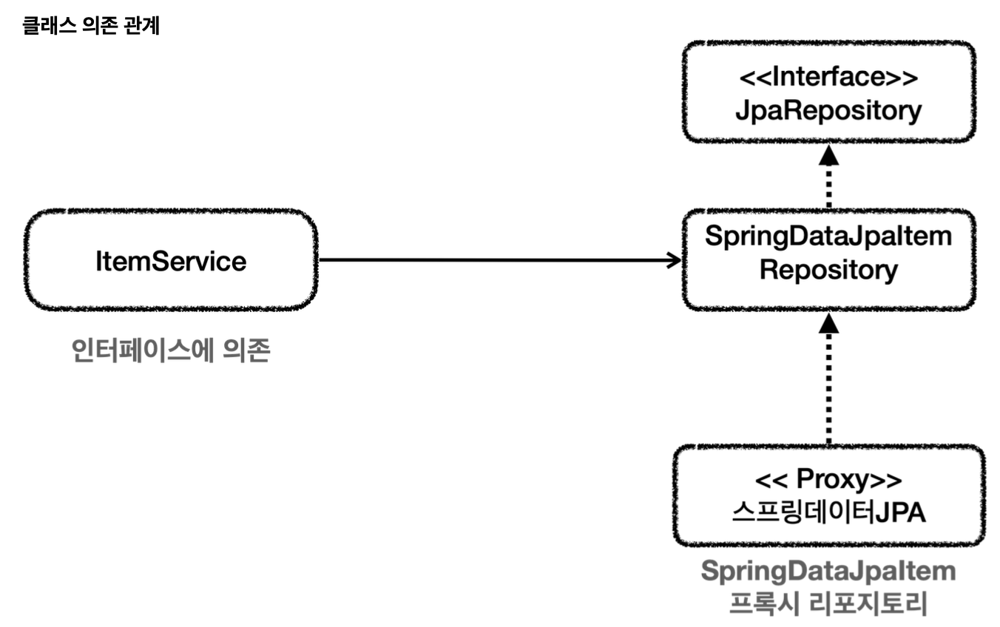
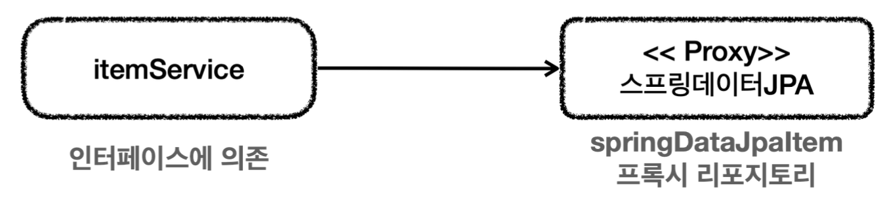
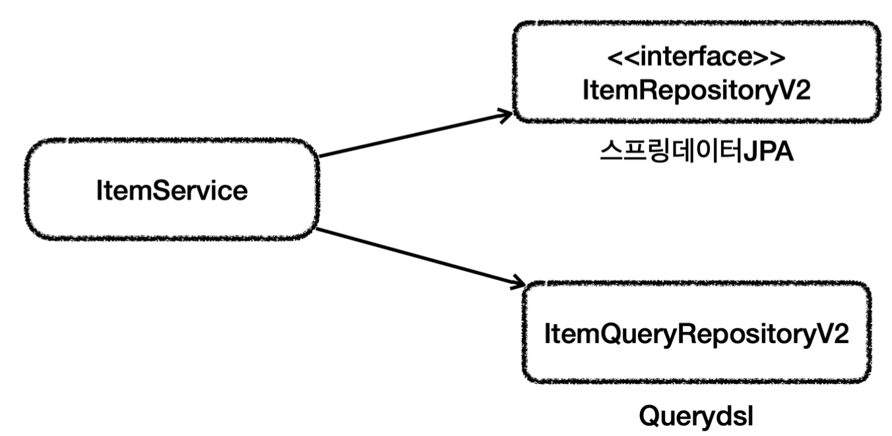

# 데이터 접근 기술 - 활용 방안
이전에 했던 스프링 데이터 JPA 예제를 떠올려보자.

- 중간에 `JpaItemRepositoryV2`가 어댑터 역할을 해준 덕에 ItemService를 사용하는 ItemRepository 인터페이스를 그대로 유지할 수 있고 클라이언트인 ItemService의 코드를 변경하지 않아도 되는 장점이 있었다.

- 하지만 구조를 맞추기 위해 중간에 어댑터가 들어가면서 전체 구조가 너무 복잡해지고 사용하는 클래스도 많아졌다.
- 유지보수 관점에서는 ItemService를 변경하지 않고, ItemRepository의 구현체를 변경할 수 있는 장점이 있었지만, 반대로 구조가 복잡해지면서 어댑터 코드와 실제 코드까지 함께 유지보수 해야 하는 단점이 생겼다.

이때 완전히 다른 선택이 가능하다. 
ItemService 코드를 일부 수정해 직접 스프링 데이터 JPA를 사용하는 방법이다.

- 이렇게 할 경우 ItemService의 코드를 변경해야한다.

이것이 트레이드 오프다.
- DI, OCP를 지키기 위해 어댑터를 도입하고 많은 코드를 유지한다.
- 어댑터를 제거하고 구조를 단순하게 가져가지만, DI, OCP를 포기하고 ItemService 코드를 직접 변경한다.

여기서 발생하는 트레이드 오프는 구조의 안정성 vs 단순한 구조와 편리성 사이의 선택이다. 상황마다 선택하는 방법이 달라질 뿐이지 어느 방법이 정답이라고 말할 수 없다.

## 실용적인 구조
스프링 데이터 JPA 기능을 최대한 살리면서 Querydsl도 편리하게 사용할 수 있는 구조를 만들어보자

이렇게 둘을 분리하면 기본 CRUD와 단순 조회는 스프링 데이터 JPA가 담당하고, 복잡한 조회 쿼리는 Querydsl이 담당하게 된다.

ItemService는 기존 ItemRepository를 사용할 수 없기 때문에 코드를 변경해야 한다.

~~~java
public interface ItemRepositoryV2 extends JpaRepository<Item, Long> {}
~~~
- 기본 CRUD는 이 기능을 사용하면 된다.

~~~java
@Repository
public class ItemQueryRepositoryV2 {

    private final JPAQueryFactory query;

    public ItemQueryRepositoryV2(EntityManager em) {
        this.query = new JPAQueryFactory(em);
    }

    public List<Item> findAll(ItemSearchCond cond) {
        return query.select(item)
                .from(item)
                .where(likeItemName(cond.getItemName()), maxPrice(cond.getMaxPrice()))
                .fetch();
    }

    private BooleanExpression maxPrice(Integer maxPrice) {
        if (maxPrice != null) {
            return item.price.loe(maxPrice);
        }

        return null;
    }

    private BooleanExpression likeItemName(String itemName) {
        if (StringUtils.hasText(itemName)) {
            return item.itemName.like("%" + itemName + "%");
        }

        return null;
    }

}
~~~
- Querydsl을 사용해 동적 쿼리 해결
- 복잡한 쿼리는 이 부분만 유지보수하면 된다.

~~~java
@Service
@RequiredArgsConstructor
@Transactional
public class ItemServiceV2 implements ItemService{

    private final ItemRepositoryV2 itemRepositoryV2;
    private final ItemQueryRepositoryV2 itemQueryRepositoryV2;

    @Override
    public Item save(Item item) {
        return itemRepositoryV2.save(item);
    }

    @Override
    public void update(Long itemId, ItemUpdateDto updateParam) {
        Item findItem = itemRepositoryV2.findById(itemId).orElseThrow();
        findItem.setItemName(updateParam.getItemName());
        findItem.setPrice(updateParam.getPrice());
        findItem.setQuantity(updateParam.getQuantity());

    }

    @Override
    public Optional<Item> findById(Long id) {
        return itemRepositoryV2.findById(id);
    }

    @Override
    public List<Item> findItems(ItemSearchCond cond) {
        return itemQueryRepositoryV2.findAll(cond);
    }
}
~~~

~~~java
@Configuration
@RequiredArgsConstructor
public class V2Config {

    private final EntityManager em;
    private final ItemRepositoryV2 itemRepositoryV2;

    @Bean
    public ItemService itemService() {
        return new ItemServiceV2(itemRepositoryV2, itemQueryRepositoryV2());
    }

    @Bean
    public ItemQueryRepositoryV2 itemQueryRepositoryV2() {
        return new ItemQueryRepositoryV2(em);
    }

    @Bean
    public ItemRepository itemRepository() {
        return new JpaItemRepositoryV3(em);
    }
}
~~~

## 다양한 데이터 접근 기술 조합
영한님의 추천은 JPA, 스프링 데이터 JPA, Querydsl을 기본으로 하고 복잡한 쿼리를 사용해야하는 경우에는 JdbcTemplate나 MyBatis를 함께 사용하는 것이다.

### 트랜잭션 매니저 선택
JPA, 스프링 데이터 JPA, Querydsl은 모두 JPA 기술을 사용하는 것이기 때문에 `JPATransactionManager`를 선택하면 된다. 이 기술을 사용하면 스프링 부트는 자동으로 `JpaTransactionManager`를 스프링 빈으로 등록한다.  
그런데 JdbcTemplate, MyBatis와 같은 기술은 내부에서 JDBC를 직접 사용하기 때문에 `DataSourceTransactionManager`를 사용한다.  
따라서 JPA와 JdbcTemplate 두 기술을 함께 사용하면 트랜잭션 매니저가 달라진다. 결국 트랜잭션을 하나로 묶을 수 없는 문제가 발생할 수 있는데 이는 걱정하지 않아도 된다.

### JpaTransactionManager
JpaTransactionManager는 DataSourceTransactionManager가 제공하는 기능도 대부분 제공한다. JPA기술 또한 DataSource와 JDBC 커넥션을 사용하기 때문이다. 결과적으로 JpaTransactionManager 하나만 스프링 빈에 등록하면 JPA, JdbcTemplate, MyBatis 모두 하나의 트랜잭션으로 묶어 사용할 수 있다.

주의할 점도 있다.  
JPA와 JdbcTemplate을 함께 사용할 경우 JPA 플러시 타이밍에 주의해야한다. JPA는 데이터를 변경하면 변경 사항을 즉시 데이터베이스에 반영하지 않는다. 기본적으로 트랜잭션이 커밋되는 시점에 변경 사항을 데이터베이스에 반영한다. 그래서 하나의 트랜잭션 안에서 JPA를 통해 데이터를 변경한 다음 JdbcTemplate을 호출하는 경우 JPA가 변경한 데이터를 읽지 못하는 문제가 발생한다.  
이러한 문제를 해결하기 위해서는 JPA 호출이 끝난 시점에 JPA가 제공하는 플러시라는 기능을 사용해 JPA의 변경 내역을 데이터베이스에 반영해주어야한다. 그래야 JdbcTemplate에서 JPA가 반영한 데이터를 사용할 수 있다.