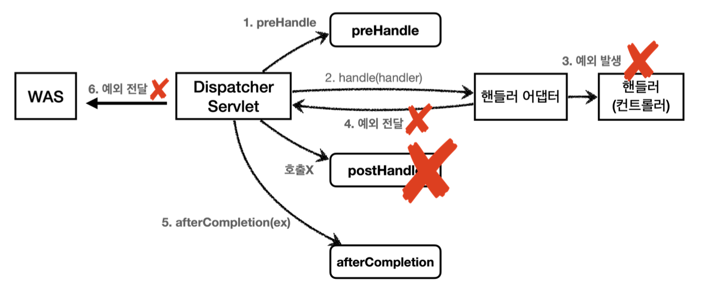
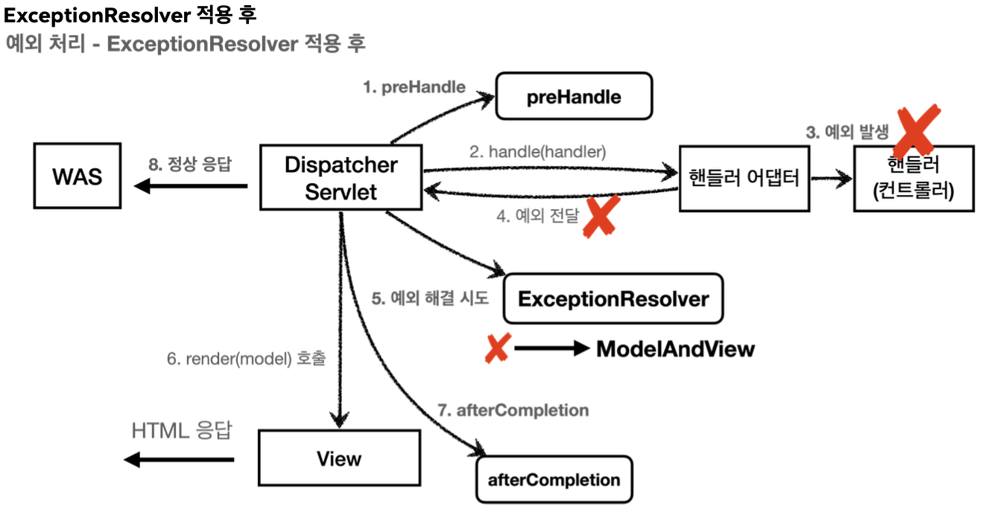

# API 예외 처리
API 예외 처리는 각 오류 상황에 맞는 오류 응답 스펙을 정하고 JSON으로 데이터를 내려줘야한다.

~~~java
@Component
public class WebServerCustomizer implements WebServerFactoryCustomizer<ConfigurableWebServerFactory> {

    @Override
    public void customize(ConfigurableWebServerFactory factory) {

        ErrorPage errorPage404 = new ErrorPage(HttpStatus.NOT_FOUND, "/error-page/404");
        ErrorPage errorPage500 = new ErrorPage(HttpStatus.INTERNAL_SERVER_ERROR, "/error-page/500");

        ErrorPage errorPageEx = new ErrorPage(RuntimeException.class, "/error-page/500");

        factory.addErrorPages(errorPage404, errorPage500, errorPageEx);
    }
}
~~~
- WAS에 예외가 전달되거나 response.sendError() 호출 시 등록한 예외 페이지 경로가 호출된다.

~~~java
@Slf4j
@RestController
public class ApiExceptionController {

    @GetMapping("/api/members/{id}")
    public MemberDto getMember(@PathVariable("id") String id) {

        if (id.equals("ex")) {
            throw new RuntimeException("잘못된 사용자");
        }

        return new MemberDto(id, "hello " + id);
    }

    @Data
    @AllArgsConstructor
    static class MemberDto {

        private String memberId;
        private String name;
    }
}
~~~

아이디가 ex인 경우 예외가 발생하도록 하였다.

http://localhost:8080/api/members/odgman 요청 시
~~~JSON
{
    "memberId": "odgman",
    "name": "hello odgman"
}
~~~
- API로 요청했는데 정상일 경우 API로 JSON 형식으로 데이터가 정상 반환된다.

http://localhost:8080/api/members/ex 예외 발생
~~~html
<!DOCTYPE HTML>
<html xmlns:th="http://www.thymeleaf.org">
<head>
    <meta charset="utf-8">
</head>
<body>

    

        <h2>500 오류 화면</h2> 

    

        
오류 화면 입니다.

    

    

 <!-- /container -->
</body>
</html>
~~~
- 오류 발생 시 미리 만들어두었던 오류 페이지가 반환된다.
- 기대한 것은 JSON이 반환되는 것이다.

JSON 응답을 할 수 있도록 수정하자
~~~java
@RequestMapping(value = "/error-page/500", produces = MediaType.APPLICATION_JSON_VALUE)
public ResponseEntity<Map<String, Object>> errorPage500Api(
        HttpServletRequest request, HttpServletResponse response) {

    log.info("API errorPage 500");
    HashMap<String, Object> result = new HashMap<>();
    Exception ex = (Exception) request.getAttribute(ERROR_EXCEPTION);
    result.put("status", request.getAttribute(ERROR_STATUS_CODE));
    result.put("message", ex.getMessage());

    Integer statusCode = (Integer) request.getAttribute(RequestDispatcher.ERROR_STATUS_CODE);
    return new ResponseEntity<>(result, HttpStatus.valueOf(statusCode));
}
~~~
- `@RequestMapping(value = "/error-page/500", produces = MediaType.APPLICATION_JSON_VALUE)`: HTTP 헤더의 Accept값이 application/json 일 때 해당 메서드가 호출된다. 즉 클라이언트가 받고 싶은 미디어타입이 json이면 이 컨트롤러의 메서드가 호출된다.

응답 데이터를 위해 Map을 만들고 status, message키에 값을 할당했다. 
ResponseEntity를 사용해서 응답하기 때문에 메시지 컨버터가 동작하면서 클라이언트에 JSON이 반환된다.

http://localhost:8080/api/members/ex
~~~
{
    "message": "잘못된 사용자",
    "status": 500
}
~~~

## API 예외 처리 - 스프링 부트 기본 오류 처리
API 예외 처리도 스프링 부트가 제공하는 기본 오류 방식을 사용할 수 있다.

**BasicErrorController 코드 일부 발췌**
~~~java
@RequestMapping(
        produces = {"text/html"}
    )
public ModelAndView errorHtml(HttpServletRequest request, HttpServletResponse response) {
    HttpStatus status = this.getStatus(request);
    Map<String, Object> model = Collections.unmodifiableMap(this.getErrorAttributes(request, this.getErrorAttributeOptions(request, MediaType.TEXT_HTML)));
    response.setStatus(status.value());
    ModelAndView modelAndView = this.resolveErrorView(request, response, status, model);
    return modelAndView != null ? modelAndView : new ModelAndView("error", model);
}

@RequestMapping
public ResponseEntity<Map<String, Object>> error(HttpServletRequest request) {
    HttpStatus status = this.getStatus(request);
    if (status == HttpStatus.NO_CONTENT) {
        return new ResponseEntity(status);
    } else {
        Map<String, Object> body = this.getErrorAttributes(request, this.getErrorAttributeOptions(request, MediaType.ALL));
        return new ResponseEntity(body, status);
    }
}
~~~
/error 동일한 경로를 처리하는 errorHtml(), error() 두 메서드를 확인할 수 있다.
- errorHtml(): 클라이언트 요청의 Accept 해더 값이 text/html인 경우 errorHtml()이 호출되어 view를 반환한다.
- error(): 그 외 경우 호출되고 ResponseEntity로 HTTP Body에 JSON 데이터를 반환한다.

### 스프링 부트의 예외 처리
스프링 부트의 기본 설정은 오류 발생 시 /error를 오류 페이지로 요청한다.
~~~java
@Controller
@RequestMapping({"${server.error.path:${error.path:/error}}"})
public class BasicErrorController extends AbstractErrorController {
}
~~~

http://localhost:8080/api/members/ex 예외 발생
~~~json
{
    "timestamp": "2024-07-31T07:44:29.826+00:00",
    "status": 500,
    "error": "Internal Server Error",
    "exception": "java.lang.RuntimeException",
    "path": "/api/members/ex"
}
~~~

### HTML 페이지 vs API 오류
BasicErrorController를 확장하면 JSON 메시지도 변경이 가능하지만 `@ExceptionHandler`가 제공하는 기능을 사용하는 것이 더 나은 방법이다.

오류 페이지를 보여줘야 할 때는 BasicErrorController를 사용하고 API 오류 처리는 `@ExceptionHandler`를 사용하자

## API 예외 처리 - HandlerExceptionResolver 
발생하는 예외에 따라 다른 상태 코드로 처리하고 싶다. 오류 메시지, 형식등을 API마다 다르게 처리하고자 한다.

IllegalArgumentException을 처리하지 못해서 컨트롤러 밖으로 넘어가는 일이 생긴다면 HTTP 상태코드를 400으로 처리하고자 한다.

~~~java
@GetMapping("/api/members/{id}")
public MemberDto getMember(@PathVariable("id") String id) {

    if (id.equals("ex")) {
        throw new RuntimeException("잘못된 사용자");
    }

    if (id.equals("bad")) {
        throw new IllegalArgumentException("잘못된 입력 값");
    }

    return new MemberDto(id, "hello " + id);
}
~~~

http://localhost:8080/api/members/bad 호출 시
~~~json
{
     "status": 500,
     "error": "Internal Server Error",
     "exception": "java.lang.IllegalArgumentException",
     "path": "/api/members/bad"
}
~~~
상태코드가 500이다.

### HandlerExceptionResolver
스프링 MVC는 컨트롤러 밖으로 예외가 던져진 경우 예외를 해결하고, 동작을 새롭게 정의할 수 있는 방법을 제공한다. 컨트롤러 밖으로 던져진 예외를 해결하고 동작 방식을 변경하고자 한다면 `HandlerExceptionResolver`를 사용하면 된다.

ExceptionResolver라고 부르기로 하자.

ExceptionResolver 적용 전 흐름

ExceptionResolver 적용 후 흐름

여기서도 postHandle()은 호출되지 않는다.

~~~java
public interface HandlerExceptionResolver {
    @Nullable
    ModelAndView resolveException(HttpServletRequest request, HttpServletResponse response, @Nullable Object handler, Exception ex);
}
~~~
- handler: 핸들러(컨트롤러) 정보
- ex: 핸들러(컨트롤러)에서 발생한 예외

~~~java
@Slf4j
public class MyHandlerExceptionResolver implements HandlerExceptionResolver {

    @Override
    public ModelAndView resolveException(HttpServletRequest request, HttpServletResponse response, Object handler, Exception ex) {

        log.info("call resolver={}", ex);

        try {
            if (ex instanceof IllegalArgumentException) {
                log.info("IllegalArgumentException resolver to 400");
                response.sendError(HttpServletResponse.SC_BAD_REQUEST, ex.getMessage());
                return new ModelAndView();
            }

        } catch (IOException e) {
            log.error("resolver ex", e);
        }

        return null;
    }
}
~~~
- `ModelAndView`를 반환하는 이유는 try, catch 하듯이 exception을 처리해서 정상 흐름처럼 변경하는 것이 목적이기 때문이다.
- ExceptionResolver는 말그대로 Exception을 Resolver 해주는 역할이다.

#### 반환 값에 따른 동작 방식
`HandlerExceptionResolver`의 반환 값에 따른 `DispatcherServlet`의 동작 방식은 아래와 같다.
- 비어있는 ModelAndView: 뷰를 렌더링 하지 않고, 정상 흐름으로 서블릿이 리턴된다.
- ModelAndView 지정: 뷰를 렌더링해준다.
- null: 다음 ExceptionResolver를 찾아 실행한다. 처리할 수 있는 ExceptionResolver가 없으면 예외 처리가 안되고 기존에 발생한 예외를 서블릿 밖으로 던진다.

#### ExceptionResolver 활용
- 예외 상태 코드 반환
    - 예외를 response.sendError() 호출로 변경해 서블릿에서 상태 코드에 따른 오류를 처리하도록 위임
    - 이후에 WAS는 서블릿 오류 페이지를 찾아 내부 호출, 예를 들면 스프링 부트가 기본으로 설정한 /error가 호출
- 뷰 템플릿 처리
    - ModelAndView에 값을 채워 예외에 따른 새로운 오류 화면 뷰 렌더링해서 고객에게 제공
- API 응답 처리
    - `response.getWriter().println()`처럼 HTTP 응답 바디에 직접 데이터를 넣어줄 수도 있다. 여기에 JSON으로 응답하면 API 응답 처리가 가능하다.

~~~java
@Configuration
public class WebConfig implements WebMvcConfigurer {

    @Override
    public void extendHandlerExceptionResolvers(List<HandlerExceptionResolver> resolvers) {
        resolvers.add(new MyHandlerExceptionResolver());

    }

}
~~~

- `http://localhost:8080/api/members/ex`
~~~json
{
    "timestamp": "2024-08-01T05:11:19.494+00:00",
    "status": 500,
    "error": "Internal Server Error",
    "exception": "java.lang.RuntimeException",
    "path": "/api/members/ex"
}
~~~

-`http://localhost:8080/api/members/bad`
~~~json
{
    "timestamp": "2024-08-01T05:11:39.751+00:00",
    "status": 400,
    "error": "Bad Request",
    "exception": "java.lang.IllegalArgumentException",
    "path": "/api/members/bad"
}
~~~

## API 예외 처리 - HandlerExceptionResolver 활용
ExceptionResolver를 활용한다면 예외가 발생했을 때 복잡한 과정 없이 여기에서 문제를 깔끔하게 해결할 수 있다.

~~~java
public class UserException extends RuntimeException {

    public UserException() {
        super();
    }

    public UserException(String message) {
        super(message);
    }

    public UserException(String message, Throwable cause) {
        super(message, cause);
    }

    public UserException(Throwable cause) {
        super(cause);
    }

    protected UserException(String message, Throwable cause, boolean enableSuppression, boolean writableStackTrace) {
        super(message, cause, enableSuppression, writableStackTrace);
    }
}
~~~
- 사용자 정의 예외

~~~java
@Slf4j
@RestController
public class ApiExceptionController {

    @GetMapping("/api/members/{id}")
    public MemberDto getMember(@PathVariable("id") String id) {

        if (id.equals("ex")) {
            throw new RuntimeException("잘못된 사용자");
        }

        if (id.equals("bad")) {
            throw new IllegalArgumentException("잘못된 입력 값");
        }

        if (id.equals("user-ex")) {
            throw new UserException("사용자 오류");
        }

        return new MemberDto(id, "hello " + id);
    }

    @Data
    @AllArgsConstructor
    static class MemberDto {

        private String memberId;
        private String name;
    }
}
- 사용자 정의 예외 추가

~~~java
@Slf4j
public class UserHandlerExceptionResolver implements HandlerExceptionResolver {

    private final ObjectMapper objectMapper = new ObjectMapper();

    @Override
    public ModelAndView resolveException(HttpServletRequest request, HttpServletResponse response, Object handler, Exception ex) {

        try {

            if (ex instanceof UserException) {
                log.info("UserException resolver to 400");
                String acceptHeader = request.getHeader("accept");
                response.setStatus(HttpServletResponse.SC_BAD_REQUEST);

                if ("application/json".equals(acceptHeader)) {
                    Map<String, Object> errorResult = new HashMap<>();
                    errorResult.put("ex", ex.getClass());
                    errorResult.put("message", ex.getMessage());

                    String result = objectMapper.writeValueAsString(errorResult);

                    response.setContentType("application/json");
                    response.setCharacterEncoding("utf-8");
                    response.getWriter().write(result);

                    return new ModelAndView();
                } else {
                    return new ModelAndView("error/500");
                }
            }

        } catch (IOException e) {
            log.error("resolver ex", e);
        }

        return null;
    }
}
~~~
- 사용자 예외를 처리하는 `UserHandlerExceptionResolver`
- HTTP 요청 헤더의 ACCEPT 값이 `application/json`이면 JSON으로 오류를 내려주고, 그 외는 `error/500`에 있는 HTML 오류 페이지를 보여준다.

WebConfig에 UserHandlerExceptionResolver 추가
~~~java
@Override
public void extendHandlerExceptionResolvers(List<HandlerExceptionResolver> resolvers) {
    resolvers.add(new MyHandlerExceptionResolver());
    resolvers.add(new UserHandlerExceptionResolver());

}
~~~

ExceptionResolver를 사용하면 컨트롤러에서 예외가 발생하더라도 ExceptionResolver에서 예외를 처리해버린다. 예외가 발생해도 서블릿 컨테이너까지 가지 않고 스프링 MVC에서 예외 처리는 끝이 난다. WAS 입장에서는 정상 처리가 된 것이다. 즉, 이곳에서 예외를 모두 처리할 수 있다.

