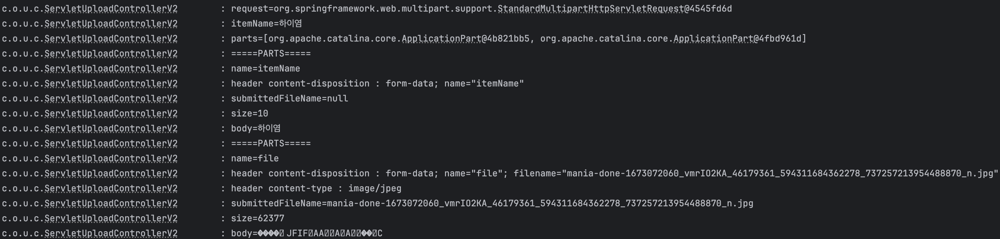
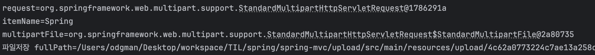

# 파일 업로드

## HTML Form 데이터 전송
`application/x-www-form-urlencoded` 방식은 HTML 폼 데이터를 서버로 전송하는 가장 기본적인 방법이다. Form태그에 별도 enctype 옵션이 없으면 HTTP 메시지의 헤더에 `Content-type: application/x-www-form-urlencoded`를 추가한다.

그리고 폼에 입력한 전송할 데이터를 HTTP Body에 문자로 `name=oh&age=20` 처럼 &로 구분해서 전송한다.

파일을 업로드하려면 바이너리 데이터를 전송해야한다. 위 방법으로는 파일을 전송하기 어렵다. 거기다 문자와 바이너리를 동시에 전송해야 하는 상황도 발생한다.

이 때 HTTP는 `multipart/form-data`라는 전송 방식을 제공한다. 이 방식은 다른 종류의 여러 파일과 폼의 내용을 함께 전송할 수 있다.

HTTP 메시지를 보면 각각의 전송 항목이 구분되어있다. `Content-Disposition`이라는 항목별 헤더가 추가되어 있고 여기에 부가 정보가 있다.

## 서블릿과 파일 업로드1
~~~java
@Slf4j
@Controller
@RequestMapping("/servlet/v1")
public class ServletUploadControllerV1 {

    @GetMapping("/upload")
    public String newFile() {
        return "upload-form";
    }

    @PostMapping("/upload")
    public String saveFileV1(HttpServletRequest request) throws ServletException, IOException {
        log.info("request={}", request);

        String itemName = request.getParameter("itemName");
        log.info("itemName={}", itemName);

        Collection<Part> parts = request.getParts();
        log.info("parts={}", parts);

        return "upload-form";
    }
}
~~~

- `request.getParts()`: `multipart/form-data` 전송 방식에서 각각 나누어진 부분을 받을 수 있음
~~~
Content-Type: multipart/form-data; boundary=----WebKitFormBoundary880cHOzWwOFbwvC9

------WebKitFormBoundary880cHOzWwOFbwvC9
Content-Disposition: form-data; name="itemName"

dd
------WebKitFormBoundary880cHOzWwOFbwvC9
Content-Disposition: form-data; name="file"; filename="9af654e1c9bc54f76cadf1bfdda1b929.JPG"
Content-Type: image/jpeg
~~~

### 멀티파트 사용 옵션
~~~
spring.servlet.multipart.max-file-size=1MB
spring.servlet.multipart.max-request-size=10MB
~~~
업로드 사이즈를 제한할 수 있다.
- max-file-size: 파일 하나의 최대 사이즈
- max-request-size: 업로드 파일 사이즈 전체의 합

## 서블릿과 파일 업로드 2

파일을 업로드 하기 위해 경로가 필요하다

**application.properties**
~~~
file.dir=파일 업로드 경로
~~~
폴더를 미리 만들어 두자

~~~java
@Slf4j
@Controller
@RequestMapping("/servlet/v2")
public class ServletUploadControllerV2 {

    @Value("${file.dir}")
    private String fileDir;

    @GetMapping("/upload")
    public String newFile() {

        return "upload-form";
    }

    @PostMapping("/upload")
    public String saveFileV2(HttpServletRequest request) throws ServletException, IOException {
        log.info("request={}", request);

        String itemName = request.getParameter("itemName");
        log.info("itemName={}", itemName);

        Collection<Part> parts = request.getParts();
        log.info("parts={}", parts);

        for (Part part : parts) {
            log.info("=====PARTS=====");
            log.info("name={}", part.getName());

            Collection<String> headerNames = part.getHeaderNames();
            for (String headerName : headerNames) {
                log.info("header {} : {}", headerName, part.getHeader(headerName));
            }

            // 편의 메서드
            // content-disposition; filename
            log.info("submittedFileName={}", part.getSubmittedFileName());
            log.info("size={}", part.getSize());

            // 데이터 읽기
            InputStream inputStream = part.getInputStream();
            String body = StreamUtils.copyToString(inputStream, StandardCharsets.UTF_8);
            log.info("body={}", body);

            //파일에 저장하기
            if (StringUtils.hasText(part.getSubmittedFileName())) {
                String fullPath = fileDir + part.getSubmittedFileName();
                log.info("파일 저장 fullPath={}", fullPath);

                part.write(fullPath);
            }

        }

        return "upload-form";
    }
}
~~~
~~~java
@Value("${file.dir}")
private String fileDir;
~~~
`application.properties`에서 설정한 `file.dir`의 값을 주입

멀티파트 형식은 전송된 데이터를 하나하나 part로 나눠 전송한다. parts에는 나누어진 데이터가 각각 담기게 된다.

**Part 주요 메서드**
- `part.getSubmmittedFileName()`: 클라이언트가 전달한 파일명
- `part.getInputStream()`: Part의 전송 데이터를 읽을 수 있다.
- `part.write()`: part를 통해 전송된 데이터를 저장할 수 있음

서블릿이 Part를 제공하여 편리하긴 하지만 HttpServletRequest를 사용해야 하고, 파일 부분만 필요하다면 여러 코드를 또 넣어야 한다. 

스프링은 어떻게 해서 이런 부분을 해소할까??

## 스프링과 파일 업로드
스프링은 `MultipartFile` 이라는 인터페이스로 멀티파트 파일을 매우 편리하게 지원한다.

~~~java
@Slf4j
@Controller
@RequestMapping("/spring")
public class SpringUploadController {

    @Value("${file.dir}")
    private String fileDir;

    @GetMapping("/upload")
    public String newFile() {
        return "upload-form";
    }

    @PostMapping("/upload")
    public String saveFile(
            @RequestParam String itemName,
            @RequestParam MultipartFile file,
            HttpServletRequest request) throws IOException {

        log.info("request={}", request);
        log.info("itemName={}", itemName);
        log.info("multipartFile={}", file);

        if (!file.isEmpty()) {
            String fullPath = fileDir + file.getOriginalFilename();
            log.info("파일저장 fullPath={}", fullPath);
            file.transferTo(new File(fullPath));
        }

        return "upload-form";
    }
}
~~~
- HTML Form의 name에 맞춰주었다. `@RequestParam MultipartFile file`
- @ModelAttribute에서도 MultipartFile을 동일하게 사용가능

**MultipartFile 주요 메서드**
- file.getOriginFilename(): 업로드 파일 명
- file.transferTo(...): 파일 저장

