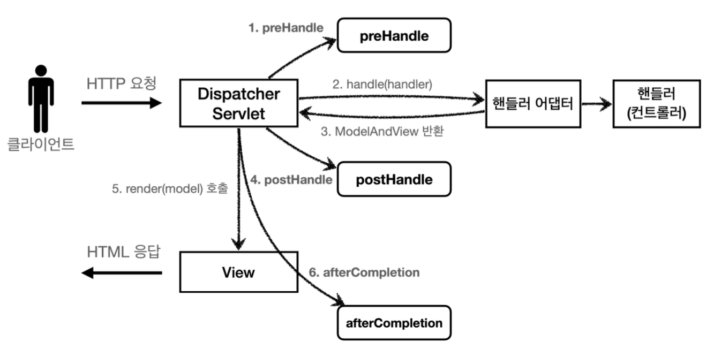
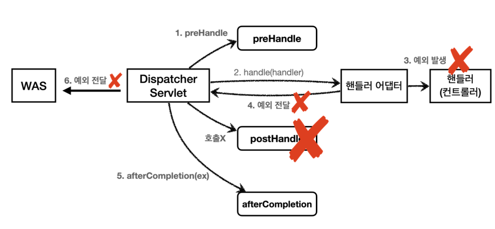

# 로그인 처리 2 - 필터, 인터셉터
로그인 한 사용자에게만 상품 관리 페이지에 들어갈 수 있게 처리하고자한다.
컨트롤러에서 로그인 여부를 체크하는 로직을 작성해주면 되겠지만 모든 컨트롤러 로직에서 공통으로 로그인 여부를 확인해야한다. 로그인과 관련된 로직이 변경될 때 작성했던 로직들을 모두 수정해야한다.

애플리케이션 여러 로직에서 공통으로 관심 있는 것을 공통 관심사라고 한다. 여기서는 등록, 수정, 삭제, 조회 등 여러 로직에서 공통으로 인증에 대해 관심을 갖고 있다.

여기서는 필터와 인터셉터를 사용해보도록 하자

## 서블릿 필터
~~~
HTTP 요청 -> WAS -> 필터 -> 서블릿 -> 컨트롤러
~~~
필터 적용 시 필터가 호출된 다음 서블릿이 호출된다.

필터 제한
~~~
로그인 사용자
HTTP 요청 -> WAS -> 필터 -> 서블릿 -> 컨트롤러

비 로그인 사용자
HTTP 요청 -> WAS -> 필터(적절치 못한 요청, 서블릿 호출 x)
~~~

필터 체인
~~~
HTTP 요청 -> WAS -> 필터1 -> 필터2 -> 필터3 -> 서블릿 -> 컨트롤러
~~~
필터는 체인으로 구성, 필터를 추가할 수 있다
~~~java
public interface Filter {
  public default void init(FilterConfig filterConfig) throws ServletException{}
  
  public void doFilter(ServletRequest request, ServletResponse response, FilterChain chain) throws IOException, ServletException;
  
  public default void destroy() {}
}
~~~
- init(): 필터 초기화 메서드, 서블릿 컨테이너가 생성될 때 호출
- doFilter(): 요청이 올 때마다 이 메서드가 호출, 필터 로직을 구현하면 된다.
- destory(): 필터 종료 메서드, 서블릿 컨테이너가 종료될 때 호출

## 서블릿 필터 - 요청 로그
~~~java
@Slf4j
public class LogFilter implements Filter {

  @Override
  public void init(FilterConfig filterConfig) throws ServletException {

      log.info("log filter init");
  }

  @Override
  public void doFilter(ServletRequest request, ServletResponse response, FilterChain filterChain) throws IOException, ServletException {
      log.info("log filter doFilter");

      HttpServletRequest httpRequest = (HttpServletRequest) request;
      String requestURI = httpRequest.getRequestURI();

      String uuid = UUID.randomUUID().toString();

      try {
          log.info("REQUEST [{}][{}]", uuid, requestURI);
          filterChain.doFilter(request, response);
      } catch (Exception e) {
          throw e;
      } finally {
          log.info("RESPONSE [{}][{}]", uuid, requestURI);
      }
  }

  @Override
  public void destroy() {
      log.info("log filter destroy");

  }
}
~~~

~~~ java
@Configuration
public class WebConfig {

  @Bean
  public FilterRegistrationBean logFilter() {
      FilterRegistrationBean<Filter> filterFilterRegistrationBean = new FilterRegistrationBean<>();
      filterFilterRegistrationBean.setFilter(new LogFilter());
      filterFilterRegistrationBean.setOrder(1);
      filterFilterRegistrationBean.addUrlPatterns("/*");

      return filterFilterRegistrationBean;
  }
}
~~~
스프링 부트를 사용하고 있을 때 FilterRegistrationBean을 사용해서 등록
- setFilter(new Filter): 등록할 필터 지정
- setOrder(1): 필터는 체인으로 동작하는데 순서가 필요하다.
- addUrlPatterns("/*"): 필터를 적용할 URL 패턴 지정, 한번에 여러 패턴 지정 가능

## 서블릿 필터 - 인증 체크
로그인 되지 않은 사용자는 특정 페이지에 접근하지 못하게 처리하자

~~~java
@Slf4j
public class LoginCheckFilter implements Filter {

    private static final String[] whitelist = {"/", "/members/add", "/login", "/logout", "/css/*"};

    @Override
    public void doFilter(ServletRequest request, ServletResponse response, FilterChain chain) throws IOException, ServletException {
        HttpServletRequest httpRequest = (HttpServletRequest) request;
        String requestURI = httpRequest.getRequestURI();

        HttpServletResponse httpResponse = (HttpServletResponse) response;

        try {
            log.info("인증 체크 필터 시작{}", requestURI);

            if (isLoginCheckPath(requestURI)) {
                log.info("인증 체크 로직 실행{}", requestURI);
                HttpSession session = httpRequest.getSession(false);

                if (session == null || session.getAttribute(SessionConst.LOGIN_MEMBER) == null) {

                    log.info("미인증 사용자 요청 {}", requestURI);

                    // 로그인으로 redirect
                    httpResponse.sendRedirect("/login?redirectURL=" + requestURI);
                    return;
                }

            }

            chain.doFilter(request, response);
        } catch (Exception e) {
            throw e;
        } finally {
            log.info("인증 체크 필터 종료 {}", requestURI);
        }
    }

    /**
     * 화이트 리스트인경우 인증체크 x
     */

    private boolean isLoginCheckPath(String requestURI) {
        return !PatternMatchUtils.simpleMatch(whitelist, requestURI);
    }
}
~~~
- `whitelist`: 인증 필터를 적용하더라도 홈화면, 회원가입화면, 로그인화면, css 같은 리소스에는 접근이 가능해야한다. 화이트리스트 경로는 인증과는 무관하게 항상 허용되어야한다. 화이트리스트 외 나머지 경로에는 인증 체크 로직을 적용해야한다.
- `lsLoginCheckPath`: 화이트 리스트를 제외한 경로에 인증 체크 로직 적용
- `httpResponse.sendRedirect("/login?redirectURL=" + requestURI)`: 미인증 사용자의 경우 상품 관리 페이지에 접근 시 로그인 화면으로 이동한다. 이 때 로그인 시 홈화면으로 이동하면 다시 상품 관리 화면으로 이동해야하는 불편함이 있다. 이를 위해 `requestURI`를 쿼리 파라미터로 같이 전달해 로그인 시 전달받은 URL로 이동하게 해야한다.
- `return`: 리다이렉트 이후에 서블릿, 컨트롤러를 호출하지 않는다.

WebConfig
~~~java
@Bean
public FilterRegistrationBean loginCheckFilter() {
    FilterRegistrationBean<Filter> filterFilterRegistrationBean = new FilterRegistrationBean<>();
    filterFilterRegistrationBean.setFilter(new LoginCheckFilter());
    filterFilterRegistrationBean.setOrder(2);
    filterFilterRegistrationBean.addUrlPatterns("/*");

    return filterFilterRegistrationBean;
}
~~~

로그인 처리
~~~java
@PostMapping("/login")
public String login4(@Validated @ModelAttribute("loginForm") LoginForm form, BindingResult bindingResult,
            @RequestParam(defaultValue="/") String redirectURL,
            HttpServletRequest request) {

    if (bindingResult.hasErrors()) {
        return "login/loginForm";
    }

    Member loginMember = loginService.login(form.getLoginId(), form.getPassword());

    if (loginMember == null) {
        bindingResult.reject("loginFail", "아이디 또는 비밀번호가 맞지 않습니다.");
        return "login/loginForm";

    }

    // 로그인 성공 처리
    // 세션이 있으면 있는 세션 반환, 없으면 신규 세션 생성
    HttpSession session = request.getSession();
    // 세션에 로그인 회원 정보 보관
    session.setAttribute(SessionConst.LOGIN_MEMBER, loginMember);

    return "redirect:"+redirectURL;
}
~~~

## 스프링 인터셉터
서블릿 필터처럼 웹과 관련된 공통 관심 사항을 해결할 수 있는 기술이다.

**스프링 인터셉터 흐름**
~~~
HTTP 요청 -> WAS -> 필터 -> 서블릿 -> 스프링 인터셉터 -> 컨트롤러
~~~
- 스프링 인터셉터는 디스패처 서블릿, 컨트롤러 사이에서 컨트롤러 호출 직전에 호출
- 스프링 인터셉터는 스프링 MVC가 제공하는 기능이기 때문에 디스패처 서블릿 이후에 등장한다.
- URL 패턴 적용 가능, 서블릿 URL 패턴과는 다르고 정밀하게 설정이 가능하다.

**스프링 인터셉터 제한**
~~~
HTTP 요청 -> WAS -> 필터 -> 서블릿 -> 스프링 인터셉터 -> 컨트롤러 // 로그인 사용자

HTTP 요청 -> WAS -> 필터 -> 서블릿 -> 스프링 인터셉터(적절하지 않은 요청, 컨트롤러 호출 x) // 비 로그인 사용자
~~~

**스프링 인터셉터 체인**
~~~
HTTP 요청 -> WAS -> 필터 -> 서블릿 -> 인터셉터1 -> 인터셉터2 -> 컨트롤러
~~~
~~~java
public interface HandlerInterceptor {
    default boolean preHandle(HttpServletRequest request, HttpServletResponse response, Object handler) throws Exception {
        return true;
    }

    default void postHandle(HttpServletRequest request, HttpServletResponse response, Object handler, @Nullable ModelAndView modelAndView) throws Exception {
    }

    default void afterCompletion(HttpServletRequest request, HttpServletResponse response, Object handler, @Nullable Exception ex) throws Exception {
    }
}
~~~

- preHandle(): 컨트롤러 호출 전
    - true 일 경우 다음으로 진행, false일 경우 진행x
    - false일 때 다른 인터셉터, 핸들러 어댑터도 호출 하지 않음
- postHandle(): 컨트롤러 호출 후
- afterCompletion(): 요청 완료 이후, 뷰가 렌더링 된 이후 호출

**스프링 인터셉터 예외 상황**

예외발생 시
- preHandle(): 컨트롤러 호출 전에 호출
- postHandle(): 컨트롤러에서 예외 발생 시 호출되지 않음
- afterCompletion(): 항상 호출, 예외(ex)를 파라미터로 받기 때문에 어떤 예외가 발생했는지 확인 가능

## 스프링 인터셉터 - 요청 로그
~~~java
@Slf4j
public class LogInterceptor implements HandlerInterceptor {

    public static final String LOG_ID = "logId";

    @Override
    public boolean preHandle(HttpServletRequest request, HttpServletResponse response, Object handler) throws Exception {

        String requestURI = request.getRequestURI();
        String uuid = UUID.randomUUID().toString();

        request.setAttribute(LOG_ID, uuid);

        if (handler instanceof HandlerMethod) {
            HandlerMethod hm = (HandlerMethod) handler;
        }

        log.info("REQUEST [{}][{}][{}]", uuid, requestURI, handler);
        return true;
    }

    @Override
    public void postHandle(HttpServletRequest request, HttpServletResponse response, Object handler, ModelAndView modelAndView) throws Exception {

        log.info("postHandle [{}]", modelAndView);
    }

    @Override
    public void afterCompletion(HttpServletRequest request, HttpServletResponse response, Object handler, Exception ex) throws Exception {
        String requestURI = request.getRequestURI();
        String logId = (String) request.getAttribute(LOG_ID);

        log.info("RESPONSE [{}][{}][{}]", logId, requestURI, handler);

        if (ex != null) {
            log.error("afterCompletion error", ex);
        }

    }
}
~~~
- `request.setAttribute(LOG_ID, uuid)`
    - postHandle, afterComplecation에서 사용할 수 있게 request에 담아두었다. 스프링 인터셉터는 호출 시점이 완전히 되어있어 지정한 값을 사용하려면 어딘가에 담아두어야 하기 때문

**HandlerMethod**  
스프링 사용 시 일반적으로 @Controller, @RequestMapping을 활용한 핸들러 매핑을 사용하는데 이 때 핸들러 정보로 HandlerMethod가 넘어온다

### WebConfig - 인터셉트 등록
~~~java
@Configuration
public class WebConfig implements WebMvcConfigurer {

    @Override
    public void addInterceptors(InterceptorRegistry registry) {
        registry.addInterceptor(new LogInterceptor())
                .order(1)
                .addPathPatterns("/**")
                .excludePathPatterns("/css/**", "/*.ico", "/error");
    }
    ...
}
~~~

## 스프링 인터셉터 - 인증 체크
~~~java
@Slf4j
public class LoginCheckInterceptor implements HandlerInterceptor {

    @Override
    public boolean preHandle(HttpServletRequest request, HttpServletResponse response, Object handler) throws Exception {

        String requestURI = request.getRequestURI();

        log.info("인증 체크 인터셉터 실행 {}", requestURI);

        HttpSession session = request.getSession();

        if (session == null || session.getAttribute(SessionConst.LOGIN_MEMBER) == null) {
            log.info("미인증 사용자 요청");

            // 로그인으로 redirect
            response.sendRedirect("/login?redirectURI=" + requestURI);
            return false;
        }
        return true;
    }
}
~~~
인증은 컨트롤러 호출 전에만 호출하면 되기 때문에 preHandle만 구현해주면 된다.

~~~java
@Configuration
public class WebConfig implements WebMvcConfigurer {

    @Override
    public void addInterceptors(InterceptorRegistry registry) {
        registry.addInterceptor(new LogInterceptor())
                .order(1)
                .addPathPatterns("/**")
                .excludePathPatterns("/css/**", "/*.ico", "/error");

        registry.addInterceptor(new LoginCheckInterceptor())
                .order(2)
                .addPathPatterns("/**")
                .excludePathPatterns("/", "/members/add", "/login", "/logout",
                        "/css/**", "/*.ico", "/error");
    }
}
~~~

## ArgumentResolver 활용

**HomeController**
~~~java
@GetMapping("/")
public String homeLogin3ArgumentResolver(@Login Member loginMember, Model model) {

if (loginMember == null) {
    return "home";
}

// 세션이 유지되면 로그인으로 이동
model.addAttribute("member", loginMember);

return "loginHome";
}
~~~

~~~java
@Target(ElementType.PARAMETER)
@Retention(RetentionPolicy.RUNTIME)
public @interface Login {

}
~~~
- `@Target(ElementType.PARAMETER)`: 파라미터에서만 사용
- `@Retention(RetentionPolicy.RUNTIME)`: 런타임까지 애노테이션 정보가 남아있음

~~~java
@Slf4j
public class LoginMemberArgumentResolver implements HandlerMethodArgumentResolver {

    @Override
    public boolean supportsParameter(MethodParameter methodParameter) {

        log.info("supportsParameter 실행");

        boolean hasLoginAnnotation = methodParameter.hasParameterAnnotation(Login.class);
        boolean hasMemberType = Member.class.isAssignableFrom(methodParameter.getParameterType());

        return hasLoginAnnotation && hasMemberType;
    }

    @Override
    public Object resolveArgument(MethodParameter methodParameter, ModelAndViewContainer modelAndViewContainer, NativeWebRequest nativeWebRequest, WebDataBinderFactory webDataBinderFactory) throws Exception {

        log.info("resolveArgument 실행");

        HttpServletRequest request = (HttpServletRequest) nativeWebRequest.getNativeRequest();
        HttpSession session = request.getSession(false);

        if (session == null) {
            return null;
        }

        Object member = session.getAttribute(SessionConst.LOGIN_MEMBER);

        return member;
    }
}
~~~
- `supportsParamtert()`: @Login 애노테이션이 있으면서 Member 타입이면 ArgumentResolver가 사용됨
- `resolveArgument()`: 컨트롤러 호출 직전에 호출되서 필요한 파라미터 정보 생성, 여기서는 세션에 있는 member 객체를 찾아 반환해준다. 이후 스프링 MVC는 컨트롤러의 메서드를 호출하면서 여기에서 반환된 member 객체를 파라미터로 전달해준다.

**WebConfig**
~~~java
@Configuration
public class WebConfig implements WebMvcConfigurer {

    @Override
    public void addArgumentResolvers(List<HandlerMethodArgumentResolver> resolvers) {
        resolvers.add(new LoginMemberArgumentResolver());
    }
    ...
}
~~~