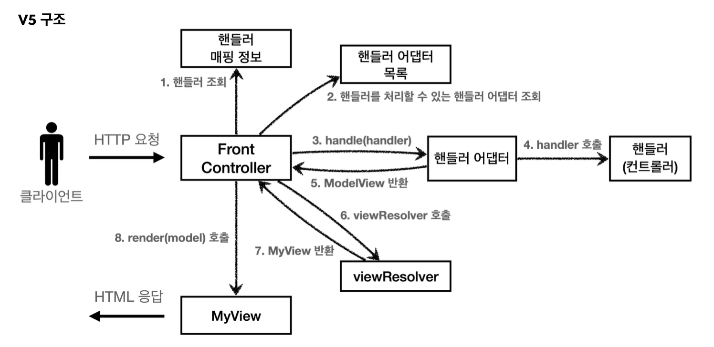

# MVC 패턴
## 개요
### 너무 많은 역할을 하고 있음
하나의 서블릿이나 JSP만으로 비즈니스 로직, 뷰 렌더링까지 처리하게 되면 너무 많을 역할을 하게되고 유지보수가 어려워진다. 비즈니스 로직을 호출하는 부분에 변경이 있을 경우 해당 코드를 건드려야하고, ui를 변경할 때에도 비즈니스 로직이 같이 있는 파일을 수정해야한다.
### 변경 라이플 사이클
비즈니스 로직과 뷰 렌더링 변경의 라이프 사이클이 다르다. ui 수정과 비즈니스 로직 수정은 각각 다르게 발생할 가능성이 높고 서로 영향을 주지 않는다.
### 기능특화
뷰 템플릿은 화면을 렌더링하는데 최적화, 이 부분의 업무만 담당하는게 더욱 좋다.

## MVC
MVC패턴은 하나의 서블릿이나 JSP로 처리하던 것을 Controller, View라는 영역으로 역할을 나눈 것을 말한다.

**컨트롤러**: HTTP 요청을 받아 파라미터를 검증하고 비즈니스로직 실행, 뷰에 전달할 데이터를 조회해서 모델에 담아줌, 컨트롤러에 비즈니스로직을 둘 수 있지만 컨트롤러가 너무 많은 역할을 하게된다. 그래서 서비스(Service)라는 계층을 만들어 여기서 비즈니스 로직을 처리한다. 이때 컨트롤러는 서비스를 호출하는 역할을 담당

**모델**: 뷰에 출력할 데이터를 담아둔다. 뷰가 필요한 데이터를 담아주는 역할을 해주기 때문에 뷰는 비즈니스 로직이나 데이터 접근을 모르고 있어도 되고 화면을 렌더링 하는 기능에 집중할 수 있다.

**뷰**: 모델에 담겨있는 데이터를 가지고 화면을 그리는 일을 맡는다.

---
~~~java
@WebServlet(name = "mvcMemberFormServlet", urlPatterns = "/servlet-mvc/members/new-form")
public class MvcMemberFormServlet extends HttpServlet {

    @Override
    protected void service(HttpServletRequest request, HttpServletResponse response) throws ServletException, IOException {

        String viewPath = "/WEB-INF/views/new-form.jsp";
        RequestDispatcher dispatcher = request.getRequestDispatcher(viewPath);
        dispatcher.forward(request, response);
    }
}
~~~
forward(): 다른 서블릿이나 JSP로 이동할 수 있는 기능, 서버 내부에서 다시 호출

/WEB-INF: 이 경로안에 JSP가 있으면 외부에서 직접 JSP를 호출할 수 없음, 컨트롤러 통해서 JSP를 호출해야함

redirect vs forward
- redirect: 실제 클라이언트에 응답이 갔다가 클라이언트가 redirect 경로로 다시 요청 -> 클라이언트가 인지할 수 있고, url경로도 변경
- forward: 서버 내부에서 일어나는 호출, 클라이언트가 인지 x

~~~html
<form action="save" method="post">
    username: <input type="text" name="username" />
    age: <input type="text" name="age" />
    <button type="submit">전송</button>
 </form>
~~~
절대경로(앞에 / 로 시작)이 아닌 상대경로(/ 로 시작x)하고 있음. 이렇게 하면 폼 전송 시 현재 URL이 속한 계층 경로 + save 가 호출된다.

## MVC 한계
컨트롤러에 중복이 많고 불필요한 코드들이 많다.
### 포워드 중복
~~~java
RequestDispatcher dispatcher = request.getRequestDispatcher(viewPath);
dispatcher.forward(request, response);
~~~
view로 이동하는 코드가 항숭 중복 호출됨, 메서드로 빼도되지만 그 메서드도 항상 직접 호출해줘야함

### ViewPath 중복
~~~java
String viewPath = "/WEB-INF/views/new-form.jsp";
~~~
- prefix: /WEB-INF/views/
- suffix: .jsp
jsp가 아닌 다른 뷰 템플릿으로 변경 시 이 부분이 들어간 곳을 모두 수정해줘야 함

### 사용하지 않는 코드
request, response를 사용하는 곳도 있고 사용하지 않는 곳도 있다

### 공통 처리의 어려움
기능이 복잡해질수록 컨트롤러에서 공통으로 처리하는 부분이 점점 많아질 것이다. 메서드로 빼면 될 것 같지만 그 메서드도 항항 호출해야하고 호출하는것 자체도 중복이다.

### 결론은 공통 처리가 어렵다!
이걸 해결하려면 컨트롤러 호출 전에 공통 기능을 처리해줘야함. **프론트 컨트롤러 패턴**을 도입해 문제를 해결할 수 있다.

## 프론트 컨트롤러 패턴
특징
- 프론트 컨트롤러 서블릿 하나로 클라이언트의 요청을 받음
- 프론트 컨트롤러 요청에 맞는 컨트롤러를 찾아서 호출
- 공통 처리가 가능해짐

### 스프링 웹 MVC와 프론트 컨트롤러
스프링 웹 MVC의 핵심도 이 프론트 컨트롤러!  
스프링 웹 MVC의 DispatcherServlet이 프론트 컨트롤러 패턴으로 구현

## 프론트 컨트롤러 도입 - v1
1. 클라이언트 HTTP 요청
2. URL 매핑 정보에서 컨트롤러 조회
3. 컨트롤러 호출
4. 컨트롤러에서 JSP forward
5. HTML 응답

~~~java
public interface ControllerV1 {

    void process(HttpServletRequest request, HttpServletResponse response) throws ServletException, IOException;
}
~~~
각 컨트롤러는 이 인터페이스를 구현
회원등록 컨트롤러
~~~java
public class MemberFormControllerV1 implements ControllerV1 {
    @Override
    public void process(HttpServletRequest request, HttpServletResponse response) throws ServletException, IOException {
        String viewPath = "/WEB-INF/views/new-form.jsp";
        request.getRequestDispatcher(viewPath).forward(request, response);
    }
}
~~~

회원 저장 컨트롤러
~~~java
public class MemberSaveControllerV1 implements ControllerV1 {

    private MemberRepository memberRepository = MemberRepository.getInstance();

    @Override
    public void process(HttpServletRequest request, HttpServletResponse response) throws ServletException, IOException {
        String username = request.getParameter("username");
        int age = Integer.parseInt(request.getParameter("age"));

        Member member = new Member(username, age);
        memberRepository.save(member);

        String viewPath = "/WEB-INF/views/save-result.jsp";
        request.getRequestDispatcher(viewPath).forward(request, response);
    }
}
~~~

회원 목록 컨트롤러
~~~java
public class MemberListControllerV1 implements ControllerV1 {

    private MemberRepository memberRepository = MemberRepository.getInstance();

    @Override
    public void process(HttpServletRequest request, HttpServletResponse response) throws ServletException, IOException {

        List<Member> members = memberRepository.findAll();
        request.setAttribute("members", members);

        String viewPath = "/WEB-INF/views/members.jsp";
        request.getRequestDispatcher(viewPath).forward(request, response);
    }
}
~~~

프론트 컨트롤러 v1
~~~java
@WebServlet(name = "frontControllerServletV1", urlPatterns = "/front-controller/v1/*")
public class FrontControllerServletV1 extends HttpServlet {

    private Map<String, ControllerV1> controllerMap = new HashMap<>();

    public FrontControllerServletV1() {
        controllerMap.put("/front-controller/v1/members/new-form", new MemberFormControllerV1());
        controllerMap.put("/front-controller/v1/members/save", new MemberSaveControllerV1());
        controllerMap.put("/front-controller/v1/members", new MemberListControllerV1());
    }

    @Override
    protected void service(HttpServletRequest request, HttpServletResponse response) throws ServletException, IOException {

        System.out.println("FrontControllerServletV1.service");
        String requestURI = request.getRequestURI();
        ControllerV1 controller = controllerMap.get(requestURI);

        if (controller == null) {
            response.setStatus(HttpServletResponse.SC_NOT_FOUND);
            return;
        }

        controller.process(request,response);
    }
}
~~~
- urlPatterns = "/front-controller/v1/*": /front-controller/v1을 포함한 하위 모든 요청은 이 서블릿이 받아줌
- controllerMap
    - key: 매핑 url
    - value: 호출된 컨트롤러
- service()
    - requestURI를 조회해 실체 호출할 컨트롤러를 controllerMap에서 찾고 없으면 404 상태코드 반환
    - 컨트롤러를 찾고 process() 메서드 호출

v1의 모든 컨트롤러에서 뷰로 이동하는 부분에 중복이 있다.
~~~java
String viewPath = "/WEB-INF/views/members.jsp";
request.getRequestDispatcher(viewPath).forward(request, response);
~~~

이 부분을 처리하는 객체를 만들자

## v2의 구조
1. 클라이언트가 HTTP 요청
2. FrontController에서 URL 매핑 정보를 갖고 컨트롤러를 조회
3. 맞는 컨트롤러를 호출 하고 MyView를 반환
4. render() 호출 후, JSP forward
5. HTMP 응답

~~~java
public class MyView {

    private String viewPath;

    public MyView(String viewPath) {
        this.viewPath = viewPath;
    }

    public void render(HttpServletRequest request, HttpServletResponse response) throws ServletException, IOException {
        request.getRequestDispatcher(viewPath).forward(request, response);
    }
}
~~~

ControllerV2
~~~java
public interface ControllerV2 {

    MyView process(HttpServletRequest request, HttpServletResponse response) throws ServletException, IOException;
}
~~~

회원등록폼 컨트롤러 V2
~~~java
public class MemberFormControllerV2 implements ControllerV2 {

    @Override
    public MyView process(HttpServletRequest request, HttpServletResponse response) throws ServletException, IOException {
        return new MyView("/WEB-INF/views/new-form.jsp");
    }
}
~~~

이제 각 컨트롤러는 dispatcher.forward()를 생성해서 호출하지 않아도 된다.
MyView 객체를 생성하고 뷰이름만 넣어주면 된다.

회원저장 컨트롤러 v2
~~~java
public class MemberSaveControllerV2 implements ControllerV2 {

    private MemberRepository memberRepository = MemberRepository.getInstance();

    @Override
    public MyView process(HttpServletRequest request, HttpServletResponse response) throws ServletException, IOException {

        String username = request.getParameter("username");
        int age = Integer.parseInt(request.getParameter("age"));

        Member member = new Member(username, age);
        memberRepository.save(member);

        request.setAttribute("member", member);

        return new MyView("/WEB-INF/views/save-result.jsp");
    }
}
~~~

회원목록 컨트롤러 v2
~~~java
public class MemberListControllerV2 implements ControllerV2 {

    private MemberRepository memberRepository = MemberRepository.getInstance();

    @Override
    public MyView process(HttpServletRequest request, HttpServletResponse response) throws ServletException, IOException {

        List<Member> members = memberRepository.findAll();
        request.setAttribute("members", members);

        return new MyView("/WEB-INF/views/members.jsp");
    }
}
~~~

프론트 컨트롤러 v2
~~~java
@WebServlet(name="frontControllerServletV2", urlPatterns = "/front-controller/v2/*")
public class FrontControllerServletV2 extends HttpServlet {

    private Map<String, ControllerV2> controllerMap = new HashMap<>();

    public FrontControllerServletV2() {
        controllerMap.put("/front-controller/v2/members/new-form", new MemberFormControllerV2());
        controllerMap.put("/front-controller/v2/members/save", new MemberSaveControllerV2());
        controllerMap.put("/front-controller/v2/members", new MemberListControllerV2());
    }

    @Override
    protected void service(HttpServletRequest request, HttpServletResponse response) throws ServletException, IOException {

        String requestURI = request.getRequestURI();
        ControllerV2 controller = controllerMap.get(requestURI);

        if (controller == null) {
            response.setStatus(HttpServletResponse.SC_NOT_FOUND);
            return;
        }

        MyView view = controller.process(request, response);
        view.render(request,response);
    }
}
~~~
프론트 컨트롤러의 호출 결과로 MyView를 반환받음. view.render()를 호출하면 forward 로직을 수행해 JSP가 실행

## Model 추가 - v3
### 서블릿 종속성 제거
서블릿을 전혀 사용하지 않도록 변경

### 뷰 이름 중복 제거
컨트롤러는 뷰의 논리 이름을 반환하고, 실제 물리 위치의 이름은 프론트 컨트롤러에서 처리하도록 단순화 시키자

v3 구조
1. 클라이언트에서 HTTP 요청
2. FrontController에서 매핑정보로 컨트롤러 조회
3. 컨트롤러 호출 후 ModelView 반환받음
4. viewResolver호출 후 MyView 반환
5. render(model) 호출
6. MyView에서 HTML 응답

### ModelView
서블릿 종속성을 제거하기 위해 Model을 직접 만들고 View 이름까지 전달하는 객체를 만들자

ModelView
~~~java
@Getter
@Setter
public class ModelView {

    private String viewName;
    private Map<String, Object> model = new HashMap<>();

    public ModelView(String viewName) {
        this.viewName = viewName;
    }
}
~~~

회원등록 폼 - v3
~~~java
public class MemberFormControllerV3 implements ControllerV3 {
    
    @Override
    public ModelView process(Map<String, String> paramMap) {
        return new ModelView("new-form");
    }
    
}
~~~
ModelView 생성 시 논리이름을 지정, 실제 물리적인 이름은 프론트 컨트롤러에서 처리

회원저장 - v3
~~~java
public class MemberSaveControllerV3 implements ControllerV3 {

    private MemberRepository memberRepository = MemberRepository.getInstance();

    @Override
    public ModelView process(Map<String, String> paramMap) {

        String username = paramMap.get("username");
        int age = Integer.parseInt(paramMap.get("age"));

        Member member = new Member(username, age);
        memberRepository.save(member);

        ModelView mv = new ModelView("save-result");
        mv.getModel().put("member", member);

        return mv;
    }
}
~~~
- paramMap.get("username"): map에 파라미터 정보가 들어있다. map에서 필요한 요청 파라미터를 조회하면 된다
- mv.getModel().put("member", member): 모델에 뷰에서 필요한 member 객체를 담고 반환

프론트 컨트롤러 v3
~~~java
@WebServlet(name = "frontControllerServletV3", urlPatterns = "/front-controller/v3/*")
public class FrontControllerServletV3 extends HttpServlet {

    private Map<String, ControllerV3> controllerMap = new HashMap<>();

    public FrontControllerServletV3() {
        controllerMap.put("/front-controller/v3/members/new-form", new MemberFormControllerV3());
        controllerMap.put("/front-controller/v3/members/save", new MemberSaveControllerV3());
        controllerMap.put("/front-controller/v3/members", new MemberListControllerV3());
    }

    @Override
    protected void service(HttpServletRequest request, HttpServletResponse response) throws ServletException, IOException {
        String requestURI = request.getRequestURI();

        ControllerV3 controller = controllerMap.get(requestURI);
        if (controller == null) {
            response.setStatus(HttpServletResponse.SC_NOT_FOUND);
            return;
        }

        Map<String, String> paramMap = createParamMap(request);
        ModelView mv = controller.process(paramMap);

        String viewName = mv.getViewName();
        MyView view = viewResolver(viewName);
        view.render(mv.getModel(), request, response);

    }

    private Map<String, String> createParamMap(HttpServletRequest request) {
        Map<String, String> paramMap = new HashMap<>();

        request.getParameterNames().asIterator()
                .forEachRemaining(paramName -> paramMap.put(paramName, request.getParameter(paramName)));
        return paramMap;
    }

    private MyView viewResolver(String viewName) {
        return new MyView("/WEB-INF/views" + viewName + ".jsp");
    }
}
~~~

- createParamMap(): request에서 파라미터 정보를 꺼내 Map으로 변환하고 컨트롤러에 paramMap을 전달
- viewResolver(): 컨트롤러가 반환한 논리 뷰 이름을 실제 물리 뷰 경로로 변경하고 실제 물리 경로가 있는 MyView 객체를 반환
- view.render(mv.getModel(), request, response)
    - 뷰 객체를 통해 HTML 화면 렌더링

MyView
~~~java
public void render(Map<String, Object> model, HttpServletRequest request, HttpServletResponse response) throws ServletException, IOException {
        modelToRequestAttribute(model, request);
        request.getRequestDispatcher(viewPath).forward(request, response);
    }

    private static void modelToRequestAttribute(Map<String, Object> model, HttpServletRequest request) {
        model.forEach((key, value) -> request.setAttribute(key, value));
    }
~~~
modelToRequestAttribute() : 모델 데이터를 꺼내 request.setAttribute()로 데이터 담아줌

## 단순하고 실용적인 컨트롤러 - v4
### v4 구조
1. 클라이언트가 HTTP 요청
2. 매핑정보를 토대로 컨트롤러를 조회
3. 컨트롤러 호출(paramMap, model) 후 viewName 반환
4. viewResolver 호출 후 MyView 반환
5. render(model) 호출, MyView가 HTML 응답

컨트롤러 v4
~~~java
public interface ControllerV4 {

    String process(Map<String, String> paramMap, Map<String, Object> model);
}
~~~

회원가입폼 - v4
~~~java
public class MemberFormControllerV4 implements ControllerV4 {

    @Override
    public String process(Map<String, String> paramMap, Map<String, Object> model) {
        return "new-form";
    }
}
~~~
new-form이라는 논리 이름만 반환하면 된다.

회원저장 - v4
~~~java
public class MemberSaveControllerV4 implements ControllerV4 {

    private MemberRepository memberRepository = MemberRepository.getInstance();
    
    @Override
    public String process(Map<String, String> paramMap, Map<String, Object> model) {

        String username = paramMap.get("username");
        int age = Integer.parseInt(paramMap.get("age"));

        Member member = new Member(username, age);
        memberRepository.save(member);

        model.put("member", member);

        return "save-result";
    }
}
~~~
모델이 파라미터로 전달되기 때문에 모델을 직접 생성하지 않아도 됨

회원목록 - v4
~~~java
public class MemberListControllerV4 implements ControllerV4 {

    private MemberRepository memberRepository = MemberRepository.getInstance();

    @Override
    public String process(Map<String, String> paramMap, Map<String, Object> model) {
        List<Member> members = memberRepository.findAll();
        model.put("members", members);

        return "members";
    }
}
~~~

프론트 컨트롤러 - v4
~~~java
@WebServlet(name="frontControllerServletV4", urlPatterns = "/front-controller/v4/*")
public class FrontControllerServletV4 extends HttpServlet {

    private Map<String, ControllerV4> controllerMap = new HashMap<>();

    public FrontControllerServletV4() {
        controllerMap.put("/front-controller/v4/members/new-form", new MemberFormControllerV4());
        controllerMap.put("/front-controller/v4/members/save", new MemberSaveControllerV4());
        controllerMap.put("/front-controller/v4/members", new MemberListControllerV4());
    }

    @Override
    protected void service(HttpServletRequest request, HttpServletResponse response) throws ServletException, IOException {

        String requestURI = request.getRequestURI();
        ControllerV4 controller = controllerMap.get(requestURI);
        if (controller == null) {
            response.setStatus(HttpServletResponse.SC_NOT_FOUND);
            return;
        }

        Map<String, String> paramMap = createParamMap(request);
        Map<String, Object> model = new HashMap<>();

        String viewName = controller.process(paramMap, model);
        MyView view = viewResolver(viewName);
        view.render(model, request, response);

    }

    private MyView viewResolver(String viewName) {
        return new MyView("/WEB-INF/views/" + viewName + ".jsp");
    }

    private Map<String, String> createParamMap(HttpServletRequest request) {

        Map<String, String> paramMap = new HashMap<>();
        request.getParameterNames().asIterator()
                .forEachRemaining(paramName -> paramMap.put(paramName, request.getParameter(paramName)));

        return paramMap;
    }
}
~~~

## 유연한 컨트롤러1 - v5
v3 버전으로 개발하고싶고, v4 버전으로도 개발하고 싶다 어떻게 해아할까?

### 어댑터 패턴
지금까지는 한가지 방식의 컨트롤러 인터페이스만 사용했다. v3, v4는 완전히 다른 인터페이스이다. 호환이 불가

이 때 사용하는 것이 어댑터. 어댑터 패턴을 사용해 프론트 컨트롤러가 다양한 방식의 컨트롤러를 처리할 수 있도록 변경하자

핸들러어댑터
~~~java
public interface MyHandlerAdapter {

    boolean supports(Object handler);

    ModelView handle(HttpServletRequest request, HttpServletResponse response, Object handler) throws ServletException, IOException;
}
~~~
- boolean supports(): 어댑터가 해당 컨트롤러를 처리할 수 있는지 판단하는 메서드
- ModelView handle():
    - 어댑터는 실제 컨트롤러를 호출, 결과로 ModelView 반환
    - 실제 컨트롤러가 ModelView를 반환하지 못하면 어댑터가 ModelView를 직접 생성해서라도 반환해야 함
    - 이제는 이 어댑터를 통해 실제 컨트롤러가 호출

ControllerV3HandlerAdapter
~~~java
public class ControllerV3HandlerAdapter implements MyHandlerAdapter {

    @Override
    public boolean supports(Object handler) {
        return (handler instanceof ControllerV3);
    }

    @Override
    public ModelView handle(HttpServletRequest request, HttpServletResponse response, Object handler) throws ServletException, IOException {

        ControllerV3 controller = (ControllerV3) handler;

        Map<String, String> paramMap = createParamMap(request);
        ModelView mv = controller.process(paramMap);

        return mv;
    }

    private Map<String, String> createParamMap(HttpServletRequest request) {
        Map<String, String> paramMap = new HashMap<>();

        request.getParameterNames().asIterator()
                .forEachRemaining(paramName -> paramMap.put(paramName, request.getParameter(paramName)));

        return paramMap;
    }
}
~~~

- supports(): ControllerV3를 처리할 수 있는 어댑터라는 것을 의미
~~~java
ControllerV3 controller = (ControllerV3) handler;

Map<String, String> paramMap = createParamMap(request);
ModelView mv = controller.process(paramMap);

return mv;
~~~
- handler를 컨트롤러v3으로 변환한 다음 v3 형식에 맞게 호출
- ControllerV3는 ModelView를 반환하므로 ModelView를 반환하면 된다.

프론트컨트롤러 v5
~~~java
@WebServlet(name="frontControllerServletV5", urlPatterns = "/front-controller/v5/*")
public class FrontControllerServletV5 extends HttpServlet {

    private final Map<String, Object> handlerMappingMap = new HashMap<>();
    private final List<MyHandlerAdapter> handlerAdapters = new ArrayList<>();

    public FrontControllerServletV5() {
        initHandlerMappingMap();
        initHandlerAdapters();
    }

    private void initHandlerAdapters() {
        handlerAdapters.add(new ControllerV3HandlerAdapter());
    }

    private void initHandlerMappingMap() {
        handlerMappingMap.put("/front-controller/v5/v3/members/new-form", new MemberFormControllerV3());
        handlerMappingMap.put("/front-controller/v5/v3/members/save", new MemberSaveControllerV3());
        handlerMappingMap.put("/front-controller/v5/v3/members", new MemberListControllerV3());
    }

    @Override
    protected void service(HttpServletRequest request, HttpServletResponse response) throws ServletException, IOException {

        Object handler = getHandler(request);

        MyHandlerAdapter adapter = getHandlerAdapter(handler);
        ModelView mv = adapter.handle(request, response, handler);

        MyView view = viewResolver(mv.getViewName());
        view.render(mv.getModel(), request, response);
        
    }

    private Object getHandler(HttpServletRequest request) {
        String requestURI = request.getRequestURI();
        return handlerMappingMap.get(requestURI);
    }

    private MyHandlerAdapter getHandlerAdapter(Object handler) {
        for (MyHandlerAdapter adapter : handlerAdapters) {
            if (adapter.supports(handler)) {
                return adapter;
            }
        }
        
        throw new IllegalArgumentException("handler adapter를 찾을 수 없습니다. handler = " + handler);
    }

    private MyView viewResolver(String viewName) {
        return new MyView("/WEB-INF/views" + viewName + ".jsp");
    }
}
~~~

이전에는 컨트롤러를 직접 매핑해서 사용했다. 이제는 어댑터를 사용하기 때문에 컨트롤러 뿐만 아니라 어댑터가 지원하기만 한다면 어떤 것이라도 url을 매핑해서 사용이 가능하다.

~~~java
private Object getHandler(HttpServletRequest request) {
    String requestURI = request.getRequestURI();
    return handlerMappingMap.get(requestURI);
}
~~~
url에 매핑된 핸들러 객체를 찾아 반환

~~~java
private MyHandlerAdapter getHandlerAdapter(Object handler) {
    for (MyHandlerAdapter adapter : handlerAdapters) {
        if (adapter.supports(handler)) {
            return adapter;
        }
    }
    
    throw new IllegalArgumentException("handler adapter를 찾을 수 없습니다. handler = " + handler);
}
~~~
handler를 처리할 수 있는 어댑터를 supports()를 통해 찾고, handler가 ControllerV3 인터페이스를 구현했다면 ControllerV3HandlerAdapter 객체가 반환

~~~java
ModelView mv = adapter.handle(request, response, handler);
~~~
handle()를 통해 실제 어댑터가 호출

## 유연한 컨트롤러2 - v5
ControllerV4도 추가하자
~~~java
private void initHandlerAdapters() {
    handlerAdapters.add(new ControllerV3HandlerAdapter());
    handlerAdapters.add(new ControllerV4HandlerAdapter());
}

private void initHandlerMappingMap() {
    // v3
    handlerMappingMap.put("/front-controller/v5/v3/members/new-form", new MemberFormControllerV3());
    handlerMappingMap.put("/front-controller/v5/v3/members/save", new MemberSaveControllerV3());
    handlerMappingMap.put("/front-controller/v5/v3/members", new MemberListControllerV3());

    // v4
    handlerMappingMap.put("/front-controller/v5/v4/members/new-form", new MemberFormControllerV4());
    handlerMappingMap.put("/front-controller/v5/v4/members/save", new MemberSaveControllerV4());
    handlerMappingMap.put("/front-controller/v5/v4/members", new MemberListControllerV4());

}
~~~

ControllerV4HandlerAdapter
~~~java
public class ControllerV4HandlerAdapter implements MyHandlerAdapter {
    @Override
    public boolean supports(Object handler) {
        return (handler instanceof ControllerV4);
    }

    @Override
    public ModelView handle(HttpServletRequest request, HttpServletResponse response, Object handler) throws ServletException, IOException {

        ControllerV4 controller = (ControllerV4) handler;

        Map<String, String> paramMap = createParamMap(request);
        Map<String, Object> model = new HashMap<>();

        String viewName = controller.process(paramMap, model);

        ModelView mv = new ModelView(viewName);
        mv.setModel(model);
        
        return mv;
    }

    private Map<String, String> createParamMap(HttpServletRequest request) {
        Map<String, String> paramMap = new HashMap<>();
        request.getParameterNames().asIterator()
                .forEachRemaining(paramName -> paramMap.put(paramName, request.getParameter(paramName)));
        
        return paramMap;
    }
}
~~~

어댑터 변환
~~~java
ModelView mv = new ModelView(viewName);
mv.setModel(model);

return mv;
~~~
ControllerV4는 뷰의 이름을 반환한다. 그런데 어댑터는 뷰의 이름이 아니라 ModelView를 만들어서 반환해야한다. 어댑터는 뷰의 이름으로 ModelView를 만들어서 반환한다.