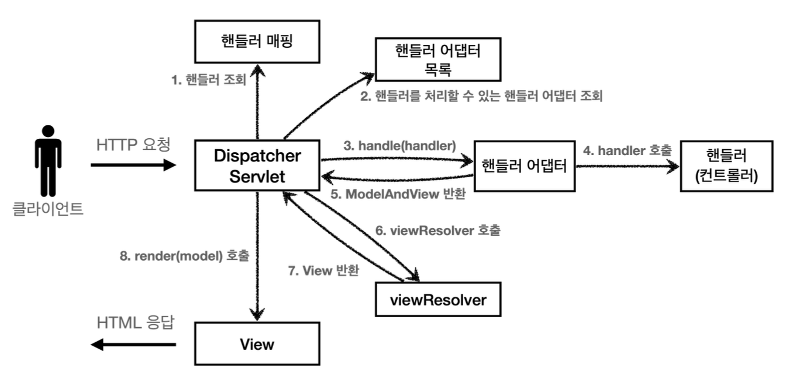

# 스프링 MVC - 구조 이해
직접 만든 MVC 프레임워크 구조

Spring MVC 구조

동작순서
1. 핸들러 조회: 핸들러 매핑 통해 요청 url에 매핑된 핸들러 조회
2. 핸들러 어댑터 조회: 핸들러를 실행할 수 있는 핸들러 어댑터 조회
3. 핸들러 어댑터 실행: 핸들러 어댑터 실행
4. 핸들러 실행: 핸들러 어댑터가 실제 핸들러 실행
5. ModelAndView 반환: 핸들러 어댑터는 핸들러가 반환하는 정보를 ModelAndView로 변환해서 반환
6. viewResolver 호출: 뷰 리졸버 찾고 실행
7. view 반환: 뷰 리졸버는 뷰의 논리 이름을 물리 이름으로 바꾸고 렌더링 역할 담당하는 뷰 객체를 반환
8. 뷰 렌더링: 뷰를 통해서 뷰를 렌더링

구조 비교
- FrontController -> DispatcherServlet
- handlerMappingMap -> HandlerMapping
- MyHandlerAdapter -> HandlerAdapter
- viewResolver -> ViewResolver
- MyView -> View

## DispatcherServlet 구조
스프링 MVC도 프론트 컨트롤러 패턴으로 구현되어있음. 바로 DispatcherServlet 얘가 핵심이다.
- DispatcherServlet도 부모 클래스에서 HttpServlet을 상속받아 사용, 서블릿으로 동작
- 스프링부트는 DispatcherServlet을 서블릿으로 자동으로 등록하면서 모든 경로에 대해 매핑

요청 흐름
- 서블릿 호출 시 HttpServlet이 제공하는 service()가 호출
- 스프링 MVC는 DispatcherServlet의 부모인 FrameServlet에서 service()를 오버라이드 해둠
- FrameworkServlet.service()를 시작으로 여러 메서드가 호출되면서 DispatcherServlet.doDispatch()가 호출

~~~java
protected void doDispatch(HttpServletRequest request, HttpServletResponse response) throws Exception {
        HttpServletRequest processedRequest = request;
        HandlerExecutionChain mappedHandler = null;
        boolean multipartRequestParsed = false;
        WebAsyncManager asyncManager = WebAsyncUtils.getAsyncManager(request);

        try {
            try {
                ModelAndView mv = null;
                Exception dispatchException = null;

                try {
                    processedRequest = this.checkMultipart(request);
                    multipartRequestParsed = processedRequest != request;

                    // 핸들러 조회
                    mappedHandler = this.getHandler(processedRequest);
                    if (mappedHandler == null) {
                        this.noHandlerFound(processedRequest, response);
                        return;
                    }

                    // 핸들러 어댑터 조회 - 핸들러를 처리할 수 있는 어댑터
                    HandlerAdapter ha = this.getHandlerAdapter(mappedHandler.getHandler());
                    String method = request.getMethod();
                    boolean isGet = HttpMethod.GET.matches(method);
                    if (isGet || HttpMethod.HEAD.matches(method)) {
                        long lastModified = ha.getLastModified(request, mappedHandler.getHandler());
                        if ((new ServletWebRequest(request, response)).checkNotModified(lastModified) && isGet) {
                            return;
                        }
                    }

                    if (!mappedHandler.applyPreHandle(processedRequest, response)) {
                        return;
                    }

                    // 핸들러 어댑터 실행 -> 핸들러 어댑터를 통해 핸들러 실행 -> ModelAndView 반환
                    mv = ha.handle(processedRequest, response, mappedHandler.getHandler());
                    if (asyncManager.isConcurrentHandlingStarted()) {
                        return;
                    }

                    this.applyDefaultViewName(processedRequest, mv);
                    mappedHandler.applyPostHandle(processedRequest, response, mv);
                } catch (Exception var20) {
                    Exception ex = var20;
                    dispatchException = ex;
                } catch (Throwable var21) {
                    Throwable err = var21;
                    dispatchException = new ServletException("Handler dispatch failed: " + err, err);
                }

                this.processDispatchResult(processedRequest, response, mappedHandler, mv, (Exception)dispatchException);
            } catch (Exception var22) {
                Exception ex = var22;
                triggerAfterCompletion(processedRequest, response, mappedHandler, ex);
            } catch (Throwable var23) {
                Throwable err = var23;
                triggerAfterCompletion(processedRequest, response, mappedHandler, new ServletException("Handler processing failed: " + err, err));
            }

        } finally {
            if (asyncManager.isConcurrentHandlingStarted()) {
                if (mappedHandler != null) {
                    mappedHandler.applyAfterConcurrentHandlingStarted(processedRequest, response);
                }
            } else if (multipartRequestParsed) {
                this.cleanupMultipart(processedRequest);
            }

        }
    }
~~~

~~~java
private void processDispatchResult(HttpServletRequest request, HttpServletResponse response, @Nullable HandlerExecutionChain mappedHandler, @Nullable ModelAndView mv, @Nullable Exception exception) throws Exception {
      boolean errorView = false;
      if (exception != null) {
          if (exception instanceof ModelAndViewDefiningException) {
              ModelAndViewDefiningException mavDefiningException = (ModelAndViewDefiningException)exception;
              this.logger.debug("ModelAndViewDefiningException encountered", exception);
              mv = mavDefiningException.getModelAndView();
          } else {
              Object handler = mappedHandler != null ? mappedHandler.getHandler() : null;
              mv = this.processHandlerException(request, response, handler, exception);
              errorView = mv != null;
          }
      }

      if (mv != null && !mv.wasCleared()) {

        // 뷰 렌더링 호출
          this.render(mv, request, response);
          if (errorView) {
              WebUtils.clearErrorRequestAttributes(request);
          }
      } else if (this.logger.isTraceEnabled()) {
          this.logger.trace("No view rendering, null ModelAndView returned.");
      }

      if (!WebAsyncUtils.getAsyncManager(request).isConcurrentHandlingStarted()) {
          if (mappedHandler != null) {
              mappedHandler.triggerAfterCompletion(request, response, (Exception)null);
          }

      }
  }
~~~

~~~java
protected void render(ModelAndView mv, HttpServletRequest request, HttpServletResponse response) throws Exception {
    Locale locale = this.localeResolver != null ? this.localeResolver.resolveLocale(request) : request.getLocale();
    response.setLocale(locale);
    String viewName = mv.getViewName();
    View view;
    if (viewName != null) {
      // 뷰 리졸버를 통해 뷰 찾고 view 반환
        view = this.resolveViewName(viewName, mv.getModelInternal(), locale, request);
        if (view == null) {
            String var10002 = mv.getViewName();
            throw new ServletException("Could not resolve view with name '" + var10002 + "' in servlet with name '" + this.getServletName() + "'");
        }
    } else {
        view = mv.getView();
        if (view == null) {
            throw new ServletException("ModelAndView [" + mv + "] neither contains a view name nor a View object in servlet with name '" + this.getServletName() + "'");
        }
    }

    if (this.logger.isTraceEnabled()) {
        this.logger.trace("Rendering view [" + view + "] ");
    }

    try {
        if (mv.getStatus() != null) {
            request.setAttribute(View.RESPONSE_STATUS_ATTRIBUTE, mv.getStatus());
            response.setStatus(mv.getStatus().value());
        }
        // 뷰 렌더링
        view.render(mv.getModelInternal(), request, response);
    } catch (Exception var8) {
        Exception ex = var8;
        if (this.logger.isDebugEnabled()) {
            this.logger.debug("Error rendering view [" + view + "]", ex);
        }

        throw ex;
    }
}
~~~

## 핸들러 매핑과 핸들러 어댑터

과거 스프링 컨트롤러
~~~java
public interface Controller {

    ModelAndView handleRequest(HttpServletRequest request, HttpServletResponse response) throws Exception;
}
~~~

OldController
~~~java
@Component("/springmvc/old-controller")
public class OldController implements Controller {
    @Override
    public ModelAndView handleRequest(HttpServletRequest request, HttpServletResponse response) throws Exception {

        System.out.println("OldController.handleRequest");
        return null;
    }
}
~~~
- @Component: 이 컨트롤러는 /springmvc/old-controller 라는 이름의 스프링 빈으로 등록
- 빈의 이름으로 url을 매핑

### 스프링 부트가 자동 등록하는 핸들러 매핑과 핸들러 어댑터
(실제로는 더 많다.)
HandlerMapping
- RequestMappingHandlerMapping: 애노테이션 기반 컨트롤러인 @RequestMapping에서 사용
- BeanNameUrlHandlerMapping: 스프링 빈의 이름으로 핸들러 찾음

HandlerAdapter
- RequestMappingHandlerAdapter: 애노테이션 기반인 @RequestMappingdptj tkdyd
- HttpRequestHandlerAdapter: HttpRequestHandler 처리
- SimpleControllerHandlerAdapter: Controller 인터페이스 처리

이 컨트롤러가 실행되기 위해선
- HandlerMapping(핸들러 매핑)
  - 핸들러 매핑에서 이 컨트롤러를 찾을 수 있어야 한다.
- HandlerAdapter(핸들러 어댑터)
  - 핸들러 매핑을 통해 찾은 핸들러를 실행할 수 있는 핸들러 어댑터가 필요하다.
이 두가지가 필요하다.

1. 핸들러 매핑으로 핸들러 조회
- HandlerMapping을 순서대로 실행해서 핸들러 조회
- 빈 이름으로 핸들러를 찾아야 하기 때문에 BeanNameUrlHandlerMapping이 실행에 성공하고 OldController를 반환

2. 핸들러 어댑터 조회
- HandlerAdapter의 supports()를 순서대로 호출
- SimpleControllerHandlerAdapter가 Controller 인터페이스를 지원하므로 대상이 된다.

3. 핸들러 어댑터 실행
- SimpleControllerHandlerAdapter를 실행하면서 핸들러 정보도 함께 넘겨줌
- SimpleControllerHandlerAdapter는 핸들러인 OldController를 내부에서 실행하고 그 결과를 반환

### HttpRequestHandler
서블릿과 가장 유사한 형태의 핸들러
~~~java
@Component("/springmvc/request-handler")
public class MyHttpRequestHandler implements HttpRequestHandler {
    @Override
    public void handleRequest(HttpServletRequest request, HttpServletResponse response) throws ServletException, IOException {
        System.out.println("MyHttpRequestHandler.handleRequest");
    }
}
~~~

### @RequestMapping
가장 우선순위가 높은 핸들러 매핑과 핸들러 어댑터 RequestMappingHandlerMapping, RequestMappingHandlerAdapter

## 뷰 리졸버
~~~java
@Component("/springmvc/old-controller")
public class OldController implements Controller {
    @Override
    public ModelAndView handleRequest(HttpServletRequest request, HttpServletResponse response) throws Exception {

        System.out.println("OldController.handleRequest");
        return new ModelAndView("new-form");
    }
}
~~~

application.properties에 
~~~
spring.mvc.view.prefix=/WEB-INF/views/
spring.mvc.view.suffix=.jsp
~~~
추가

### InternalResourceViewResolver
스프링 부트는 InternalResourceViewResolver 라는 뷰 리졸버를 자동으로 등록, 이때 application.properties에 등록한 prefix, suffix 설정 정보를 사용해 등록

스프링부트가 자동으로 등록하는 뷰 리졸버
(실제로는 더 많음)
- BeanNameViewResolver: 빈 이름으로 뷰 찾아서 반환
- InternalResourceViewResolver: JSP를 처리할 수 있는 뷰 반환

### 뷰 리졸버 동작 방식
1. 핸들러 어댑터 호출
- 핸들러 어댑터 통해 논리 뷰 이름 획득
2. viewResolver 호출
- 논리 뷰 이름으로 viewResolver를 순서대로 호출
- BeanNameViewResolver는 new-form 이르는 이름의 스프링 빈으로 등록된 뷰를 찾는데 없다
- 다음으로 InternalResourceViewResolver 호출
3. InternalResourceViewResolver
- 이 뷰 리졸버는 InternalResourceView 반환
4. 뷰 - InternalResourceView
- InternalResourceView는 forward()를 호출해 처리할 수 있는 경우 사용
5. view.render()
- view.render()가 호출되고 InternalResourceView는 forward()를 사용해 JSP 실행

## 스프링 MVC - 시작
회원 등록 폼
~~~java
@Controller
public class SpringMemberFormControllerV1 {

    @RequestMapping("/springmvc/v1/members/new-form")
    public ModelAndView process() {
        return new ModelAndView("new-form");
    }
}
~~~
- @Controller
  - 내부에 @Component 애노테이션이 있어 컴포넌트 스캔 대상이 됨
  - 스프링 MVC에서 애노테이션 기반 컨트롤러로 인식
- @RequestMapping: 요청 정보 매핑, URL이 호출되면 이 메서드가 호출, 애노테이션 기반으로 동작하기 때문에 메서드 이름은 임의로 지어도 된다.
- ModelAndView: 모델과 뷰 정보를 담아서 반환하면 된다.

회원저장
~~~java
public class SpringMemberSaveControllerV1 {

    private MemberRepository memberRepository = MemberRepository.getInstance();

    @RequestMapping("/springmvc/v1/members/save")
    public ModelAndView process(HttpServletRequest request, HttpServletResponse response) {
        String username = request.getParameter("username");
        int age = Integer.parseInt(request.getParameter("age"));

        Member member = new Member(username, age);
        System.out.println("member = " + member);
        memberRepository.save(member);

        ModelAndView mv = new ModelAndView("save-result");
        mv.addObject("Member", member);
        return mv;
    }
}
~~~
- mv.addObject("member",member): 스프링에서 제공하느 ModelAndView를 통해 Model 데이터를 추가할 때 addObject()를 사용하면 된다.

회원목록
~~~java
@Controller
public class SpringMemberListControllerV1 {

    private MemberRepository memberRepository = MemberRepository.getInstance();

    @RequestMapping("/springmvc/v1/members")
    public ModelAndView process() {

        List<Member> members = memberRepository.findAll();

        ModelAndView mv = new ModelAndView("members");
        mv.addObject("members", members);

        return mv;
    }
}
~~~

## 스프링 MVC - 컨트롤러 통합
컨트롤러 클래스를 유연하게 하나로 통합 가능
~~~java
@Controller
@RequestMapping("/springmvc/v2/members")
public class SpringMemberControllerV2 {

    private MemberRepository memberRepository = MemberRepository.getInstance();

    @RequestMapping("/new-form")
    public ModelAndView newForm() {
        return new ModelAndView("new-form");
    }

    @RequestMapping("/save")
    public ModelAndView save(HttpServletRequest request, HttpServletResponse response) {

        String username = request.getParameter("username");
        int age = Integer.parseInt(request.getParameter("age"));

        Member member = new Member(username, age);
        memberRepository.save(member);

        ModelAndView mav = new ModelAndView("save-result");
        mav.addObject("member", member);
        return mav;
    }
    
    @RequestMapping
    public ModelAndView members() {

        List<Member> members = memberRepository.findAll();

        ModelAndView mav = new ModelAndView("members");
        mav.addObject("members", members);
        
        return mav;
    }
}
~~~