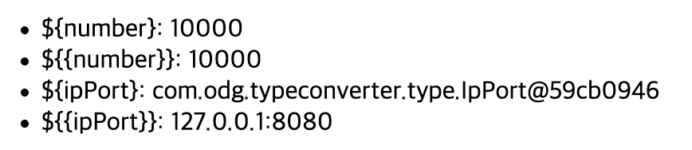
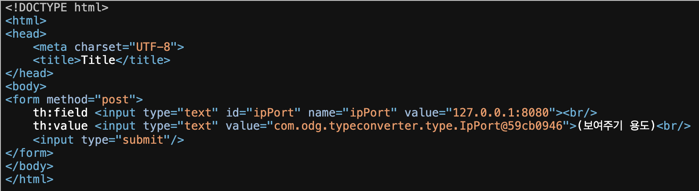
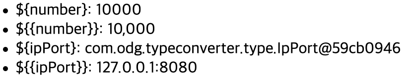
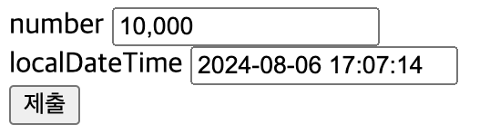
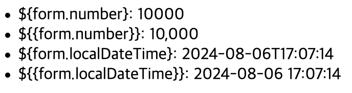

# 스프링 타입 컨버터
HTTP 쿼리 스트링으로 전달하는 값은 모두 문자이다. 스프링에서는 `@RequestParam`을 사용하면 문자타입을 숫자타입으로 편리하게 받을 수 있다. 스프링이 중간에서 타입을 변경한 것이다.

`@ModelAttribute`, `@PathVariable`에서도 확인할 수 있다.

또한 스프링은 확장이 가능한 컨버터 인터페이스를 제공한다. 
추가적인 타입 변환이 필요하면 이 컨버터 인터페이스를 구현해서 등록하면 된다. 
이 컨버터 인터페이스는 모든 타입에 적용이 가능하다. A -> B 타입으로 변환하는 컨버터 인터페이스를 만들고, B -> A 타입으로 변환하는 컨버터 인터페이스를 만들어 등록하면 된다. 

## 타입 컨버터 - Converter
타입 컨버터를 사용하기 위해서는 `org.springframework.core.convert.converter.Converter` 인터페이스를 구현하면 된다.

~~~java
@FunctionalInterface
public interface Converter<S, T> {
    @Nullable
    T convert(S source);

    default <U> Converter<S, U> andThen(Converter<? super T, ? extends U> after) {
        Assert.notNull(after, "'after' Converter must not be null");
        return (s) -> {
            T initialResult = this.convert(s);
            return initialResult != null ? after.convert(initialResult) : null;
        };
    }
}
~~~

### 문자 -> 숫자 변환 타입 컨버터
~~~java
@Slf4j
public class StringToIntegerConverter implements Converter<String, Integer> {

    @Override
    public Integer convert(String source) {
        log.info("converter source = {}", source);
        return Integer.valueOf(source);
    }
}
~~~

### 숫자 -> 문자 변환 타입 컨버터
~~~java
@Slf4j
public class IntegerToStringConverter implements Converter<Integer, String> {
    @Override
    public String convert(Integer source) {
        log.info("convert source={}", source);
        return String.valueOf(source);
    }
}
~~~

### 사용자 정의 타입 컨버터
~~~java
@Getter
@EqualsAndHashCode
public class IpPort {

    private String ip;
    private int port;

    public IpPort(String ip, int port) {
        this.ip = ip;
        this.port = port;
    }
}
~~~
이러한 객체가 있다고 가정하자. IP와 PORT를 입력하면 IpPort 객체로 변환하는 컨버터를 만들어보자.

~~~java
@Slf4j
public class StringToIpPortConverter implements Converter<String, IpPort> {

    @Override
    public IpPort convert(String source) {
        log.info("convert source={}", source);

        String[] split = source.split(":");
        String ip = split[0];
        int port = Integer.parseInt(split[1]);
        return new IpPort(ip,port);
    }
}
~~~

## 컨버전 서비스 - ConversionService
스프링은 개별 컨버터를 모아두고 편리하게 사용할 수 있는 기능인 컨버전 서비스를 제공한다.

~~~java
public interface ConversionService {
    boolean canConvert(@Nullable Class<?> sourceType, Class<?> targetType);

    boolean canConvert(@Nullable TypeDescriptor sourceType, TypeDescriptor targetType);

    @Nullable
    <T> T convert(@Nullable Object source, Class<T> targetType);

    @Nullable
    default Object convert(@Nullable Object source, TypeDescriptor targetType) {
        return this.convert(source, TypeDescriptor.forObject(source), targetType);
    }

    @Nullable
    Object convert(@Nullable Object source, @Nullable TypeDescriptor sourceType, TypeDescriptor targetType);
}
~~~
컨버전 서비스 인터페이스는 컨버팅이 가능한지 확인하는 기능과 컨버팅 기능을 갖고있다.

~~~java
public class ConversionServiceTest {

    @Test
    void conversionService() {
        // 등록
        DefaultConversionService conversionService = new DefaultConversionService();
        conversionService.addConverter(new StringToIntegerConverter());
        conversionService.addConverter(new IntegerToStringConverter());
        conversionService.addConverter(new IpPortToStringConverter());
        conversionService.addConverter(new StringToIpPortConverter());

        // 사용
        assertThat(conversionService.convert("10", Integer.class)).isEqualTo(10);
        assertThat(conversionService.convert(10, String.class)).isEqualTo("10");

        IpPort ipPort = conversionService.convert("127.0.0.1:8080", IpPort.class);
        assertThat(ipPort).isEqualTo(new IpPort("127.0.0.1", 8080));

        String ipPortString = conversionService.convert(new IpPort("127.0.0.1", 8080), String.class);
        assertThat(ipPortString).isEqualTo("127.0.0.1:8080");
    }
}
~~~

`DefaultConversionService`는 `ConversionService` 인터페이스를 구현한 구현체로 컨버터를 등록하는 기능도 제공한다.

컨버터를 등록하기 위해서는 `StringToIntegerConverter` 같은 타입 컨버터를 명확하게 알고 있어야 한다. 하지만 컨버터를 사용하는 입장에서는 타입 컨버터를 전혀 몰라도 된다. 타입 컨버터들은 컨버전 서비스 내부에 숨어서 제공된다. 

따라서 타입을 변환할 시 컨버전 서비스 인터페이스에만 의존하면 된다. 물론 컨버전 서비스를 등록하는 부분과 사용하는 부분을 분리하고 의존관계 주입을 사용해야 한다.

**인터페이스 분리 원칙 - ISP(Interface Segregation Principle)** 
클라이언트가 자신이 이용하지 않는 메서드에 의존하지 않아야 한다.

`DefaultConversionService` 아래 두 인터페이스를 구현하였다.
- `ConversionService`: 컨버터 사용에 초점
- `ConverterRegistry`: 컨버터 등록에 초점

이렇게 인터페이스를 분리하면 컨버터를 사용하는 클라이언트와 컨버터를 등록하고 관리하는 클라이언트의 관심사를 분리할 수 있다. 컨버터를 사용하는 클라이언트는 `ConversionService`만 의존하면 되므로, 컨버터를 어떻게 등록하고 관리하는지는 전혀 몰라도 된다. 결과적으로 컨버터를 사용하는 클라이언트는 꼭 필요한 메서드만 알게 된다.

## 스프링에 Converter 적용하기
### WebConfig - 컨버터 등록
~~~java
@Configuration
public class WebConfig implements WebMvcConfigurer {

    @Override
    public void addFormatters(FormatterRegistry registry) {
        registry.addConverter(new StringToIpPortConverter());
        registry.addConverter(new IpPortToStringConverter());
        registry.addConverter(new StringToIntegerConverter());
        registry.addConverter(new IntegerToStringConverter());
    }
}
~~~
스프링은 내부에서 `ConversionService`를 제공한다. `WebMvcConfigurer`가 제공하는 `addFormatters()`를 사용해 추가하고 싶은 컨버터를 등록하면 된다. 스프링은 내부에서 사용하는 `ConversionService`에 컨버터를 추가해준다.

http://localhost:8080/hello-v2?data=10
~~~
[nio-8080-exec-6] c.o.t.c.StringToIntegerConverter : converter source = 10
data = 10
~~~
직접 등록한 `StringToIntegerConverter`가 작동하는 것을 확인할 수 있다.

그런데 직접 등록하기 전에도 이 코드는 잘 수행되었다. 스프링이 내부에서 수 많은 기본 컨버터들을 제공하기 때문이다. 컨버터를 직접 추가하면 추가한 컨버터가 기본 컨버터보다 더 높은 우선 순위를 가지게 된다.

~~~java
@GetMapping("/ip-port")
public String ipPort(@RequestParam(name = "ipPort") IpPort ipPort) {

    System.out.println("ipPort.getIp() = " + ipPort.getIp());
    System.out.println("ipPort.getPort() = " + ipPort.getPort());

    return "ok";
}
~~~

http://localhost:8080/ip-port?ipPort=127.0.0.1:8080
~~~
[nio-8080-exec-9] c.o.t.converter.StringToIpPortConverter  : convert source=127.0.0.1:8080
ipPort.getIp() = 127.0.0.1
ipPort.getPort() = 8080
~~~

**처리 과정** 
`@RequestParam`은 `@RequestParam`을 처리하는 ArgumentResolver인 `RequestParamMethodArgumentResolver`에서 `ConversionService`를 사용해 타입을 변환한다.

## 뷰 템플릿에 컨버터 적용하기
타임리프는 렌더링 시 컨버터를 적용해서 렌더링 하는 방법을 편리하게 지원한다.
~~~java
@Controller
public class ConverterController {

    @GetMapping("/converter-view")
    public String converterView(Model model) {
        model.addAttribute("number", 10000);
        model.addAttribute("ipPort", new IpPort("127.0.0.1", 8080));

        return "converter-view";
    }

}
~~~

~~~html
<!DOCTYPE html>
<html xmlns:th="http://www.thymeleaf.org">
<head>
    <meta charset="UTF-8">
    <title>Title</title>
</head>
<body>
<ul>
    <li>${number}: </li>
    <li>${{number}}: </li>
    <li>${ipPort}: </li>
    <li>${{ipPort}}: </li>
</ul>
</body>
</html>
~~~
타임리프는 `${{...}}`를 사용하면 자동으로 컨버전 서비스를 사용해서 변환된 결과를 출력해준다. 스프링과 통합되어서 스프링이 제공하는 컨버전 서비스를 사용하기 때문에 우리가 등록한 컨버터들을 사용할 수 있다.

결과 화면

결과 로그
~~~
c.o.t.c.IntegerToStringConverter         : convert source=10000
c.o.t.converter.IpPortToStringConverter  : convert source=com.odg.typeconverter.type.IpPort@59cb0946
~~~
- `${{number}}`: 뷰 템플릿은 데이터를 문자로 출력한다. 즉 컨버터가 적용하게 되면 Integer타입인 10000을 String 타입으로 변환하는 컨버터인 `IntegerToStringConverter`를 실행하게 된다. 이 부분은 타임리프가 숫자를 문자로 자동으로 변환하기 때문에 컨버터를 적용하지 않아도 결과가 같다.
- `${{ipPort}}`: IpPort타입을 String 타입으로 변환해야하므로 `IpPortToStringConverter`가 적용된다.

### 폼에 적용하기
~~~java
@Controller
public class ConverterController {

    @GetMapping("/converter-view")
    public String converterView(Model model) {
        model.addAttribute("number", 10000);
        model.addAttribute("ipPort", new IpPort("127.0.0.1", 8080));

        return "converter-view";
    }

    @GetMapping("/converter/edit")
    public String converterForm(Model model) {
        IpPort ipPort = new IpPort("127.0.0.1", 8080);
        Form form = new Form(ipPort);
        model.addAttribute("form", form);

        return "converter-form";
    }

    @PostMapping("/converter/edit")
    public String converterEdit(@ModelAttribute Form form, Model model) {
        IpPort ipPort = form.getIpPort();
        model.addAttribute("ipPort", ipPort);
        return "converter-view";
    }

    @Getter
    @Setter
    @NoArgsConstructor
    static class Form {
        private IpPort ipPort;

        public Form(IpPort ipPort) {
            this.ipPort = ipPort;
        }
    }
}
~~~
- `GET /converter/edit`: IpPort를 뷰 템플릿 폼에 출력
- `POST /converter/edit`: 뷰 템플릿 폼의 IpPort 정보를 받아 출력

~~~html
<!DOCTYPE html>
<html xmlns:th="http://www.thymeleaf.org">
<head>
    <meta charset="UTF-8">
    <title>Title</title>
</head>
<body>
<form th:object="${form}" th:method="post">
    th:field <input type="text" th:field="*{ipPort}"> 
    th:value <input type="text" th:value="*{ipPort}">(보여주기 용도) 
    <input type="submit"/>
</form>
</body>
</html>
~~~

타임리프의 `th:field`는 컨버전 서비스도 함께 적용이 된다.

http://localhost:8080/converter/edit

- GET
  - `th:field`가 자동으로 컨버전 서비스를 적용해주어서 ${{ipPort}}처럼 적용이 되어있다. (IpPort -> String)
- POST
  - `@ModelAttribute`를 사용해 String -> IpPort로 변환

## 포맷터 - Formatter
아래와 같은 상황이 있다 가정해보자
- 화면에 숫자를 출력한다고 할 때 `Integer` -> `String` 출력 시점에 숫자 1000 -> 문자 "1,000" 이렇게 1000단위에 쉼표를 넣어서 출력하거나 "1,000"라는 문자를 1000이라는 숫자로 변경해야 한다.
- 날짜 객체를 문자인 "2021-01-01 10:30:20"처럼 출력하거나 그 반대인 상황

이러한 객체를 특정 포멧에 맞추어 문자로 출력하거나 반대 역할을 하는 것에 특화된 기능이 포맷터이다.

Locale: 날짜 숫자의 표현방법은 현지화 정보가 사용될 수 있다.

**Converter vs Formatter**
- Converter는 범용(객체 -> 객체)
- Formatter는 문자에 특화(객체 -> 문자, 문자 -> 객체) + 현지화(Locale)

### 포맷터 - Formatter 만들기
포맷터는 객체를 문자로 변경하는 기능, 문자를 객체로 변경하는 기능 모두 수행한다.

~~~java
public interface Formatter<T> extends Printer<T>, Parser<T> {
}

@FunctionalInterface
public interface Printer<T> {
    String print(T object, Locale locale);
}

@FunctionalInterface
public interface Parser<T> {
    T parse(String text, Locale locale) throws ParseException;
}
~~~
- print(): 객체를 문자로 변경
- parse(): 문자를 객체로 변경

~~~java
@Slf4j
public class MyNumberFormatter implements Formatter<Number> {
    @Override
    public Number parse(String text, Locale locale) throws ParseException {
        log.info("text={}, locale={}", text, locale);
        NumberFormat format = NumberFormat.getInstance(locale);
        return format.parse(text);
    }

    @Override
    public String print(Number object, Locale locale) {

        log.info("object={}, locale={}", object, locale);
        NumberFormat instance = NumberFormat.getInstance(locale);
        return instance.format(object);
    }
}
~~~
- "1,000" 처럼 숫자 중간의 쉼표를 적용하기 위해 자바가 기본으로 제공하는 `NumberFormat` 객체 사용
- 이 객체는 Locale 정보를 사용해 나라별로 다른 숫자 포맷을 만들어준다.
- `parse()`를 사용해 문자를 숫자로 변환한다. `Number` 타입은 Integer, Long과 같은 숫자 타입의 부모타입이다.
- `print()`를 사용해 객체를 문자로 변환한다.

~~~java
class MyNumberFormatterTest {

    MyNumberFormatter formatter = new MyNumberFormatter();

    @Test
    void parse() throws ParseException {

        Number result = formatter.parse("1,000", Locale.KOREA);
        assertThat(result).isEqualTo(1000L);
    }

    @Test
    void print() {
        String result = formatter.print(1000, Locale.KOREA);
        assertThat(result).isEqualTo("1,000");
    }
}
~~~
- parse()의 결과가 Long 이기에 1000L와 비교함

~~~
[main] INFO com.odg.typeconverter.formatter.MyNumberFormatter -- text=1,000, locale=ko_KR
[main] INFO com.odg.typeconverter.formatter.MyNumberFormatter -- object=1000, locale=ko_KR
~~~

## 포맷터를 지원하는 컨버전 서비스
컨버전 서비스에는 컨버터만 등록할 수 있고, 포맷터는 등록할 수는 없다. 포맷터를 지원하는 컨버전 서비스를 사용하게 되면 컨버전 서비스에 포맷터까지 같이 사용이 가능하다. 내부에서 어댑터 패턴을 사용하여 Formatter가 Converter처럼 동작하도록 지원한다.

`FormattingConversionService`는 포맷터를 지원하는 컨버전 서비스이다. `DefaultFormattingConversionService`는 FormattingConversionService에 기본적인 통화, 숫자 관련 몇가지 포맷터를 추가해서 제공한다.

~~~java
public class FormattingConversionServiceTest {

    @Test
    void formattingConversionService() {
        DefaultFormattingConversionService conversionService = new DefaultFormattingConversionService();

        // 컨버터 등록
        conversionService.addConverter(new StringToIpPortConverter());
        conversionService.addConverter(new IpPortToStringConverter());

        // 포멧터 등록
        conversionService.addFormatter(new MyNumberFormatter());

        // 컨버터 사용
        IpPort ipPort = conversionService.convert("127.0.0.1:8080", IpPort.class);
        assertThat(ipPort).isEqualTo(new IpPort("127.0.0.1", 8080));

        // 포멧터 사용
        assertThat(conversionService.convert(1000, String.class)).isEqualTo("1,000");
        assertThat(conversionService.convert("1,000", Long.class)).isEqualTo(1000);
    }
}
~~~
`DefaultFormattingConversionService`는 ConversionService 관련 기능을 상속받기 때문에 컨버터도, 포맷터도 모두 등록이 가능하다. 사용할 때는 `convert()`를 사용하면 된다.

스프링 부트는 `DefaultFormattingConversionService`를 상속 받은 `WebConversionService`를 내부에서 사용한다.

## 포맷터 적용하기
~~~java
@Configuration
public class WebConfig implements WebMvcConfigurer {

    @Override
    public void addFormatters(FormatterRegistry registry) {
        // 주석처리: 우선순위 이슈
        registry.addConverter(new StringToIpPortConverter());
        registry.addConverter(new IpPortToStringConverter());
//        registry.addConverter(new StringToIntegerConverter());
//        registry.addConverter(new IntegerToStringConverter());

        // 추가
        registry.addFormatter(new MyNumberFormatter());
    }
}
~~~
`StringToIntegerConverter`와 `IntegerToStringConverter`를 주석처리를 해주었다. `MyNumberFormatter`도 숫자에서 문자, 문자에서 숫자로 변경하기 때문에 둘의 기능이 겹치게 된다. 우선순위는 컨버터가 우선이므로 포맷터가 적용되지 않고 컨버터가 적용된다.

**객체 -> 문자**
http://localhost:8080/converter-view

`MyNumberFormatter`가 적용되서 10,000 문자가 출력된 것을 볼 수 있다.

**문자 -> 객체**
http://localhost:8080/hello-v2?data=10,000
~~~
c.o.t.formatter.MyNumberFormatter : text=10,000, locale=ko
data = 10000
~~~
"10,000" 문자가 Integer 타입 숫자로 변환된 것을 볼 수 있다.

## 스프링이 제공하는 기본 포맷터
스프링은 자바에서 기본으로 제공하는 타입들에 대해 수 많은 포맷터를 기본으로 제공한다. 포맷터는 기본 형식이 지정되어 있기 때문에 객체 각 필드마다 다른 형식으로 포맷을 지정하기는 어렵다.

스프링은 애노테이션 기반으로 원하는 형식을 지정해 사용할 수 있는 매우 유용한 포맷터 두가지를 제공한다.

- `@NumberFormat`: 숫자 관련 형식 지정 포맷터 사용, `NumberFormatAnnotaionFormatterFactory`
- `@DateTimeFormat`: 날짜 관련 형식 지정 포맷터 사용, `Jsr310DateTimeFormatAnnotationFormatterFactory`

~~~java
@Controller
public class FormatterController {

    @GetMapping("/formatter/edit")
    public String formatterForm(Model model) {
        Form form = new Form();
        form.setNumber(10000);
        form.setLocalDateTime(LocalDateTime.now());

        model.addAttribute("form", form);

        return "formatter-form";
    }

    @PostMapping("/formatter/edit")
    public String formatterEdit(@ModelAttribute Form form) {
        return "formatter-view";
    }

    @Getter
    @Setter
    @NoArgsConstructor
    static class Form {

        @NumberFormat(pattern = "###,###")
        private Integer number;

        @DateTimeFormat(pattern = "yyyy-MM-dd HH:mm:ss")
        private LocalDateTime localDateTime;
    }
}
~~~

~~~html
<!DOCTYPE html>
<html xmlns:th="http://www.thymeleaf.org">
<head>
    <meta charset="UTF-8">
    <title>Title</title>
</head>
<body>
<form th:object="${form}" th:method="post">
    number <input type="text" th:field="*{number}"> 
    localDateTime <input type="text" th:field="*{localDateTime}"> 
    <input type="submit"/>
</form>
</body>
</html>
~~~

~~~html
<!DOCTYPE html>
<html xmlns:th="http://www.thymeleaf.org">
<head>
    <meta charset="UTF-8">
    <title>Title</title>
</head>
<body>
<ul>
    <li>${form.number}: </li>
    <li>${{form.number}}: </li>
    <li>${form.localDateTime}: </li>
    <li>${{form.localDateTime}}: </li>
</ul>
</body>
</html>
~~~
