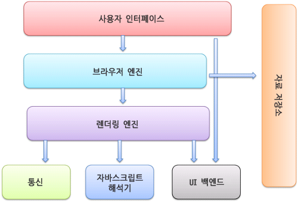

# 브라우저는 어떻게 동작하는가?
web에 대해 학습을 하다보니 브라우저에서 http://naver.com 과 같은 url 주소를 입력했을 때 어떤 과정으로 해당 url의 페이지가 화면에 보여지는 지가 궁금했다. 천천히 알아보자.

여기서는 크롬, 사파리 같은 오픈 소스 브라우저를 예로 들 것이다.

## 브라우저의 주요 기능
- 사용자가 선택한 자원을 서버에 요청하고 브라우저에 표시
- 보통 HTML문서이지만 PDF나 이미지, 다른 형태일 수도 있다.
- 자원의 주소는 URI에 의해 정해진다.

브라우저는 HTML과 CSS 명세에 따라 HTML파일을 해석해서 표시한다. 이 명세는 W3C라고 불리는 웹 표준화 기구에서 정한다. 예전 브라우저는 일부만 명세에 따라 구현하고 독자적인 방법으로 확장했으나 호환성의 문제로 대부분의 브라우저가 표준 명세를 따른다.

브라우저의 인터페이스는 유사한 요소들이 존재한다.
- URI를 입력할 수 있는 주소 표시줄
- 이전, 다음버튼
- 즐겨찾기(북마크)
- 새로고침
- 홈버튼

브라우저의 사용자 인터페이스는 표준 명세가 없음에도 불구하고 서로의 장점을 모방하며 지금의 UI로 자리잡았다. 

## 브라우저의 기본 구조

- 사용자 인터페이스: 요청한 페이지를 보여주는 화면을 제외한 나머지 부분
- 브라우저 엔진: 사용자 인터페이스와 렌더링 엔진 사이의 동작을 제어
- 렌더링 엔진: 요청한 컨텐츠를 표시, HTML 요청 시 HTML과 CSS를 파싱하여 화면에 표시
- 통신: 네트워크 호출에 사용, 플랫폼의 독립적인 인터페이스로 구성
- 자바스크립트 해석기: 자바스크립트 코드를 해석하고 실행
- UI 백엔드 - 플랫폼에서 명시하지 않은 일반적인 인터페이스
- 자료 저장소 - 자료를 저장하는 계층, 쿠키 등 모든 종류의 자원을 디스크에 저장하는 계층

### 렌더링 엔진
렌더링 엔진의 역할은 요청 받은 내용을 브라우저에 표시하는 일이다. 
기본적으로 HTML, XML, 이미지를 표시할 수 있다. 플러그인이나 확장 기능을 사용해 PDF와 같은 유형의 파일도 표시할 수 있다.

사파리와 크롬은 웹킷(Webkit) 엔진을 사용하고 파이어폭스는 게코(Gecko)엔진을 사용한다.

웹킷은 최초 리눅스 플랫폼에서 동작하기 위해 제작된 오픈소스 엔진으로 애플이 맥과 윈도우즈에서 사파리 브라우저를 지원하기 위해 수정을 더했다.

#### 동작과정

- HTML 문서를 파싱
- 콘텐츠 트리 내부에서 태그를 DOM 노드로 변환
- 외부 CSS 파일과 함께 포함된 스타일 요소도 파싱
- 스타일 정보와 HTML 표시 규칙은 `렌더 트리`라고 하는 또 다른 트리를 생성
- 렌더 트리는 정해준 순서대로 화면에 표시되는데 생성 과정이 끝났을 때 배치가 진행되면서 노드가 화면의 정확한 위치에 표시되는 것을 의미한다.
- UI 백엔드에서 렌더 트리의 각 노드를 가로지르며 형상을 만드는 그리기 과정이 진핸된다.
- 이러한 과정들이 점진적으로 진행된다.
- 렌더링 엔진은 더 나은 사용자 경험을 위해 모든 HTML을 파싱할 때까지 기다리지 않고 배치와 그리기 과정을 시작한다.
- 전송을 받고 기다리는 동시에 받은 내용의 일부를 먼저 화면에 표시한다.

## 파싱과 DOM 트리 구축
`DOM`이란 **Document Object Model(문서 객체 모델)**  
웹페이지의 소스를 보면 `<html>`, `<body>`와 같은 태그들이 있는데 이를 자바스크립트가 활용할 수 있는 객체로 만들면 문서 객체가 된다.
즉, 웹 브라우저가 HTML 페이지를 인식하는 방식을 말한다.

### 파싱
문서 파싱은 브라우저가 코드를 이해하고 사용할 수 있는 구조로 변환하는 것을 말한다.

문서를 가지고 어휘 분석, 구문 분석 과정을 거쳐 파싱 트리를 구축한다. 
어휘 분석기를 통해 언어의 구문 규칙에 따라 문서 구조를 분석한다. 이 때 구문 규칙과 일치하는지를 비교하고 일치하는 노드만 파싱 트리에 추가한다. 이러한 과정을 반복한다. 

이렇게 만들어진 파서 트리는 최종 결과물이 아니다. 그저 컴파일의 과정일 뿐, 다시 기계코드 문서로 변환시키는 과정까지 완료되야 최종 결과물이 나오게 된다.

이런 파서를 생성하는 것은 복잡하고 최적화하기 힘들어 자동으로 생성해주는 파서 생성기를 많이 활용한다.

결국 파싱 과정을 거치면서 서버로부터 받은 문서를 브라우저가 이해하기 쉽게 사용할 수 있는 DOM 트리구조로 변환시켜주는 것이다.

## 정리
- 주소창에 url을 입력하면 서버에 요청이 전송된다
- 해당 페이지에 존재하는 여러 자원들이 보내진다.
- 브라우저는 해당 자원이 담긴 HTML과 스타일이 담긴 CSS를 W3C 명세에 따라 해석함, 이 역할을 하는 것이 렌더링 엔진
- 렌더링 엔진이 html 파싱을 시작한다. html 파서가 문서에 존재하는 어휘와 구문을 분석하면서 DOM 트리를 구축
- 다음으로 CSS를 파싱, CSS 파서가 모든 CSS 정보를 스타일 구조체로 생성
- 위 두가지를 연결시켜 렌더 트리를 만듦, 렌더 트리를 통해 문서가 시각적 요소를 포함한 형태로 구성된 상태가 된다.
- 화면에 배치를 시작하고 UI 백엔드가 노드를 돌며 형상을 그린다.
- 이때 빠르게 브라우저 화면에 표시해주기 위해 배치와 그리는 과정은 페이지 정보를 모두 받고 한꺼번에 진행되지 않는다. 자원을 전송받으면 기다리는 동시에 일부분은 먼저 진행하고 화면에 표시한다.

